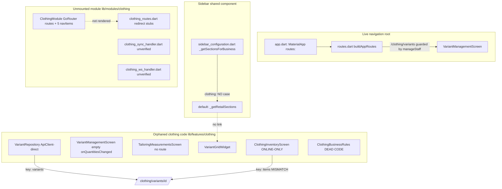

# Design Document — Clothing / Fashion Vertical Full Remediation

## Overview

The DukanX `clothing` vertical (`BusinessType.clothing`, "Clothing / Fashion") ships a meaningful amount of clothing-specific code — a size × color `VariantGridWidget` with "Smart Fill" size curves, a `ClothingInventoryScreen`, a `VariantManagementScreen`, a `TailoringMeasurementsScreen`, a `VariantRepository`, a `ClothingBusinessRules` utility, a `ClothingVariantScannerWidget`, and a registered `ClothingModule` — but almost none of it is reachable in the running desktop app, and what is reachable carries a cluster of data-loss, API-contract, money-correctness, capability, RBAC, offline, validation, and polish defects documented in `audit-reports/business-types/audit-clothing.md`.

This design specifies how the phased remediation defined in `requirements.md` (Requirement 1 through Requirement 16, delivered across Phase 0 through Phase 10) is realized in code. It mirrors the requirements: the cross-cutting invariants of Requirement 1 and the scope boundary of Requirement 2 become design-wide invariants; each subsequent phase maps to a design section with concrete components, interfaces, and data models; and the money-math and data-transformation surfaces are specified precisely enough to support property-based testing.

### Route surface decision (Requirement 4 — Option B confirmed)

The audit established the live navigation reality: `app/app.dart` builds `MaterialApp(routes: buildAppRoutes())` — the **legacy `MaterialApp.routes` map** (`App_Router` / `lib/app/routes.dart` `buildAppRoutes()`) — while the clothing-specific screens live in the parallel, **unmounted** `ClothingModule` GoRouter system. This is the single root cause of clothing screens being orphaned.

This design adopts **Option B (scoped legacy `MaterialApp.routes` registration)** as the recommended and chosen route surface, per Requirement 4.2:

- **Option A (rejected):** Mount the full GoRouter module system (`MaterialApp.router`). Rejected because it is an app-wide navigation migration that touches every vertical's routing, violates the surgical scope boundary of Requirement 2.2, and risks regressing the eight other verticals the audit explicitly protects.
- **Option B (chosen):** Register the clothing screens as guard-wrapped named routes in the existing `buildAppRoutes()` "CUSTOM BUSINESS MODULES" section — the same surface that already hosts `/clothing/variants`. This keeps the change additive, scoped, and reversible, and it is the surface the live app actually renders.

All subsequent clothing route wiring (variant matrix, tailoring, inventory, printing) registers on this one documented surface. The `ClothingModule` GoRouter routes remain as-is (or are reconciled under sign-off in Phase 6) and are not the live surface.

### Guiding principles

- **Evidence before change.** Phase 0 produces a read-only `Verification_Report` resolving every unverified audit item to CONFIRMED, FALSIFIED, or still-unverified. No later phase acts on an assumption.
- **Surgical, additive change.** Shared files (`sidebar_configuration.dart`, `business_alerts_widget.dart`, `business_quick_actions.dart`, `business_capability.dart`, `feature_resolver.dart`) are touched only by adding a `clothing` branch or a new gated item; no other business type's resolution path changes, and a regression pass records per-vertical results.
- **One canonical money path.** All touched clothing money is integer Paise. The GST slab rule and variant pricing compute in integer Paise with documented half-up rounding.
- **One variant model.** The divergent `VariantItem` (doubles) and ad-hoc `Map<String,dynamic>` shapes converge on a single `Variant_Item` with `sku`, `barcode`, `priceCents`, `stock`.
- **Offline-first, never direct `ApiClient`.** The three clothing screens route through an offline-first repository (local store + sync queue with a retry cap), following the established `jewellery_repository_offline.dart` pattern.
- **Gate-driven progression.** Each phase ends with the literal `PHASE N COMPLETE — AWAITING APPROVAL` and resumes only on the literal `APPROVED`. Schema changes (Mini_Gate) and deletions (soft-delete / two-confirmation sign-off) require their own explicit approval.

## Architecture

### Current-state component map



### Target-state component map (post-remediation)

```mermaid
graph TD
    APP[app.dart: MaterialApp routes:] --> ROUTES[routes.dart buildAppRoutes]
    ROUTES -->|guarded named routes Option B| VMS[VariantManagementScreen]
    ROUTES --> TMS[TailoringMeasurementsScreen]
    ROUTES --> CIS[ClothingInventoryScreen]
    SBCFG[sidebar_configuration.dart] -->|case clothing| CSECT[_getClothingSections]
    CSECT -->|4 items + capability/permission tags| NAV[SidebarNavigationHandler getScreenForItem]
    NAV --> VMS
    NAV --> TMS
    NAV --> CIS
    CAP[business_capability.dart useSalesReturn added to clothing] --> CSECT
    VMS --> VGW[VariantGridWidget + Save control]
    VGW --> CREPO[ClothingRepositoryOffline local store + sync queue]
    CIS --> CREPO
    TMS --> CREPO
    CREPO -->|single contract: variants| EP[/clothing/* endpoints]
    GST[GstSlabRule 5/12 percent integer paise] --> BILL[clothing billing/tax layer]
    QA[Quick_Actions clothing: Variants -> VMS] --> VMS
    AW[Alerts_Widget clothing: live alertCountsProvider] --> CREPO
    PRINT[Print_Infrastructure per-variant tags] --> VGW
```

### Phase-to-requirement map

| Phase | Requirements | Theme | Primary artifacts |
|-------|--------------|-------|-------------------|
| 0 | 3 | Read-only verification | `Verification_Report` (Markdown only) |
| 1 | 4 | Navigation reachability architecture decision (Option B) | architecture decision record |
| 2 | 5, 6, 7 | Dedicated sidebar, capability/RBAC closure, route guard + quick action | `sidebar_configuration.dart`, `business_quick_actions.dart`, `routes.dart` |
| 3 | 8 | Critical data-loss + API contract fixes | `variant_management_screen.dart`, `variant_repository.dart`, `clothing_inventory_screen.dart` |
| 4 | 9 | Tailoring module wiring + validation | `tailoring_measurements_screen.dart`, `clothing_business_rules.dart`, `routes.dart` |
| 5 | 10, 11 | GST value-slab rule + variant model unification + exchange | GST rule, `Variant_Item` model, exchange flow, `business_capability.dart` |
| 6 | 12 | Offline-first, sync, printing, backend confirmation | `ClothingRepositoryOffline`, sync/ws handlers, print, OCR entry |
| 7 | 13 | Performance hardening verification | batch fetch, debounce, grid reflow |
| 8 | 14 | UI polish, theming, accessibility, import/export, bounds | touched clothing screens |
| 9 | 15 | Mandatory regression pass + navigation walk | regression evidence, nav graph walk |
| 10 | 16 | Final verification matrix + test coverage | `Verification_Matrix`, test suites |

The cross-cutting constraints of Requirement 1 (integer Paise, RID ids, tenant scoping, Mini_Gate, no hard deletes, idempotent migrations, additive shared edits, regression pass, blast-radius documentation, STOP GATE protocol) are not a phase — they are invariants enforced in every section below. The scope boundary of Requirement 2 (four allowed locations, no app-wide GoRouter migration, no new backend endpoints, e-Way bill deferred) bounds every change.

### Design-wide invariants (Requirement 1 & 2)

1. **Integer-Paise money (1.1, 1.2).** Every money value in created/modified clothing code is an `int` of Paise. `VariantItem.priceAdjustment` (`double?`) and the ad-hoc `quantity`/`priceAdjustment` doubles are migrated to `priceCents` (int Paise) and `stock` (int). No `double`/`float`/decimal currency is introduced; touched `double` price/quantity fields are migrated.
2. **RID ids (1.3).** New entities use `{tenantId}-{timestamp_ms}-{uuid_v4_short}` via the shared `RidGenerator.next(tenantId)` (same generator the jewellery offline repo uses), replacing any bare `Uuid().v4()` on touched paths.
3. **Tenant scoping (1.4, 1.12).** Every query/write/sync resolves `tenantId` from `SessionManager` (`session.currentBusinessId` / `ownerId`). An unresolved tenant aborts the operation with a tenant-context error and performs no read or write.
4. **Mini_Gate for schema (1.5).** Any DynamoDB model-shape or local-store (Hive box / Drift table) change halts and requests a Mini_Gate with a proposed change and a migration plan before applying.
5. **No hard deletes (1.6).** Removal of a record/file/route/screen uses a soft-delete status flag or a two-confirmation flow; no hard delete of data.
6. **Idempotent migrations (1.7).** Any data migration is guarded so repeated runs produce the same persisted result and modify zero records after the first execution (mirroring `dc_discount_migration.dart`).
7. **Additive shared edits + regression (1.8, 1.9, 1.10, 1.11).** Shared components gain only a `clothing` branch or a new gated item; no other business type's sidebar/capability/quick-action/alert resolution changes. A regression pass records pass/fail per non-clothing vertical and documents the blast radius.
8. **STOP GATE (1.13).** Phase completion emits the literal gate text and waits for `APPROVED`.
9. **Scope boundary (2.1–2.6).** Changes are restricted to `features/clothing/*`, `modules/clothing/*`, the `clothing` case in Shared_Components, and the navigation entries needed for reachability. No app-wide GoRouter migration; no new backend endpoint beyond satisfying an existing clothing-screen contract; e-Way bill deferred pending explicit sign-off.

## Components and Interfaces

### Phase 0 — Verification_Report (Requirement 3)

A single read-only Markdown artifact at `.kiro/specs/clothing-vertical-remediation/phase0-verification-report.md`. Phase 0 creates, modifies, and deletes zero files other than this report and touches no application source/config/build file (3.1). It records:

- **Widget internals (3.2):** what the cited source lines of `variant_cell.dart`, `size_curve_chip.dart`, and `clothing_variant_scanner_widget.dart` do, each with file path + start/end line numbers.
- **Handler liveness (3.3):** `clothing_sync_handler.dart` and `clothing_ws_handler.dart` each classified as active or not-active in the live app, with path + line ranges.
- **AppScreen targets (3.4):** the exact `AppScreen` targets `AppScreen.itemStock` and `AppScreen.categories` resolve to in `core/navigation/app_screens.dart`, with path + lines.
- **RBAC reality (3.5):** whether the `session_manager.dart` RBAC matrix gates the retail sidebar items shown to clothing — gated or not-gated — with path + lines.
- **Billing line render (3.6):** whether the billing line-item UI renders `size`/`color` per line — renders or does-not-render — with path + lines.
- **Backend shape (3.7):** for each of `/clothing/variants/{id}`, `/clothing/tailoring-notes`, `/clothing/variants/bulk`, classify as deployed-non-stub / deployed-stub / no-handler, recording the observed response-key contract and any handler path + lines.
- **Resolution (3.8, 3.9, 3.10):** every previously unverified audit item marked CONFIRMED or FALSIFIED with evidence, or flagged still-unverified with the specific missing evidence; every unverified item resolved to exactly one of those three states.

The report is the authoritative input to Phases 1–10; later phases cite it (e.g., 8.3's contract choice references finding 3.7; 12.5's handler disposition references finding 3.3).

### Phase 1 — Navigation reachability architecture decision (Requirement 4)

A recorded architecture decision (an ADR section in this design and the phase gate write-up) that:

- Enumerates Option A (full GoRouter module mount) and Option B (scoped legacy `MaterialApp.routes` registration) and selects exactly one (4.1).
- Records **Option B as recommended and chosen** (4.2), with a complete rationale and the trade-offs of rejecting Option A, containing no "to be decided" placeholders (4.3).
- Identifies exactly one documented route surface — `buildAppRoutes()` in `lib/app/routes.dart` — on which all subsequent clothing routes register (4.4).
- Emits the Phase 1 STOP GATE (4.5); no sidebar or route wiring begins until the decision is approved (4.6); if rejected, the record is retained, requested changes applied, and the gate re-emitted without beginning wiring (4.7).

### Phase 2 — Sidebar, capability/RBAC, route guard, quick action (Requirements 5, 6, 7)

**`_getClothingSections()` in `sidebar_configuration.dart` (Requirement 5).** A new private function returning the clothing section list, reached via an explicit `case BusinessType.clothing:` in `_getSectionsForBusiness` — no fall-through to `default: _getRetailSections()` (5.1). It returns exactly one dedicated clothing section with four items plus the same shared common sections every other type receives (5.2). Each item has a non-empty label and a target that resolves via `SidebarNavigationHandler.getScreenForItem` to an existing screen, with no placeholder routes (5.3).

| Item | Sidebar id | Screen | Capability gate (5.4/5.5) |
|------|-----------|--------|---------------------------|
| Variant Matrix | `clothing_variant_matrix` | `Variant_Management_Screen` | `useVariants` |
| Tailoring / Alterations | `clothing_tailoring` | `Tailoring_Measurements_Screen` | `useTailoringNotes` |
| Size & Color Stock Overview | `clothing_stock_overview` | `Clothing_Inventory_Screen` | `useVariants` |
| Price-Tag / Barcode Printing | `clothing_tag_printing` | print flow via `Print_Infrastructure` | `useBarcodeScanner` |

A clothing-specific item whose granted capability (`useVariants`, `useTailoringNotes`, `useBarcodeScanner`, `useScanOCR`) is present is tagged with that capability (5.4); an item whose capability is not granted is omitted while non-gated items and shared common sections still return (5.5). For any `BusinessType` other than `clothing`, sections are byte-for-byte identical to pre-change (5.6).

**Capability mismatch + RBAC bypass closure (Requirement 6).** The variant-tracking surface lives in the dedicated clothing section and is **not** conditioned on `useBatchExpiry` (which clothing is not granted), fixing the audit's capability mismatch (6.1). For the retail-origin financial/compliance/admin items still surfaced to clothing — `audit_trail`, `bank_accounts`, `accounting_reports`, the tax items (`gstr1`, `gstr2`, `gstr3b`, `gst_summary`), `expenses`, `credit_notes`, `backup` — a `permission` tag is attached so `RolePermissions.hasPermission` evaluates each by role (6.2). A permission-tagged item is excluded for a user lacking the permission (6.3) and included for one holding it (6.4). The edit is additive — no rendered item for any other business type is added/removed/reordered/altered (6.5). If any listed item remains untagged, the closure is treated as incomplete and a verification error names each untagged item key (6.6).

**Route guard + quick-action corrections (Requirement 7).** The `Variant_Management_Screen` route guard changes from `Permissions.manageStaff` to a single inventory/product permission governing variant management (7.1). A clothing vendor holding that permission resolves to `Variant_Management_Screen` with no redirect (7.2); a user lacking it is blocked, redirected to the default authorized landing screen, shown an access-denied indication (7.3), and no screen state is instantiated/retained (7.4). The "Variants" quick action in `business_quick_actions.dart` navigates to `Variant_Management_Screen`, not `AppScreen.categories` (7.5); quick actions for every other business type resolve to identical destinations (7.6).

### Phase 3 — Critical data-loss & API contract fixes (Requirement 8)

```mermaid
sequenceDiagram
    participant M as Merchant
    participant VGW as VariantGridWidget
    participant VMS as VariantManagementScreen
    participant R as ClothingRepositoryOffline
    M->>VGW: edit quantities + Smart Fill
    VGW->>VMS: onQuantitiesChanged(quantities)
    M->>VMS: tap Save
    VMS->>R: bulkUpdateVariants(productId, variants) [tenant-scoped]
    alt persisted
        R-->>VMS: Right(true)
        VMS-->>M: success indicator (<=2s)
    else failure
        R-->>VMS: Left(failure)
        VMS-->>M: error indication; edits retained
    end
```

- **Save path (8.1, 8.2):** `VariantGridWidget` gains an explicit Save control; `onQuantitiesChanged` is replaced with a handler that routes edits to `Variant_Repository.bulkUpdateVariants` scoped by `tenantId`.
- **Contract unification (8.3):** the `/clothing/variants/{id}` response-key mismatch (`items` vs `variants`) is resolved to a single contract per the Phase 0 finding (3.7), so `Clothing_Inventory_Screen` and `Variant_Repository` read the same key.
- **Safe parse (8.4):** `VariantItem.fromJson` casts each field through a null/type guard — null/mistyped optional fields resolve to defaults; null/mistyped required fields raise a descriptive parse error, not an uncaught exception.
- **Map index (8.5):** `_getFilteredVariants` looks products up via a `Map<String, Product>` keyed by product id instead of `firstWhere` without `orElse`, so an unmatched id never throws `StateError`.
- **Debounce (8.6):** variant-search recompute is debounced to at most once per 300 ms of input inactivity.
- **Batch fetch (8.7):** the N+1 per-product fetch in `Clothing_Inventory_Screen._loadInventory` is replaced with a single batch endpoint call.
- **Feedback (8.8, 8.9):** a visible success indicator appears within 2 s of a confirmed save; a failed save shows an error indication and retains the merchant's edited quantities without discarding.

### Phase 4 — Tailoring module wiring (Requirement 9)

- **Reachability (9.1, 9.2):** a "Take Measurements" action from a bill/customer context opens `Tailoring_Measurements_Screen` constructed with the originating `customerId` and `invoiceId`; a navigation path is registered on the Option B route surface, reachable in a single activation.
- **Validation (9.3, 9.4):** each measurement field is validated against `ClothingBusinessRules.isValidMeasurement` bounds (not an inline `> 0` check); on save, each field is parsed with `double.tryParse` and only values that parse and fall within bounds persist, associated with `customerId`/`invoiceId`.
- **Soft delete (9.5):** `_deleteMeasurements` becomes a soft-delete that sets a status flag rather than a silent no-op.
- **Typed date (9.6):** the delivery date is stored as a typed `DateTime`, not a split string.
- **Missing context (9.7):** activation without a resolvable `customerId`/`invoiceId` does not open the screen and shows an error naming the missing context.
- **Invalid input (9.8):** a field failing `double.tryParse` or out of bounds rejects the save, retains all entered values, and shows an error identifying the invalid field.

### Phase 5 — GST value-slab rule + variant model unification + exchange (Requirements 10, 11)

**GST_Slab_Rule (Requirement 10).** A pure function in the clothing billing/tax layer computes the rate from the line item's taxable value in integer Paise:

```
int gstRatePercentForTaxableValue(int taxableValuePaise) {
  // 10.6: reject non-positive value upstream (caller surfaces error)
  // 10.1: 0 < value < 100000 paise  -> 5
  // 10.2: value >= 100000 paise      -> 12
}
int gstAmountPaise(int taxableValuePaise, {int? overrideRatePercent, required bool gstEditable})
```

- 5% when `0 < taxableValue < ₹1000` (100,000 Paise) (10.1); 12% when `taxableValue >= ₹1000` (10.2).
- A manual override is honored when `gstEditable` is true (10.3); rejected with the slab rate retained and an error when `gstEditable` is false (10.4).
- All intermediate and final money math is integer Paise, rounding fractional Paise half-up to the nearest whole Paise (10.5).
- A taxable value `<= 0` Paise rejects the line item, skips slab computation, and surfaces an error (10.6).
- A boundary test asserts exactly 100,000 Paise selects 12% and 99,999 Paise selects 5% (10.7).

**Variant model unification (Requirement 11).** The divergent shapes converge on one `Variant_Item`:

```
class VariantItem {
  final String id;        // RID for new variants
  final String productId;
  final String color;
  final String size;
  final String sku;       // <= 64 chars
  final String barcode;   // <= 64 chars
  final int priceCents;   // integer Paise, >= 0
  final int stock;        // integer count, >= 0
}
```

The ad-hoc `Map<String,dynamic>` and the `quantity`/`priceAdjustment` doubles are removed (11.1). If unification requires a DynamoDB model-shape change, the work halts for a Mini_Gate (11.2). The cell-key scheme is changed so any two distinct `(color, size)` pairs yield distinct keys, including values containing `_` (e.g., "Off_White") — e.g., length-prefixed or separator-escaped encoding instead of `'${color}_$size'` (11.3).

**Exchange flow (Requirement 11.4–11.8).** `useSalesReturn` is granted to `BusinessType.clothing` and to no other type (11.4). A size-swap exchange increments the returned variant's stock and decrements the issued variant's stock in a single atomic operation (11.5); insufficient issued stock rejects the exchange leaving both unchanged (11.6); any post-adjustment failure rolls back all adjustments so no partial state persists (11.7). Season/collection tracking, brand-wise stock reporting, and loyalty/bundle support are each recorded as in-scope or deferred-backlog with a written rationale (11.8).

### Phase 6 — Offline-first, sync, printing, backend (Requirement 12)

**`ClothingRepositoryOffline`** follows the `jewellery_repository_offline.dart` pattern: a local store (Hive box / Drift table per the existing per-vertical mechanism) plus a sync queue, tenant-scoped, RID ids, optimistic local write.

- **No direct ApiClient (12.1):** `Clothing_Inventory_Screen`, `Variant_Management_Screen`, and `Tailoring_Measurements_Screen` route all CRUD through this repository — never `ApiClient` directly.
- **Optimistic write + enqueue (12.2):** every create/update/delete persists locally within 1 s and enqueues exactly one sync-queue entry.
- **FIFO drain + retry (12.3, 12.4):** on reconnect the queue drains FIFO; a failing entry retries up to 5 times, is retained until success or limit, marked failed after the limit, and a visible "unsynced changes exist" indication is shown (mirroring the jewellery retry-cap-then-mark behavior, not silent discard).
- **Handler disposition (12.5):** `Clothing_Sync_Handler` and `Clothing_Ws_Handler` are activated, or removed under the soft-delete + sign-off rules, based on the Phase 0 finding (3.3).
- **Printing (12.6, 12.7):** printing a price tag/barcode for selected variants renders one tag per variant via `Print_Infrastructure`; a print failure names the affected variant and leaves its record unchanged.
- **OCR entry (12.8):** an OCR scan-bill entry point is surfaced for clothing, reachable in a single interaction from `Clothing_Inventory_Screen`, using the granted `useScanOCR` capability.
- **Endpoint confirmation (12.9):** a `/clothing/*` endpoint absent for the sync path is confirmed with the backend or placed behind a feature flag rather than failing silently (no new endpoints beyond Requirement 2.3).

### Phase 7 — Performance hardening verification (Requirement 13)

- **Batch under load (13.1):** loading ≥1,000 products with up to 20 variants each uses a fixed number of batch requests independent of product count (confirms the 8.7 fix under load).
- **Debounce under load (13.2):** consecutive keystrokes recompute only after 300 ms of inactivity (confirms 8.6).
- **Grid reflow (13.3):** at any desktop width 800–1280 px the grid reflows columns to available width with a 120 px minimum column width and no horizontal scrollbar at ≥800 px (replaces `FixedColumnWidth(100)`).
- **Render budget (13.4):** initial grid render completes within 3000 ms from batch-request dispatch to first interactive render for the 13.1 dataset.
- **Failure handling (13.5):** if the batch fetch fails or exceeds 10000 ms, an error indication shows, no per-product fallback occurs, and previously loaded data is unchanged.

### Phase 8 — UI polish, theming, accessibility (Requirement 14)

- **Theming (14.1):** hardcoded `#1A1A2E`, `#B8860B`, `grey[50]` in touched clothing screens are replaced with `Theme.of(context)` values — zero color literals remain; screens render in light and dark.
- **Semantics/tooltips (14.2, 14.3):** variant cells, scanner control, and measurement fields are wrapped in `Semantics` with non-empty labels; icon-only controls get non-empty tooltips.
- **Contrast (14.4):** theme-derived color pairs target WCAG 2.1 AA (≥4.5:1 normal, ≥3:1 large), documented that full conformance requires manual AT testing + expert review.
- **Import/export (14.5, 14.6, 14.7):** variant export via `Variant_Repository.exportToCsv`; CSV import imports valid rows and reports the imported count; malformed/invalid rows are rejected with which rows failed indicated and existing data preserved.
- **Money + bounds (14.8, 14.9, 14.10):** displayed/stored money is a non-negative integer Paise in `0..9,999,999,999`; a per-product reorder level replaces the hardcoded low-stock threshold; a variant quantity that is negative or exceeds 999,999 is rejected, an error shown, the prior value preserved.

### Phase 9 — Mandatory regression pass + navigation walk (Requirement 15)

- **Regression (15.1, 15.3):** electronics, mobile, computer, hardware, grocery, and pharmacy are compared against a recorded pre-change baseline across sidebar sections, capability flags, quick-action set, and alert set; the pass succeeds only when zero items are added/removed/reordered in any category for any of those verticals; any detected change halts for remediation and names the vertical + category.
- **Navigation walk (15.2, 15.4):** a clothing navigation graph walk passes only when 100% of clothing sidebar items resolve to a registered screen with zero "Unknown Screen" placeholders; an unresolved item halts for remediation and is named.
- **Evidence (15.5):** the per-vertical outcome for the six verticals, the navigation-walk outcome, and the routes visited are recorded.

### Phase 10 — Final verification matrix + test coverage (Requirement 16)

- **Verification_Matrix (16.1, 16.2):** every finding in `audit-clothing.md` maps to exactly one of FIXED, VERIFIED-OK, or DEFERRED-SIGNOFF — zero unmapped, none with more than one disposition; each DEFERRED-SIGNOFF records a rationale and the named sign-off authority.
- **Tests (16.3–16.6):** passing unit tests for the GST slab (incl. ₹1000 boundary), variant model unification, and cell-key collision (incl. "Off_White"); passing widget tests for the variant grid save path and tailoring validation against bounds; passing integration tests for the offline-first variant load+sync path (1–3 examples); a manual smoke-test checklist for sidebar→screen navigation with no "Unknown Screen".
- **No regression + gating (16.7, 16.8):** the six verticals resolve unchanged sidebar/capability/quick-action/alert behavior; any failing required test halts before declaring the vertical shippable.

## Data Models

### Unified Variant_Item (Requirement 11.1)

| Field | Type | Notes |
|-------|------|-------|
| `id` | `String` | RID for new variants (1.3) |
| `productId` | `String` | tenant-scoped owning product |
| `color` | `String` | matrix row |
| `size` | `String` | matrix column |
| `sku` | `String` | ≤ 64 chars |
| `barcode` | `String` | ≤ 64 chars |
| `priceCents` | `int` | integer Paise, ≥ 0, ≤ 9,999,999,999 (14.8) |
| `stock` | `int` | ≥ 0, ≤ 999,999 (14.10) |

Replaces both the `quantity:int`/`priceAdjustment:double?` `VariantItem` and the ad-hoc `Map<String,dynamic>` (`size/color/sku/barcode/stock/priceCents`). `fromJson` is null/type-guarded (8.4).

### Tailoring measurement record (Requirement 9)

| Field | Type | Notes |
|-------|------|-------|
| `id` | `String` | RID |
| `tenantId` | `String` | scoping (1.4) |
| `customerId` | `String` | originating context (9.1, 9.4) |
| `invoiceId` | `String` | originating context |
| measurements | `Map<MeasurementKey,double>` | validated against `isValidMeasurement` bounds (9.3) |
| `priority` | `String`/enum | as today |
| `deliveryDate` | `DateTime` | typed, not split string (9.6) |
| `status` | enum (`active`/`deleted`) | soft-delete flag (9.5) |

### Local store + sync queue (Requirement 12)

Following `jewellery_repository_offline.dart`: a local box/table per clothing entity plus a `clothing_sync_queue` carrying `entityType`, `operation` (`create`/`update`/`delete`), `entityId`, `retryCount`, `lastError`, and a failed flag (set after retry cap, not deleted). Records carry `synced`, `pendingOperation`, `pendingSince`, and `version` for reconciliation. Any new field/box/table is additive with safe defaults and applied only after a Mini_Gate (1.5, 11.2).

### Backend (Node.js + DynamoDB)

`/clothing/*` items are tenant-scoped, money attributes stored as integer Paise, single response-key contract for `/clothing/variants/{id}` (8.3). No new endpoint is created beyond satisfying an existing clothing-screen contract (2.3); gaps are confirmed/flagged (12.9). No production schema change without a Mini_Gate.

### RID identifier

```
{tenantId}-{timestamp_ms}-{uuid_v4_short}
```
`RidGenerator.next(tenantId)` produces ids for all new clothing entities on touched paths (1.3).

## Correctness Properties

*A property is a characteristic or behavior that should hold true across all valid executions of a system — essentially, a formal statement about what the system should do. Properties serve as the bridge between human-readable specifications and machine-verifiable correctness guarantees.*

These properties are derived from the acceptance-criteria prework and consolidated to remove redundancy (e.g., the integer-Paise invariants of 1.1/1.2/10.5/14.8 are one property; the preservation criteria 1.8/1.9/5.6/6.5/7.6/15.1/16.7 are one property; the sidebar-resolution criteria 5.3/15.2 are one property; the capability/RBAC gate criteria 5.5/6.3/6.4 are one property). Reachability/UI-composition, documentation, process-governance, and timing/responsive criteria (all of Requirements 2, 3, 4; 1.5, 1.10, 1.11, 1.13; 5.1, 5.2; 6.1; 7.1, 7.5; 8.3, 8.6, 8.8; 9.1, 9.2, 9.7; 10.7; 11.2, 11.8; 12.1, 12.5, 12.7, 12.8, 12.9; 13.2, 13.3, 13.4, 13.5; 14.1–14.4; 15.3–15.5; 16.1–16.6, 16.8) are validated by example-based, integration, smoke, or governance checks described in the Testing Strategy, not by properties.

### Property 1: Money is integer Paise with half-up rounding

*For any* combination of taxable values, variant prices, and quantities supplied to the touched clothing money path, every intermediate and final monetary result is an `int` number of Paise (never a `double`/`float`), within the range 0 to 9,999,999,999, equal to the integer reference computation with fractional Paise rounded half-up.

**Validates: Requirements 1.1, 1.2, 10.5, 14.8**

### Property 2: RID identifiers are well-formed

*For any* tenant id, an identifier produced for a new clothing entity matches the pattern `{tenantId}-{timestamp_ms}-{uuid_v4_short}` and embeds that exact tenant id as its prefix, with a non-empty shortened UUID v4 segment.

**Validates: Requirements 1.3**

### Property 3: Tenant isolation

*For any* two distinct tenant ids and any clothing records (variants, tailoring measurements, inventory) written under the first, a query, repository read, or sync performed under the second never returns those records.

**Validates: Requirements 1.4**

### Property 4: Unresolved tenant aborts the operation

*For any* clothing read or write attempted while the tenant id cannot be resolved, the operation is rejected, performs no read or write, and returns an error.

**Validates: Requirements 1.12**

### Property 5: Deletions are soft

*For any* clothing record (variant, tailoring measurement), a delete operation sets a status flag and leaves the record retrievable in deleted state rather than performing a hard removal.

**Validates: Requirements 1.6, 9.5**

### Property 6: Migrations are idempotent

*For any* starting local-store state, applying a clothing remediation migration twice produces the same persisted result as applying it once, and the second application modifies zero records.

**Validates: Requirements 1.7**

### Property 7: Other business types are unchanged

*For any* `BusinessType` other than `clothing`, the sidebar sections, granted capability set, quick-action set, and alert set after the remediation are identical (no item added, removed, or reordered) to those before the `case BusinessType.clothing` additions and the shared-component edits.

**Validates: Requirements 1.8, 1.9, 5.6, 6.5, 7.6, 15.1, 16.7**

### Property 8: Every clothing sidebar id resolves to a real screen

*For any* clothing sidebar item id introduced by the reachability work, `SidebarNavigationHandler.getScreenForItem` returns the single existing screen mapped to that id and never the "Unknown Screen" / placeholder fallthrough, and the item's label contains at least one non-whitespace character.

**Validates: Requirements 5.3, 15.2**

### Property 9: Capability gate includes granted and excludes ungranted items

*For any* clothing sidebar item that surfaces a gated domain feature and any capability-grant configuration, the item is included when its corresponding `BusinessCapability` is granted and omitted when it is not, while non-gated clothing items and shared common sections are always returned.

**Validates: Requirements 5.4, 5.5**

### Property 10: Enumerated financial/compliance/admin items carry a permission tag

*For any* of the enumerated items surfaced to clothing (`audit_trail`, `bank_accounts`, `accounting_reports`, `gstr1`, `gstr2`, `gstr3b`, `gst_summary`, `expenses`, `credit_notes`, `backup`), the item carries a `permission` tag; if any lacks one, a verification error names that item key.

**Validates: Requirements 6.2, 6.6**

### Property 11: RBAC inclusion is exactly by permission

*For any* permission-tagged clothing sidebar item and any user, the item is included in the rendered clothing sidebar if and only if `RolePermissions.hasPermission` reports the user holds the item's required permission.

**Validates: Requirements 6.3, 6.4**

### Property 12: Variant route access is granted iff authorized

*For any* principal navigating the variant route, the route resolves to `Variant_Management_Screen` when the principal holds the corrected inventory/product permission and otherwise blocks access, redirects to the default authorized landing screen with an access-denied indication, and retains no screen state and instantiates no matrix.

**Validates: Requirements 7.2, 7.3, 7.4**

### Property 13: Capabilities are granted to clothing only

*For any* clothing-granted capability (including `useSalesReturn`), `FeatureResolver.canAccess('clothing', capability)` is true; and *for any* business type other than `clothing`, `canAccess(type, useSalesReturn)` is false.

**Validates: Requirements 11.4**

### Property 14: Variant grid Save persists exactly the edited quantities

*For any* set of variant-grid edits, activating the explicit Save control invokes `Variant_Repository.bulkUpdateVariants` (tenant-scoped) with exactly those edited quantities and no edit is silently discarded.

**Validates: Requirements 8.1, 8.2**

### Property 15: Failed save retains edited quantities

*For any* set of variant-grid edits, a failed `bulkUpdateVariants` produces an error indication and the grid retains the edited quantities without discarding them.

**Validates: Requirements 8.9**

### Property 16: Variant JSON parsing is total

*For any* JSON payload, `VariantItem.fromJson` resolves a null or mistyped optional field to its defined default and raises a descriptive parse error for a null or mistyped required field, never an uncaught exception.

**Validates: Requirements 8.4**

### Property 17: Filtering never throws on an unmatched product id

*For any* set of variants and products, resolving a product in `_getFilteredVariants` via the product-id `Map` index returns without throwing `StateError` even when a variant references a product id absent from the product set.

**Validates: Requirements 8.5**

### Property 18: Variant fetch request count is independent of product count

*For any* product count N (up to 1,000+ with up to 20 variants each), the number of variant-fetch requests is a fixed constant that does not increase with N.

**Validates: Requirements 8.7, 13.1**

### Property 19: Tailoring validation and save honor measurement bounds

*For any* map of measurement field inputs, each field validates exactly as `ClothingBusinessRules.isValidMeasurement`; on save, only `double.tryParse`-successful, in-bounds values persist (associated with the originating `customerId` and `invoiceId`), and if any field is unparseable or out of bounds the save is rejected, all entered values are retained, and the invalid field is named.

**Validates: Requirements 9.3, 9.4, 9.8**

### Property 20: Delivery date round-trips as a typed DateTime

*For any* picked delivery date, the persisted value is a typed `DateTime` whose read-back equals the input, with no string-split storage.

**Validates: Requirements 9.6**

### Property 21: GST slab selects the rate by value threshold

*For any* line-item taxable value, the slab rate is 5% when `0 < value < 100,000` Paise and 12% when `value >= 100,000` Paise.

**Validates: Requirements 10.1, 10.2**

### Property 22: GST override honored iff editable

*For any* manual GST override, the override rate is applied when `gstEditable` is true, and when `gstEditable` is false the slab-computed rate is retained and an error indication is surfaced.

**Validates: Requirements 10.3, 10.4**

### Property 23: Non-positive taxable value is rejected

*For any* taxable value that is 0 Paise or negative, the line item is rejected, slab GST computation is skipped, and an error indication is surfaced.

**Validates: Requirements 10.6**

### Property 24: Variant model round-trips

*For any* `Variant_Item`, `fromJson(toJson(v))` equals `v`, with `priceCents` and `stock` non-negative integers and `sku`/`barcode` at most 64 characters.

**Validates: Requirements 11.1**

### Property 25: Variant cell keys are injective

*For any* two distinct `(color, size)` pairs — including pairs whose color or size contains the `_` character (e.g., "Off_White") — the computed cell keys differ, and any pair maps to a single stable key.

**Validates: Requirements 11.3**

### Property 26: Size-swap exchange is atomic and stock-correct

*For any* size-swap exchange of quantity q with sufficient issued stock, the returned variant's stock increases by q and the issued variant's stock decreases by q in a single atomic operation; if issued stock is insufficient the exchange is rejected with both stocks unchanged; and if any step fails after adjustment begins, all adjustments roll back so no partial state persists.

**Validates: Requirements 11.5, 11.6, 11.7**

### Property 27: Offline writes are optimistic and enqueue exactly one entry

*For any* create, update, or delete of a clothing record (online or offline), the change is persisted to the local store within 1 second and exactly one corresponding sync-queue entry is enqueued.

**Validates: Requirements 12.2**

### Property 28: Sync queue drains FIFO

*For any* sequence of enqueued clothing sync entries, restoring connectivity drains them in first-in-first-out order.

**Validates: Requirements 12.3**

### Property 29: Failed sync entries are retried then marked, never discarded

*For any* clothing sync entry whose transport fails, the entry is retained and the local record preserved unchanged across up to five retry attempts; after the fifth failure it is marked failed with a visible "unsynced changes exist" indication and is not discarded.

**Validates: Requirements 12.4**

### Property 30: One tag is rendered per selected variant

*For any* set of selected variants, printing renders exactly one price tag / barcode per selected variant via `Print_Infrastructure`.

**Validates: Requirements 12.6**

### Property 31: CSV export/import round-trips and rejects invalid rows

*For any* set of variants, exporting via `Variant_Repository.exportToCsv` and re-importing yields the valid rows with a reported imported count equal to the number of valid rows; *for any* CSV containing malformed/invalid rows, the invalid rows are rejected and indicated while existing variant data is preserved.

**Validates: Requirements 14.5, 14.6, 14.7**

### Property 32: Low stock is computed from the per-product reorder level

*For any* product reorder level R and stock S, the low-stock indication equals `S <= R` rather than a hardcoded constant threshold.

**Validates: Requirements 14.9**

### Property 33: Variant quantity bounds are enforced

*For any* variant quantity entry that is negative or exceeds 999,999, the entry is rejected, an error indication is shown, and the prior value is preserved.

**Validates: Requirements 14.10**

## Error Handling

Error handling follows DukanX conventions (observable response or propagation; never a silent swallow) and the requirements' explicit error behaviors:

- **Tenant context unavailable (1.4, 1.12).** If `tenantId` cannot be resolved from `SessionManager`, the operation aborts, accesses no data, and returns a tenant-context-unavailable error.
- **Variant parse faults (8.4).** `VariantItem.fromJson` returns defaults for null/mistyped optional fields and raises a descriptive, typed parse error for null/mistyped required fields; callers surface it rather than crashing.
- **Missing product on filter (8.5).** A variant referencing an absent product id is skipped via the `Map` index lookup; no `StateError` is thrown.
- **Save failure (8.9).** A failed `bulkUpdateVariants` shows an error stating the save did not complete and retains the merchant's edited quantities in the grid.
- **Tailoring validation (9.7, 9.8).** Missing `customerId`/`invoiceId` blocks opening the screen and names the missing context; an unparseable or out-of-bounds field rejects the save, retains all entered values, and names the invalid field.
- **GST guards (10.4, 10.6).** A manual override while `gstEditable` is false is rejected with the slab rate retained and an error surfaced; a non-positive taxable value rejects the line item and skips slab computation with an error.
- **Exchange failure (11.6, 11.7).** Insufficient issued stock rejects the exchange leaving both stocks unchanged; any post-adjustment failure rolls back all stock adjustments so no partial state persists.
- **Sync failures (12.4, 12.9).** Failed sync entries are retained, retried up to 5 times, then marked failed with a visible unsynced-changes indication and never discarded; a sync against a missing/absent endpoint surfaces a visible failure or is feature-flagged rather than failing silently.
- **Print failure (12.7).** A failed price-tag/barcode print names the affected variant and leaves its record unchanged.
- **Batch fetch failure/timeout (13.5).** A failed or >10 s batch fetch shows an error indication, performs no per-product fallback, and leaves previously loaded variant data unchanged.
- **Quantity / money bounds (14.8, 14.10).** Out-of-range money (outside 0..9,999,999,999 Paise) or quantity (negative or >999,999) is rejected with an error and the prior value preserved.
- **CSV import (14.7).** Malformed/invalid rows are rejected and indicated; valid rows import; existing data is preserved.
- **Governance halts (1.5, 1.13, 2.4, 2.5, 11.2).** Schema changes (Mini_Gate), out-of-scope/e-Way bill changes, and phase completion halt for explicit recorded sign-off rather than proceeding.

## Testing Strategy

Property-based testing **is appropriate** for this feature: the GST slab rule, variant model unification, cell-key collision, money/Paise invariants, tenant isolation, idempotent migration, exchange stock atomicity, sync-queue FIFO/retry, CSV round-trip, and capability/RBAC gating are pure-logic surfaces with universal "for all inputs" statements. Reachability/route registration, theming, responsive layout, timing budgets, and the Phase 0/4/9/10 artifacts are validated by example, widget, integration, smoke, or governance checks.

A property-based testing library is used for the language under test (Dart: `package:test` with a property-based helper such as `glados`; for any backend Node.js logic, `fast-check`). Properties are **not** implemented from scratch.

### Property-based tests

- Each correctness property above is implemented by a **single** property-based test running a **minimum of 100 iterations**.
- Each test is tagged with a comment referencing its design property in the format: **Feature: clothing-vertical-remediation, Property {number}: {property_text}**.
- Money generators produce integer Paise so floating-point never enters assertions; measurement generators draw values inside and outside the `ClothingBusinessRules` bounds; cell-key generators include color/size values containing `_`; sync generators include forced-failure transports to exercise the retry cap (Property 29); tenant generators produce distinct tenant pairs (Property 3); exchange generators include insufficient-stock and mid-exchange-failure cases (Property 26).
- **Highest-value properties to land first:** Property 21 (GST slab), Property 1 (integer Paise), Property 24 (variant round-trip), Property 25 (cell-key injectivity), Property 14 (save path), Property 26 (exchange atomicity), Property 7 (other-types preserved).

### GST boundary unit test (Requirement 10.7)

An example-based test asserts a taxable value of exactly 100,000 Paise selects 12% and 99,999 Paise selects 5%, complementing Property 21.

### Example-based unit & widget tests (non-property criteria)

- **Sidebar/scope (5.1, 5.2, 6.1):** `_getSectionsForBusiness(clothing)` returns the dedicated clothing section (not retail), with the four named items plus shared common sections, and the variant-tracking surface present without `useBatchExpiry` gating.
- **Route/quick-action (7.1, 7.5):** the variant route guard uses the inventory/product permission (not `manageStaff`); the "Variants" quick action targets `Variant_Management_Screen` (not `AppScreen.categories`).
- **Contract (8.3):** `Clothing_Inventory_Screen` and `Variant_Repository` read the same `/clothing/variants/{id}` response key.
- **Save feedback / debounce (8.6, 8.8):** a confirmed save shows a success indicator within 2 s; rapid keystrokes recompute once after 300 ms idle.
- **Tailoring nav (9.1, 9.2):** the "Take Measurements" action constructs `Tailoring_Measurements_Screen` with originating ids and is reachable in one activation; missing-context (9.7) shows an error and does not open the screen.
- **Save path widget test (16.4):** the variant grid Save path and tailoring validation against bounds are exercised at the widget level.
- **Accessibility (14.2, 14.3):** `Semantics` labels on variant cells/scanner/measurement fields; tooltips on icon-only controls.
- **Responsive (13.3):** grid reflow + 120 px minimum column width + no horizontal scrollbar at widths 800–1280 px.
- **OCR entry (12.8):** an OCR scan-bill entry point is reachable in one interaction from `Clothing_Inventory_Screen`.

### Integration & smoke tests (not PBT)

- **Offline-first (12.1, 16.5):** 1–3 integration examples for the offline variant load + sync path; assert the three screens depend on `ClothingRepositoryOffline` and never call `ApiClient` directly for CRUD.
- **Render budget / batch failure (13.4, 13.5):** measure initial grid render ≤3000 ms for the 1,000-product dataset; force batch failure/timeout and assert error with no per-product fallback and unchanged prior data.
- **Backend (12.9):** confirm `/clothing/*` endpoints or feature-flag absent ones; verify visible sync failure rather than silent loss.
- **Phase 0 (Requirement 3):** verify the Verification_Report exists, carries the required classifications with citations, and that zero non-report files changed during Phase 0.
- **Theming (14.1, 14.4):** assert zero color literals remain in touched screens and they render in light/dark; document that full WCAG conformance requires manual AT testing + expert review.
- **Governance (1.5, 1.10, 1.11, 1.13, 2.x, 4.x, 11.2, 11.8, 12.5, 15.3–15.5, 16.1, 16.2, 16.6, 16.8):** Mini_Gate, deletion sign-off, STOP GATE adherence, blast-radius documentation, the architecture decision record, the regression-pass and navigation-walk evidence, and the Verification_Matrix completeness are process checks recorded at each phase gate.

### Regression suite (Requirements 15, 16.7)

The Phase 9 regression pass compares electronics, mobile, computer, hardware, grocery, and pharmacy against a recorded pre-change baseline across sidebar sections, capability flags, quick-action set, and alert set, passing only when zero items change in any category for any vertical; the clothing navigation graph walk passes only at 100% item resolution with zero "Unknown Screen" placeholders. Property 7 provides automated, input-varying coverage of the no-regression invariant; the full existing test suite runs at the Phase 10 gate to confirm no other vertical regresses before the vertical is declared shippable.
