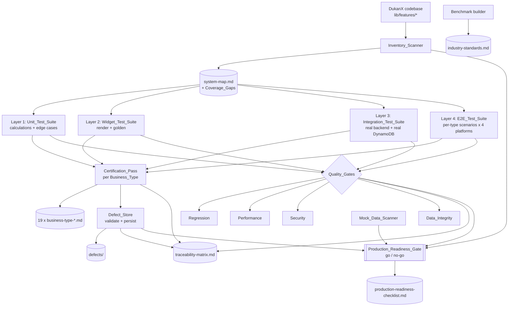

# Design Document

## Overview

The `comprehensive-test-certification` feature introduces the **Certification_System**: a
Dart-based tooling and test-orchestration layer that scans DukanX, drives a four-layer Flutter
test pyramid, runs a per-business-type certification protocol, enforces four cross-cutting quality
gates, maintains a persistent traceability matrix, and produces a single explicit go/no-go
production-readiness decision. The goal is a zero-defect, production-ready release validated
against the real Node.js backend and real DynamoDB database, with no mock, stub, or hardcoded
business data permitted in release or profile builds.

The Certification_System is **not** a runtime feature of the operator app. It is a body of test
code and deterministic decision logic that lives alongside the existing test corpus
(`Dukan_x/test/`, `Dukan_x/integration_test/`). It reuses the patterns already established in this
repo — the workspace-walking helpers in `test/audit/audit_walker.dart`, the golden-snapshot
discipline in `test/preservation/`, and the repo-wide property-based-testing convention built on
`dartproptest`.

The system is composed of seven cooperating capabilities, each backed by a deliverable artifact:

1. **Inventory_Scanner** → `inventory/system-map.md` (Req 1).
2. **Four test layers** — Unit, Widget, Integration, E2E (Req 2, 3, 4, 5).
3. **Certification_Pass** orchestrator → 19 × `reports/business-type-<name>.md` (Req 6).
4. **Defect_Store** → `defects/` records with validated structure (Req 7).
5. **Four Quality_Gates** — Regression, Performance, Security, Data_Integrity (Req 8–11).
6. **Traceability_Matrix** → `traceability-matrix.md` and **Benchmark_Document** →
   `benchmark/industry-standards.md` (Req 12, 13).
7. **Production_Readiness_Gate** → `production-readiness-checklist.md`, plus the
   **Mock_Data_Scanner** that makes mock data a hard release blocker (Req 14, 15, 16).

### Design goals

- **Evidence over assumption.** Every coverage claim is backed by a scanned source path, a test
  result, or a persisted record. Nothing is "assumed certified".
- **Real services, no mocks at the boundary.** Integration and E2E layers run against the real
  backend and DynamoDB. Mock data anywhere in a Release_Build is a release-blocking defect.
- **Deterministic decisions.** Go/no-go, defect validation, coverage-gap detection, and
  reconciliation are pure functions of their inputs, so they are reproducible and property-testable.
- **Separation of "verify" from "decide".** The layers that *gather evidence* (scanners, test
  runners, gates) are separate from the pure logic that *renders a decision* from that evidence.
  The pure decision logic is the primary property-based-testing target.
- **Idempotent, append-only artifacts.** The Traceability_Matrix and Production_Readiness_Checklist
  preserve prior entries across cycles; a failed write never leaves a partially-modified artifact.

### Research notes

- **Business types.** Confirmed in `lib/models/business_type.dart`: exactly 19 values —
  `grocery, pharmacy, restaurant, clothing, electronics, mobileShop, computerShop, hardware,
  service, wholesale, petrolPump, vegetablesBroker, clinic, bookStore, jewellery, autoParts,
  decorationCatering, schoolErp, other`. The four Service_Only_Types are `service, clinic,
  schoolErp, decorationCatering`.
- **Existing scan tooling.** `test/audit/audit_walker.dart` already walks the workspace, lists
  Dart files, resolves the workspace root, and emits structured `Finding` rows; `test/preservation/`
  uses golden snapshots for stability. The Inventory_Scanner and Certification_Pass reuse these
  helpers rather than re-implementing file walking.
- **PBT library.** The repo standardized on `dartproptest ^0.2.1` (see the `dev_dependencies` note
  in `pubspec.yaml` explaining why `glados` was rejected). The API is
  `forAll((args...) => bool, [gen1, ...], numRuns: 200)` with `precond(...)` for assumptions. The
  pure decision logic in this feature (defect validation, go/no-go, coverage-gap, reconciliation,
  ledger/inventory invariants) is an ideal PBT target.
- **Test dependencies to add.** Requirements name `golden_toolkit` (Req 3.5) and `patrol`
  (Req 5.7) which are **not** in `pubspec.yaml` today; the design adds them to `dev_dependencies`.
  Requirements mention `mocktail` (Req glossary) while the repo uses `mockito` — the design keeps
  `mockito` (already present, with codegen wired) to avoid a redundant dependency, and notes this
  deviation. Fixed-precision arithmetic uses the already-present `decimal` package.
- **Backend/DB targets.** Per `docs/ARCHITECTURE.md`, the authoritative operator API is
  `my-backend/` (Serverless TS, region `ap-south-1`); DynamoDB tables are provisioned by
  `template.yaml` (SAM) and `my-backend/serverless.yml`. Integration/E2E layers target a dedicated
  certification stage of these real services, never mocks.

## Architecture

The Certification_System is a pipeline: **scan → plan → test → gate → trace → decide**. Each stage
consumes verified evidence and emits an artifact. The shaded "decision core" stages are pure
functions and are the property-based-testing targets.



### Layer boundaries

| Layer | Tooling | Scope | Real services? | Location |
|-------|---------|-------|----------------|----------|
| L1 Unit | `flutter_test` + `mockito` + `decimal` | Pure calc & business logic | Mocks allowed (test-only) | `test/unit/<type>/<module>/` |
| L2 Widget | `flutter_test` + `golden_toolkit` | Screen render, states, goldens | Mocks allowed (test-only) | `test/widget/<type>/<module>/` |
| L3 Integration | `integration_test` | Module ↔ real backend ↔ real DynamoDB | **Required real** | `integration_test/<module>/` |
| L4 E2E | `integration_test` + `patrol` | Full scenarios, native flows | **Required real** | `e2e/<type>/` |

The "no mock data" rule (Req 4.2, 15.5) applies to **Release_Builds** and to the L3/L4 boundary.
Mocks used inside L1/L2 are test doubles that never ship in a build; the Mock_Data_Scanner
distinguishes the two by scanning the *build artifact's* source modules, bundled assets, and config
(Req 15.1), not the test tree.

### Decision core (pure, property-tested)

These components take evidence as input and produce a verdict with no I/O. They are deterministic
and are where the correctness properties concentrate:

| Component | Pure responsibility | Requirements |
|-----------|--------------------|--------------|
| `DefectValidator` | Accept/reject a Defect record by structural rules; classify gap category. | 7.1, 7.2, 7.3 |
| `LedgerInvariant` / `InventoryInvariant` | Compute expected ledger balance and on-hand quantity. | 5.2, 5.3 |
| `ReconciliationChecker` | Net aggregate balance difference; orphaned-reference detection. | 11.1–11.5 |
| `CoverageGapCalculator` | Detect screens/types shortfalls and zero-test requirements. | 1.8, 1.9, 13.3, 13.4 |
| `GateStatusReducer` | Reduce per-metric/per-test results to a gate pass/fail. | 9.3, 9.4, 10.x, 8.2, 8.3 |
| `ProductionReadinessDecider` | Reduce all gate statuses + defects + scan results to go/no-go. | 14.1–14.5, 15.3, 15.4 |
| `BenchmarkValidator` | Confirm all six practice categories map to ≥1 concrete action. | 12.2, 12.3 |

### Evidence/IO shell (example, integration, smoke)

These stages perform I/O (file scanning, test execution, network, DynamoDB) and are validated with
example, integration, and smoke tests rather than properties:

- `InventoryScanner` — walks the codebase, writes `system-map.md`.
- The four test-suite runners and the real-service wiring.
- `RegressionRunner`, `PerformanceProbe`, `SecurityProbe`, `MockDataScanner`.
- `ArtifactStore` — atomic, append-only writers for matrix/checklist (temp-write + rename).

## Components and Interfaces

All certification tooling lives under `Dukan_x/test/certification/` (pure logic + unit/property
tests), with the four layer suites under their required roots (`test/unit/`, `test/widget/`,
`integration_test/`, `e2e/`). Types below are Dart.

### Business type and module domain

```dart
/// The 19 verticals (mirror of lib/models/business_type.dart).
/// Service_Only_Types carry no product/inventory scope.
const Set<String> kServiceOnlyTypes = {
  'service', 'clinic', 'schoolErp', 'decorationCatering',
};

/// Functional modules certified per type (Req 1.4).
enum Module {
  customerManagement, supplierManagement, inventoryTracking, invoiceGeneration,
  payments, reports, analytics, dataSync, offlineMode, subscriptionControls,
  licenseActivation, billing,
}
```

### Inventory_Scanner (Req 1)

```dart
class ScreenEntry {
  final String route;
  final String widgetName;
  final List<String> businessTypes;
  final String sourcePath;        // evidence: where it was detected
}

class SystemMap {
  final List<BusinessTypeEntry> businessTypes;   // modules, tax rules, workflows, permissions
  final List<ScreenEntry> screens;               // screen -> route -> widget -> types
  final List<RouteEntry> routes;
  final List<ModuleEntry> modules;
  final List<RoleEntry> roles;                    // role -> permission-matrix entries
  final List<BackendCallEntry> backendCalls;      // + sourcePath
  final List<DbAccessEntry> dbAccessPoints;       // + sourcePath
  final List<MockDataEntry> detectedMockData;     // path + indicator
  final List<CoverageGap> coverageGaps;
}

class InventoryScanner {
  /// Walks Dukan_x/lib/features/* (reusing audit_walker helpers). Continues on
  /// unreadable files, recording a Coverage_Gap per skip (Req 1.10).
  SystemMap scan();

  /// Writes inventory/system-map.md with one table per section + gap list (Req 1.7).
  void writeSystemMap(SystemMap map, String path);
}
```

### Test layer suites (Req 2, 3, 4, 5)

The suites are organized by the required directory shape. Layer 1 exposes the calculation engine
under test so unit and property tests share it:

```dart
/// Fixed-precision results. Monetary scale = 2, quantity scale = 3 (Req 2.2).
/// Rounding is half-up (Req 2.3). Built on package:decimal.
sealed class CalcResult {}
class CalcValue extends CalcResult { final Decimal value; }
class CalcError extends CalcResult { final String code; final String message; }

abstract class CalculationEngine {
  CalcResult taxTotal(...);
  CalcResult gst(...);
  CalcResult vat(...);
  CalcResult invoiceTotal(...);
  CalcResult reconcilePayment(...);
  CalcResult inventoryAdjustment(...);
  CalcResult roundCurrency(Decimal raw);   // half-up to 2 dp
  // Invalid input (null, non-numeric, out of [0.01, 999999999.99], illegal
  // negative) returns CalcError and persists nothing (Req 2.6, 2.7).
}
```

### Certification_Pass (Req 6)

```dart
enum CheckName {
  authAndOnboarding, modulesInWorkflowOrder, routeReachability,
  rolePermissionEnforcement, reportAndAnalyticsAccuracy, billingInventoryPersistence,
}

class CheckResult { final CheckName name; final bool passed; final List<String> defectIds; }

class CertificationReport {
  final String businessType;
  final List<CheckResult> checks;     // one per CheckName (Req 6.1)
  final bool overallPass;             // FAIL if any check has >=1 defect (Req 6.7)
  final List<String> omittedTests;    // service-only omissions + rationale (Req 16.5)
}

class CertificationPass {
  /// Runs all checks for one type, records Defects for failures, writes
  /// reports/business-type-<name>.md (Req 6.6).
  CertificationReport run(String businessType);

  /// Runs all 19 types -> exactly 19 reports (Req 6.8).
  List<CertificationReport> runAll();
}
```

### Defect_Store and DefectValidator (Req 7)

```dart
enum Severity { critical, high, medium, low }      // critical/high == release-blocking
enum ResolutionStatus { open, inProgress, resolved, closed }
enum GapCategory {
  feature, workflow, navigation, missingScreen, brokenRoute,
  uiInconsistency, incorrectCalculation, dataIntegrity, missingRequirement,
}

class Defect {
  final String id;                  // unique
  final Severity severity;
  final List<String> reproSteps;    // >= 1 ordered step
  final ResolutionStatus status;
  final GapCategory category;       // exactly one
}

class DefectValidation { final bool accepted; final String? errorField; }

class DefectValidator {
  /// Pure structural check. Rejects (and names the offending field) when id is
  /// missing, severity/status not in allowed set, repro empty, or category not
  /// exactly one. No partial record retained (Req 7.3).
  DefectValidation validate(Defect candidate);
}

class DefectStore {
  /// Persists only validated defects under defects/. On status -> resolved/closed,
  /// updates status AND links the resolution into the matrix in one operation (Req 7.5).
  void upsert(Defect defect);
  bool get allClosed;               // drives "not production-ready" while any open (Req 7.4)
}
```

### Quality gates (Req 8, 9, 10, 11)

```dart
enum GateStatus { green, notGreen }

abstract class QualityGate {
  String get name;
  GateStatus run();
}

/// Req 8 — full suite within 10 min of commit; nightly when no commit (Req 8.5).
class RegressionGate implements QualityGate { ... }

/// Req 9 — cold-start, scroll fps, report-gen, sync time vs tunable thresholds
/// over >= 10,000 records. Pure reducer below decides pass/fail.
class PerformanceProbe { List<PerfMeasurement> measure(PerfConfig cfg); }

/// Req 10 — five categories: auth bypass, role escalation, insecure storage,
/// API authz, license tamper. Any failing case => release-blocking defect.
class SecurityProbe { List<SecurityCaseResult> run(); }

/// Req 11 — referential integrity + reconciliation. Pure logic in ReconciliationChecker.
class DataIntegrityGate implements QualityGate { ... }
```

```dart
class PerfThresholds {                       // defaults; tunable via config (Req 9.2)
  final int coldStartMs;                     // default 5000
  final int reportGenMs;                     // default 10000
  final int syncMs;                          // default 60000
  final int minFps;                          // default 30 (no frame > 33ms)
  final int datasetRecords;                  // default 10000
  final ThresholdSource source;              // default | tuned
}

class PerfMeasurement {
  final String metric; final num measured; final num threshold;
  final ThresholdSource source; final int datasetRecords; final bool measured_;
}

class GateStatusReducer {
  /// Pure: green iff every measurement is within threshold and measurable (Req 9.3, 9.4, 9.6).
  GateStatus reducePerformance(List<PerfMeasurement> ms);
  /// Pure: green iff zero failing security cases across all five categories (Req 10).
  GateStatus reduceSecurity(List<SecurityCaseResult> cases);
}
```

### Reconciliation and invariants (Req 5, 11)

```dart
class LedgerInvariant {
  /// Expected ledger balance = subtotal - discount - paymentReceived (Req 5.2).
  Decimal expectedBalance(Decimal subtotal, Decimal discount, Decimal payment);
}

class InventoryInvariant {
  /// Expected on-hand = received - invoiced (Req 5.3).
  Decimal expectedOnHand(Decimal received, Decimal invoiced);
}

class ReconciliationChecker {
  /// orphaned references across invoice/payment/inventory/ledger (Req 11.1, 11.2).
  List<OrphanRef> orphans(RecordSet records);
  /// net difference of corresponding aggregate balances; expected 0.00 (Req 11.3, 11.4).
  Decimal netDifference(RecordSet before, RecordSet after);
}
```

### Traceability_Matrix and Benchmark_Document (Req 12, 13)

```dart
class TraceEntry {
  final String requirementId;          // exactly one per requirement (Req 13.1)
  final List<String> testCaseIds;
  final List<TestResult> latestResults;
  final List<String> defectIds;
  final List<String> resolutionLinks;
  final bool isCoverageGap;            // true when testCaseIds is empty (Req 13.3)
}

class TraceabilityMatrix {
  /// Atomic update within 5s of a committed change; failed write retains last
  /// good matrix (Req 13.2, 13.4, 13.5, 13.6).
  void applyChange(TraceChange change);
  void persist(String path);
}

class BenchmarkValidator {
  /// Six practice categories must each map to >= 1 concrete action; otherwise
  /// reject and name the unmapped category (Req 12.2, 12.3). Retains valid content.
  BenchmarkValidation validate(BenchmarkDocument doc);
}
```

### Production_Readiness_Gate and Mock_Data_Scanner (Req 14, 15)

```dart
class ReadinessInputs {
  final bool mockDataAbsent;           // from Mock_Data_Scanner (Req 15)
  final bool debugFlagsAbsent;
  final bool envMatchesProduction;
  final bool crashFree;
  final Map<String, GateStatus> gateStatuses;   // every Quality_Gate
  final List<Defect> unresolvedDefects;
  final Set<String> unevaluatableItems;         // items whose status can't be determined
}

class ReadinessDecision { final bool go; final List<String> reasons; }

class ProductionReadinessDecider {
  /// Pure decision (Req 14.2, 14.3, 14.4, 14.5, 15.3, 15.4):
  /// go IFF mock data absent, debug flags absent, env matches prod, crash-free,
  /// every gate green, zero unresolved release-blocking (Critical/High) defects,
  /// and no unevaluatable items. Otherwise no-go with itemized reasons.
  ReadinessDecision decide(ReadinessInputs inputs);
}

class MockDataScanner {
  /// Scans 100% of a Release_Build's source modules, assets, config within 300s;
  /// classifies hardcoded samples, stubbed responses, in-memory fakes, fixtures,
  /// placeholder creds as Mock_Data (Req 15.1, 15.2). One defect per occurrence.
  MockScanResult scan(BuildArtifact build);
}
```

## Data Models

### System_Map tables (Req 1.7)

`inventory/system-map.md` contains one Markdown table per section. Every row carries the source
path that proves it (Req 1.1, 1.2, 1.5, 1.6).

| Section | Columns |
|---------|---------|
| Business_Types | type, enabledModules, taxRules, workflows, requiredPermissions, sourcePath |
| Screens | screen, route, widget, businessTypes, sourcePath |
| Routes | route, target, status (reachable/broken/dead/missing) |
| Modules | module, owningTypes |
| Roles | role, module, permittedAction |
| Backend_Calls | callSignature, sourcePath |
| DB_Access | accessPoint, sourcePath |
| Mock_Data | sourcePath, indicator |
| Coverage_Gaps | kind, expected, actual, shortfall/reason |

Coverage-gap seeds: fewer than 460 screens (Req 1.8), fewer than 19 types (Req 1.9), and any
unreadable file (Req 1.10) each produce a structured gap row.

### Calculation domain (Req 2)

Monetary values use `Decimal` at scale 2; quantities at scale 3. The valid monetary input domain is
`[0.01, 999_999_999.99]`. Inputs outside the domain, `null`, non-numeric, or illegally negative
produce a `CalcError` and persist nothing. Categories under test: tax, discounts, GST, VAT, invoice
totals, payment reconciliation, inventory adjustments, credit/debit entries, currency rounding —
each with ≥1 case per applicable Business_Type (Req 2.4) and the seven required edge cases
(Req 2.5).

### Defect record (Req 7)

```jsonc
{
  "id": "DEF-0007",                       // unique, required
  "severity": "High",                     // {Critical, High, Medium, Low}
  "reproSteps": ["Open jewellery billing", "Add item", "Observe total"],  // >= 1
  "status": "Open",                       // {Open, In-Progress, Resolved, Closed}
  "category": "incorrectCalculation"      // exactly one of the 9 gap categories
}
```

A record missing any required field, or carrying an out-of-set value, or more/fewer than one
category, is rejected with the offending field named; no partial record is written (Req 7.3).

### Certification_Report (Req 6)

`reports/business-type-<name>.md` — a PASS/FAIL line for each of the six checks, the defect ids per
FAIL line, the overall result (FAIL if any check has ≥1 defect), and, for Service_Only_Types, the
list of omitted product/inventory test cases with the no-scope rationale (Req 16.5). The run
produces exactly 19 such reports (Req 6.8).

### Performance record (Req 9.5)

Each measurement records: metric name, measured value, threshold, threshold source
(default/tuned), and dataset record count, written into the Production_Readiness_Checklist. A
metric that cannot be measured is marked "not measured" with a defect (Req 9.6).

### Traceability entry (Req 13)

Exactly one entry per business requirement, linking test cases → latest results → defects →
resolutions. An entry with zero linked test cases is flagged `isCoverageGap = true`; the flag is
removed within 5s once a linkage is committed. Entries persist unchanged across cycles until
explicitly updated; a failed write retains the last good matrix (Req 13.5, 13.6).

### Production_Readiness_Checklist (Req 14)

A result entry (pass/fail) for: absence of Mock_Data, absence of debug flags, environment match,
crash-free operation, and the green/not-green status of every Quality_Gate. The final decision is
go only when all items pass and zero release-blocking defects remain; otherwise no-go with each
failing item or defect listed as a reason. Prior records are retained, never overwritten
(Req 15.3).

## Correctness Properties

*A property is a characteristic or behavior that should hold true across all valid executions of a
system — essentially, a formal statement about what the system should do. Properties serve as the
bridge between human-readable specifications and machine-verifiable correctness guarantees.*

The Certification_System mixes IO-heavy evidence gathering (scanning, real-service tests, gate
probes) with a **pure decision core** (defect validation, gate reducers, ledger/inventory
invariants, reconciliation, coverage-gap detection, go/no-go). The decision core is deterministic
logic over well-defined inputs and is the property-based-testing target below. Each property is
implemented by a single `dartproptest` test running at least 100 iterations. Generators draw
business types from the 19 real values (including the four Service_Only_Types) and synthesize
randomized evidence (defect records, check-result sets, measurements, record sets, matrices) to
exercise edge bands and rejection directions. Properties that have a rejection direction mutate a
valid input to break exactly one rule and assert the decision flips.

### Property 1: Coverage-gap shortfall arithmetic

*For any* expected count E (460 for screens, 19 for business types) and *any* actual count A, the
Inventory_Scanner records a Coverage_Gap entry if and only if A < E, and when recorded the entry
states expected = E, actual = A, and shortfall = E − A (a non-negative integer).

**Validates: Requirements 1.8, 1.9**

### Property 2: Currency rounding is half-up at scale 2 and results carry the fixed scale

*For any* raw Decimal value, `roundCurrency` returns that value rounded half-up to 2 decimal places,
and every monetary result is reported at scale 2 while every quantity result is reported at scale 3.

**Validates: Requirements 2.2, 2.3**

### Property 3: Invalid calculation input yields a defined error and persists nothing

*For any* calculation input that is null, non-numeric, illegally negative, or outside the monetary
domain [0.01, 999,999,999.99], the CalculationEngine returns a `CalcError` (never a `CalcValue`) and
no partial result is persisted or returned.

**Validates: Requirements 2.6, 2.7**

### Property 4: Ledger balance invariant

*For any* invoice subtotal, *any* discount in the range 0..subtotal, and *any* payment received, the
expected ledger entry balance equals subtotal − discount − payment, computed at scale 2.

**Validates: Requirements 5.2**

### Property 5: Inventory on-hand invariant

*For any* received quantity and *any* invoiced quantity, the expected final on-hand inventory
quantity equals received − invoiced, computed at scale 3.

**Validates: Requirements 5.3**

### Property 6: Subscription and license gating is accessible exactly when entitled

*For any* active subscription (including license-activation state) and *any* gated feature, the
feature is accessible if and only if the active subscription's entitlement set contains that
feature; otherwise access is blocked with a denial indication.

**Validates: Requirements 5.4**

### Property 7: Report-accuracy mismatch threshold

*For any* expected value and *any* actual value of a report or analytics output, the result is
classified as a mismatch (and a Defect recorded) if and only if the absolute difference is greater
than 0.01.

**Validates: Requirements 6.4**

### Property 8: Certification result is the conjunction of its checks

*For any* set of check results produced for a Business_Type, the Certification_Report overall result
is PASS if and only if every check recorded zero Defects, and FAIL otherwise; and *for any* report
mutated so that one passing check gains a Defect, the overall result becomes FAIL.

**Validates: Requirements 6.7**

### Property 9: Defect-record validation accepts well-formed records and rejects malformed ones

*For any* candidate Defect record, the DefectValidator accepts it if and only if it has a unique
identifier, a severity in {Critical, High, Medium, Low}, at least one ordered reproduction step, a
resolution status in {Open, In-Progress, Resolved, Closed}, and exactly one gap category; and *for
any* record mutated to drop or corrupt one of those fields, validation rejects it, names the
offending field, and retains no partial record.

**Validates: Requirements 7.1, 7.2, 7.3**

### Property 10: Regression result reduces to a conjunction and blocks on any failure

*For any* set of per-test results, the Regression_Suite overall status is failed if and only if at
least one test failed; when failed the release is blocked and the notification set equals exactly the
set of failed tests; when all pass the overall status is passed and the release is not blocked on
this gate.

**Validates: Requirements 8.2, 8.3**

### Property 11: Performance gate is green only when every metric is measured and within threshold

*For any* set of performance measurements, the Performance Quality_Gate is green if and only if every
required metric was measured and its measured value is at or within its defined threshold; otherwise
the gate fails and exactly one Defect is recorded per offending metric, identifying the metric, its
measured value (or not-measured), and its threshold, while all measurements are retained.

**Validates: Requirements 9.3, 9.4, 9.6**

### Property 12: Security gate is green only with zero failing cases across all five categories

*For any* set of security case results across the five categories (authentication bypass, role
escalation, insecure local storage, API authorization, license tamper), the Security Quality_Gate is
green if and only if no case failed; otherwise the gate fails and exactly one release-blocking Defect
is recorded per category containing a failing case, naming the affected endpoint or case.

**Validates: Requirements 10.1, 10.5**

### Property 13: Data-integrity verdict requires zero orphans and a zero reconciliation difference

*For any* record set over invoice, payment, inventory, and ledger records, the Data_Integrity
Quality_Gate passes if and only if every foreign-key reference resolves to an existing parent
(zero orphaned references) and the net difference between corresponding aggregate reconciliation
balances is exactly 0.00 currency units; otherwise the gate fails and the Defect identifies the
orphaned references and/or the inconsistent record sets together with the computed difference.

**Validates: Requirements 11.1, 11.2, 11.3, 11.4, 11.5**

### Property 14: Benchmark document is valid only when all six practice categories are mapped

*For any* Benchmark_Document, validation succeeds if and only if each of the six required practice
categories maps to at least one concrete, named action; otherwise validation rejects the document,
names each unmapped category, and retains any previously generated valid content.

**Validates: Requirements 12.2, 12.3**

### Property 15: Traceability coverage-gap flag tracks linked test cases (round-trip)

*For any* Traceability_Matrix, a requirement entry is flagged as a Coverage_Gap if and only if its
set of linked test cases is empty; and *for any* gap-flagged entry, committing at least one test-case
linkage clears the gap flag, while removing the last linkage re-introduces it.

**Validates: Requirements 13.3, 13.4**

### Property 16: Traceability persistence is stable across no-op cycles

*For any* persisted Traceability_Matrix, running a certification cycle that commits no entry change
leaves every prior entry unchanged; entries are retained until explicitly updated.

**Validates: Requirements 13.5**

### Property 17: Production-readiness decision is go exactly when all evidence is clean

*For any* set of readiness inputs, the Production_Readiness_Gate records a go decision if and only if
Mock_Data is absent, debug flags are absent, the environment configuration matches production,
operation is crash-free, every Quality_Gate is green, zero unresolved release-blocking (Critical or
High) Defects remain, and no required checklist item is unevaluatable; in every other case it records
a no-go decision and lists each failing item, non-green gate, blocking Defect, or unevaluatable item
as a reason.

**Validates: Requirements 7.4, 12.5, 14.2, 14.3, 14.4, 14.5, 15.3, 15.4**

### Property 18: Every test file maps to exactly one business type and one module

*For any* test file path under the four layer roots, the classifier associates it with exactly one
Business_Type and exactly one Module; and *for any* path that cannot be associated with exactly one
of each, a Defect is recorded naming the unassigned file.

**Validates: Requirements 16.3, 16.4**

### Property 19: Service-only certification omits product and inventory test cases

*For any* Service_Only_Type (`service`, `clinic`, `schoolErp`, `decorationCatering`), the produced
test set contains no product or inventory test case and each omitted case is recorded with the
rationale that the type has no product or inventory scope; and *for any* attempt to inject a product
or inventory case into a service-only set, the case is rejected.

**Validates: Requirements 16.5**

## Error Handling

The Certification_System is fail-safe and evidence-preserving: an unprovable or failed step never
produces a false "ready" verdict, and a failed write never corrupts a prior artifact.

### Scan-time errors (Req 1.10, 15.6)

The Inventory_Scanner and Mock_Data_Scanner continue past an unreadable or unparseable file,
recording a Coverage_Gap (inventory) or a release-blocking Defect plus a no-go decision (mock scan)
that names the affected path and the reason it was skipped. A scan that cannot complete at all
(inaccessible build artifact) is itself a release-blocking condition, never a silent pass.

### Validation rejection (Req 7.3, 12.3)

`DefectValidator` and `BenchmarkValidator` are pure and total: they return an explicit rejection
naming the offending field or unmapped category and never persist a partial record. A rejected
defect is not written to `defects/`; a rejected benchmark document retains the last valid content.

### Atomic artifact writes (Req 13.5, 13.6, 15.3)

The Traceability_Matrix and Production_Readiness_Checklist are written via a temp-file-plus-rename
`ArtifactStore` so a failed or interrupted write leaves the last successfully persisted artifact
intact and returns an error identifying the failed update. Prior entries are append-preserved and
never overwritten in place.

### Gate and decision failure (Req 8.4, 9.6, 14.5, 15.6)

When a gate cannot run (infrastructure/environment error) or a metric cannot be measured, the
affected gate is marked failed/not-green and the run surfaces a notification — it is never treated as
green. The `ProductionReadinessDecider` treats any unevaluatable checklist item as an automatic
no-go with the item named, so missing evidence can never yield a go.

### Scenario isolation (Req 5.8, 5.9)

A failing assertion, operation error, or 300-second timeout halts only the offending E2E scenario;
the runner records the failing step (or the step in progress at timeout) and continues the remaining
Business_Type scenarios. One vertical's failure never blocks certification of the others.

## Testing Strategy

The Certification_System is itself test code, so "testing strategy" here means how the
Certification_System's own logic is verified. It uses a dual approach: example/edge/integration tests
for the IO shell, and a property-based suite for the pure decision core.

### Property-based testing

- **Library.** `dartproptest ^0.2.1` — the repo-wide PBT library (already a `dev_dependency`; see the
  note in `pubspec.yaml` explaining why `glados` was not adopted). Do not hand-roll generators or
  implement PBT from scratch. API: `forAll((args...) => bool, [gen1, ...], numRuns: kNumRuns)` with
  `precond(...)` for assumptions.
- **Generators.**
  - A business-type generator over the 19 real types, plus a Service_Only_Type generator.
  - Evidence generators: defect records (well-formed and field-mutated), check-result sets,
    performance-measurement sets (within/over threshold and not-measured), security case-result sets,
    record sets with and without orphaned references and matching/mismatched aggregates, traceability
    matrices, and `ReadinessInputs`.
  - Numeric generators for money (scale 2, domain edges incl. 0.01 and 999,999,999.99 and the
    half-up .xx5 boundary) and quantities (scale 3), built on `package:decimal`.
  - A mutation generator that takes a valid input and breaks exactly one rule to drive the rejection
    direction of Properties 3, 8, 9, 14, 18, 19.
- **Configuration.** `const int kNumRuns = 200;` (≥100 required; 200 matches the repo convention).
- **Tagging.** Each property test carries a comment of the form
  `Feature: comprehensive-test-certification, Property {number}: {property_text}`.
- **One test per property.** Each of Properties 1–19 is implemented by a single property-based test;
  the forward and rejection directions live in that one test where applicable. Tests reside under
  `Dukan_x/test/certification/`.

### The four certification layers (the deliverable suites)

These are the suites the Certification_System produces and runs over DukanX; they use example,
integration, and snapshot strategies rather than properties:

- **Layer 1 — Unit (`test/unit/<type>/<module>/`).** `flutter_test` + `mockito`, with the
  property-tested `CalculationEngine` exercised by example cases for the ten calculation categories
  (Req 2.1, 2.4) and the seven required edge cases (Req 2.5). Mocks here are test-only doubles that
  never ship.
- **Layer 2 — Widget (`test/widget/<type>/<module>/`).** `flutter_test` + `golden_toolkit`
  (**to add** to `dev_dependencies`). Render/build, state (loading/empty/error/success), and
  input-validation tests per screen, plus one golden per screen per type; a ≥1-pixel golden diff
  fails the test and records the screen and type (Req 3.1–3.6).
- **Layer 3 — Integration (`integration_test/<module>/`).** `integration_test` against the **real**
  Node.js backend (`my-backend/`) and **real** DynamoDB on a dedicated certification stage. Covers
  auth, token refresh, role guards, and offline-sync (Req 4). No mocks at this boundary.
- **Layer 4 — E2E (`e2e/<type>/`).** `integration_test` + `patrol` (**to add** to
  `dev_dependencies`) for native flows. One scenario per type across Android, iOS, Windows, macOS,
  with platform-specific assertions; scenario isolation and a 300 s timeout per Req 5.8/5.9.

### Example, integration, and smoke tests for the decision shell

- **Scanner example tests** (Req 1.1–1.7, 1.10, 15.1, 15.2): run scanners over a small fixture tree;
  assert the eight system-map tables, evidence source paths, and mock-data classification.
- **Certification orchestration** (Req 6.1–6.3, 6.5, 6.6, 6.8): example tests over a fixture type set
  asserting the six checks run, defects are recorded for failures, and exactly 19 reports are written.
- **Defect transactional update** (Req 7.5): example test that a status change to Resolved/Closed
  updates status and links the resolution into the matrix in one operation.
- **Traceability/checklist atomicity** (Req 13.2, 13.6, 16.1, 16.2): example tests for the within-5s
  update, temp-write-plus-rename atomicity, and deliverable existence/empty checks.
- **CI/scheduler smoke** (Req 8.1, 8.5, 5.5, 5.7, 2.8, 3.7, 4.9): smoke checks that the regression
  trigger and nightly schedule are wired and that suites reside under the required roots.

### Dependency changes

Add to `Dukan_x/pubspec.yaml` `dev_dependencies`: `golden_toolkit` (Req 3.5) and `patrol` (Req 5.7).
The design keeps the existing `mockito` rather than adding `mocktail` (named in the requirements
glossary) because `mockito` is already wired with codegen in this repo; this is a deliberate, recorded
deviation that satisfies the Layer 1 mocking need without a redundant dependency.
