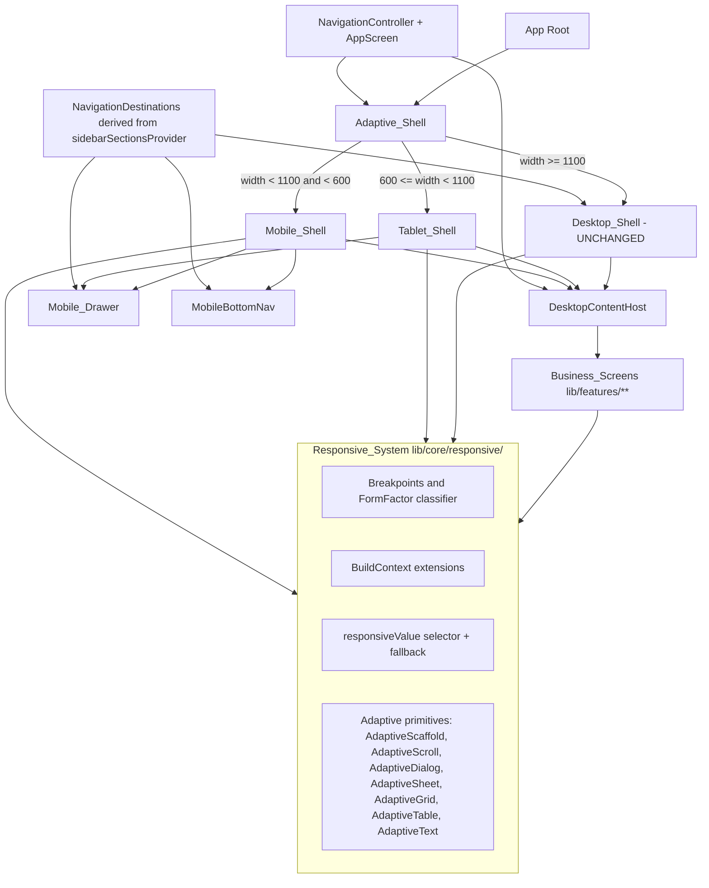
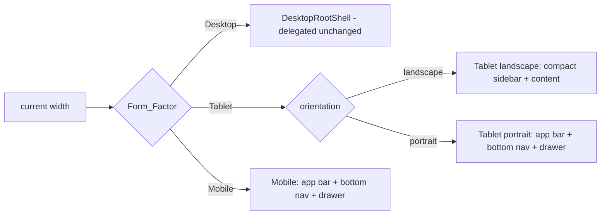

# Design Document

## Overview

This design defines a single, centralized responsive architecture and stability initiative for Dukan_x so that every feature renders consistently and safely across all `Supported_Platform`s (Android phone/tablet, iPhone/iPad, Windows desktop, and Web) from one screen implementation. The design directly addresses the three concrete defects called out in the requirements:

1. **Duplicate responsive systems.** Two overlapping utilities exist today — `lib/core/responsive/responsive_layout.dart` (the cross-platform Mobile/Tablet/Desktop system with breakpoints 600 and 1100) and `lib/core/theme/responsive_layout.dart` (a desktop-window-resizing system with breakpoints 1280/1440/1920). These define conflicting breakpoints and overlapping helpers (`ResponsiveContext.isLarge` vs `ResponsiveBuildContext.isLarge`, two `responsivePadding`/`adaptivePadding` notions). The design consolidates them into one authoritative `Responsive_System` under `lib/core/responsive/`.

2. **Compile-blocking broken reference.** `lib/core/responsive/adaptive_shell.dart` imports `mobile_drawer.dart` and instantiates `MobileDrawer()` in four places, but the file does not exist. This is a hard compile error today. The design specifies a concrete `Mobile_Drawer` implementation that satisfies the import and provides full navigation parity.

3. **Desktop-only screens.** Most `Business_Screen`s under `lib/features/` were authored for the fixed desktop layout and overflow, clip, or break on smaller form factors, under orientation changes, keyboard insets, and accessibility font scaling.

The design's guiding principles:

- **One source of truth.** Exactly one definition of breakpoints, `Form_Factor` classification, context extensions, adaptive widgets, and responsive value selectors. (Req 1, Req 2)
- **Preserve the desktop experience.** `Desktop_Shell` (`lib/widgets/desktop/desktop_root_shell.dart`) and its navigation set are kept byte-for-byte unchanged; the `Adaptive_Shell` simply delegates to it on the Desktop `Form_Factor`. (Req 5)
- **Single-implementation adaptive screens.** A screen is authored once and reflows through the `Responsive_System`; there are no parallel per-form-factor screen files. (Req 4)
- **Safety by construction.** Reusable adaptive primitives (scroll-on-overflow, bounded constraints, safe-area, text overflow handling) make the overflow/clipping/unbounded-constraint bug classes structurally hard to reintroduce. (Req 6, 7, 8)
- **Testability.** A property-and-widget test harness asserts no `Overflow_Error` across the full width range, orientations, keyboard insets, and font scales, and verifies shell selection per `Form_Factor`. (Req 13)

### Scope

In scope: the `Responsive_System` consolidation, `Mobile_Drawer`, `Adaptive_Shell`/`Mobile_Shell`/`Tablet_Shell`, adaptive primitives and per-component responsiveness, navigation consistency, stability scaffolding (error boundaries, progress/async patterns), per-platform performance patterns, the `Responsive_Audit`, and the test harness.

Out of scope: business logic, data models, and backend behavior, except where required to surface graceful error handling in the UI (Req 9.6, 10.3, 10.4).

## Architecture

### High-level layering



The `Responsive_System` is a leaf dependency: shells, components, and screens depend on it, and it depends on nothing in the app except Flutter. This keeps it free of cycles and trivially testable.

### Form_Factor classification (single source)

`Form_Factor` is derived purely from logical screen width using one `Breakpoint_Strategy` (Req 1.2–1.4, Req 2.3):

| Form_Factor | Width range (logical px) |
|-------------|--------------------------|
| Mobile      | `width < 600`            |
| Tablet      | `600 <= width < 1100`    |
| Desktop     | `width >= 1100`          |

The existing `lib/core/responsive/responsive_layout.dart` already encodes exactly these thresholds (`Breakpoints.mobile = 600`, `Breakpoints.tablet = 1100`) and the matching `getScreenSize` classifier, so it becomes the foundation of the consolidated system. The legacy `lib/core/theme/responsive_layout.dart` thresholds (1280/1440/1920) describe desktop window-comfort tiers, not `Form_Factor`; they are removed as an independent breakpoint authority (Req 2.4, 2.5).

### Shell selection

`Adaptive_Shell` (`lib/core/responsive/adaptive_shell.dart`) is the single entry point for the main layout. It reads the current `Form_Factor` from the `Responsive_System` and selects exactly one shell (Req 5.1, 9.1–9.3):



- **Desktop** delegates to `DesktopRootShell` with no behavioral change (Req 5). The full-screen/distraction-free toggle (Req 5.6, 5.7) is implemented inside the desktop layer as a UI-state flag that hides the sidebar and `EnterpriseTopBar` while keeping `DesktopContentHost` mounted (so the selected destination is retained on exit).
- **Tablet** picks its layout from orientation, re-rendering on rotation (Req 9.2, 9.8).
- **Mobile** always uses app bar + `MobileBottomNav` + `Mobile_Drawer` (Req 9.1).

All three shells host the same `DesktopContentHost`, which is the single screen switcher keyed by `AppScreen`. Because every shell shares this host, screens are authored once and reused across form factors (Req 4.1, 4.3).

### Navigation model and destination parity

Navigation state is owned by the existing `NavigationController` (Riverpod `Notifier<NavigationState>`), which is form-factor agnostic — it tracks `currentScreen`, `history`, and `isNavigating`. The set of *reachable destinations* for a business context is already produced once by `sidebarSectionsProvider` (`lib/widgets/desktop/sidebar_configuration.dart`), filtered by `BusinessCapability` and session permissions.

To guarantee identical reachable destinations across Mobile, Tablet, and Desktop (Req 9.4, 3.3), all three navigation surfaces derive from this single provider:

- `Desktop_Shell` consumes `sidebarSectionsProvider` directly (unchanged).
- `Mobile_Drawer` consumes the **same** `sidebarSectionsProvider`, rendering its sections/items as an expandable drawer list. It therefore exposes exactly the destinations the desktop sidebar exposes for the active business context.
- `MobileBottomNav` exposes a fixed set of 5 "primary" shortcuts; every bottom-nav destination is also present in the drawer, so the drawer remains the authoritative full set and parity holds at the shell level.

Destination resolution (id → screen → widget) is centralized: `AppScreen.fromId(id)` maps an item id to an `AppScreen`, and `DesktopContentHost` maps an `AppScreen` to a widget builder. A destination is *unresolvable* when `fromId` returns `AppScreen.unknown` or no builder/permission allows it; this drives the error handling in Req 3.6 and 9.6.

### Why the desktop layout is safe

`DesktopRootShell` is `const`-constructed and rebuilds only its leaf widgets via `NavigationController` selectors. The `Adaptive_Shell` already returns `const DesktopRootShell()` for the Desktop branch. The consolidation changes only the *import path/symbols* the desktop layer uses for any responsive helper, not its structure. The design treats `desktop_root_shell.dart` and the desktop navigation set as frozen (Req 5.5).

## Components and Interfaces

### 1. Responsive_System (consolidated) — `lib/core/responsive/`

The consolidated public surface lives under `lib/core/responsive/` and is re-exported from a single barrel (`lib/core/responsive/responsive.dart`) so call sites have one import.

**`responsive_breakpoints.dart`** — the only definition of thresholds and classification:

```dart
enum FormFactor { mobile, tablet, desktop }

class ResponsiveBreakpoints {
  static const double mobileMax = 600;   // width < 600 => mobile
  static const double tabletMax = 1100;  // 600..<1100 => tablet, >=1100 => desktop
  static const double maxContentWidth = 1200;

  /// Pure, side-effect-free classifier — the single source of truth.
  static FormFactor classify(double width) {
    if (width < mobileMax) return FormFactor.mobile;
    if (width < tabletMax) return FormFactor.tablet;
    return FormFactor.desktop;
  }
}
```

The existing `ScreenSize { mobile, tablet, desktop }` enum is retained as the public name to avoid churn across the many call sites that already use `context.screenSize`/`ScreenSize`; `FormFactor` is introduced as the canonical alias and `ScreenSize` is kept as a typedef-style synonym during migration. (One enum, one classifier — Req 1.1, 2.1, 2.5.)

**`responsive_context.dart`** — `BuildContext` extension with the context helpers required by Req 1.6:

```dart
extension ResponsiveContext on BuildContext {
  FormFactor get formFactor;          // classify(MediaQuery width)
  bool get isMobile / isTablet / isDesktop;
  Orientation get orientation;
  bool get isPortrait / isLandscape;
  bool get isKeyboardVisible;         // viewInsets.bottom > 0
  double get keyboardHeight;          // viewInsets.bottom
  EdgeInsets get safeAreaPadding;     // MediaQuery padding
  double get textScale;               // textScaler.scale(1.0)
  double get screenWidth / screenHeight;
}
```

These already exist in the core file; the design keeps their semantics and adds `formFactor` as the canonical accessor.

**`responsive_value.dart`** — the responsive value selector with explicit fallback (Req 1.5, 1.7, 1.8):

```dart
/// Returns the value for the current Form_Factor, falling back to the
/// next-smaller defined value, else the smallest defined value.
T responsiveValue<T>(BuildContext context, {T? mobile, T? tablet, T? desktop});
```

The fallback order is deterministic and total over the three form factors as long as at least one value is provided (enforced by an assertion). The current `responsiveValue` only falls *down* from desktop→tablet→mobile and requires `mobile`. The consolidated version generalizes this to the "next-smaller defined, else smallest defined" rule of Req 1.7 so that, e.g., a value defined only for `tablet` is returned for both `mobile` and `desktop` queries when nothing smaller exists (desktop→tablet exists; mobile→tablet is the smallest defined).

Because classification is driven by `MediaQuery`, a width change that crosses a boundary causes Flutter to rebuild dependents, re-running `classify` and the selector — satisfying re-classification on resize (Req 1.8, 4.2).

**Adaptive primitives** (`adaptive_widgets.dart`) — reusable widgets that make safety structural:

| Widget | Responsibility | Requirements |
|--------|----------------|--------------|
| `AdaptiveScaffold` | Scaffold that shows drawer on mobile/tablet, hosts content, applies safe area | 6.4, 9.1 |
| `AdaptiveScroll` | Wraps content in a scroll view with `ConstrainedBox(minHeight: viewport)`; the default container for screen bodies | 4.4, 6.3, 6.7, 7.2 |
| `AdaptiveDialog` | Constrains width/height to safe-area bounds per form factor; scrolls overflowing content | 8.1, 8.2 |
| `AdaptiveSheet` | Bottom sheet capped at 90% safe-area height; scrolls overflowing content | 8.3, 8.4 |
| `AdaptiveForm` | Lays out fields within safe-area width; scrollable | 8.5, 8.6 |
| `AdaptiveTable` | Horizontal scroll or reflow to cards when content width exceeds available width | 8.7 |
| `AdaptiveGrid` | Column count from `responsiveValue` per form factor | 8.8 |
| `AdaptiveChartBox` | Constrains chart to safe-area dimensions | 8.9 |
| `AdaptiveText` | `Text` with `softWrap`/`TextOverflow.ellipsis` defaults | 7.7 |
| `BoundedBox` | Supplies bounded constraints derived from parent (`LayoutBuilder`) to children that would otherwise be unbounded | 7.3, 7.4, 7.5 |

The pre-existing `ResponsiveLayout`, `ResponsiveScaffold`, `ResponsiveGrid`, `ResponsiveContainer`, `ResponsiveSafeArea`, and `AdaptiveButton` in the core file are retained and re-exported; new primitives fill the per-component gaps (dialog/sheet/table/chart/text) that the requirements call out.

### 2. Adaptive_Shell — `lib/core/responsive/adaptive_shell.dart`

Existing structure is kept; the only functional change is replacing the broken `MobileDrawer` reference with the real implementation and sourcing destinations from `sidebarSectionsProvider`. Interface:

```dart
class AdaptiveShell extends ConsumerWidget {
  const AdaptiveShell({super.key});
  // build: switch on context.formFactor -> DesktopRootShell | _TabletShell | _MobileShell
}
```

`_MobileShell` and `_TabletShell` remain `ConsumerStatefulWidget`s owning a `GlobalKey<ScaffoldState>` to open the drawer. Both host `DesktopContentHost` in their body (single screen source) and use `MobileBottomNav` + `Mobile_Drawer`.

### 3. Mobile_Drawer — `lib/core/responsive/mobile_drawer.dart` (new)

The missing file. It satisfies the import in `adaptive_shell.dart` and is rendered for Mobile and Tablet shells (Req 3.1, 3.2).

```dart
class MobileDrawer extends ConsumerWidget {
  const MobileDrawer({super.key});

  @override
  Widget build(BuildContext context, WidgetRef ref) {
    final sections = ref.watch(sidebarSectionsProvider);     // same source as desktop
    final current  = ref.watch(navigationControllerProvider.select((s) => s.currentScreen));
    // Drawer -> ListView of ExpansionTile per SidebarSection ->
    //   ListTile per SidebarMenuItem, highlighting the active destination.
    // onTap(item): _select(context, ref, item.id);
  }
}
```

Behavioral contract:

- **Displays every enabled destination** for the active business context, because it consumes the already-filtered `sidebarSectionsProvider` (Req 3.3).
- **On selection**, resolves `AppScreen.fromId(item.id)`:
  - If it resolves to a known, navigable screen → `navigationControllerProvider.notifier.navigateTo(screen)`, then close the drawer via `Navigator.pop(context)` once navigation is scheduled (Req 3.4, 3.5).
  - If it resolves to `AppScreen.unknown` (or a screen blocked by permission/availability) → keep the current screen, keep the drawer open, and show an inline error (SnackBar/inline banner) stating the destination is unavailable (Req 3.6, 9.6).
- Content is wrapped in a scroll view and safe area so long destination lists never overflow (Req 6.4, 7).

A small pure helper makes the resolution outcome testable without a widget tree:

```dart
enum DestinationResolution { resolved, unavailable }

class DestinationResolver {
  /// Pure: id -> (resolution, screen). `unavailable` when fromId == unknown
  /// or the screen is not in the navigable set for the business context.
  static (DestinationResolution, AppScreen) resolve(String id, Set<AppScreen> navigable);
}
```

### 4. Mobile/Tablet shells and bottom navigation

`MobileBottomNav` (`lib/core/responsive/mobile_bottom_nav.dart`) is retained as-is (Material 3 `NavigationBar`, 5 primary destinations). Its destinations are a subset of the drawer's, preserving parity (Req 9.4). `_TabletCompactSidebar` (private, in `adaptive_shell.dart`) remains the landscape-tablet compact rail.

### 5. Desktop_Shell — `lib/widgets/desktop/desktop_root_shell.dart` (unchanged)

Frozen. The `Adaptive_Shell` delegates to `const DesktopRootShell()` on Desktop. The design adds no destinations and removes none (Req 5.5). The full-screen/distraction-free behavior (Req 5.6, 5.7) is realized by a `desktopChromeVisibleProvider` (bool) read by the desktop layout to hide/show the sidebar + `EnterpriseTopBar`; `DesktopContentHost` stays mounted so the selected destination survives the toggle.

### 6. Responsive_Audit — `docs/responsive-audit.md` + `tool/responsive_audit.dart`

The audit (Req 12) is produced as a checked-in inventory plus a lightweight scanner:

- **Inventory document** classifies every `Business_Screen` under `lib/features/`, every shared layout component, and every `Responsive_Component` as `compliant` or `non-compliant`, with the failing conditions recorded per item (form factor, orientation, font scale). (Req 12.1, 12.5, 12.6)
- **Scanner** (`tool/responsive_audit.dart`) statically flags: files importing the legacy `core/theme/responsive_layout.dart` breakpoint API, hand-rolled `MediaQuery.of(context).size.width` comparisons that re-define breakpoints outside the `Responsive_System` (Req 12.4), and screens not wrapped in an adaptive body. The scanner output seeds the inventory and is re-runnable to prevent regressions.

The audit is the work-planning artifact that the tasks phase consumes; it does not change runtime behavior.

## Data Models

The feature is UI-architecture-centric; its "data models" are small, mostly pure value types that the logic and tests operate on. No persistence or backend models are introduced.

### FormFactor / ScreenSize

```dart
enum FormFactor { mobile, tablet, desktop }   // canonical
// `ScreenSize` retained as a synonym during migration (same three members).
```

### ResponsiveSpec<T> (selector input)

A conceptual record describing per-form-factor values consumed by `responsiveValue`:

```dart
({T? mobile, T? tablet, T? desktop})   // at least one non-null (asserted)
```

Resolution function (the testable core of Req 1.5, 1.7):

```
resolve(spec, factor):
  desktop query: desktop ?? tablet ?? mobile
  tablet  query: tablet  ?? mobile  ?? desktop
  mobile  query: mobile  ?? tablet  ?? desktop
```

Interpretation per Req 1.7 ("next-smaller defined, else smallest defined"): for a query at factor F, prefer F's own value; otherwise prefer the nearest smaller defined value; if none smaller is defined, use the smallest defined value overall. The table above encodes this for three tiers.

### NavigationDestination set

Derived (not stored) from `sidebarSectionsProvider`:

```dart
// SidebarMenuItem (existing): { id, icon, label, route?, capability?, permission? }
// SidebarSection (existing):  { index, icon, title, accentColor?, items[] }

// Derived for parity checks:
Set<String> reachableDestinationIds(List<SidebarSection> sections) =>
    sections.expand((s) => s.items).map((i) => i.id).toSet();
```

Because all surfaces derive their reachable set from this one function applied to the same provider output, the Mobile/Tablet/Desktop reachable sets are equal by construction (Req 9.4).

### NavigationState (existing, unchanged)

```dart
class NavigationState { final AppScreen currentScreen; final List<AppScreen> history; final bool isNavigating; }
```

### DestinationResolution (new, pure)

```dart
enum DestinationResolution { resolved, unavailable }
// resolve(id, navigable) -> (DestinationResolution, AppScreen)
```

### OverflowProbe (test-only model)

A model used by the test harness to describe a render condition and its result:

```dart
// condition: { width, orientation, textScale, keyboardInset }
// result:    { overflowed: bool, outsideSafeArea: bool, threwRenderError: bool }
```

This is the observable the responsive test suite asserts on (Req 13.5, 13.7).

## Correctness Properties

*A property is a characteristic or behavior that should hold true across all valid executions of a system — essentially, a formal statement about what the system should do. Properties serve as the bridge between human-readable specifications and machine-verifiable correctness guarantees.*

These properties were derived from the acceptance-criteria prework. Redundant criteria were consolidated: every "no Overflow_Error" clause across Requirements 4, 6, 7, and 8 folds into one rendering property; the shell-selection criteria (5.1, 9.1, 9.2, 9.3, 13.4) fold into one selection property; the destination-resolution criteria (3.4, 3.6, 9.6) fold into one resolution property; and the breakpoint criteria (1.2–1.4, 1.8, 2.3, 2.4) fold into one classification property. Structural/one-time guarantees (1.1, 2.1, 2.5, 2.6, 3.1, 3.2, 4.1, 4.3) are handled by the audit and compile checks described in the Testing Strategy, not as properties.

### Property 1: Form_Factor classification is correct at every width

*For any* logical width `w >= 0`, the `Responsive_System` classifier returns `Mobile` if and only if `w < 600`, `Tablet` if and only if `600 <= w < 1100`, and `Desktop` if and only if `w >= 1100`. The generated widths must include the exact boundary values 599, 600, 1099, and 1100.

**Validates: Requirements 1.2, 1.3, 1.4, 1.8, 2.3, 2.4**

### Property 2: Consolidation preserves classification (model-based)

*For any* logical width `w`, the consolidated `Responsive_System` classifier returns the same `Form_Factor` that the pre-consolidation core classifier (`getScreenSize` with `Breakpoints.mobile = 600`, `Breakpoints.tablet = 1100`) returned for that width, so existing consumers observe no change.

**Validates: Requirements 2.2**

### Property 3: Responsive value selection and fallback

*For any* partial value specification over `{mobile, tablet, desktop}` with at least one value defined, and *for any* current `Form_Factor`, `responsiveValue` returns the value defined for the current `Form_Factor` when present; otherwise it returns the value of the nearest smaller `Form_Factor` that has a defined value; otherwise (no smaller value is defined) it returns the value of the smallest `Form_Factor` that has a defined value. The result is never null.

**Validates: Requirements 1.5, 1.7**

### Property 4: Shell selection is a total function of Form_Factor

*For any* logical width `w` (and orientation), the `Adaptive_Shell` selects the `Desktop_Shell` if and only if `w >= 1100`, the `Tablet_Shell` if and only if `600 <= w < 1100` (choosing the landscape or portrait variant according to the current orientation), and the `Mobile_Shell` if and only if `w < 600`. The `Tablet_Shell` is selected only in the Tablet band and never on Mobile or Desktop.

**Validates: Requirements 5.1, 9.1, 9.2, 9.3, 13.4**

### Property 5: Destination parity across Form_Factors

*For any* business context (any set of `SidebarSection`s produced by `sidebarSectionsProvider`), the set of reachable destination ids derived for the Mobile drawer equals the set derived for the Tablet drawer, which equals the set derived for the Desktop sidebar. Every destination reachable on one `Form_Factor` is reachable on the other two.

**Validates: Requirements 3.3, 9.4**

### Property 6: Destination resolution outcome

*For any* destination id and the navigable screen set for the active business context, resolving the id yields exactly one of two outcomes: (a) `resolved` with a concrete `AppScreen` equal to `AppScreen.fromId(id)` when that screen is known and navigable, in which case selection navigates to that screen; or (b) `unavailable` when `AppScreen.fromId(id)` is `unknown` or the screen is not navigable, in which case the current screen is retained and no navigation occurs. The two outcomes are mutually exclusive and total over all ids.

**Validates: Requirements 3.4, 3.6, 9.6**

### Property 7: Active destination reflects the current screen

*For any* `currentScreen` value, the active selection reported by each navigation surface (drawer highlight, bottom-nav index, desktop sidebar selection) corresponds to that `currentScreen` under the surface's id/index mapping, and changing `currentScreen` changes the reported active selection to match.

**Validates: Requirements 9.7, 5.4**

### Property 8: Overflow-free rendering across all render conditions

*For any* render condition — a width in `[320, 3840]` logical pixels, either orientation, a text scale in `[1.0, platformMax]`, and an optional keyboard inset — every representative `Business_Screen` and `Responsive_Component` built through the `Responsive_System` renders without producing an `Overflow_Error` and without throwing a render-time exception (including unbounded-constraint exceptions), wrapping, truncating, or scrolling as needed.

**Validates: Requirements 4.2, 4.4, 4.5, 6.1, 6.3, 6.5, 6.7, 7.1, 7.2, 7.3, 7.4, 7.5, 7.7, 8.2, 8.4, 8.5, 8.6, 13.1, 13.2, 13.3, 13.5**

### Property 9: Safe-area containment and reachability

*For any* render condition (width, orientation, text scale, safe-area insets), every interactive control rendered through the `Responsive_System` lies within the `Safe_Area`, is reachable (on-screen directly or via scrolling), and presents a touch target of at least 44 by 44 logical pixels.

**Validates: Requirements 6.4, 6.6, 13.7**

### Property 10: Per-component constraint invariants

*For any* current `Form_Factor` and content:
- an `AdaptiveDialog`'s width does not exceed the available `Safe_Area` width and its height does not exceed the available `Safe_Area` height;
- an `AdaptiveSheet`'s height does not exceed 90 percent of the available `Safe_Area` height;
- an `AdaptiveTable`'s rendered width does not exceed the available width (achieved by horizontal scrolling or by reflow);
- an `AdaptiveGrid`'s column count equals `responsiveValue(mobile, tablet, desktop)` for the current `Form_Factor`;
- an `AdaptiveChartBox`'s width and height do not exceed the available `Safe_Area` dimensions.

**Validates: Requirements 8.1, 8.3, 8.7, 8.8, 8.9**

### Property 11: Audit classification is total and disjoint

*For any* item in the scanned universe (every `Business_Screen` under `lib/features/`, every shared layout component, and every `Responsive_Component`), the `Responsive_Audit` assigns exactly one classification — `compliant` or `non-compliant` — so that no item is left unclassified and none is classified twice.

**Validates: Requirements 12.6**

## Error Handling

The design treats errors as first-class UI states so the application stays usable (Req 10).

### Unresolvable / unavailable navigation destinations (Req 3.6, 9.6)

`DestinationResolver.resolve` is the single decision point. When it returns `unavailable`:
- the `NavigationController` is **not** invoked, so `currentScreen` is retained;
- the `Mobile_Drawer` stays open;
- an inline error (SnackBar on mobile/tablet, inline banner on desktop) states the reason (unknown destination, missing permission, or unavailable dependency).

This keeps a mis-configured or permission-gated destination from navigating to a blank/garbage screen.

### Per-screen render errors (Req 10.3)

The existing `FeatureErrorBoundary` wraps every screen in `DesktopContentHost`. The design keeps this isolation: a render error in one screen shows that screen's recoverable error UI (with Retry) while all other destinations remain navigable, because the shell and the other cached screens are unaffected. The boundary already logs through `ErrorHandler` and auto-retries up to a bounded count.

### Operation failures (Req 10.4)

Operations surface failures through a consistent result/error channel that drives a visible, dismissible error message (SnackBar or inline). The app is never forced into a restart; the failed operation can be retried.

### Long-running operations (Req 10.5, 11.7)

Operations expected to exceed ~1 second show a progress indicator until completion. Navigation that cannot present the target screen within the latency budget shows a loading indicator (reusing the existing `AppLoadingIndicator`) until the screen is ready, rather than blocking.

### Layout safety as error prevention (Req 7)

Overflow, clipping, and unbounded-constraint failures are render-time errors in Flutter. The adaptive primitives prevent them structurally: `AdaptiveScroll` guarantees a scrollable, min-height-constrained body; `BoundedBox` supplies parent-derived bounded constraints to widgets that would otherwise be unbounded; `AdaptiveText` defaults to wrap/ellipsis. This converts a class of runtime exceptions into safe, scrollable layouts.

### Defensive fallbacks

`responsiveValue` asserts at least one value is provided and is total over the three form factors (never returns null). `DesktopContentHost` already renders a safe placeholder for any `AppScreen` lacking a builder, so an unmapped-but-known screen degrades gracefully instead of crashing.

## Testing Strategy

The strategy combines property-based tests (universal guarantees), widget/example tests (specific behaviors and edge cases), the audit (structural coverage), and integration/benchmark tests (stability and performance). PBT applies because the core is rich in pure, input-varying logic (classification, value selection, resolution, parity) and because overflow-free rendering is a universal guarantee testable across a large generated condition space.

### Property-based tests

- **Library:** `dartproptest ^0.2.1` — the project's established PBT library (already used across `test/core/subscription/`, `test/core/mode/`, and `test/security/`). It is used because `glados` is unresolvable against this project's Flutter-SDK-pinned `test_api`/`matcher` and `mockito` constraints (documented in `pubspec.yaml`). PBT is **not** implemented from scratch.
- **Iterations:** minimum 100 per property; the suite uses the project convention `kNumRuns = 200`.
- **API:** `forAll((args...) => bool, [generators], numRuns: kNumRuns)` with `Gen.*` generators, asserting the returned `held` is `true`.
- **Tagging:** each property test is tagged with a comment in the form
  `Feature: cross-platform-responsive-ui, Property {number}: {property_text}`
  and each implements exactly one design property with a single property-based test.

Property-to-test mapping:

| Property | What it generates | Core under test |
|----------|-------------------|-----------------|
| 1 Classification | widths incl. boundaries 599/600/1099/1100 | `ResponsiveBreakpoints.classify` |
| 2 Consolidation equivalence | widths | consolidated vs pre-consolidation core classifier |
| 3 Value selection/fallback | partial specs + form factor | `responsiveValue` resolution |
| 4 Shell selection | widths + orientation | `Adaptive_Shell` shell selector (pure selection function) |
| 5 Destination parity | generated `SidebarSection` lists | `reachableDestinationIds` across surfaces |
| 6 Resolution outcome | valid + invalid ids | `DestinationResolver.resolve` |
| 7 Active destination | `AppScreen` values | nav-surface active mapping |
| 8 Overflow-free rendering | width/orientation/textScale/keyboard | representative screens + components via widget-test pumping |
| 9 Safe-area & reachability | conditions + insets | interactive-control geometry |
| 10 Component invariants | form factor + content | `AdaptiveDialog/Sheet/Table/Grid/ChartBox` |
| 11 Audit totality | enumerated screen/component universe | audit classification map |

For Properties 8 and 9, the property closure pumps a widget under a generated `MediaQuery` inside the Flutter test binding and inspects `tester.takeException()` / render geometry; the generators produce the render conditions and `forAll` drives the iterations.

### Widget / example tests (specific behaviors and edge cases)

- Context helpers presence and values (1.6).
- Drawer closes after a resolvable selection (3.5); keyboard focus keeps the field visible (6.2); nested scrollables route to the innermost (7.6).
- Desktop preservation: sidebar+topbar+content present (5.2), active marker (5.4), destination-set snapshot equals frozen baseline (5.5), full-screen hide/restore round-trip (5.6, 5.7).
- Stability: injected throwing screen shows recovery UI while others remain navigable (10.3); operation failure shows a message and app stays usable (10.4); long operation shows progress (10.5); delayed screen shows loading indicator (11.7).
- Default-layout fallback for a screen lacking a specific Form_Factor layout (4.5); unbounded-prone widgets render without exception (7.3).

### Audit and static checks (structural guarantees)

- `flutter analyze` / build passes with no missing-symbol or removed-symbol references (2.6, 3.1, 3.2).
- The audit scanner (`tool/responsive_audit.dart`) asserts only one breakpoint/classification definition exists and flags stray definitions (1.1, 2.1, 2.5, 12.4), confirms no per-Form_Factor duplicate screen files (4.1, 4.3), and inventories failing screens/components and navigation divergences (12.1–12.5).

### Integration and performance tests (stability / per-platform)

- Stability sweeps: navigate across representative destinations without crashes (10.1) and without main-thread blocks beyond budget (10.6).
- Performance benchmarks on reference hardware: navigation latency (11.1), scroll frame rate (11.2, 11.5), reflow latency (11.3), and resource retain/release around hide transitions (11.4, 11.6). These use 1–3 representative scenarios rather than property generation because behavior does not vary meaningfully with input and repeated runs are costly.

### Test suite reporting (Req 13.5, 13.6, 13.7)

The responsive suite fails on any detected `Overflow_Error` (Property 8), on safe-area/reachability/off-viewport violations and render exceptions (Property 9), and reports a failure if the suite does not run to completion (CI marks an unfinished run as failed). The Property 8/9 harness records each violating condition (width, orientation, text scale, inset) to aid triage.
