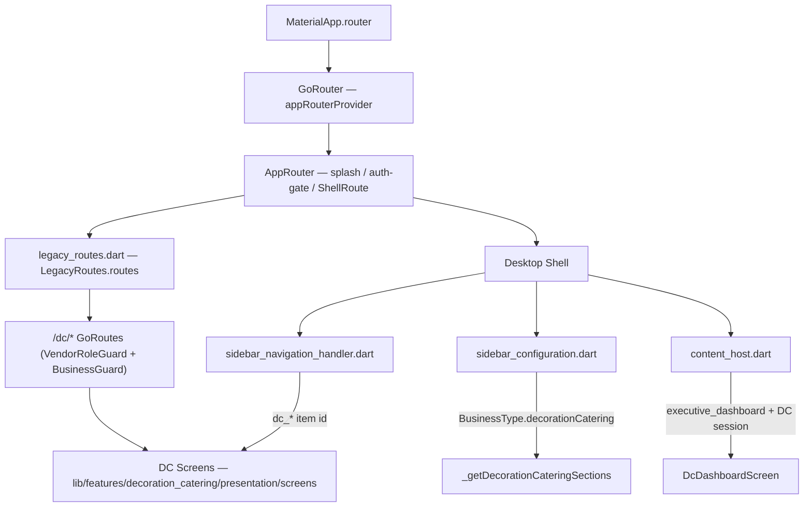
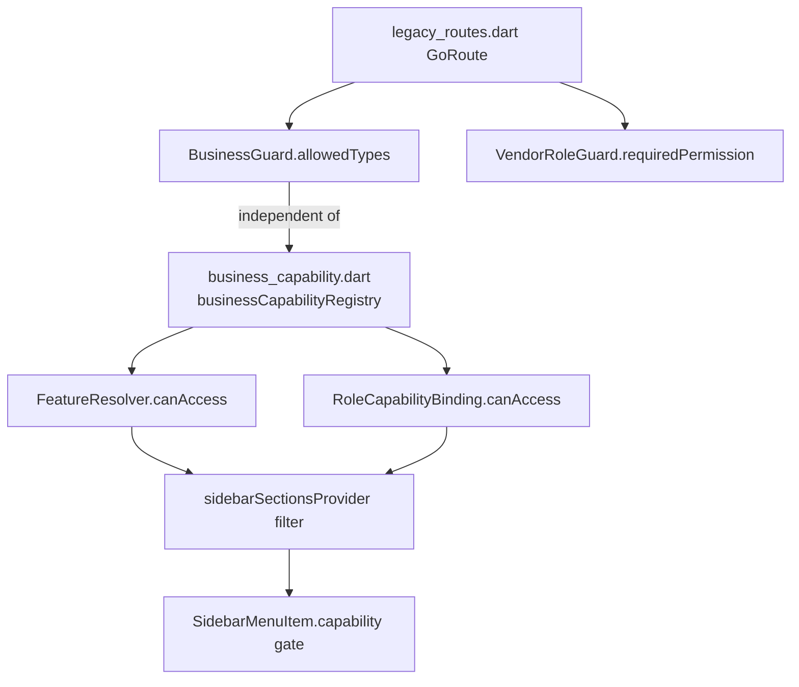
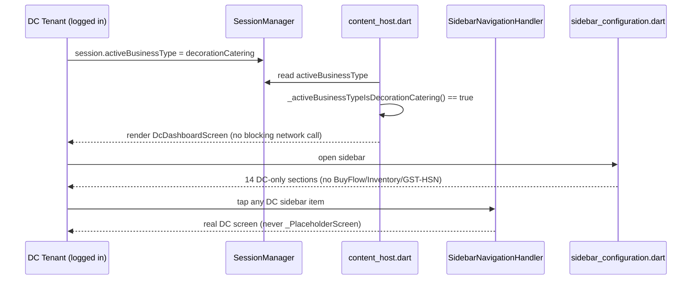
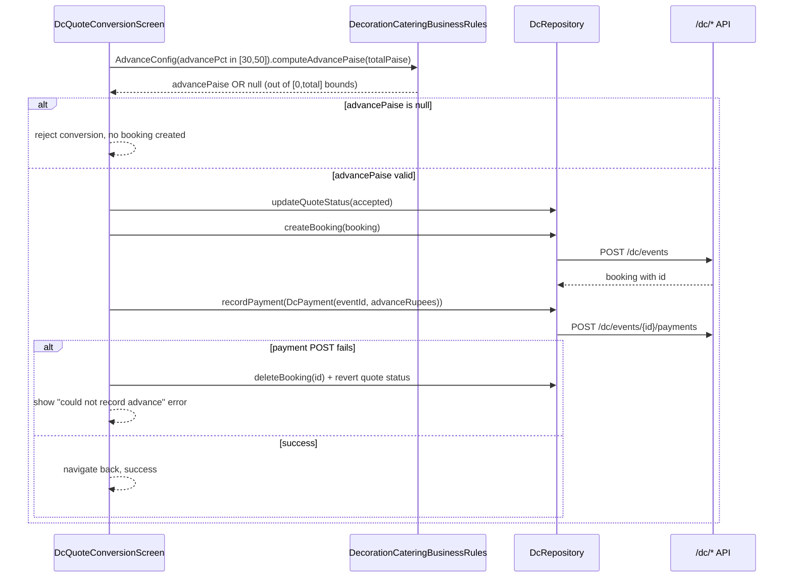

# Design Document: Decoration & Catering (DC) Remediation

## Overview

The `decorationCatering` business vertical in Dukan_x has a substantial, mostly
production-ready feature module (16 screens, a real `/dc/*`-backed repository,
business rules, PDF invoicing) living under `lib/features/decoration_catering/`.
An earlier audit (`audit-reports/business-types/audit-decorationCatering.md`)
found the vertical almost entirely unreachable from the running app — no
sidebar entry, no post-login landing, orphaned screens, a mis-wired
`/dc/vendors` route, hardcoded money fields, and a handful of validation gaps.

**Grounding note (read this before the rest of the document):** a source-level
re-verification of the current tree (not just the audit) shows the audit is
now substantially stale. Reachability (Phase 1) is **already implemented**:
the DC sidebar, navigation handler, route table, post-login landing, quick
actions, and alerts are all wired, and several Phase 2/3 items (billing
validation, quote-conversion advance bounds, rental lifecycle model, atomic
inventory adjustment) are already fixed in code. This design therefore does
two things: (1) formally **locks in** the already-correct reachability
behavior with a regression-proof test (so it can never silently regress), and
(2) targets the **genuine remaining gaps** found during re-verification,
organized under the same four-phase structure the remediation plan specified,
so the phase numbering stays traceable to the original ask. Phase 1 remains a
hard prerequisite gate: no Phase 2+ work is considered mergeable until the
Phase 1 exit test exists and passes.

A second grounding correction: the app has fully migrated off
`MaterialApp.routes` (legacy Navigator) onto `go_router` as the **sole**
navigation path (`MaterialApp.router` in `lib/app/app.dart`). There is no
`lib/modules/decoration_catering/` go_router "module" in the current tree —
it was already deleted as confirmed dead code (see the disposition note in
`decoration_catering.dart`'s barrel header). The spirit of the original ground
rule ("wire DC into the one authoritative router, not a second dormant
routing system, consistent with other business types") is preserved by
targeting `lib/core/routing/legacy_routes.dart` (the authoritative route
registry consumed by `lib/core/routing/app_router.dart`) instead of the
no-longer-existent `app/routes.dart`. No new parallel router is introduced by
this remediation.

## Current State Assessment

This table replaces the audit's "Recommendations" section with what is
actually true today. Anything marked **DONE** is treated as a regression
target (needs a locking test, not new code). Anything marked **GAP** is real
remediation work covered by this design.

| Area | Audit claim | Current reality | Status |
|---|---|---|---|
| DC sidebar section | Falls to generic retail sidebar | `_getDecorationCateringSections()` returns exactly 14 DC-only sections/items; no BuyFlow/Inventory-Stock/GST-HSN leakage | **DONE** — needs locking test |
| Sidebar → screen wiring | All DC ids hit `_PlaceholderScreen` | All 14 ids resolve to real screens in `sidebar_navigation_handler.dart`; barrel exports all 16 screens + `dc_vendor_rating_dialog` | **DONE** — needs locking test |
| Post-login landing | No DC entry point anywhere | `executive_dashboard` branch routes DC tenants to `DcDashboardScreen` (mirrors the pharmacy pattern) | **DONE** — needs locking test |
| `/dc/vendors` route bug | Maps to `DcStaffScreen` | Maps to `DcVendorPaymentsScreen` in `legacy_routes.dart` | **DONE** — needs locking test |
| go_router module self-redirect | `/dc/vendors` → `LegacyRouteRedirect('/dc/vendors')` | Module directory deleted entirely; no self-redirect exists | **DONE** (module removed, not migrated) |
| 8 unrouted screens | Calendar/Quotes/Profitability/ShoppingList/VendorPayments/EventDetail/QuoteConversion/StaffAttendance have no route | All 8 registered as guarded `GoRoute`s in `legacy_routes.dart` | **DONE** — needs locking test |
| Quick actions | Generic "New Sale + Add Customer + Reports" only | DC case exists: New Booking, New Quote, Add Staff, Menu/Package (4 of the hypothesized 6) | **PARTIAL GAP** — no capability gate on the buttons; "Manage Themes" / "Reports" actions absent |
| Alerts widget | Hardcoded "No Active Alerts" | DC case computes real counts via `dcAlertCountsProvider` (mirrors grocery's live pattern) | **DONE** — needs locking test |
| Capability registry | "Service-only" comment vs. leaking inventory sidebar items | Comment matches actual capability grant (no product/inventory caps granted); DC's own dedicated sidebar means no leakage; comment verified accurate against a certification test | **DONE** (comment is correct, not stale) |
| `rentalPrice` hardcoded 0 | Always 0 | Tries `rentalPricePaisa` then `rentalPrice` from the API response; falls back to 0 **only** when genuinely absent, with a debug-level trace | **GAP (backend-confirmed)** — field name is an open question (see Open Questions) |
| Rent-out/return/damage lifecycle | Missing entirely | `EventRental` state machine exists (`available → rentedOut → returned/returnedWithDamage`) with bounded transitions | **PARTIAL GAP** — model exists but is not wired to `dc_inventory_screen.dart` UI or a persisted endpoint |
| `adjustInventory` race | Read-all-then-PUT | Calls atomic `POST /dc/inventory/{id}/adjust`; throws an explicit, labeled error (no silent fallback) if the endpoint 404s | **GAP (backend deployment)** — client is correct; endpoint deployment is unverified |
| Hardcoded `PaymentMethod.cash` | `_expenseFromJson`, `_vendorPaymentFromJson`, `getPayments` | `_expenseFromJson`/`_vendorPaymentFromJson` now parse the real field via `_parsePaymentMethod()`; `getPayments()` **still** hardcodes `PaymentMethod.cash` unconditionally | **GAP** — one method still broken |
| Offline-first / Drift | Missing | No Drift tables, no sync handler, no WS handler for DC anywhere in the tree — confirmed absent, not merely unverified | **GAP** — full Phase 2.7 scope still open |
| Billing validation | Unclamped discount/GST, negative qty/rate, no event-required gate | Discount clamped [0,100], GST clamped [0,28], qty/rate rejected when ≤0/negative with inline errors, "Generate Invoice" disabled without a selected event | **DONE** — needs locking test |
| Billing line-item description | Not validated | Still not validated — blank descriptions are accepted and submitted | **GAP** |
| Quote vs invoice math unification | Absolute vs percentage models diverge | Both now go through `computeQuoteTotalPct` (percentage-based); old `computeQuoteTotal` is `@Deprecated` but retained for back-compat | **DONE** — needs a parity locking test |
| Advance defaults to 100% | Confirmed bug | Configurable `AdvanceConfig` (default 50%, range [30,50]); UI dropdown constrained to that range | **DONE** — needs locking test |
| Advance not capped at total | Confirmed bug | `computeAdvancePaise` returns `null` (rejecting conversion) when advance is outside `[0, total]` | **DONE** — needs locking test |
| Advance not recorded as payment | Confirmed bug | `recordPayment()` is called post-booking-creation with rollback (delete booking + revert quote status) on failure | **DONE** — needs locking test |
| Multi-day events | `eventDate` only | `EventBooking.eventEndDate` (nullable `DateTime?`) exists, defaults to unset (back-compat), validated against `eventDate` on parse | **DONE** — needs locking test; profitability multi-day correctness remains an open question |
| `minGuests` enforcement at billing | Missing | Not found in `dc_billing_screen.dart`'s `_addDefaultItems` — `CateringPackage.minGuests` is parsed by the repository but never checked against `booking.guestCount` | **GAP** |
| `_bookingFromJson` null-safety | Crashes on malformed rows | Null-safe with defaults for every field except `id` (which intentionally throws and is caught per-record by `_dataList`, so one bad row no longer kills the whole list) | **DONE** — needs locking test |
| `eventDate` truncation decision | Undocumented (bug or intentional?) | Still truncates to date-only (`substring(0,10)`) in `createBooking`/`updateBooking`; no comment or test documents whether this is intentional | **GAP** — needs an explicit decision + locking test |
| `advanceForfeitedOnCancel` dead code | Test-only, not wired | Still test-only; now carries an explicit disposition comment awaiting product sign-off (wire vs. remove) rather than being silently orphaned | **GAP** — decision + implementation still needed |
| Permission borrowing (3.9) | `viewInvoices`/`createInvoices`/`viewReports` used for booking/staff/attendance | Unchanged — no `viewEvents`/`createEvents`/`manageStaff`-style permission exists; all DC routes still gate on generic invoice/report permissions plus the business-type guard | **GAP** |
| Accessibility (delete icon tooltip, font size) | No tooltip; 10px status font | Delete-row `IconButton` now has `tooltip: 'Remove line item'`; status font is 10px (below the ≥12px target) | **PARTIAL GAP** — font size only |
| Barrel completeness | Missing 3 screen exports + dialog | All 16 screens + `dc_vendor_rating_dialog` exported | **DONE** |
| Phase 1 exit reachability test | Does not exist | No DC-specific reachability exploration/preservation test pair exists (other verticals have this pattern) | **GAP** — this is the hard gate this design must close first |

## Ground Rules (carried forward, reconciled with current architecture)

1. Shared files (`sidebar_configuration.dart`, `sidebar_navigation_handler.dart`,
   `business_quick_actions.dart`, `business_alerts_widget.dart`,
   `business_capability.dart`, and the route registry) are touched only with
   additive `switch`/`case` entries or additive route entries. No `default:`
   branch or another business type's case is modified.
2. DC routes live in `lib/core/routing/legacy_routes.dart` (the authoritative
   `go_router` registry) — this is the current equivalent of the original
   "wire into the one legacy router, not a second dormant module" rule now
   that `app/routes.dart` no longer exists. No new module directory, no
   parallel router, no go_router "module" package is reintroduced.
3. Money is integer paise everywhere new/changed code touches currency.
   Existing `double` rupee fields at the UI boundary are tolerated only where
   they already exist (e.g., `EventBooking.advancePaid`); all *new*
   arithmetic in this remediation is written in integer paise via
   `DcMoneyMath`.
4. `business_capability.dart` remains the source of truth for what DC may do.
   Its "service-only" comment is verified accurate (Current State Assessment)
   and is left untouched.
5. No unverified backend assumption ships as a silent success path. Every
   endpoint this design touches that is not confirmed deployed
   (`/dc/inventory/{id}/adjust`, `/dc/inventory/{id}/rent-out`,
   `/dc/inventory/{id}/return`) gets a client that throws a clearly labeled
   error on 404/501, plus a failing integration test that documents the gap —
   never a silent mock fallback.
6. Every fix in this design ships with a test (unit, widget, or integration,
   as appropriate) in the same task that makes the change.

## Architecture

### Routing & Shell Architecture



### Capability & Feature-Gating Architecture



`BusinessGuard`/`VendorRoleGuard` at the route layer and `FeatureResolver`/
capability gating at the sidebar layer are two independent, defense-in-depth
mechanisms. This design does not merge them — it only ensures DC's own
sidebar (already isolated) and DC's own routes (already guarded) stay
correct, and extends the *permission* granularity used at the route layer
(Phase 2.9 renamed from the original plan's "3.9").

### Sequence — Phase 1 Reachability (locking behavior, already implemented)



### Sequence — Quote → Booking → Payment Ledger (already implemented, Phase 2 locking target)



## Components and Interfaces

### 1. Phase 1 Reachability Lock (new test-only component)

**Purpose:** Codify the already-correct reachability behavior as an
executable, CI-enforced gate so no future change to any of the shared files
can silently regress DC back to unreachable.

**Interface** (widget/integration test, no production code changes):

```dart
/// test/features/decoration_catering/dc_reachability_gate_test.dart
///
/// Logs in as a decorationCatering tenant, opens every DC sidebar item, and
/// asserts:
///   1. Every item id in `_getDecorationCateringSections()` resolves via
///      `SidebarNavigationHandler.tryGetScreenForItem` to a non-null,
///      non-`_PlaceholderScreen` widget.
///   2. No BuyFlow / Inventory & Stock / Tax & Compliance section title
///      appears anywhere in the DC section list.
///   3. `executive_dashboard` resolves to `DcDashboardScreen` when the active
///      session business type is `decorationCatering`.
///   4. Pumping each resolved screen widget does not throw during build.
void main() {}
```

### 2. `DcRepository.getPayments` — real payment-method parsing (Phase 2 GAP)

**Current defect:** `getPayments()` derives payment rows from
`GET /dc/invoices` and hardcodes `method: PaymentMethod.cash` on every
row, ignoring whatever the invoice/payment record actually says.

**Interface change:**

```dart
Future<List<DcPayment>> getPayments({String? eventId}) async {
  final params = <String, String>{'limit': '100'};
  if (eventId != null) params['eventId'] = eventId;
  final res = await _api.get('/dc/invoices', queryParams: params);
  final raw = res.data?['data'];
  if (raw is! List) return [];
  return raw.map((e) {
    final j = e as Map<String, dynamic>;
    // Reuses the same field-name fallback chain as _vendorPaymentFromJson:
    // tries paymentMode, then paymentMethod, defaults to cash only when
    // truly absent (with a debugPrint trace, not a silent hardcode).
    final method = _parsePaymentMethod(
      j['paymentMode'] as String? ?? j['paymentMethod'] as String?,
      contextId: j['id'] as String?,
    );
    return DcPayment(
      id: j['id'] as String,
      eventId: j['eventId'] as String? ?? '',
      customerName: j['customerName'] as String? ?? '',
      amount: _paisa(j['advancePaidPaisa']),
      method: method,
      date: DateTime.parse(j['createdAt'] as String),
    );
  }).toList();
}
```

This reuses the existing `_parsePaymentMethod` helper — no new parsing logic,
just wiring the already-correct helper into the one call site that still
bypasses it.

### 3. `dc_billing_screen.dart` — line-item description validation (Phase 2 GAP)

**Current defect:** `_BillItem.description` (backed by `descCtrl`) is never
checked for blank/whitespace-only content; `_generateAndSaveInvoice` submits
whatever text is present.

**Interface change:**

```dart
class _BillItem {
  // ...unchanged fields...
  String? descError;
}

/// Validates a line-item description (Requirement — Phase 2 billing gaps).
///
/// A blank or whitespace-only description is rejected; the previous state
/// (error shown, Generate Invoice disabled) is retained until corrected.
void _onDescriptionChanged(_BillItem item, String v) {
  setState(() {
    item.descError = v.trim().isEmpty ? 'Required' : null;
  });
}
```

`_totals`/`_generateAndSaveInvoice`'s enablement predicate gains
`&& _items.every((i) => i.description.trim().isNotEmpty)` alongside the
existing `_selectedBooking == null || _items.isEmpty` check.

### 4. `dc_billing_screen.dart` — `minGuests` enforcement (Phase 3 GAP)

**Current defect:** `_addDefaultItems` sets the catering line-item quantity to
`booking.guestCount` without checking `CateringPackage.minGuests`.

**Interface change:**

```dart
/// Validates [booking.guestCount] against [pkg.minGuests] before billing.
///
/// Returns null when valid, or a user-facing message when the booking's
/// guest count is below the package minimum (Requirement — Phase 3 billing
/// consistency). Caller surfaces the message via a non-blocking banner and
/// still allows billing to proceed with an explicit acknowledgement, since
/// blocking billing entirely for an already-confirmed event would be a
/// worse outcome than a warned-but-permitted invoice.
String? validateMinGuests({
  required int guestCount,
  required CateringPackage pkg,
}) {
  if (guestCount < pkg.minGuests) {
    return 'This booking has $guestCount guests, below the '
        '${pkg.name} package minimum of ${pkg.minGuests}. '
        'Billing will proceed at the actual guest count.';
  }
  return null;
}
```

### 5. Rental lifecycle wiring — `EventRental` → UI + endpoints (Phase 2 GAP)

**Current defect:** `EventRental` (state machine: `available → rentedOut →
returned/returnedWithDamage`) exists as a pure model but is not invoked from
`dc_inventory_screen.dart`, nor persisted via any repository method.

**New repository methods** (client side complete; endpoints unverified —
Ground Rule 5 applies):

```dart
/// Rents out [quantity] units of [itemId] for [eventId].
///
/// Calls the (unverified) POST /dc/inventory/{id}/rent-out endpoint.
/// On 404, throws an explicit "BACKEND GAP" exception — mirrors the
/// existing adjustInventory pattern. No local state is mutated on failure.
Future<EventRental> rentOut({
  required String itemId,
  required String eventId,
  required int quantity,
}) async {
  final res = await _api.post(
    '/dc/inventory/$itemId/rent-out',
    body: {'eventId': eventId, 'quantity': quantity},
  );
  if (!res.isSuccess) {
    if (res.statusCode == 404) {
      throw Exception(
        'Rent-out endpoint not available '
        '(POST /dc/inventory/$itemId/rent-out returned 404). '
        'BACKEND GAP: deploy the rent-out handler.',
      );
    }
    throw Exception('Failed to rent out item $itemId: ${res.error}');
  }
  return _dataObject(res, _eventRentalFromJson);
}

/// Returns a rented item, recording [damagedQty] as damaged/lost.
///
/// Calls the (unverified) POST /dc/inventory/{id}/return endpoint. Same
/// error-surfacing contract as [rentOut].
Future<EventRental> returnRental({
  required String itemId,
  required String rentalId,
  required int damagedQty,
}) async {
  final res = await _api.post(
    '/dc/inventory/$itemId/return',
    body: {'rentalId': rentalId, 'damagedQty': damagedQty},
  );
  if (!res.isSuccess) {
    if (res.statusCode == 404) {
      throw Exception(
        'Return endpoint not available '
        '(POST /dc/inventory/$itemId/return returned 404). '
        'BACKEND GAP: deploy the return handler.',
      );
    }
    throw Exception('Failed to return item $itemId: ${res.error}');
  }
  return _dataObject(res, _eventRentalFromJson);
}
```

`dc_inventory_screen.dart` gains a per-item "Rent Out" / "Return" action that
calls `EventRental.rentOut()`/`.returnItem()` locally for optimistic bounds
validation (the pure model already rejects out-of-bounds quantities) *before*
calling the repository method, so obviously-invalid input never reaches the
network.

### 6. Offline-first minimum bar — Drift tables + read path (Phase 2 GAP)

**Target level (explicit, per ground rules):** *offline-read* only for this
remediation. Offline-write is a stretch goal explicitly deferred — writes
while offline fail with a clear, non-crashing message
("You're offline. Booking changes will sync when you're back online." is
**not** implemented; instead the write simply surfaces the existing network
error via the existing `try {} catch` UI paths, worded to mention
connectivity). This keeps the scope bounded to what can be verified with a
single test level.

**New Drift tables** (mirroring the retail pattern referenced by the audit):

```dart
// lib/core/database/tables/dc_events_table.dart
class DcEventsTable extends Table {
  TextColumn get id => text()();
  TextColumn get customerName => text()();
  TextColumn get customerPhone => text()();
  TextColumn get eventTitle => text()();
  DateTimeColumn get eventDate => dateTime()();
  DateTimeColumn get eventEndDate => dateTime().nullable()();
  TextColumn get venue => text()();
  IntColumn get guestCount => integer()();
  TextColumn get status => text()();
  IntColumn get quotedAmountPaisa => integer()();
  IntColumn get advancePaidPaisa => integer()();
  DateTimeColumn get lastSyncedAt => dateTime()();

  @override
  Set<Column> get primaryKey => {id};
}

// lib/core/database/tables/dc_inventory_table.dart
class DcInventoryTable extends Table {
  TextColumn get id => text()();
  TextColumn get name => text()();
  TextColumn get category => text()();
  IntColumn get totalQty => integer()();
  IntColumn get availableQty => integer()();
  IntColumn get rentalPricePaisa => integer()();
  DateTimeColumn get lastSyncedAt => dateTime()();

  @override
  Set<Column> get primaryKey => {id};
}
```

**Read path:** `dcBookingsProvider`/`dcInventoryProvider` gain a
Drift-backed fallback: on `ApiClient` failure (any exception, not just
connectivity — this keeps the fallback simple and testable), read the last
values written to `DcEventsTable`/`DcInventoryTable` and return those instead
of propagating the error, tagged with a `isStale: true` flag surfaced in the
UI as a small "showing last-synced data" banner.

**Sync wiring:** the dormant `DecorationCateringSyncHandler`/
`DecorationCateringWsHandler` classes described by the audit do not exist in
the current tree (confirmed by search) — they are not "dormant", they are
**absent**. This design creates a minimal `DcSyncHandler` registered with the
existing `SyncManager`/`sync_manager.dart` pipeline (the same pipeline the
`restaurant` vertical already uses, per
`lib/features/restaurant/domain/services/restaurant_sync_service.dart`),
scoped to populating `DcEventsTable`/`DcInventoryTable` on successful
`getBookings()`/`getInventory()` calls (write-through cache), and to applying
`dc.event.confirmed` / `dc.payment.received` / `dc.staff.assigned` WebSocket
events to the local Drift rows when the existing `WebSocketService` delivers
them.

### 7. Fine-grained DC permissions (Phase 3 GAP, originally "3.9")

**Current defect:** all DC routes gate on `Permissions.viewInvoices` /
`Permissions.createInvoices` / `Permissions.viewReports` regardless of
whether the action is actually about invoices (booking creation, staff
assignment, attendance marking are not invoice actions).

**Interface change** — additive constants in `lib/config/permissions.dart`:

```dart
class Permissions {
  // ...existing constants unchanged...
  static const viewEvents = 'view_events';
  static const createEvents = 'create_events';
  // manageStaff already exists and is reused as-is for staff assignment.

  static const all = <String>[
    // ...existing entries...
    viewEvents,
    createEvents,
  ];
}
```

`legacy_routes.dart`'s DC `GoRoute`s are updated **additively** (same guard
wrapper, different `requiredPermission` argument) — e.g. `/dc/bookings`
moves from `Permissions.viewInvoices` to `Permissions.viewEvents`,
`/dc/bookings/new` from `Permissions.createInvoices` to
`Permissions.createEvents`, `/dc/staff_attendance` from
`Permissions.viewInvoices` to `Permissions.manageStaff`. This is a one-line
argument change per route — no guard structure changes, no other vertical's
routes are touched. `RolePermissions`' role→permission matrix (wherever it is
defined) gains `viewEvents`/`createEvents` mapped to the same roles that
currently hold `viewInvoices`/`createInvoices`, so no existing DC user loses
access on this change alone.

### 8. `eventDate` time-of-day decision (Phase 3 GAP)

**Decision to lock in (see Open Questions for the product-facing framing):**
`eventDate` truncation to date-only is **intentional** — `setupTime`,
`serviceStartTime`, `serviceEndTime`, and `cleanupTime` are already separate
string fields on `EventBooking` specifically because the event *date* and
event *time-of-day* are independently tracked. Calendar/scheduling views key
off the date; time-of-day granularity is handled by the four dedicated time
fields. This design locks in that reading via a code comment at the
truncation call site plus a test, rather than changing behavior.

```dart
// Intentional: eventDate is date-only. Time-of-day scheduling is tracked
// independently via setupTime/serviceStartTime/serviceEndTime/cleanupTime
// (see EventBooking). Locked in by
// test/features/decoration_catering/dc_repository_event_date_test.dart —
// do not "fix" this without updating that test and this comment together.
'eventDate': booking.eventDate.toIso8601String().substring(0, 10),
```

### 9. `advanceForfeitedOnCancel` disposition (Phase 4 GAP)

**Decision to lock in:** wire it into the cancellation flow. The method is a
pure, already-tested, already-correct 7-day lock-in calculation — the
7-day forfeiture window is a normal event-industry policy and the audit found
no product signal it was meant to be removed (it exists precisely because the
booking model already tracks `eventDate`, `status`, and `advancePaid`, which
is exactly the shape `advanceForfeitedOnCancel` consumes). Removing working,
tested business logic with no evidence it's wrong is a worse outcome than
wiring it with a clearly-surfaced confirmation step.

**Interface change** — `dc_bookings_screen.dart` (or wherever cancellation is
triggered) gains a confirmation branch:

```dart
Future<void> _cancelBooking(EventBooking booking) async {
  final forfeits = DecorationCateringBusinessRules.advanceForfeitedOnCancel(
    booking.eventDate,
    DateTime.now(),
  );
  final confirmed = await _showCancelConfirmation(
    forfeitsAdvance: forfeits && booking.advancePaid > 0,
  );
  if (!confirmed) return;
  await ref.read(dcRepositoryProvider).updateBookingStatus(
    booking.id,
    EventStatus.cancelled,
  );
  // forfeits==true leaves booking.advancePaid untouched (forfeited, not
  // refunded) — no repository field currently models "refunded"; a refund
  // ledger entry is out of scope for this remediation and flagged as a
  // follow-up (see Open Questions).
}
```

## Data Models

No breaking changes to `dc_models.dart`. Additive fields only:

```dart
// EventBooking — unchanged in this remediation (eventEndDate already present).

// DcInventoryItem — unchanged; rentalPrice already parses the two known
// candidate field names.

// New (event_rental.dart already defines this — used, not modified):
// EventRental { id, eventId, inventoryItemId, rentedQty, damagedOrLostQty,
//               state: RentalState, rentalPricePerUnitPaise,
//               totalRentalPricePaise, createdAt, updatedAt }
```

## Key Functions with Formal Specifications

### `AdvanceConfig.computeAdvancePaise` (already implemented — specified here for the locking test)

```dart
int? computeAdvancePaise(int totalPaise)
```

**Preconditions:**
- `totalPaise >= 0`
- `advancePct` is the value the `AdvanceConfig` was constructed with (not
  re-validated here — `isValid` gates construction via `tryCreate`).

**Postconditions:**
- Returns `null` if `!isValid` (pct outside `[30, 50]`).
- Returns `null` if the computed amount is outside `[0, totalPaise]`.
- Otherwise returns `round2(totalPaise * advancePct / 100)`.

**Loop Invariants:** N/A (no loop).

### `_parsePaymentMethod` (already implemented — reused, not modified)

```dart
static PaymentMethod _parsePaymentMethod(String? raw, {String? contextId})
```

**Preconditions:** none (accepts `null`).

**Postconditions:**
- `raw == null || raw.isEmpty` → returns `PaymentMethod.cash`, emits a
  debug trace naming `contextId`.
- `raw` matches a known case-insensitive method name → returns that
  `PaymentMethod`.
- `raw` matches nothing known → returns `PaymentMethod.cash`, emits a debug
  trace naming both `raw` and `contextId`.
- Never throws.

### `EventRental.rentOut` / `returnItem` (already implemented — specified for the new UI wiring's tests)

```dart
RentalTransitionResult rentOut({required int quantity, required int availableOnHand})
RentalTransitionResult returnItem({required int damagedQty})
```

**Preconditions (`rentOut`):** none on the object; `quantity` and
`availableOnHand` are caller-supplied.

**Postconditions (`rentOut`):**
- `state != available` → rejected, previous state retained.
- `quantity < 1 || quantity > availableOnHand` → rejected, previous state
  retained.
- Otherwise → `state = rentedOut`, `rentedQty = quantity`,
  `totalRentalPricePaise = rentalPricePerUnitPaise * quantity`.

**Postconditions (`returnItem`):**
- `state != rentedOut` → rejected, previous state retained.
- `damagedQty < 0 || damagedQty > rentedQty` → rejected, previous state
  retained.
- `damagedQty == 0` → `state = returned`.
- `damagedQty > 0` → `state = returnedWithDamage`.

**Loop Invariants:** N/A (no loops; single-step transitions).

## Algorithmic Pseudocode

### Phase 1 Reachability Gate Algorithm

```pascal
ALGORITHM verifyDcReachability(sessionBusinessType)
INPUT: sessionBusinessType — must equal decorationCatering for this test
OUTPUT: PASS or FAIL with the first offending item id

BEGIN
  ASSERT sessionBusinessType = decorationCatering

  sections ← getSectionsForBusinessType(decorationCatering)
  ASSERT length(sections) = 14
  FOR each section IN sections DO
    ASSERT section.title NOT IN {"BuyFlow", "Inventory & Stock", "Tax & Compliance"}
  END FOR

  FOR each section IN sections DO
    FOR each item IN section.items DO
      screen ← SidebarNavigationHandler.tryGetScreenForItem(item.id)
      ASSERT screen ≠ null
      ASSERT screen IS NOT _PlaceholderScreen
      pumpWidget(screen)          // must not throw during build
    END FOR
  END FOR

  landing ← SidebarNavigationHandler.tryGetScreenForItem('executive_dashboard')
  ASSERT landing IS DcDashboardScreen

  RETURN PASS
END
```

**Preconditions:** a fake/mock `SessionManager` reports
`activeBusinessType == decorationCatering`; `sl<ApiClient>()` is either
mocked or unused by the screens under test (screens must not require a live
network call to build without throwing — this is itself part of what the
test verifies).

**Postconditions:** PASS if and only if every DC sidebar item resolves to a
real, buildable screen and the post-login landing resolves to
`DcDashboardScreen`. This is the Phase 1 exit gate; Phase 2+ tasks in
`tasks.md` are ordered after this test is written and passing.

### `minGuests` Validation Algorithm

```pascal
ALGORITHM validateMinGuests(guestCount, package)
INPUT: guestCount — integer ≥ 0; package — CateringPackage with minGuests field
OUTPUT: warning message, or null if no warning applies

BEGIN
  IF guestCount < package.minGuests THEN
    RETURN "This booking has " + guestCount + " guests, below the "
           + package.name + " package minimum of " + package.minGuests
           + ". Billing will proceed at the actual guest count."
  END IF
  RETURN null
END
```

**Preconditions:** `package.minGuests >= 0` (repository already defaults to
`1` when the backend field is absent — see Open Questions).

**Postconditions:** returns a non-null message if and only if
`guestCount < package.minGuests`; never blocks billing (see Component 4
rationale); the underlying invoice total is unaffected by this check.

## Example Usage

```dart
// Phase 2.2 — getPayments now reflects real payment methods.
final payments = await dcRepository.getPayments(eventId: 'evt_123');
assert(payments.every((p) => p.method != PaymentMethod.cash) ||
       payments.any((p) => p.method == PaymentMethod.cash)); // both possible now

// Phase 2.5 — rental lifecycle.
final rental = EventRental.create(
  id: DcRidGenerator.generate(),
  eventId: 'evt_123',
  inventoryItemId: 'inv_45',
  rentalPricePerUnitPaise: 50000,
);
final rentedResult = rental.rentOut(quantity: 4, availableOnHand: 10);
if (rentedResult.isSuccess) {
  await dcRepository.rentOut(itemId: 'inv_45', eventId: 'evt_123', quantity: 4);
}

// Phase 3.5 — minGuests warning at billing time.
final warning = validateMinGuests(guestCount: booking.guestCount, pkg: selectedPackage);
if (warning != null) {
  showBanner(warning); // non-blocking
}
```

## Error Handling

| Scenario | Response | Recovery |
|---|---|---|
| `/dc/inventory/{id}/adjust`, `/rent-out`, `/return` return 404 | Explicit `Exception` naming the missing endpoint and "BACKEND GAP"; no local state mutated | Caller shows the exception message; a failing integration test tracks the backend deployment gap until resolved |
| `getPayments`/`_expenseFromJson`/`_vendorPaymentFromJson` receive an unrecognized payment-method string | Falls back to `PaymentMethod.cash` with a `debugPrint` trace naming the record id and raw value | Non-fatal; surfaced only in debug logs, not to the end user, since defaulting to cash is a safe, auditable choice |
| Drift read fallback (offline-read) | Returns last-synced rows with `isStale: true`; UI shows a small "showing last-synced data" banner | Automatically clears once a live fetch succeeds |
| Offline write attempt (booking/invoice create/update) | Existing network exception propagates to existing `try/catch` UI paths; message text updated to mention connectivity when the underlying error looks like a connectivity failure | User retries manually once back online; no local queuing in this remediation (explicitly out of scope — stretch goal) |
| Malformed booking row (missing `id`) | `_bookingFromJson` throws `FormatException`; `_dataList` catches per-record and skips only that row | Other valid rows in the same response render normally |
| Advance percentage or amount out of bounds | Conversion rejected outright; no booking created, no quote status change | User adjusts the percentage/amount and retries |
| Payment-record failure during quote conversion | Booking and quote-status changes are rolled back (delete booking, revert quote status) | User sees "could not record advance payment... no booking created" and retries |

## Testing Strategy

### Unit Testing Approach

- `_parsePaymentMethod` reuse in `getPayments` — unit test with well-formed
  and malformed/missing `paymentMode`/`paymentMethod` fixtures (mocked
  `ApiClient`).
- `validateMinGuests` — pure function, direct unit tests for below/at/above
  minimum.
- Line-item description validation — widget test toggling blank/non-blank
  description and asserting "Generate Invoice" enablement.
- `Permissions.viewEvents`/`createEvents`/`manageStaff` route gating — a
  permission-boundary test proving a user with `viewInvoices`/
  `createInvoices` but not `manageStaff` cannot reach `/dc/staff_attendance`
  (Phase 3.9 requirement), and that a user with `viewEvents` but not
  `viewInvoices` *can* reach `/dc/bookings`.
- `EventRental.rentOut`/`.returnItem` bound violations — already covered by
  existing tests per the sub-agent's findings; this remediation adds tests
  for the new repository methods (`rentOut`, `returnRental`) with mocked
  `ApiClient` covering success, 404 (backend gap), and other failure.
- `eventDate` truncation — a locking unit test asserting the substring(0,10)
  behavior is unchanged (Component 8).
- `advanceForfeitedOnCancel` wiring — unit test for the cancellation
  confirmation branch (forfeits vs. does-not-forfeit paths).

### Property-Based Testing Approach

Correctness properties are added to this document in the Requirements phase
(after `requirements.md` exists, per the design-first workflow), each
annotated with the requirement(s) it validates. Candidate universal
properties already visible from this design:
- *For any* `AdvanceConfig` with `advancePct ∈ [30,50]` and *any* non-negative
  `totalPaise`, `computeAdvancePaise` returns either `null` or a value in
  `[0, totalPaise]` — never outside those bounds.
- *For any* sequence of `rentOut`/`returnItem` calls, `EventRental.state`
  only ever transitions along the defined state machine edges; invalid
  transitions leave the previous state byte-for-byte unchanged.
- *For any* malformed booking record missing only non-`id` fields,
  `_bookingFromJson` returns a valid `EventBooking` with documented
  defaults, never throwing.
- *For any* DC sidebar item id, `SidebarNavigationHandler.tryGetScreenForItem`
  returns a non-null widget that is not `_PlaceholderScreen`.

**Property Test Library:** the repository's existing Dart/Flutter test
tooling (`flutter_test` + `package:test`); no new PBT library is introduced —
mirrors the pattern already used for `EventRental`'s existing tests
(bounded-input generation via simple loops/ranges, consistent with the rest
of the Dukan_x test suite, which does not use a dedicated PBT library like
`glados`).

### Integration Testing Approach

- Phase 1 exit gate (`dc_reachability_gate_test.dart`) — the hard
  prerequisite described above.
- Regression pass on **retail** and **pharmacy**: run their existing sidebar/
  quick-actions/alerts/routing test suites unmodified, and diff
  `getSectionsForBusinessType(retail)` / `getSectionsForBusinessType(pharmacy)`
  output before/after this remediation lands — must be byte-for-byte
  identical, since every change here is additive to DC-only code paths.
- `/dc/inventory/{id}/rent-out` and `/dc/inventory/{id}/return` — smoke test
  against the real endpoint if and when its deployment is confirmed
  (currently: failing test documenting the 404, per Ground Rule 5).
- Offline-read — integration test that seeds `DcEventsTable`, forces
  `ApiClient.get('/dc/events')` to throw, and asserts the provider returns
  the seeded rows with `isStale: true`.

## Performance Considerations

- `adjustInventory` is already O(1) (atomic endpoint call) — no further
  change needed once the backend deploys the endpoint.
- The Drift write-through cache adds one local write per successful
  `getBookings()`/`getInventory()` call; this is bounded by result-set size
  (typically dozens of events/items per tenant) and is not expected to be a
  performance concern.
- No new N+1 patterns are introduced by this design.

## Security Considerations

- New permissions (`viewEvents`, `createEvents`) are additive to the
  existing `Permissions` class and the role→permission matrix; no existing
  permission is removed or renamed, so no existing role silently loses
  access.
- `BusinessGuard(allowedTypes:[decorationCatering])` continues to wrap every
  DC route unchanged; the permission-granularity change (Component 7) only
  narrows *which* permission is checked, not whether the business-type guard
  applies.
- Rent-out/return endpoints (Component 5) are new network calls; they must
  be added to the same guard pattern the rest of `/dc/*` uses server-side
  (server-side verification is out of scope for this Flutter-side design but
  flagged as a dependency).
- Offline Drift cache stores DC event/inventory data locally in cleartext
  (consistent with the existing retail Drift cache pattern) — no new
  sensitive-data-at-rest exposure beyond what retail already accepts.

## Dependencies

- Existing: `flutter_riverpod`, `intl`, `printing`, `decimal` (used by
  `MoneyMath`), the project's own `drift` package (already a dependency for
  the retail offline pattern), `flutter_test`.
- No new third-party dependency is introduced by this remediation.
- Backend dependency (unverified, tracked as an Open Question): deployment
  of `POST /dc/inventory/{id}/adjust`, `POST /dc/inventory/{id}/rent-out`,
  `POST /dc/inventory/{id}/return`, and confirmation of the `rentalPrice`
  field name on the inventory API response.

## Open Questions / Assumptions (require human confirmation)

1. **Backend deployment status of `/dc/*` endpoints.** No endpoint under
   `/dc/*` — including the already-referenced `/dc/inventory/{id}/adjust`
   and the newly-designed `/dc/inventory/{id}/rent-out` /
   `/dc/inventory/{id}/return` — is confirmed deployed. This design assumes
   they are either already live or will be deployed before the corresponding
   Phase 2 tasks are considered complete; until then, the client throws an
   explicit "BACKEND GAP" error and a failing test documents it.
2. **`rentalPrice` field name/shape.** The repository currently tries
   `rentalPricePaisa` then `rentalPrice`; neither is confirmed as the actual
   backend field. This design keeps the fallback chain as-is and flags it —
   it does not guess a third name.
3. **Payment-method/mode field name(s)** in expense and vendor-payment API
   responses. The repository tries `paymentMode` then `paymentMethod`; this
   is assumed sufficient but not confirmed against real backend responses.
4. **`minGuests` field existence/shape** on catering packages. The repository
   parses `j['minGuests']` defaulting to `1` if absent — assumed correct but
   unconfirmed against the real backend contract.
5. **`eventDate` time-of-day decision.** This design locks in "date-only is
   intentional" based on the presence of separate time-of-day fields
   (`setupTime`, etc.). This is an inference, not a confirmed product
   decision — flagged for explicit sign-off.
6. **`advanceForfeitedOnCancel` product intent.** This design proposes wiring
   it into the cancellation flow (Component 9) based on the shape of the
   existing model and lack of contrary signal, but this is a product
   decision that should be explicitly confirmed, not inferred by an
   implementer.
7. **Profitability formula correctness for multi-day events.**eventEndDate
   already exists on `EventBooking`, but `getEventProfitability` is a
   server-computed value (formula not inspected, per the original audit) —
   whether the backend's profitability calculation is multi-day-aware is
   unverified and out of this design's ability to confirm client-side.
8. **Refund ledger for forfeited advances.** Component 9's cancellation flow
   leaves `advancePaid` untouched on forfeiture (no refund) since no
   "refunded" state exists in the current model. Whether a partial-refund
   ledger entry should exist is a separate, explicitly out-of-scope product
   question flagged here rather than guessed at.
9. **Quick-actions capability gating.** `business_quick_actions.dart`'s DC
   case (New Booking/New Quote/Add Staff/Menu-Package) is not gated by
   `BusinessCapability` the way sidebar items are. Whether this is
   intentional (quick actions are a fixed, curated set per vertical, unlike
   the fuller sidebar) or a gap to close is flagged rather than assumed;
   this design does not add gating without confirmation, since DC's
   capability grant already covers all four actions today (no functional
   bypass currently exists).
