# Implementation Plan: Decoration & Catering (DC) Remediation

## Overview

This plan converts `design.md` (re-verified Current State Assessment) and
`requirements.md` (EARS acceptance criteria) into discrete, dependency-ordered
coding/testing tasks. Task 1 implements the Phase 1 reachability gate test
(Requirement 1.1). **Per requirements.md, no Phase 2, 3, or 4 task below is
actionable until Task 1's test exists and passes** — every task after Task 1
is marked `Depends on: Task 1 (Requirement 1.1)` accordingly, in addition to
any narrower same-phase dependency noted on that task.

For requirements whose design.md status is **DONE** (regression-lock only),
the task's scope is narrowly to write/confirm the named locking test.
**No production code change is expected for these tasks unless the locking
test surfaces an actual regression** — if it does, fixing that regression is
in scope, but rewriting already-correct code speculatively is not.

For requirements whose status is **GAP** or **PARTIAL GAP**, the task's scope
is the real implementation work plus its verifying test.

Sub-tasks marked `*` are test-only sub-tasks that are supplementary to a
separate implementation sub-task in the same task, and may be skipped for a
faster pass. Tasks whose *entire* deliverable is a regression-lock test are
NOT marked `*` at the top level (per house rules) — skipping them would mean
doing nothing for that requirement.

---

## Tasks

- [x] 1. Write Phase 1 reachability gate test
  - Create `test/features/decoration_catering/dc_reachability_gate_test.dart`
    (DcReachabilityGateTest): log in as a DcTenant (mock/fake
    `SessionManager` with `activeBusinessType == decorationCatering`) and
    assert:
    - `SidebarConfiguration` returns exactly 14 DC-only sections/items
    - no returned section has title "BuyFlow", "Inventory & Stock", or
      "Tax & Compliance"
    - every DC item id resolves via
      `SidebarNavigationHandler.tryGetScreenForItem` to a non-null widget
      that is not `_PlaceholderScreen`
    - pumping each resolved screen widget does not throw during build
    - resolving `executive_dashboard` while the session business type is
      `decorationCatering` resolves to `DcDashboardScreen` via `ContentHost`
  - This is the hard prerequisite gate. No other task in this plan may be
    started before this test exists and passes.
  - **No dependency — this is the first task.**
  - _Requirements: 1.1_

- [x] 2. Lock in sidebar/routing/landing/alerts wiring with regression tests
  - Regression-lock only — the underlying behavior already exists per
    design.md's Current State Assessment; no production code change is
    expected unless a sub-test below surfaces an actual regression.
  - [x] 2.1 Write routing test asserting `/dc/vendors` maps to
    `DcVendorPaymentsScreen` in `legacy_routes.dart`
    - _Requirements: 2.1 (AC2)_
  - [x] 2.2 Write routing test enumerating all 8 previously-unrouted DC
    screens (Calendar, Quotes, Profitability, ShoppingList, VendorPayments,
    EventDetail, QuoteConversion, StaffAttendance) and asserting each has a
    registered guarded `GoRoute`
    - _Requirements: 2.1 (AC3)_
  - [x] 2.3 Write widget test asserting `BusinessAlertsWidget` computes its
    DC alert counts from `dcAlertCountsProvider` rather than a hardcoded
    value
    - _Requirements: 2.1 (AC4)_
  - Depends on: Task 1 (Requirement 1.1)
  - _Requirements: 2.1_

- [x] 3. Fix `DcRepository.getPayments()` to derive real payment method
  - [x] 3.1 Update `getPayments()` to derive `method` via
    `_parsePaymentMethod()` using `paymentMode` falling back to
    `paymentMethod` (consistent with `_vendorPaymentFromJson`); default to
    `PaymentMethod.cash` with a debug-level trace naming the record id only
    when neither field is present; remove the unconditional
    `method: PaymentMethod.cash` hardcode
    - Note: field-name assumption tracked as OQ-3 (not confirmed against
      real backend responses) — implement against the existing fallback
      chain, do not guess a third field name
    - _Requirements: 2.2_
  - [ ]* 3.2 Write unit test for `getPayments()` with mocked `ApiClient`
    covering well-formed `paymentMode`/`paymentMethod` fixtures and
    malformed/missing fixtures (asserting the cash-default + trace path)
    - _Requirements: 2.2_
  - Depends on: Task 1 (Requirement 1.1)
  - _Requirements: 2.2_

- [x] 4. Add billing line-item description validation to `DcBillingScreen`
  - [x] 4.1 Add `descError` to `_BillItem`; add
    `_onDescriptionChanged` to set `descError` when the description is
    blank/whitespace-only and clear it otherwise; update the "Generate
    Invoice" enablement predicate to require every item's description be
    non-blank; guard `_generateAndSaveInvoice` so it cannot submit while any
    item has a blank/whitespace-only description
    - _Requirements: 2.3_
  - [ ]* 4.2 Write widget test toggling a blank/non-blank description and
    asserting "Generate Invoice" enablement and that submission is blocked
    while any description is blank
    - _Requirements: 2.3_
  - Depends on: Task 1 (Requirement 1.1)
  - _Requirements: 2.3_

- [x] 5. Write capability-gating regression-lock test
  - Regression-lock only — no production code change expected unless this
    test surfaces an actual regression.
  - Write a certification test asserting `businessCapabilityRegistry` does
    not grant `decorationCatering` any product/inventory capability (e.g.
    `useProductAdd`, `useInventoryList`, `useStockEntry`), and reuse/extend
    Task 1's sidebar-section assertion to confirm no BuyFlow/Inventory &
    Stock/Tax & Compliance section appears for a DcTenant.
  - Depends on: Task 1 (Requirement 1.1)
  - _Requirements: 2.4_

- [x] 6. Add `DcRepository.rentOut()` / `returnRental()` methods
  - [x] 6.1 Implement `rentOut({itemId, eventId, quantity})` calling
    `POST /dc/inventory/{id}/rent-out`, and `returnRental({itemId, rentalId,
    damagedQty})` calling `POST /dc/inventory/{id}/return`; both return an
    `EventRental` on success; both throw an explicit exception containing
    "BACKEND GAP" and naming the endpoint on HTTP 404, mutating no local
    state on failure
    - Caveat (OQ-1): neither endpoint's deployment is confirmed. Implement
      the client per design.md's Component 5; the BACKEND GAP path is the
      expected behavior until deployment is confirmed, not a bug to work
      around.
    - _Requirements: 2.5 (AC1-4)_
  - [ ]* 6.2 Write unit tests (mocked `ApiClient`) covering: success for
    both methods, HTTP 404 → "BACKEND GAP" exception with no local state
    mutation, and one other failure status for each method
    - _Requirements: 2.5 (AC1-4)_
  - Depends on: Task 1 (Requirement 1.1)
  - _Requirements: 2.5_

- [x] 7. Wire rent-out/return actions into `DcInventoryScreen`
  - [x] 7.1 Add a per-item "Rent Out" action that first validates the
    requested quantity locally via `EventRental.rentOut()`'s bounds check
    before calling `DcRepository.rentOut()`; add a "Return" action that
    first validates the damaged quantity locally via
    `EventRental.returnItem()`'s bounds check before calling
    `DcRepository.returnRental()`; reject locally-invalid quantities
    without making a network call
    - _Requirements: 2.5 (AC5-7)_
  - [ ]* 7.2 Write widget test asserting a locally-invalid rent-out/return
    quantity is rejected without a network call, and a valid quantity
    invokes the corresponding repository method
    - _Requirements: 2.5 (AC5-7)_
  - Depends on: Task 6 (Requirement 2.5), Task 1 (Requirement 1.1)
  - _Requirements: 2.5_

- [x] 8. Define `DcEventsTable` / `DcInventoryTable` Drift tables
  - Add `lib/core/database/tables/dc_events_table.dart` and
    `dc_inventory_table.dart` mirroring `EventBooking` and
    `DcInventoryItem` fields respectively, each with a `lastSyncedAt`
    timestamp column, and register both with the app's Drift database
    schema.
  - Depends on: Task 1 (Requirement 1.1)
  - _Requirements: 2.6 (AC1)_

- [x] 9. Implement `DcSyncHandler` write-through cache and WebSocket wiring
  - [x] 9.1 Create `DcSyncHandler`, registered with the existing
    `SyncManager` (mirroring
    `lib/features/restaurant/domain/services/restaurant_sync_service.dart`):
    on successful `DcRepository.getBookings()`/`getInventory()`, write the
    returned rows into `DcEventsTable`/`DcInventoryTable`; on
    `dc.event.confirmed`, `dc.payment.received`, or `dc.staff.assigned`
    events from the existing `WebSocketService`, apply the update to the
    corresponding local Drift row
    - _Requirements: 2.6 (AC2, AC6)_
  - [ ]* 9.2 Write unit/integration test asserting a successful
    `getBookings()`/`getInventory()` call results in the write-through rows
    being persisted, and that each of the three WebSocket event types
    updates the correct local row
    - _Requirements: 2.6 (AC2, AC6)_
  - Depends on: Task 8 (Requirement 2.6), Task 1 (Requirement 1.1)
  - _Requirements: 2.6_

- [x] 10. Wire offline-read fallback and stale-data banner
  - [x] 10.1 Update `dcBookingsProvider`/`dcInventoryProvider` (or
    equivalent) to catch any exception from `DcRepository.getBookings()`/
    `getInventory()` and fall back to reading the last-written rows from
    `DcEventsTable`/`DcInventoryTable`, tagging the result `isStale: true`;
    add a "showing last-synced data" banner to the relevant screens that
    displays while `isStale` is true and clears automatically once a
    subsequent live fetch succeeds; leave write paths (booking/invoice
    create/update) on their existing try/catch error surfacing, updating
    error copy to mention connectivity when the underlying error indicates
    a connectivity failure — do not add offline write queuing, optimistic
    writes, or conflict resolution (explicitly out of scope)
    - _Requirements: 2.6 (AC3-5, AC7-8)_
  - [ ]* 10.2 Write integration test: seed `DcEventsTable`, force
    `ApiClient.get` to throw, assert the provider returns the seeded rows
    tagged `isStale: true`; then simulate a successful live fetch and
    assert the stale banner clears
    - _Requirements: 2.6 (AC3-5)_
  - Depends on: Task 9 (Requirement 2.6), Task 1 (Requirement 1.1)
  - _Requirements: 2.6_

- [x] 11. Checkpoint — Phase 2 complete
  - Ensure all tests pass, ask the user if questions arise.

- [x] 12. Write quote/invoice math parity regression-lock test
  - Regression-lock only — no production code change expected unless this
    test surfaces an actual regression.
  - Write a unit test asserting `DcQuoteConversionScreen` and
    `DcBillingScreen` both compute totals via
    `DecorationCateringBusinessRules.computeQuoteTotalPct`, and a parity
    test proving the quote-path and billing-path totals are numerically
    identical for equivalent inputs (same subtotal, discount %, GST %);
    additionally assert the deprecated `computeQuoteTotal` is not called
    from either path.
  - Depends on: Task 1 (Requirement 1.1)
  - _Requirements: 3.1_

- [x] 13. Write `AdvanceConfig` default/bounds regression-lock and property test
  - Regression-lock only — no production code change expected unless this
    test surfaces an actual regression.
  - Write a unit test asserting `AdvanceConfig` defaults `advancePct` to 50
    with the UI control constrained to `[30, 50]`, and that
    `AdvanceConfig.isValid` is `false` for any `advancePct` outside
    `[30, 50]`.
  - Write a property test (100+ iterations, generating non-negative
    `totalPaise` and valid `AdvanceConfig`s): *for any* valid
    `AdvanceConfig` and *any* non-negative `totalPaise`,
    `computeAdvancePaise(totalPaise)` returns either `null` or a value
    within `[0, totalPaise]`, never outside that range; and assert that a
    `null` result causes `DcQuoteConversionScreen` to reject the conversion
    without creating a booking or changing quote status.
  - **Property: For any AdvanceConfig with advancePct in [30, 50] and any
    non-negative totalPaise, computeAdvancePaise returns null or a value in
    [0, totalPaise].**
  - Depends on: Task 1 (Requirement 1.1)
  - _Requirements: 3.2_

- [x] 14. Write advance-payment-ledger-with-rollback regression-lock test
  - Regression-lock only — no production code change expected unless this
    test surfaces an actual regression.
  - Write a unit test with a mocked `DcRepository` asserting: (a) on
    successful conversion, `createBooking()` is followed by
    `recordPayment()` with the advance amount; (b) when `recordPayment()`
    fails after booking creation, the screen deletes the created booking,
    reverts the quote status, and shows an error; (c) on full success, the
    screen navigates back with a success indication.
  - Depends on: Task 1 (Requirement 1.1)
  - _Requirements: 3.3_

- [x] 15. Write multi-day event (`eventEndDate`) regression-lock test
  - Regression-lock only — no production code change expected unless this
    test surfaces an actual regression.
  - Write a unit test asserting `EventBooking` exposes a nullable
    `eventEndDate`, defaults to `null` without throwing when absent from a
    raw record, and that a raw record with `eventEndDate` chronologically
    before `eventDate` is treated as invalid per existing parsing/validation
    behavior.
  - Note: multi-day profitability correctness is explicitly out of scope
    here (tracked as OQ-7).
  - Depends on: Task 1 (Requirement 1.1)
  - _Requirements: 3.4_

- [x] 16. Write `_bookingFromJson` null-safety regression-lock and property test
  - Regression-lock only — no production code change expected unless this
    test surfaces an actual regression.
  - Write a property test (100+ iterations, generating raw booking records
    with random subsets of non-`id` fields omitted): *for any* malformed
    booking record missing only non-`id` fields, `_bookingFromJson` returns
    a valid `EventBooking` with a documented default for each missing
    field and never throws.
  - Write a unit test asserting a record missing `id` causes
    `_bookingFromJson` to throw, and that `_dataList` catches that
    exception per-record, excluding only the malformed record from a mixed
    well-formed/malformed response.
  - **Property: For any malformed booking record missing only non-id
    fields, `_bookingFromJson` returns a valid EventBooking with documented
    defaults and never throws.**
  - Depends on: Task 1 (Requirement 1.1)
  - _Requirements: 3.5_

- [x] 17. Implement `validateMinGuests` and wire it into `DcBillingScreen`
  - [x] 17.1 Implement `validateMinGuests({guestCount, pkg})` returning a
    non-null advisory message when `guestCount < pkg.minGuests` and `null`
    otherwise; call it from `_addDefaultItems`/package-selection in
    `DcBillingScreen` and display a non-blocking banner with the returned
    message; ensure the check never disables "Generate Invoice" and never
    alters the computed invoice total
    - Caveat (OQ-4): `minGuests` field presence/shape on the backend is
      unconfirmed; implement against the repository's existing
      default-to-1-when-absent parsing, do not change that fallback.
    - _Requirements: 3.6_
  - [ ]* 17.2 Write unit test for `validateMinGuests` at below/at/above the
    minimum, and a widget test asserting banner visibility and that
    "Generate Invoice" enablement/invoice total are unaffected by the
    comparison itself
    - _Requirements: 3.6_
  - Depends on: Task 1 (Requirement 1.1)
  - _Requirements: 3.6_

- [x] 18. Add fine-grained DC permissions and update route gating
  - [x] 18.1 Add additive `Permissions.viewEvents` and
    `Permissions.createEvents` constants (without removing/renaming any
    existing constant); update `legacy_routes.dart` so `/dc/bookings`
    (and equivalent viewing routes) require `viewEvents` instead of
    `viewInvoices`, `/dc/bookings/new` (and equivalent creation routes)
    require `createEvents` instead of `createInvoices`, and
    `/dc/staff_attendance` requires `Permissions.manageStaff` instead of
    `viewInvoices`; leave the `BusinessGuard(allowedTypes:
    [decorationCatering])` wrapper on every DC route unchanged; update the
    role→permission matrix to map `viewEvents`/`createEvents` to the same
    roles that currently hold `viewInvoices`/`createInvoices` so no
    existing DC user loses access as a direct result of this change
    - _Requirements: 3.7_
  - [ ]* 18.2 Write a permission-boundary test asserting a user with
    `viewInvoices`/`createInvoices` but not `manageStaff` cannot reach
    `/dc/staff_attendance`, and a user with `viewEvents` but not
    `viewInvoices` can reach `/dc/bookings`
    - _Requirements: 3.7_
  - Depends on: Task 1 (Requirement 1.1)
  - _Requirements: 3.7_

- [x] 19. Document and lock in the `eventDate` date-only truncation decision
  - Add a code comment at the `eventDate` truncation call site in
    `DcRepository.createBooking()`/`updateBooking()` stating the
    truncation is intentional (time-of-day is tracked independently via
    `setupTime`/`serviceStartTime`/`serviceEndTime`/`cleanupTime`) and
    naming the locking test file; create
    `test/features/decoration_catering/dc_repository_event_date_test.dart`
    asserting the `substring(0,10)` serialization behavior is unchanged.
  - Caveat (OQ-5): this locks in an *inferred* reading of the decision, not
    a confirmed product sign-off; flag for explicit confirmation, but
    proceed under this assumption per requirements.md.
  - Depends on: Task 1 (Requirement 1.1)
  - _Requirements: 3.8_

- [x] 20. Write billing-validation clamps regression-lock test
  - Regression-lock only — no production code change expected unless this
    test surfaces an actual regression.
  - Write widget/unit tests locking in: discount input is clamped to
    `[0, 100]` in computed totals; GST input is clamped to `[0, 28]` in
    computed totals; a zero/negative line-item quantity or rate shows an
    inline error and is excluded from the computed total as if valid; and
    "Generate Invoice" remains disabled while no event is selected.
  - Depends on: Task 1 (Requirement 1.1)
  - _Requirements: 3.9_

- [x] 21. Checkpoint — Phase 3 complete
  - Ensure all tests pass, ask the user if questions arise.

- [x] 22. Wire `advanceForfeitedOnCancel` into the cancellation flow
  - [x] 22.1 In the booking cancellation flow, evaluate
    `DecorationCateringBusinessRules.advanceForfeitedOnCancel(booking.eventDate,
    now)`; when it returns `true` and `booking.advancePaid > 0`, show a
    confirmation dialog stating the advance will be forfeited before
    proceeding; if the user does not confirm, do not change booking status;
    on confirmation (with or without forfeiture), call
    `DcRepository.updateBookingStatus(booking.id, EventStatus.cancelled)`;
    leave `booking.advancePaid` unchanged on forfeiture (no refund entry)
    - Caveats: wiring this pure, already-tested calculation into the
      cancellation UI is a product decision inferred from existing model
      shape, not a confirmed sign-off (OQ-6); a refund ledger entry remains
      explicitly out of scope (OQ-8).
    - _Requirements: 4.1_
  - [ ]* 22.2 Write unit test covering the confirmation branch: forfeits
    (advance > 0, within 7-day lock-in) vs. does-not-forfeit paths, and the
    does-not-confirm path leaving booking status unchanged
    - _Requirements: 4.1_
  - Depends on: Task 1 (Requirement 1.1)
  - _Requirements: 4.1_

- [x] 23. Increase invoice-history status label font size for accessibility
  - [x] 23.1 Update the invoice-history status label's `TextStyle` on
    `DcBillingScreen` so `fontSize` is at least 12 (from the current 10),
    without altering the existing status color coding or text label
    - _Requirements: 4.2_
  - [ ]* 23.2 Write widget test asserting the rendered status label's
    `TextStyle.fontSize >= 12`
    - _Requirements: 4.2_
  - Depends on: Task 1 (Requirement 1.1)
  - _Requirements: 4.2_

- [x] 24. Write delete-row icon tooltip regression-lock test
  - Regression-lock only — no production code change expected unless this
    test surfaces an actual regression.
  - Write a widget test asserting the delete-row `IconButton` on
    `DcBillingScreen` has `tooltip: 'Remove line item'`.
  - Depends on: Task 1 (Requirement 1.1)
  - _Requirements: 4.3_

- [x] 25. Write barrel-completeness regression-lock test
  - Regression-lock only — no production code change expected unless this
    test surfaces an actual regression.
  - Write a static/unit test importing `decoration_catering.dart` and
    referencing all 16 exported screens (`dc_billing_screen`,
    `dc_bookings_screen`, `dc_calendar_screen`, `dc_catering_screen`,
    `dc_dashboard_screen`, `dc_decoration_screen`, `dc_event_detail_screen`,
    `dc_inventory_screen`, `dc_profitability_screen`,
    `dc_quote_conversion_screen`, `dc_quotes_screen`, `dc_reports_screen`,
    `dc_shopping_list_screen`, `dc_staff_attendance_screen`,
    `dc_staff_screen`, `dc_vendor_payments_screen`) plus
    `dc_vendor_rating_dialog`, failing if any symbol is removed from the
    barrel without a deliberate, accompanying test update.
  - Depends on: Task 1 (Requirement 1.1)
  - _Requirements: 4.4_

- [x] 26. Checkpoint — Phase 4 complete
  - Ensure all tests pass, ask the user if questions arise.

- [x] 27. Verify every requirement specifies a verifying test type (GR-4)
  - Review `requirements.md` and confirm every numbered requirement
    (1.1 through 4.4, and GR-1 through GR-3) states a "Verifying test type"
    (unit, widget, or integration), and that every DONE/regression-lock
    requirement's test type is described as a locking test rather than new
    production-code coverage. This is a documentation-completeness check,
    not an automated test (per GR-4's own acceptance criteria); update
    `requirements.md` if any gap is found during this review.
  - No dependency — this is a documentation review and can run at any
    time; included here for completeness of coverage.
  - _Requirements: GR-4_

- [x] 28. Audit new/changed monetary arithmetic for integer-paise compliance (GR-2)
  - Review every monetary computation added or changed by Tasks 3, 6, 7,
    17, and 22 (the tasks most likely to touch money-adjacent logic) and
    confirm each uses `DcMoneyMath` on integer paise values rather than
    `double` arithmetic; existing pre-remediation `double` rupee fields at
    the UI boundary (e.g. `EventBooking.advancePaid`) are exempt per GR-2
    AC2. Add a unit test asserting integer-paise inputs/outputs for any
    new money-computing function introduced by those tasks; if none of
    those tasks introduced new monetary arithmetic, record that finding
    directly in this task instead of writing a vacuous test.
  - Depends on: Task 3, Task 6, Task 7, Task 17, Task 22 (all depend
    transitively on Task 1, Requirement 1.1)
  - _Requirements: GR-2_

- [x] 29. Ensure BACKEND GAP failing test exists for `adjustInventory` endpoint (GR-3)
  - `POST /dc/inventory/{id}/adjust` is an already-implemented client call
    (per design.md's Current State Assessment: "client is correct; endpoint
    deployment is unverified") that GR-3 explicitly names alongside
    rent-out/return. Confirm or add an integration test asserting
    `adjustInventory` throws a "BACKEND GAP"-labeled exception naming the
    endpoint on HTTP 404/501 and mutates no local state; cross-check that
    Task 6's rent-out/return tests satisfy the same contract for those two
    endpoints; confirm no code path substitutes a mocked/fabricated
    successful response for any of the three endpoints.
  - Depends on: Task 6 (Requirement 2.5), Task 1 (Requirement 1.1)
  - _Requirements: GR-3_

- [x] 30. Final regression verification gate (GR-1)
  - Run the existing retail and pharmacy sidebar/quick-actions/alerts/
    routing test suites unmodified and confirm they still pass; capture
    `getSectionsForBusinessType(retail)` and
    `getSectionsForBusinessType(pharmacy)` output and diff it against a
    pre-remediation baseline, asserting byte-for-byte identical output;
    confirm every diff touching a shared file (`sidebar_configuration.dart`,
    `sidebar_navigation_handler.dart`, `business_quick_actions.dart`,
    `business_alerts_widget.dart`, `business_capability.dart`,
    `legacy_routes.dart`) across all preceding tasks is additive-only
    (new `case`/route entries only — no `default:` branch or other
    business type's `case` modified).
  - This task is the final verification gate and MUST run after all other
    tasks in this plan (Tasks 1-29) have landed.
  - Depends on: Tasks 1-29 (all requirements)
  - _Requirements: GR-1_

## Notes

- Task 1 (Requirement 1.1) is a hard prerequisite: no task numbered 2-29
  may be started before it exists and passes.
- Tasks marked `*` are optional, supplementary test sub-tasks and can be
  skipped for a faster pass; the implementation sub-task in the same task
  is not optional.
- Tasks whose entire deliverable is a regression-lock test (2, 5, 12, 13,
  14, 15, 16, 20, 24, 25) are not marked `*` — they are the required
  deliverable for their requirement, not a supplementary test.
- Open Question caveats (OQ-1, OQ-3 through OQ-6, OQ-8) are noted inline on
  the tasks they affect; implementation proceeds under the stated
  assumption per requirements.md, pending eventual human sign-off.
- Task 30 (GR-1) is the final verification gate and depends on every other
  task in this plan.

## Task Dependency Graph

```mermaid
graph TD
    T1[1. Phase 1 reachability gate test]
    T1 --> T2[2. Sidebar/routing/landing/alerts lock]
    T1 --> T3[3. getPayments real method]
    T1 --> T4[4. Billing description validation]
    T1 --> T5[5. Capability-gating lock]
    T1 --> T6[6. rentOut/returnRental methods]
    T6 --> T7[7. Wire rent-out/return UI]
    T1 --> T8[8. Drift tables]
    T8 --> T9[9. DcSyncHandler]
    T9 --> T10[10. Offline-read fallback + banner]
    T2 --> T11[11. Checkpoint: Phase 2]
    T3 --> T11
    T4 --> T11
    T5 --> T11
    T7 --> T11
    T10 --> T11
    T1 --> T12[12. Quote/invoice math parity lock]
    T1 --> T13[13. AdvanceConfig bounds lock + property]
    T1 --> T14[14. Advance payment ledger rollback lock]
    T1 --> T15[15. eventEndDate lock]
    T1 --> T16[16. bookingFromJson null-safety lock + property]
    T1 --> T17[17. validateMinGuests]
    T1 --> T18[18. Fine-grained DC permissions]
    T1 --> T19[19. eventDate truncation decision lock]
    T1 --> T20[20. Billing clamps lock]
    T12 --> T21[21. Checkpoint: Phase 3]
    T13 --> T21
    T14 --> T21
    T15 --> T21
    T16 --> T21
    T17 --> T21
    T18 --> T21
    T19 --> T21
    T20 --> T21
    T1 --> T22[22. advanceForfeitedOnCancel wiring]
    T1 --> T23[23. Status label font size]
    T1 --> T24[24. Delete-row tooltip lock]
    T1 --> T25[25. Barrel-completeness lock]
    T22 --> T26[26. Checkpoint: Phase 4]
    T23 --> T26
    T24 --> T26
    T25 --> T26
    T27[27. GR-4 doc review] 
    T3 --> T28[28. GR-2 money audit]
    T6 --> T28
    T7 --> T28
    T17 --> T28
    T22 --> T28
    T6 --> T29[29. GR-3 BACKEND GAP coverage]
    T11 --> T30[30. GR-1 final regression gate]
    T21 --> T30
    T26 --> T30
    T27 --> T30
    T28 --> T30
    T29 --> T30
```



```json
{
  "waves": [
    { "wave": 1, "tasks": ["1"] },
    {
      "wave": 2,
      "tasks": ["2", "3", "4", "5", "6", "8", "12", "13", "14", "15", "16", "17", "18", "19", "20", "22", "23", "24", "25", "27"]
    },
    { "wave": 3, "tasks": ["7", "9", "28"] },
    { "wave": 4, "tasks": ["10", "29"] },
    { "wave": 5, "tasks": ["11", "21", "26"] },
    { "wave": 6, "tasks": ["30"] }
  ]
}
```
