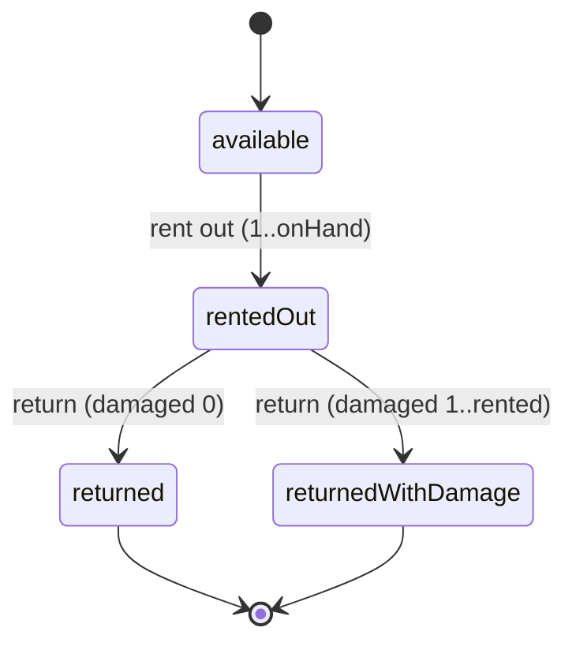

# Design Document — Decoration & Catering Vertical Remediation

## Overview

The DukanX `decorationCatering` vertical (the **DC_System**) is fully built at the screen,
model, and repository layers but is effectively unreachable and, where reachable, produces
incorrect financial figures. This design specifies how to make the vertical shippable
end-to-end by:

1. **Restoring reachability** — adding the missing `BusinessType.decorationCatering` case to
   `Sidebar_Configuration`, completing the `DC_Barrel` exports, wiring the
   `Sidebar_Navigation_Handler`, registering guarded legacy routes, and fixing post-login
   landing so a DC tenant arrives at `DcDashboardScreen`.
2. **Correcting business logic** — unifying the split discount/tax models between
   `computeQuoteTotal` and `dc_billing_screen.dart`, replacing the "advance defaults to 100%"
   behavior with a 30–50% configurable default (50%), populating `rentalPrice` from the API
   instead of the hardcoded `0`, recording the advance through `recordPayment` on quote
   conversion, and tracking rental lifecycle state.
3. **Hardening data handling** — null-safe JSON parsing in `DC_Repository`, reading the stored
   payment method instead of hardcoding `PaymentMethod.cash`, validating discount/GST/quantity/
   rate inputs, and adding `eventEndDate` for multi-day events.
4. **Replacing fake data** — sourcing dashboard quick actions and alert counts from
   `DC_Repository`/`dcStatsProvider` instead of the absent/placeholder branches.
5. **Closing out** — capability/isolation reconciliation, accessibility polish, dead-code
   disposition, and an optional offline-first sync phase — each behind explicit approval gates.

This work is **phased (Phase 0 → Phase 8)** with a human `Approval_Gate` between phases and a
separate `Mini_Approval_Gate` before any DynamoDB schema change. Phase 0 is read-only. The design
follows the established remediation pattern used by the restaurant and clinic verticals and is
bound by the cross-cutting constraints in Requirement 1 (tenant scoping, integer-paise money, RID
ids, idempotent migrations, no silent deletions, real fixes only).

### Scope and Verification Notes (grounded in the live codebase)

The following facts were confirmed by reading the current code and inform this design. Phase 0
must re-confirm any item marked *to verify* before the dependent fix is applied; if Ground Truth
contradicts the code, work STOPS and reports.

- **Barrel gap (confirmed):** `decoration_catering.dart` exports 13 screens but omits
  `dc_event_detail_screen.dart`, `dc_quote_conversion_screen.dart`,
  `dc_staff_attendance_screen.dart`, and `dc_vendor_rating_dialog.dart`, all of which exist on disk
  under `presentation/screens/` and `presentation/widgets/`.
- **Sidebar gap (confirmed):** `grep` for `decorationCatering` in `sidebar_configuration.dart`
  returns no matches — `_getSectionsForBusiness` has no DC case and falls through to
  `_getRetailSections()`.
- **Navigation gap (confirmed):** no `dc_*` ids resolve in `sidebar_navigation_handler.dart`.
- **Routes (confirmed):** `/dc/*` paths appear only in `legacy_routes.dart`'s `knownLegacyPaths`
  set; *to verify in Phase 0* whether each is registered as a guarded `GoRoute` and whether
  `/dc/vendors` currently resolves to `DcStaffScreen` rather than `DcVendorPaymentsScreen`.
- **Rental price (confirmed):** `DcRepository._inventoryFromJson` hardcodes `rentalPrice: 0`.
- **Payment method (confirmed):** `_expenseFromJson` hardcodes `PaymentMethod.cash`;
  `_vendorPaymentFromJson` already reads a `paymentMode` string with a `'cash'` default.
- **Non-atomic inventory (confirmed):** `adjustInventory` performs a read-all-then-PUT
  (`getInventory()` → `currentStock` PUT) rather than an atomic delta call.
- **Unsafe parsing (confirmed):** `_bookingFromJson` uses non-null-safe casts
  (`j['customerName'] as String`, `(j['guestCount'] as num).toInt()`,
  `DateTime.parse(j['eventDate'])`) that throw on malformed records, crashing the list screen;
  it also never maps `eventEndDate`.
- **Quote math (confirmed):** `DecorationCateringBusinessRules.computeQuoteTotal` uses an
  **absolute** `discount` and an absolute `taxAmount` (both `double`), while invoice/billing uses a
  **percentage** model — the source of the totals mismatch in Requirement 10.
- **Money type (confirmed):** `EventBooking.quotedAmount`/`advancePaid` and most DC models use
  `double` rupees; the repository converts to/from integer paise at the API boundary
  (`_paisa`/`_toPaisa`). Per Requirement 1.3–1.4, money in **touched** code must be integer paise.
- **Capability config (confirmed):** the registry marks `decorationCatering` as *service-only*
  (event/catering capabilities only; no product/inventory/billing capability registered),
  contradicting the vertical's use of inventory-for-rentals and billing — the Requirement 7 gate.
- **Sync handlers (to verify):** `DecorationCateringSyncHandler` / `DecorationCateringWsHandler`
  are not present under those names; Phase 7 (optional) treats them as new/dormant artifacts behind
  a sign-off gate.
- **GST default:** DC uses an 18% GST model (`DcQuote.gstPct` defaults to 18); this is the
  vertical's correct rate and is preserved.

## Architecture

The DC_System is a feature module that plugs into three shared DukanX subsystems: the desktop
**navigation shell** (sidebar config + navigation handler + legacy router), the **dashboard V2**
widgets, and the **capability/guard isolation layer**. Its own internals are a classic
screen → provider → repository → API stack.

```mermaid
flowchart TD
    Login[Post-login routing] -->|businessType == decorationCatering| Dash[DcDashboardScreen]

    subgraph Shell[Shared Navigation Shell]
        SC[Sidebar_Configuration\n_getDecorationCateringSections]
        SNH[Sidebar_Navigation_Handler\ngetScreenForItem]
        AR[App_Router / legacy_routes\nguarded /dc/* routes]
        VG[Vendor_Role_Guard]
        BG[Business_Guard allowedTypes:[decorationCatering]]
    end

    subgraph DashV2[Dashboard V2]
        QA[Quick_Actions]
        AW[Alerts_Widget]
    end

    subgraph DC[DC Feature Module]
        Screens[16 DC Screens]
        Providers[dcStatsProvider / dcBookingsProvider / ...]
        Repo[DC_Repository /dc/*]
        Rules[DecorationCateringBusinessRules]
    end

    Dash --> SC --> SNH --> Screens
    AR --> VG --> BG --> Screens
    Dash --> QA --> Screens
    Dash --> AW --> Repo
    Screens --> Providers --> Repo
    Screens --> Rules
    Repo -->|ApiClient| API[(Lambda /dc/* + DynamoDB)]
    Repo -->|Phase 7 optional| Drift[(Local Drift tables)]
```

### Phase Map

| Phase | Theme | Approval |
|-------|-------|----------|
| 0 | Read-only backend reality check → `Verification_Report` | Gate |
| 1 | Reachability: sidebar case, barrel exports, navigation, guarded routes, post-login landing | Gate |
| 2 | Capability & isolation reconciliation (Path A / Path B sign-off) | Gate + sign-off |
| 3 | Dashboard quick actions + real alert counts | Gate |
| 4 | Rental lifecycle correctness (price, state, atomic delta) | Gate |
| 5 | Discount/tax model unification; advance & ledger correctness | Gate |
| 6 | Data validation & JSON robustness; `eventEndDate` | Gate |
| 7 | Optional offline-first sync (Drift + handlers) | Sign-off + Gate |
| 8 | Polish (a11y) & dead-code disposition | Sign-off for deletes + Gate |

### Cross-Cutting Design Rules (Requirement 1)

- **Tenant scoping:** every DC query/write/cache key resolves `Tenant_Id` from
  `SessionManager.currentBusinessId`. The literal `vendorId: 'SYSTEM'` is prohibited. If
  `currentBusinessId` is null/empty, the operation aborts and returns a
  tenant-context-unavailable error (no DC data accessed).
- **Money:** all money in touched code is integer **Paise**; no `double` for currency is introduced
  in touched code. The existing `_paisa`/`_toPaisa` boundary helpers are the conversion seam.
- **Identifiers:** new entity ids use the **RID** pattern `{tenantId}-{timestamp_ms}-{uuid_v4_short}`.
- **Migrations:** idempotent — repeated runs change zero records after the first.
- **Safety gates:** schema changes require a `Mini_Approval_Gate`; deletions require explicit
  recorded sign-off. No TODO placeholders. Caught exceptions are surfaced or propagated, never
  silently swallowed. New code matches existing l10n, responsive, and error-handling patterns.

## Components and Interfaces

### Phase 0 — Verification_Report (read-only)

A single Markdown artifact. No source files change. It classifies each of the 17 `/dc/*`
endpoints as exactly one of `non-stub handler deployed`, `stub handler deployed`, or
`no handler deployed`; cites file path + start/end line numbers for every referenced audit
finding; states whether the go_router DC_Module is dead code (with evidence); records the
`getEventProfitability` formula (path + lines) and confirms or flags it; and flags any endpoint
with no non-stub handler as a backend gap, and any unclassifiable item as `unverified` with a
reason.

### Phase 1 — Reachability

**`Sidebar_Configuration._getDecorationCateringSections()`** (new)

```dart
// sidebar_configuration.dart
List<SidebarSection> _getSectionsForBusiness(BusinessType type) {
  switch (type) {
    // ... existing cases unchanged ...
    case BusinessType.decorationCatering:
      return _getDecorationCateringSections();   // NEW explicit case
    // ...
  }
}
```

Returns exactly **14** sections, each with a non-empty label and a sidebar-reachable navigation
target: Dashboard, Bookings, Calendar, Quotes, Catering/Menu, Decoration/Themes, Staff,
Attendance, Vendors & Payments, Inventory/Rentals, Shopping List, Billing, Profitability, Reports.
No other `BusinessType` branch is modified (Requirement 3.4 preservation).

**`DC_Barrel`** (`decoration_catering.dart`) — add the four missing exports:

```dart
export 'presentation/screens/dc_event_detail_screen.dart';
export 'presentation/screens/dc_quote_conversion_screen.dart';
export 'presentation/screens/dc_staff_attendance_screen.dart';
export 'presentation/widgets/dc_vendor_rating_dialog.dart';
```

**`Sidebar_Navigation_Handler.getScreenForItem(id)`** — add a case for each of the 14 DC ids
returning the single mapped DC screen (constructed with the session-resolved `Tenant_Id`).
`/dc/vendors`-class id resolves to `DcVendorPaymentsScreen`, **not** `DcStaffScreen`. Any
non-DC/unknown id continues to return the `_PlaceholderScreen` fallthrough without throwing.

**`App_Router` / `legacy_routes`** — register exactly eight routes, each wrapped in **both**
`Vendor_Role_Guard` and `Business_Guard(allowedTypes: [decorationCatering])`:
`dc_calendar`, `dc_quotes`, `dc_profitability`, `dc_shopping_list`, `dc_vendor_payments`,
`dc_event_detail`, `dc_quote_conversion`, `dc_staff_attendance`. The `DC_Routes` redirect resolves
in a single pass (no self-redirect loop).

**Post-login landing** — when a `decorationCatering` tenant authenticates, the resolver renders
`DcDashboardScreen` within 3 seconds; if the resolved route is anything else, it falls back to
`DcDashboardScreen`. All 16 DC screens are reachable within ≤ 2 navigation actions; a render
failure keeps the tenant on the current screen with a "could not load" error.

### Phase 2 — Capability & Isolation Reconciliation

A decision gate with two mutually exclusive, sign-off-gated paths:

- **Path A (grant):** register the capabilities the DC_System actually uses
  (inventory-for-rentals, billing) and remove the "service-only" comment from the capability
  config.
- **Path B (restrict):** keep DC capability-restricted and attach a capability guard to the
  retail-only `SidebarMenuItem`s **BuyFlow, Stock, Purchase** so they are unreachable for DC.

If neither path is signed off, **no** capability change is made and the system surfaces that
sign-off is required. Reconciliation reports the integer count (≥ 0) of `SidebarMenuItem`s that
both lack a `capability:` field and fall outside DC scope. Any route determined out-of-DC-scope
gets `Business_Guard` attached so DC access is denied.

### Phase 3 — Dashboard Quick Actions & Alerts

**`Quick_Actions`** — add a `BusinessType.decorationCatering` branch with exactly four activatable
controls, each navigating to its screen: **New Booking**, **New Quote**, **Add Staff**,
**Menu/Package**.

**`Alerts_Widget`** — add a DC branch displaying three integer counts derived **only** from
`DC_Repository` query results (no literals):

| Alert | Definition |
|-------|-----------|
| Upcoming events | events scheduled within the next 7 days (today inclusive → +7 calendar days) |
| Advance pending | bookings with advance payment pending |
| Rentals due | rentals due back on or before the current date |

A zero count renders as `0` (never omitted/placeholdered). If `DC_Repository` fails to return a
count, that alert shows an error indication rather than a stale/default value. `DcDashboardScreen`
is populated from `dcStatsProvider` such that every displayed statistic traces to a provider value.

### Phase 4 — Rental Lifecycle

**`DcRepository._inventoryFromJson`** — populate `rentalPrice` from the API field
(`rentalPricePaisa`, *exact field name to confirm in Phase 0*) via `_paisa(...)`. If the field is
missing/null, default to `0`, keep all other fields, and surface a non-blocking
"rentalPrice unavailable" indication.

**Rental lifecycle state** — a per-event item state machine:



- Rent-out quantity ∈ `[1, availableOnHand]`; return damaged-or-lost ∈ `[0, rentedQty]`.
- Out-of-bounds entries are rejected and the previous state retained.

**`DcRepository.adjustInventory`** — replace the read-all-then-PUT with an **atomic delta** call
(e.g. `POST /dc/inventory/{id}/adjust { deltaQty }`, *endpoint to confirm in Phase 0*). On failure,
leave the stored quantity unchanged and surface an error. If the backend has no atomic delta,
document the backend gap (no silent fallback).

### Phase 5 — Discount/Tax Unification & Advance/Ledger

**Unified money model** (`DecorationCateringBusinessRules` + `dc_billing_screen.dart`):

```
discountPct ∈ [0, 100], ≤ 2 dp
discountAmount   = round2(subtotal * discountPct / 100)
postDiscount     = subtotal - discountAmount
gstAmount        = round2(postDiscount * gstPct / 100)   // gstPct ∈ [0, 28]
grandTotal       = postDiscount + gstAmount
```

`computeQuoteTotal` is migrated from the absolute-discount model: the stored absolute discount is
converted to the equivalent percentage of the pre-discount subtotal
(`discountPct = round2(absDiscount / subtotal * 100)`) and persisted in the percentage model. GST
applies to the post-discount subtotal with identical rate/rounding in both call sites, so the two
grand totals match to the paise (zero variance). A discount outside `[0, 100]` is rejected, the
previous valid value retained, and an out-of-range error returned.

**Advance & ledger** (quote → booking conversion):

- Replace "advance defaults to 100%" with a configurable advance percentage, default **50%**,
  accepted range **30–50% inclusive**. A configured value outside the range is rejected, the prior
  value retained, and a range error presented.
- `advanceAmount = round2(total * advancePct / 100)`, validated `0 ≤ advanceAmount ≤ total`.
- Out-of-bounds advance → reject conversion, create no booking, leave the source quote in its
  pre-conversion state, present a bounds error.
- On conversion, call `DcRepository.recordPayment` against `/dc/events/{id}/payments` so the ledger
  reflects the advance (not merely setting `advancePaid`). If `recordPayment` fails → reject
  conversion, create no booking, leave the ledger unchanged, present a "could not record advance"
  error.

### Phase 6 — Validation & Robustness

- **Discount input** clamps to `[0, 100]`; **GST input** bounds to `[0, 28]`.
- **Quantity** ≤ 0 / empty / non-numeric → reject, retain previous value, show error.
- **Rate** < 0 / empty / non-numeric → reject, retain previous value, show error.
- **Generate Invoice** disabled while no event is selected.
- **`eventEndDate`** added to `EventBooking` and propagated through booking form, calendar, and
  profitability for multi-day events; `eventEndDate < eventDate` is rejected with an error.
- **`_bookingFromJson`** uses null-safe parsing with defined defaults; a malformed booking record
  is skipped (valid records preserved), an error indication surfaced, no screen crash.
- **`_expenseFromJson` / `_vendorPaymentFromJson`** read the stored payment method; a missing/
  unrecognized method applies a defined default and surfaces a non-blocking indication.

### Phase 7 — Optional Offline-First Sync (sign-off gated)

Gated on documented sign-off naming the in-scope entities (events/bookings, staff, vendors,
inventory, quotes, payments) and excluding all others. When approved: add Drift tables for each
named entity carrying the retail vertical's sync columns (last-modified timestamp, sync status,
soft-delete flag); wire `DC_Sync_Handler`/`DC_Ws_Handler` to read/write only those tables;
optimistic local write + FIFO sync queue; failed entries retry up to 5 times then mark a
failed-sync indication without discarding the local change.

### Phase 8 — Polish & Dead-Code Disposition

Icon-only DC buttons get a non-empty tooltip and a non-empty assistive-tech semantic label.
Status badges below 10px are set to 10–11px. `advanceForfeitedOnCancel` is wired into the
cancellation flow or removed per recorded sign-off. The go_router DC_Module is deleted or retained
with a documented rationale per sign-off. Any deletion requires explicit recorded sign-off first.

## Data Models

Money in **touched** code is integer paise. Existing models expose rupee `double`s populated via
the repository's `_paisa`/`_toPaisa` boundary; new fields and new logic added by this remediation
use integer paise and the `MoneyMath` half-up rounding helper.

### EventBooking (modified — Requirement 12.6)

Add `eventEndDate` and propagate it. The field already exists on the model but is **not** populated
by `_bookingFromJson`; Phase 6 maps it and validates ordering.

```dart
class EventBooking {
  // ... existing fields ...
  final DateTime eventDate;
  final DateTime? eventEndDate;   // NEW: must be null or >= eventDate (multi-day events)
  // money fields remain rupee-double at the model boundary; conversion math uses paise
}
```

### Advance configuration (new — Requirement 11)

```dart
/// Configurable advance percentage applied on quote→booking conversion.
/// Default 50%, accepted range [30, 50] inclusive. Stored per tenant/business config.
class AdvanceConfig {
  final int advancePct;        // integer percent in [30, 50]; default 50
  const AdvanceConfig({this.advancePct = 50});
  bool get isValid => advancePct >= 30 && advancePct <= 50;
}
```

### Unified quote/invoice money model (modified — Requirement 10)

`DecorationCateringBusinessRules.computeQuoteTotal` changes from `(discount, taxAmount)` absolutes
to a percentage model `(discountPct, gstPct)` operating on an integer-paise subtotal:

```dart
/// All amounts integer paise; pct values are decimals with <= 2 dp.
({int discountAmount, int postDiscount, int gstAmount, int grandTotal})
computeQuoteTotalPct({
  required int subtotalPaise,
  required double discountPct,   // [0, 100]
  required double gstPct,        // [0, 28]
});
```

### Rental lifecycle state (new — Requirement 9)

```dart
enum RentalState { available, rentedOut, returned, returnedWithDamage }

class EventRental {
  final String eventId;
  final String inventoryItemId;
  final int rentedQty;          // [1, availableOnHand] at rent-out
  final int damagedOrLostQty;   // [0, rentedQty] at return
  final RentalState state;
}
```

### DcInventoryItem (modified — Requirement 9.1/9.2)

`rentalPrice` is populated from the API; `0` only as an explicit, surfaced fallback when the API
field is absent. (Existing model field reused; only the `_inventoryFromJson` mapping changes.)

### DcExpense / DcVendorPayment (modified — Requirement 12.8/12.10)

`_expenseFromJson` reads the stored `paymentMode`/`paymentMethod` rather than hardcoding
`PaymentMethod.cash`; a missing/unrecognized value applies a defined default and surfaces a
non-blocking indication. `DcVendorPayment` already carries a `paymentMode` string with a `'cash'`
default and is brought under the same parse rule.

### New identifiers

All new entities (rental records, advance-config rows, any Phase 7 Drift rows) use the **RID**
pattern `{tenantId}-{timestamp_ms}-{uuid_v4_short}`.

## Correctness Properties

*A property is a characteristic or behavior that should hold true across all valid executions of a
system — essentially, a formal statement about what the system should do. Properties serve as the
bridge between human-readable specifications and machine-verifiable correctness guarantees.*

The property-based approach applies to the computational and invariant-bearing parts of this
remediation — tenant scoping, id generation, migration idempotence, navigation resolution over the
enumerated id/route sets, guard denial, data-derived alert counts, rental bounds, the unified
discount/tax math, advance computation, input validation/clamping, JSON parse robustness, and the
accessibility invariants. Purely structural items (Phase 0 documentation, static type rules,
process gates, single-input UI examples) are covered by the unit/integration tests in the Testing
Strategy rather than properties.

### Property 1: Tenant scoping, never 'SYSTEM'

*For any* DC repository operation (query, write, or cache-key construction) executed with a
non-null, non-empty `SessionManager.currentBusinessId`, the resolved tenant/scope key SHALL equal
`currentBusinessId` and SHALL never be the literal `'SYSTEM'`.

**Validates: Requirements 1.1, 1.2**

### Property 2: Fail-safe on missing tenant

*For any* DC operation invoked while `currentBusinessId` is null or empty, the DC_System SHALL
abort the operation, perform no DC data access, and return a tenant-context-unavailable error.

**Validates: Requirements 1.13**

### Property 3: RID identifier format

*For any* new DC entity id generated for a given `tenantId`, the id SHALL match the RID shape
`{tenantId}-{timestamp_ms}-{uuid_v4_short}`, embed that `tenantId` as its prefix, and be unique
across distinct generation timestamps.

**Validates: Requirements 1.5**

### Property 4: Migration idempotence

*For any* pre-migration DC dataset, running the migration twice SHALL produce a persisted state
after the second run identical to the state after the first run, and the second run SHALL modify
zero records.

**Validates: Requirements 1.8**

### Property 5: Non-DC sidebar preservation

*For any* `BusinessType` other than `decorationCatering`, `_getSectionsForBusiness` SHALL return a
section list identical to the baseline produced before the `decorationCatering` case was added.

**Validates: Requirements 3.4**

### Property 6: DC sidebar sections are well-formed

*For any* section returned for `BusinessType.decorationCatering`, the section SHALL have a
non-empty label and a navigation target that resolves to a real DC screen (not the placeholder).

**Validates: Requirements 3.3**

### Property 7: DC navigation resolution

*For any* DC sidebar item id enumerated in Requirement 3, `getScreenForItem` SHALL return the
single DC screen mapped to that id and SHALL never return the `_PlaceholderScreen` fallthrough;
*for any* id not enumerated, it SHALL return the `_PlaceholderScreen` fallthrough without throwing.

**Validates: Requirements 4.2, 4.3, 4.4**

### Property 8: Guard denial for out-of-scope access

*For any* DC route accessed by a user whose business type is not `decorationCatering` or who lacks
the vendor role, the DC_System SHALL block access and redirect to a fallback, retaining no DC
screen state; and *for any* route determined to be outside DC scope, `Business_Guard` SHALL deny
DC access.

**Validates: Requirements 5.5, 7.6**

### Property 9: Single-pass route redirect

*For any* DC route, the `DC_Routes` redirect logic SHALL resolve it in a single pass with no
further redirect (a fixed point in one step).

**Validates: Requirements 5.6**

### Property 10: DC route guard wrapping

*For any* of the eight registered DC routes, the route SHALL be wrapped in both `Vendor_Role_Guard`
and `Business_Guard` with `allowedTypes: [decorationCatering]`.

**Validates: Requirements 5.2**

### Property 11: All DC screens reachable

*For any* of the 16 DC screens, there SHALL exist a path of at most 2 navigation actions from
`DcDashboardScreen` after which the screen renders its primary content without navigation error or
crash.

**Validates: Requirements 6.2**

### Property 12: Alert counts derive from repository data

*For any* DC dataset returned by `DC_Repository`, each of the three alert counts displayed by
`Alerts_Widget` SHALL equal the count computed by its definition over that dataset — events
scheduled within the next 7 days (today inclusive through +7 days), bookings with advance pending,
and rentals due on or before today — and SHALL never be a hardcoded literal.

**Validates: Requirements 8.2, 8.4**

### Property 13: rentalPrice mapping

*For any* inventory record whose API payload contains a rental-price field, `_inventoryFromJson`
SHALL set `rentalPrice` to that field's value (paise-converted), not a hardcoded `0`.

**Validates: Requirements 9.1**

### Property 14: Rental quantity bounds and state

*For any* rental operation: a rent-out quantity in `[1, availableOnHand]` and a return
damaged-or-lost quantity in `[0, rentedQty]` SHALL be accepted and recorded; a quantity outside
those bounds SHALL be rejected with the previous state retained; and after any valid operation the
per-event item state SHALL be exactly one of `available`, `rentedOut`, `returned`, or
`returnedWithDamage`.

**Validates: Requirements 9.3, 9.4, 9.5, 9.6**

### Property 15: Discount/tax model equivalence

*For any* set of line items, discount percentage in `[0, 100]`, and GST percentage in `[0, 28]`,
the grand total produced by `computeQuoteTotal` SHALL equal the grand total produced by
`dc_billing_screen.dart` to the nearest paise (zero variance), with GST applied to the post-discount
subtotal using identical rate and rounding rules in both.

**Validates: Requirements 10.1, 10.3, 10.4**

### Property 16: Absolute-to-percentage discount conversion

*For any* stored absolute discount amount no greater than the pre-discount subtotal, the migrated
discount percentage SHALL equal `round2(absoluteDiscount / subtotal * 100)`, and re-applying that
percentage SHALL reproduce the original absolute discount to within paise rounding.

**Validates: Requirements 10.2**

### Property 17: Out-of-range discount rejection

*For any* discount percentage outside `[0, 100]`, the DC_System SHALL reject the input, retain the
previous valid discount value, and return an error identifying the out-of-range discount.

**Validates: Requirements 10.5**

### Property 18: Advance amount computation

*For any* booking total and configured advance percentage in `[30, 50]`, the advance amount
computed at quote conversion SHALL equal `round2(total * advancePct / 100)` paise and SHALL satisfy
`0 <= advanceAmount <= total`.

**Validates: Requirements 11.3, 11.4**

### Property 19: Advance configuration range

*For any* configured advance percentage outside `[30, 50]`, the DC_System SHALL reject the
configuration value, retain the previously stored advance percentage, and present an
accepted-range error.

**Validates: Requirements 11.2**

### Property 20: Percentage field clamping

*For any* numeric discount input the clamped result SHALL equal `clamp(input, 0, 100)`, and *for
any* numeric GST input the bounded result SHALL equal `clamp(input, 0, 28)`.

**Validates: Requirements 12.1, 12.2**

### Property 21: Line-item numeric input validation

*For any* line-item quantity that is `<= 0`, empty, or non-numeric, and *for any* line-item rate
that is `< 0`, empty, or non-numeric, the DC_System SHALL reject the entry, retain the previous
valid value, and present an error indication.

**Validates: Requirements 12.3, 12.4**

### Property 22: Payment-method mapping

*For any* expense or vendor-payment record whose stored payment method is a recognized value,
`_expenseFromJson` / `_vendorPaymentFromJson` SHALL map to that exact `PaymentMethod`, never a
hardcoded `PaymentMethod.cash`.

**Validates: Requirements 12.8**

### Property 23: Booking parse robustness

*For any* list of booking records mixing valid and malformed entries, `_bookingFromJson`-based
parsing SHALL return every valid record (with defined defaults applied), skip each malformed
record while surfacing an error indication, and never throw.

**Validates: Requirements 12.7, 12.9**

### Property 24: Event date ordering

*For any* `(eventDate, eventEndDate)` pair, the DC_System SHALL accept the booking when
`eventEndDate` is null or `>= eventDate`, and reject it with an error when `eventEndDate <
eventDate`.

**Validates: Requirements 12.11**

### Property 25: Icon-only button accessibility

*For any* icon-only DC button, the rendered widget SHALL expose a non-empty tooltip and a non-empty
assistive-technology semantic label describing the button's action.

**Validates: Requirements 14.1, 14.2**

### Property 26: Status badge font floor

*For any* DC status badge whose font size would be below 10px, the rendered font size SHALL be set
to a value between 10px and 11px inclusive.

**Validates: Requirements 14.3**

### Phase 7 (deferred until sign-off) — Sync properties

The following properties are specified now but asserted only once Phase 7 sign-off is recorded
(Requirement 13.1). Until then, the only related assertion is preservation: no Phase 7 artifact
exists.

### Property 27: Sync references only approved tables

*For any* DC sync operation, the table it reads from or writes to SHALL be one of the approved
in-scope entity tables (events/bookings, staff, vendors, inventory, quotes, payments).

**Validates: Requirements 13.3**

### Property 28: Optimistic write enqueues one ordered entry

*For any* sequence of DC create/update/delete mutations (offline or online), each mutation SHALL
persist to the local Drift table immediately and enqueue exactly one corresponding sync entry,
preserving mutation order.

**Validates: Requirements 13.4, 13.5**

### Property 29: Bounded retry preserves local change

*For any* queued sync entry that fails to transmit, the DC_System SHALL retain the entry, preserve
the local record unchanged, retry up to 5 times, and after the final failed attempt mark the entry
with a failed-sync indication without discarding the local change.

**Validates: Requirements 13.6**

## Error Handling

Error handling follows Requirement 1.10 (no silently discarded exceptions) and 1.13 (fail-safe on
missing tenant). Strategy by layer:

- **Tenant context:** a single resolver returns `currentBusinessId` or fails. When null/empty, DC
  operations short-circuit with a `TenantContextUnavailable` error before any I/O; callers render a
  non-destructive error state. The `'SYSTEM'` fallback is never used.
- **Repository / JSON parsing:** per-record null-safe parsing with defined defaults. Malformed
  records are skipped (not fatal); the parser collects and surfaces a non-blocking error indication
  listing skipped records so a single bad row never crashes a list screen (Requirement 12.7/12.9).
  Missing/unrecognized payment methods apply a defined default and surface a non-blocking
  indication (12.10).
- **Network / API:** `DC_Repository` calls surface failures as typed results. Alert-count failures
  render an error indication per affected alert rather than a stale or default number (8.5). The
  atomic inventory delta leaves stored quantity unchanged on failure and surfaces an error (9.8); a
  missing backend delta capability is documented, not silently worked around (9.9).
- **Validation:** discount/GST inputs are clamped to range; invalid quantity/rate entries are
  rejected with the previous valid value retained and an error shown (12.1–12.4). Out-of-range
  discount (10.5), out-of-range advance config (11.2), and `eventEndDate < eventDate` (12.11) are
  rejected with specific error messages.
- **Conversion atomicity:** quote→booking conversion is all-or-nothing. If advance bounds fail or
  `recordPayment` fails, no booking is created, the source quote stays in its pre-conversion state,
  the ledger is unchanged, and a specific error is presented (11.5/11.7).
- **Navigation:** unknown sidebar ids resolve to a placeholder without throwing (4.4); a DC screen
  that fails to render keeps the tenant on the current screen with a "could not load" message
  (6.4).
- **Guards:** denied access redirects to a fallback and retains no DC screen state (5.5).
- **Sync (Phase 7):** transmit failures retain the queue entry, preserve the local record, retry up
  to 5 times, then mark a user-observable failed-sync state without discarding the local change
  (13.6).

## Testing Strategy

A dual approach: **property-based tests** for the universal invariants and computational
requirements above, and **example / integration / widget tests** for specific scenarios, wiring,
and UI states.

### Property-Based Testing

- **Library:** use an established Dart property-based testing library
  (`package:glados`, already used elsewhere in this repo's `test/certification/pbt/` and
  `scripts/audit/analyzers/` per the grounding scan). Do **not** hand-roll PBT.
- **Iterations:** each property test runs a minimum of **100** generated cases.
- **Tagging:** each property test references its design property with a comment of the form
  `Feature: decoration-catering-vertical-remediation, Property {number}: {property_text}`.
- **One test per property:** each Correctness Property is implemented by a single property-based
  test.
- **Generators:** bookings with varied dates/amounts/guest counts; inventory items with random
  on-hand and rental prices; line-item lists with random quantities/rates; discount percentages
  spanning in-range and out-of-range; advance percentages spanning `[30,50]` and outside; mixed
  valid/malformed JSON record lists; the enumerated sets of DC sidebar ids, DC routes, and the 14
  sections / 16 screens; arbitrary numeric inputs for clamp properties; pre-migration datasets for
  idempotence.

Property coverage map: P1–P2 (tenant scoping/fail-safe), P3 (RID), P4 (idempotent migration), P5
(non-DC preservation), P6–P7 (sidebar/navigation resolution), P8–P10 (guards/routes), P11
(reachability), P12 (alert counts), P13–P14 (rental price/bounds/state), P15–P17 (discount/tax
unification), P18–P19 (advance), P20–P21 (clamp/validation), P22–P24 (parsing/dates), P25–P26
(accessibility), P27–P29 (Phase 7 sync, deferred).

### Unit / Example Tests

- Phase 0 `Verification_Report` completeness: 17 endpoints each classified; findings cite
  path + line numbers (review-assisted assertions).
- `_getSectionsForBusiness(decorationCatering)` returns exactly the 14 named sections (3.1, 3.2).
- `/dc/vendors` resolves to `DcVendorPaymentsScreen`, not `DcStaffScreen` (5.4).
- DC tenant post-login lands on `DcDashboardScreen`; non-DC landing falls back to it (6.1, 6.3).
- Quick_Actions yields exactly four DC actions, each navigating to its screen (8.1).
- `DcDashboardScreen` statistics each trace to a `dcStatsProvider` value (8.6).
- Capability reconciliation: Path A removes the service-only comment; Path B guards
  BuyFlow/Stock/Purchase; no-sign-off makes no change and surfaces sign-off-required; the
  out-of-scope capability-less item count is reported (7.1–7.5).
- `recordPayment` is invoked on conversion (mock verifies the ledger call) (11.6).
- Advance default is 50% (11.1).
- Zero-count alerts render `0`; repository failure renders an error indication (8.3, 8.5).
- `eventEndDate` propagates through booking form, calendar, and profitability (12.6).
- Generate Invoice disabled with no event selected (12.5).

### Integration / Widget Tests

- Full reachability: login as DC tenant → land on dashboard → navigate to each of the 16 screens
  via sidebar → assert primary content renders without crash (6.2).
- Deep-link / in-app navigation to each guarded DC route as an authorized DC vendor resolves to the
  target; unauthorized type/role is blocked and redirected (5.3, 5.5).
- Rental flow: rent out an item, return it (with and without damage), assert quantity and state
  transitions and that the adjustment used the atomic delta path (9.3–9.7).
- Conversion flow: convert a quote with a valid advance → booking created + ledger payment
  recorded; force `recordPayment` failure → no booking, quote unchanged, ledger unchanged
  (11.5–11.7).

### Static / Smoke Checks

- Analyzer passes with zero unresolved-import/missing-symbol errors after barrel exports (4.1).
- Touched currency fields are integer paise; no new `double` currency types (1.3, 1.4).
- Process gates (phase approvals, schema/deletion sign-offs) are honored per the operating rules
  (1.6, 1.7, 1.12, 13.1, 14.4–14.7).
