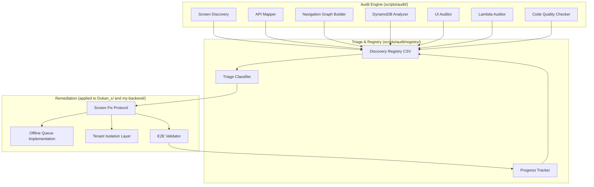
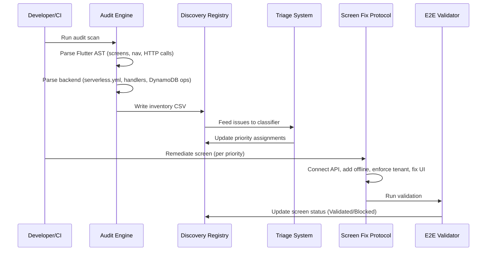

# Design Document: Full-Stack Audit and Remediation System

## Overview

This system provides an automated audit and remediation pipeline for DukanX — a multi-tenant SaaS billing platform with 460+ screens across 19+ business verticals. The system discovers all screens, API endpoints, navigation routes, and DynamoDB access patterns; triages issues by severity (P0–P3); and systematically remediates every screen to production-ready status with zero mock data, full offline support, tenant isolation, and UI consistency.

The architecture follows a pipeline pattern: **Discover → Analyze → Triage → Remediate → Validate → Track**. Each phase produces structured output consumed by the next, enabling incremental progress and parallel work across verticals.

### Design Decisions

1. **Script-based tooling over external services**: The Audit Engine runs as Dart scripts (for Flutter analysis) and Node.js/TypeScript scripts (for backend analysis) within the existing monorepo, avoiding external tool dependencies.
2. **CSV-based Discovery Registry**: Uses CSV as the registry format (matching the existing `audit_results.csv` pattern already in the project) for human readability and version control diffability.
3. **Existing infrastructure reuse**: Leverages the project's existing `core/sync/`, `core/database/`, `core/offline/`, `core/responsive/`, and `my-backend/src/middleware/handler-wrapper.ts` patterns rather than introducing new frameworks.
4. **Static analysis over runtime instrumentation**: Prefers AST parsing and pattern matching for audit discovery, keeping the audit non-invasive and CI-friendly.

## Architecture

The system is organized into three layers that map to the existing project structure:



### Execution Flow



### Directory Structure

```
scripts/audit/
├── analyzers/
│   ├── screen_discovery.dart        # Req 1: Flutter screen scanner
│   ├── api_mapper.ts                # Req 2: Backend route + call site mapper
│   ├── navigation_graph.dart        # Req 3: Navigation graph builder
│   ├── dynamodb_analyzer.ts         # Req 4: DynamoDB access pattern analyzer
│   ├── ui_auditor.dart              # Req 10: UI consistency checker
│   ├── lambda_auditor.ts            # Req 11: Lambda handler reviewer
│   └── code_quality.ts              # Req 13: Code quality scorer
├── registry/
│   ├── discovery_registry.ts        # Central inventory management
│   ├── triage_classifier.ts         # Req 5: Priority assignment
│   └── progress_tracker.ts          # Req 15: Status state machine
├── remediation/
│   ├── mock_eliminator.dart         # Req 6: Mock data detection + replacement
│   ├── api_connector.dart           # Req 7: Real API connection
│   ├── offline_implementer.dart     # Req 8: Offline mode scaffolding
│   └── tenant_enforcer.ts           # Req 9: Tenant isolation verification
├── validation/
│   ├── e2e_runner.dart              # Req 14: E2E test execution
│   └── vertical_validator.dart      # Req 12: Vertical-specific validation
└── config/
    ├── verticals.json               # Vertical definitions + primary entities
    └── audit_rules.json             # Configurable patterns and thresholds
```

## Components and Interfaces

### 1. Screen Discovery Engine (`screen_discovery.dart`)

**Purpose**: Scans the Flutter codebase to catalog all screen/page widgets.

**Interface**:
```dart
class ScreenDiscoveryEngine {
  /// Scans all Dart files under the given root path
  Future<List<ScreenEntry>> scan(String projectRoot);

  /// Determines if a Dart file contains a valid screen widget
  ScreenClassification classifyFile(String filePath, String fileContent);

  /// Derives the vertical name from a file path
  String deriveVertical(String relativePath);

  /// Detects mock data patterns in a file
  MockDetectionResult detectMockData(String fileContent);

  /// Assigns priority based on screen characteristics
  Priority assignPriority(ScreenEntry entry);
}

enum Priority { high, medium, low }

class ScreenEntry {
  final String project;
  final String feature;
  final String fileName;
  final String relativePath;
  final String businessTypes;
  final bool mockData;
  final String mockReasons;
  final bool apiConnected;
  final bool offlineReady;
  final bool uiConsistent;
  final bool navWired;
  final Priority priority;
}
```

### 2. API Surface Mapper (`api_mapper.ts`)

**Purpose**: Catalogs backend routes and maps Flutter HTTP call sites to them.

**Interface**:
```typescript
interface ApiMapper {
  /** Parse routes from serverless.yml and template.yaml */
  parseRoutes(configPaths: string[]): Route[];

  /** Scan Flutter code for HTTP call sites */
  scanCallSites(flutterRoot: string): CallSite[];

  /** Match call sites to routes using path normalization */
  matchCallSitesToRoutes(callSites: CallSite[], routes: Route[]): MatchResult;

  /** Normalize a path by replacing path params with wildcards */
  normalizePath(path: string): string;
}

interface Route {
  method: string;
  path: string;
  normalizedPath: string;
  handlerFile: string;
  authenticated: boolean;
  source: 'serverless.yml' | 'template.yaml';
}

interface CallSite {
  screenFile: string;
  requestPath: string;
  normalizedPath: string;
  httpMethod: string;
  lineNumber: number;
}

interface MatchResult {
  matched: Array<{ callSite: CallSite; route: Route }>;
  brokenDependencies: CallSite[];  // P1: call site with no matching route
  orphanedRoutes: Route[];          // P2: route with no matching call site
}
```

### 3. Navigation Graph Builder (`navigation_graph.dart`)

**Purpose**: Constructs a directed graph of navigation transitions and detects dead-ends.

**Interface**:
```dart
class NavigationGraphBuilder {
  /// Build directed graph from Flutter navigation calls
  NavigationGraph buildGraph(String projectRoot);

  /// Find all screens unreachable from the root route
  List<UnreachableScreen> findUnreachable(NavigationGraph graph);

  /// Find broken navigation links (unresolved route strings)
  List<BrokenLink> findBrokenLinks(NavigationGraph graph, Set<String> registeredRoutes);

  /// Export graph as adjacency list grouped by vertical
  Map<String, Map<String, List<String>>> toAdjacencyList(NavigationGraph graph);
}

class NavigationGraph {
  final Map<String, Set<String>> edges;  // screenId → {target screenIds}
  final String rootRoute;
}
```

### 4. DynamoDB Access Analyzer (`dynamodb_analyzer.ts`)

**Purpose**: Catalogs DynamoDB operations and verifies tenant isolation at the database level.

**Interface**:
```typescript
interface DynamoDbAnalyzer {
  /** Scan handler files for DynamoDB operations */
  scanOperations(handlersDir: string): DynamoDbOperation[];

  /** Check if an operation has tenant isolation */
  hasTenantIsolation(op: DynamoDbOperation, tenantIdPattern?: RegExp): boolean;

  /** Detect scan operations that could be queries */
  detectInefficientScans(op: DynamoDbOperation): boolean;

  /** Check if table name or key is dynamically constructed */
  isDynamicConstruction(op: DynamoDbOperation): boolean;
}

interface DynamoDbOperation {
  type: 'get' | 'put' | 'query' | 'scan' | 'update' | 'delete';
  tableName: string;
  keyCondition: string;
  filterExpression: string;
  handlerFile: string;
  lineNumber: number;
  isDynamic: boolean;
}
```

### 5. Triage Classifier (`triage_classifier.ts`)

**Purpose**: Assigns priority levels to discovered issues.

**Interface**:
```typescript
interface TriageClassifier {
  /** Classify a single issue based on its characteristics */
  classify(issue: AuditIssue): PriorityLevel;

  /** Generate summary report grouped by priority and vertical */
  generateReport(issues: AuditIssue[]): TriageReport;
}

type PriorityLevel = 'P0' | 'P1' | 'P2' | 'P3';

interface AuditIssue {
  type: IssueType;
  screenName?: string;
  handlerName?: string;
  vertical: string;
  details: string;
  location: { file: string; line?: number };
}

type IssueType =
  | 'tenant_leak'
  | 'mock_data_production'
  | 'broken_navigation'
  | 'missing_offline_write'
  | 'ui_inconsistency'
  | 'orphaned_route'
  | 'broken_api_dependency'
  | 'missing_validation'
  | 'inadequate_error_handling'
  | 'scan_instead_of_query'
  | 'dynamic_construction'
  | 'repository_bypass';
```

### 6. Offline Queue (`core/sync/` extension)

**Purpose**: Extends the existing sync infrastructure with mutation queuing, replay, and capacity management.

**Interface**:
```dart
class OfflineQueue {
  static const int maxQueueSize = 5000;

  /// Queue a mutation while offline
  Future<QueueResult> enqueue(OfflineMutation mutation);

  /// Replay queued mutations on reconnection (batch of 50, 60s timeout)
  Future<ReplayResult> replay();

  /// Get current queue size
  Future<int> get queueSize;

  /// Check if queue is at capacity
  Future<bool> get isAtCapacity;

  /// Get failed mutations for user review
  Future<List<FailedMutation>> getFailedMutations();

  /// Discard a failed mutation by ID
  Future<void> discard(String mutationId);
}

class OfflineMutation {
  final String id;
  final DateTime timestamp;
  final String operationType;
  final Map<String, dynamic> payload;
  final String tenantId;
  int retryCount;
}

class FailedMutation extends OfflineMutation {
  final String failureReason;
  final String affectedRecordId;
}
```

### 7. Progress Tracker (`progress_tracker.ts`)

**Purpose**: Manages screen remediation status with a state machine and generates progress reports.

**Interface**:
```typescript
interface ProgressTracker {
  /** Attempt a status transition */
  transition(screenId: string, targetStatus: ScreenStatus, reason: string): TransitionResult;

  /** Get progress summary per vertical */
  getSummary(): ProgressSummary;

  /** Calculate overall platform readiness percentage */
  getReadinessPercentage(): number;
}

type ScreenStatus = 'Not Started' | 'In Progress' | 'Remediated' | 'Validated' | 'Blocked';

const VALID_TRANSITIONS: Record<ScreenStatus, ScreenStatus[]> = {
  'Not Started': ['In Progress'],
  'In Progress': ['Remediated', 'Blocked'],
  'Blocked': ['In Progress'],
  'Remediated': ['Validated'],
  'Validated': ['Remediated'],
};

interface TransitionResult {
  success: boolean;
  error?: string;
  previousStatus?: ScreenStatus;
  newStatus?: ScreenStatus;
  timestamp?: string;
}
```

### 8. Tenant Isolation Layer (`my-backend/src/middleware/`)

**Purpose**: Extends the existing `authorizedHandler` to enforce tenant scoping at the repository layer.

**Interface**:
```typescript
interface TenantIsolationLayer {
  /** Extract and validate tenant ID from JWT claims */
  extractTenantId(event: APIGatewayProxyEventV2): TenantValidation;

  /** Inject tenant ID into DynamoDB operation params */
  scopeToTenant(params: DynamoDBParams, tenantId: string): DynamoDBParams;

  /** Verify a resource belongs to the authenticated tenant */
  verifyOwnership(resourceTenantId: string, authTenantId: string): boolean;

  /** Log security event for cross-tenant access attempts */
  logSecurityEvent(event: SecurityEvent): void;
}

interface TenantValidation {
  valid: boolean;
  tenantId?: string;
  error?: string;
}

// Tenant ID format: non-empty, max 128 chars, [a-zA-Z0-9_-]+
const TENANT_ID_PATTERN = /^[a-zA-Z0-9_-]{1,128}$/;
```

### 9. E2E Validator (`e2e_runner.dart`)

**Purpose**: Executes end-to-end validation flows for remediated screens.

**Interface**:
```dart
class E2EValidator {
  static const Duration stageTimeout = Duration(seconds: 30);
  static const Duration syncTimeout = Duration(seconds: 60);

  /// Run full data flow validation (UI → API → DB → response → UI)
  Future<E2EResult> validateDataFlow(String screenId, TestTransaction transaction);

  /// Run sync cycle validation (offline write → queue → reconnect → sync → cache)
  Future<E2EResult> validateSyncCycle(String screenId, OfflineMutation mutation);

  /// Run cross-tenant isolation validation
  Future<E2EResult> validateTenantIsolation(String screenId, {
    required String tenantAToken,
    required String tenantBResourceId,
  });
}

class E2EResult {
  final bool passed;
  final List<StageResult> stages;
  final String? failureDetails;
}
```

## Data Models

### Discovery Registry CSV Schema

Matches the existing `audit_results.csv` format:

| Column | Type | Description |
|--------|------|-------------|
| Project | string | Always "Dukan_x" |
| Feature | string | Feature folder name or "core/general" |
| FileName | string | Dart file name |
| RelativePath | string | Full relative path from project root |
| BusinessTypes | string | Vertical name (e.g., "School ERP", "Restaurant") |
| MockData | boolean | True if mock data detected |
| MockReasons | string | Comma-separated list of mock indicators |
| ApiConnected | boolean | True if screen calls real API |
| OfflineReady | boolean | True if offline caching implemented |
| UiConsistent | boolean | True if passes UI checklist |
| NavWired | boolean | True if reachable in navigation graph |
| Priority | enum | "High" / "Medium" / "Low" |
| Status | enum | "Not Started" / "In Progress" / "Remediated" / "Validated" / "Blocked" |
| StatusReason | string | Last status change reason |
| StatusTimestamp | ISO8601 | Last status change time |

### Offline Mutation Queue (SQLite Table)

```sql
CREATE TABLE offline_mutations (
  id TEXT PRIMARY KEY,
  tenant_id TEXT NOT NULL,
  timestamp TEXT NOT NULL,          -- ISO8601
  operation_type TEXT NOT NULL,     -- 'create' | 'update' | 'delete'
  entity_type TEXT NOT NULL,        -- e.g., 'invoice', 'product', 'appointment'
  payload TEXT NOT NULL,            -- JSON-encoded payload
  retry_count INTEGER DEFAULT 0,
  status TEXT DEFAULT 'pending',    -- 'pending' | 'syncing' | 'failed' | 'synced'
  failure_reason TEXT,
  affected_record_id TEXT,
  created_at TEXT NOT NULL,
  synced_at TEXT
);

CREATE INDEX idx_mutations_status ON offline_mutations(status);
CREATE INDEX idx_mutations_tenant ON offline_mutations(tenant_id);
CREATE INDEX idx_mutations_timestamp ON offline_mutations(timestamp);
```

### Audit Issue Model

```typescript
interface AuditIssue {
  id: string;                       // Unique issue identifier
  type: IssueType;
  priority: PriorityLevel;
  vertical: string;
  screenName?: string;
  handlerName?: string;
  description: string;
  location: {
    file: string;
    line?: number;
    column?: number;
  };
  detectedAt: string;               // ISO8601
  resolvedAt?: string;
  isBlocking: boolean;              // true for new code violations
  metadata?: Record<string, unknown>;
}
```

### Navigation Graph Model

```typescript
interface NavigationGraphData {
  root: string;                     // Root route identifier
  nodes: Map<string, ScreenNode>;
  edges: Array<{ from: string; to: string; type: NavType }>;
}

interface ScreenNode {
  id: string;
  filePath: string;
  vertical: string;
  routes: string[];                 // Registered route strings for this screen
}

type NavType = 'push' | 'pushNamed' | 'go' | 'goNamed' | 'pushReplacement';
```

### Vertical Configuration Model

```json
{
  "verticals": [
    {
      "id": "restaurant",
      "name": "Restaurant",
      "featureFolder": "restaurant",
      "businessType": "Restaurant",
      "primaryEntity": "menu_item",
      "criticalJourney": ["create", "list", "edit", "report", "export"],
      "domainScreens": ["menu_screen", "order_screen", "table_screen", "kot_screen"],
      "dashboardRoute": "/restaurant/dashboard"
    }
  ]
}
```

## Correctness Properties

*A property is a characteristic or behavior that should hold true across all valid executions of a system — essentially, a formal statement about what the system should do. Properties serve as the bridge between human-readable specifications and machine-verifiable correctness guarantees.*

### Property 1: Screen Classifier Correctness

*For any* Dart file content and file path, the screen classifier SHALL include the file in the Discovery Registry if and only if: (a) the file path or class name contains "screen" or "page" (case-insensitive), AND (b) the file contains a class declaration extending StatelessWidget or StatefulWidget. Files meeting (a) but not (b) SHALL be excluded as false positives.

**Validates: Requirements 1.1, 1.6**

### Property 2: Vertical Derivation Correctness

*For any* file path under `lib/features/<folder>/`, the derived vertical SHALL equal the `<folder>` name. *For any* file path not under `lib/features/`, the derived vertical SHALL be "core/general".

**Validates: Requirements 1.2**

### Property 3: CSV Serialization with Priority Logic

*For any* valid ScreenEntry, serializing to CSV and parsing back SHALL produce an equivalent entry. Additionally, screens that are dashboards or entry-points SHALL receive "High" priority, standard feature screens with navigation wired SHALL receive "Medium", and all others SHALL receive "Low".

**Validates: Requirements 1.3**

### Property 4: API Path Matching

*For any* HTTP call site path and *for any* set of backend route paths, the matcher SHALL identify a connection if and only if the normalized paths are equal (where normalization replaces path parameters like `{id}` with a wildcard). Call sites with no matching route SHALL be flagged as broken dependencies, and routes with no matching call site SHALL be flagged as orphaned.

**Validates: Requirements 2.2, 2.3, 2.4**

### Property 5: Navigation Graph Reachability

*For any* directed navigation graph with a designated root node, a screen SHALL be flagged as unreachable if and only if there exists no directed path from the root to that screen. Additionally, *for any* navigation route reference that does not resolve to a registered screen, it SHALL be flagged as a broken link.

**Validates: Requirements 3.2, 3.3**

### Property 6: DynamoDB Tenant Isolation Detection

*For any* DynamoDB operation extracted from a handler file, the analyzer SHALL flag it as a P0 security issue if and only if neither the partition key condition nor the filter expression references a tenant identifier matching the configurable pattern (default: `tenantId` or `tenant_id`).

**Validates: Requirements 4.2, 4.3**

### Property 7: Priority Classification Function

*For any* audit issue, the Triage Classifier SHALL assign: P0 if the issue involves tenant data leakage; P1 if it involves mock data in production or broken navigation; P2 if it involves missing offline mode on write screens; P3 if it involves UI inconsistency. *For any* issue matching multiple criteria, the assigned priority SHALL equal the highest (most severe) among matched criteria. *For any* issue matching no specific criteria, P3 SHALL be assigned.

**Validates: Requirements 5.2, 5.3, 5.4, 5.5, 5.6, 5.7, 5.8**

### Property 8: Mock Data Pattern Detection

*For any* Dart file content, the mock data detector SHALL identify a mock pattern if and only if the content contains: hardcoded sample data arrays with 2+ literal entries, TODO/placeholder comments indicating fake data, imports from paths containing "mock"/"dummy"/"fake"/"sample", or conditional logic returning inline literal data when no API call is present.

**Validates: Requirements 6.1**

### Property 9: Offline Cache Round-Trip with Encryption

*For any* valid data entity, storing it through the SQLCipher-encrypted SQLite cache and then retrieving it SHALL produce a value equivalent to the original entity. The encrypted on-disk representation SHALL not contain the plaintext payload.

**Validates: Requirements 8.1, 8.6**

### Property 10: Mutation Queue Chronological Ordering

*For any* sequence of offline mutations enqueued with distinct timestamps, replaying the queue SHALL process mutations in strictly chronological (ascending timestamp) order.

**Validates: Requirements 8.2, 8.3**

### Property 11: Queue Capacity Enforcement

*For any* offline queue at maximum capacity (5000 mutations), attempting to enqueue a new mutation SHALL be rejected. *For any* queue below capacity, enqueuing SHALL succeed and increment the queue size by exactly 1.

**Validates: Requirements 8.4, 8.8**

### Property 12: Tenant ID Format Validation

*For any* string presented as a tenant ID, the validation function SHALL accept it if and only if it is non-empty, at most 128 characters, and contains only characters matching `[a-zA-Z0-9_-]`. Strings failing validation SHALL result in HTTP 403 rejection.

**Validates: Requirements 9.2**

### Property 13: Cross-Tenant Access Rejection

*For any* authenticated request where the resource's tenant partition key does not match the authenticated tenant's ID, the system SHALL return HTTP 403 and the response body SHALL contain zero data belonging to the target resource's tenant.

**Validates: Requirements 9.3**

### Property 14: Error State Preserves Form Data

*For any* screen with user-entered form data, when an API call fails after all retry attempts, the screen's form field values and navigation state SHALL remain identical to their pre-failure state.

**Validates: Requirements 7.5**

### Property 15: UI Compliance Detection — Hardcoded Style Values

*For any* Dart widget code containing an inline Color literal, TextStyle literal, or numeric padding/margin that duplicates a theme-available value, the UI auditor SHALL flag it as a violation. Code using theme references SHALL not be flagged.

**Validates: Requirements 10.3**

### Property 16: Contrast Ratio Accessibility Check

*For any* pair of foreground and background colors, the accessibility checker SHALL compute the WCAG 2.1 contrast ratio and flag the pair as non-compliant if the ratio is below 4.5:1 for normal text or below 3:1 for large text (≥18sp or ≥14sp bold).

**Validates: Requirements 10.4**

### Property 17: Code Quality Score Calculation

*For any* set of feature module metrics (test coverage percentage, validation percentage, responsive percentage), the quality score SHALL equal the equally-weighted average of the three percentages, producing a value on the 0–100 scale.

**Validates: Requirements 13.5**

### Property 18: Diff-Based Violation Classification

*For any* code violation and *for any* commit diff context, if the violation's file and line appear in the diff's added lines, the violation SHALL be classified as blocking. If the violation's line is in unchanged code, it SHALL be classified as non-blocking. If the classification cannot be determined, the violation SHALL default to blocking.

**Validates: Requirements 13.6, 13.7, 13.8**

### Property 19: Status State Machine Transitions

*For any* screen with a current status, a transition attempt SHALL succeed if and only if the (currentStatus → targetStatus) pair is in the valid transition set: {Not Started → In Progress, In Progress → Remediated, In Progress → Blocked, Blocked → In Progress, Remediated → Validated, Validated → Remediated}. Invalid transitions SHALL be rejected with the current status preserved. Transitions with empty reasons SHALL be rejected regardless of transition validity.

**Validates: Requirements 15.1, 15.3**

### Property 20: Progress Aggregation and Readiness Percentage

*For any* set of screen statuses, the progress summary SHALL correctly count screens in each status per vertical, and the overall readiness percentage SHALL equal (Validated screens / Total screens) × 100 rounded to 1 decimal place.

**Validates: Requirements 15.4, 15.5**

### Property 21: Vertical Navigation Depth

*For any* vertical's domain-specific screen, the screen SHALL be reachable within 3 navigation actions (hops) from that vertical's dashboard entry point in the navigation graph. Screens requiring more than 3 hops SHALL be reported as validation failures.

**Validates: Requirements 12.1**

### Property 22: Handler Compliance Detection

*For any* Lambda handler file, the audit SHALL correctly identify: missing input validation (no Zod/schema library usage), missing correlation IDs in error responses, incorrect HTTP status codes, missing request/response logging, catch blocks that neither re-throw nor log nor return error responses, direct DynamoDB client usage bypassing the repository layer, and sensitive data appearing in log statements.

**Validates: Requirements 11.1, 11.3, 11.4, 11.5**

## Error Handling

### Audit Engine Errors

| Error Scenario | Handling Strategy |
|---------------|-------------------|
| Unparseable YAML (serverless.yml/template.yaml) | Skip file, log warning with file path and parse error, continue scan |
| Dart file with syntax errors | Skip file, log as parse-failure, do not include in registry |
| Dynamic DynamoDB construction (can't resolve statically) | Flag as P1 audit-incomplete, require manual review |
| Missing file system permissions | Log error, skip directory, report in scan summary |
| Circular navigation routes detected | Break cycle at second visit, log warning, mark involved screens |

### Offline Queue Errors

| Error Scenario | Handling Strategy |
|---------------|-------------------|
| Queue at max capacity (5000) | Reject new write, show warning message, require connectivity |
| Mutation sync failure (server conflict/validation) | Retain mutation, increment retry count, notify after 3 failures |
| SQLCipher key unavailable | Block queue operations, display "encryption unavailable" error, log security event |
| Sync timeout (>60s per batch) | Mark batch as timed-out, retry in next sync cycle |
| Network restored but mutations fail | Process remaining batch, collect failures, present user with retry/discard options |

### Tenant Isolation Errors

| Error Scenario | Handling Strategy |
|---------------|-------------------|
| Missing tenant ID in JWT claims | Return HTTP 403, log security event |
| Invalid tenant ID format | Return HTTP 403, log with attempted value (masked) |
| Cross-tenant resource access | Return HTTP 403, discard operation, log security event with details |
| Failed tenant injection into DynamoDB params | Return HTTP 500, log as security event, do NOT execute DB operation |
| Repository bypass detected at deploy time | Fail deployment, report violating handler and call location |

### E2E Validation Errors

| Error Scenario | Handling Strategy |
|---------------|-------------------|
| Stage timeout (>30 seconds) | Mark stage as failed, record timeout + elapsed duration |
| Sync cycle timeout (>60 seconds post-reconnect) | Mark validation as failed, reopen issue with P1 |
| Test data creation failure | Abort validation for that screen, log infrastructure error |
| Validation failure on remediated screen | Reopen issue within 5 minutes, assign P1, include failure details |

### CI Pipeline Errors

| Error Scenario | Handling Strategy |
|---------------|-------------------|
| Mock data detected in non-test code (new commit) | Fail CI pipeline, report pattern and file location |
| TypeScript `any` without justification comment | Fail CI pipeline for new code; add to backlog for existing |
| Flutter analysis violations | Report as blocking (new) or non-blocking (existing) per diff analysis |

## Testing Strategy

### Property-Based Testing

The feature contains significant pure-function logic suitable for property-based testing: classification algorithms, path matching, graph reachability, priority assignment, state machines, format validation, and scoring calculations.

**Library**: `fast-check` (TypeScript/Node.js tests), `glados` (Dart property tests)

**Configuration**: Minimum 100 iterations per property test.

**Tag format**: `Feature: full-stack-audit-remediation, Property {N}: {title}`

Each correctness property (1–22) maps to one property-based test that generates randomized inputs and verifies the universal property holds.

### Unit Tests (Example-Based)

Unit tests complement property tests for specific scenarios:

| Component | Unit Test Focus |
|-----------|----------------|
| Screen Discovery | Specific Dart files with known widget patterns; false-positive files |
| API Mapper | Known serverless.yml structures; edge case paths with special characters |
| Navigation Graph | Adjacency list output format; specific graph topologies |
| Triage Summary | Known issue sets → expected report output |
| Offline Queue | Loading/error/retry state rendering; offline indicator display |
| E2E Validator | Timeout detection; failure reopening within 5 minutes |
| Vertical Validator | Specific journey step failure → continues remaining verticals |

### Integration Tests

| Scope | What Is Validated |
|-------|-------------------|
| Full Scan Cycle | Run audit engine against a fixtures directory with known screens, verify CSV output matches expected |
| File Watch | Add/delete/rename files, trigger rescan, verify registry updates |
| Sync Cycle | Offline write → queue → mock reconnect → replay → verify persistence |
| Cross-Tenant E2E | Send request with Tenant A token for Tenant B resource → verify 403 |
| CI Pipeline | Commit with mock data outside test dirs → verify pipeline failure |
| Vertical Journey | Execute create→list→edit→report→export for one vertical with test data |

### Smoke Tests

| Check | What Is Verified |
|-------|------------------|
| tsconfig.json strict mode | `strict: true` present |
| Flutter analysis_options | Required rules configured |
| SQLCipher encryption | Database file is encrypted (not readable as plaintext) |
| Deployment gate | Raw DynamoDB bypass fails deployment |
| Mock-free CI assertion | Pipeline rejects mock patterns in production code paths |

### Test Execution

- Property tests: Run via `npm test -- --testPathPattern=property` (backend) and `dart test test/property/` (Flutter)
- Unit tests: Run via `npm test` and `flutter test`
- Integration tests: Run via `npm run test:integration` against LocalStack (per existing `ci-localstack.yml` workflow)
- Smoke tests: Run as part of CI pipeline pre-deploy checks

