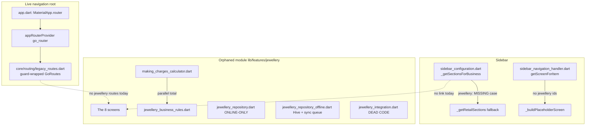
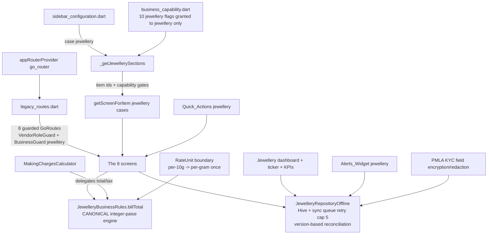
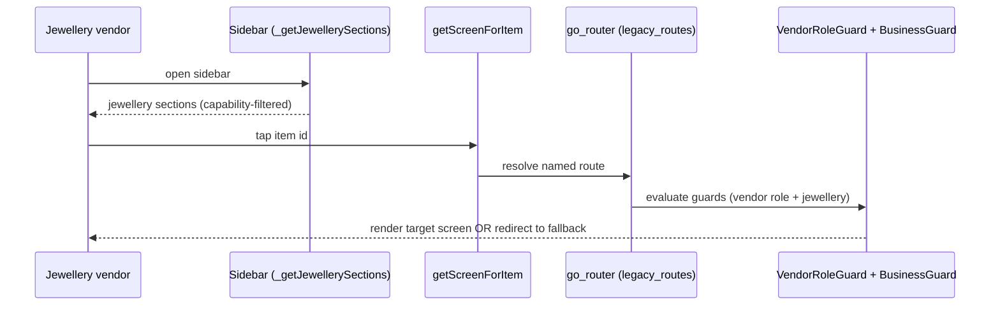
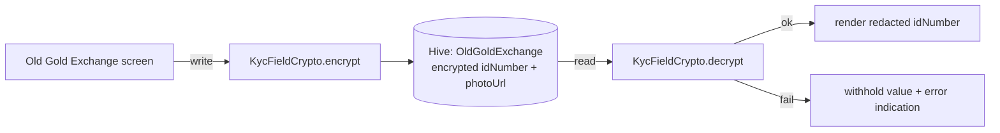

# Design Document — Jewellery Vertical Full Remediation

## Overview

The DukanX `jewellery` vertical (`BusinessType.jewellery`) is a complete feature module — 8 screens, 5 model groups, 6 repositories, a making-charges calculator, a purity-aware business-rules utility — that is almost entirely unreachable in the running app, and which carries a cluster of money-correctness, capability, offline, validation, and polish defects documented in `audit-reports/business-types/audit-jewellery.md`.

This design specifies how the phased remediation defined in `requirements.md` (Requirement 1 through Requirement 17, delivered across Phase 0 through Phase 8) is realized in code. It is organized to mirror the requirements: cross-cutting invariants become design-wide invariants; each phase maps to a design section with concrete components, interfaces, and data models; and the money-math surfaces are specified precisely enough to support property-based testing.

### Route surface decision (material deviation from literal requirement text)

Requirement 4.1 and the `App_Router` glossary entry describe the live route surface as the legacy `MaterialApp routes:` table in `lib/app/routes.dart` (`buildAppRoutes()`), reflecting the state captured by the audit. **The codebase has since migrated to go_router.** Verified facts:

- `lib/app/app.dart` renders `MaterialApp.router(routerConfig: ref.watch(appRouterProvider))` — go_router is the sole navigation root.
- The legacy `buildAppRoutes()` table is no longer wired into any `MaterialApp` (confirmed by `test/core/routing/*` and `phase0_routing_scaffold_smoke_test.dart`).
- The legacy table was migrated **verbatim** into `lib/core/routing/legacy_routes.dart` as guard-wrapped `GoRoute`s — each route lifting its `VendorRoleGuard` + nested `BusinessGuard(allowedTypes: [...])` wrapper character-for-character. Clinic, Book Store, Petrol Pump, and Mobile/Computer Shop vertical-family routes already live there, and `BusinessType.jewellery` already appears in the shared billing/invoice routes' `allowedTypes` lists.

Per a recorded decision during design review, this design **maps the intent of Requirements 4 and 5 onto the live go_router surface**: the 8 jewellery screens are registered as guard-wrapped `GoRoute`s in `lib/core/routing/legacy_routes.dart` (the successor to the "CUSTOM BUSINESS MODULES" section), preserving the requirement's intent of a *single documented, guarded route surface* with `VendorRoleGuard` + `BusinessGuard(allowedTypes: [BusinessType.jewellery])`. Wiring routes into the dead `buildAppRoutes()` table would recreate the exact orphaning bug this remediation fixes. This deviation is recorded here and must be reflected back into the requirements glossary at the next requirements revision.

### Guiding principles

- **Evidence before change.** Phase 0 produces a read-only `Verification_Report` resolving every unverified audit item to CONFIRMED or FALSIFIED. No phase acts on an assumption.
- **Surgical, additive change.** Shared files (sidebar config, capability registry, navigation handler, route table, billing widgets, dashboard widgets) are touched only by adding a `jewellery` branch or a new gated item; no other business type's resolution path changes.
- **One canonical money path.** `JewelleryBusinessRules` becomes the single pricing engine, computing in integer paise; `MakingChargesCalculator` delegates to it.
- **Gate-driven progression.** Each phase ends with `PHASE N COMPLETE — AWAITING APPROVAL` and resumes only on `APPROVED`. Schema changes and deletions require their own explicit sign-off (Mini_Gate / deletion sign-off).

## Architecture

### Current-state component map



### Target-state component map (post-remediation)



### Phase-to-requirement map

| Phase | Requirements | Theme | Primary artifacts |
|-------|--------------|-------|-------------------|
| 0 | 2 | Read-only verification | `Verification_Report` (Markdown only) |
| 1 | 3, 4, 5 | Reachability: sidebar, routes, nav handler, dead-code | `sidebar_configuration.dart`, `legacy_routes.dart`, `sidebar_navigation_handler.dart` |
| 2 | 6, 7, 8 | Money correctness: rate unit, engine unification, GST/wastage/stone | `jewellery_business_rules.dart`, `making_charges_calculator.dart`, rate-unit boundary |
| 3 | 9, 10, 11 | Capability + security + PMLA KYC | `business_capability.dart`, `legacy_routes.dart`, KYC crypto |
| 4 | 12, 13 | Dashboard: quick actions, alerts, dedicated dashboard, ticker, billing edits | dashboard widgets, `bill_line_item_row.dart` |
| 5 | 14 | Offline-first parity + sync reconciliation | repositories, sync handler, Hive schema (Mini_Gate) |
| 6 | 15 | Validation + crash prevention | business rules, calculator, repos |
| 7 | 16 | Performance + backend + certificate model | list screens, `/jewellery/*` endpoints, certificate model/screen |
| 8 | 17 | Polish, accessibility, sign-off | mojibake fix, Semantics, deletion |

The cross-cutting constraints of Requirement 1 (integer paise, RID ids, tenant scoping, no `vendorId: 'SYSTEM'`, idempotent migrations, Mini_Gate, deletion sign-off, no-regression, STOP GATE protocol, blast-radius documentation) are not a phase — they are invariants enforced in every section below.

### Design-wide invariants (Requirement 1)

1. **Integer-paise money (1.1, 1.2).** Every money value in created/modified jewellery code is an `int` of paise. The canonical engine signatures move from `double`/`Decimal` to `int paise` inputs and outputs. Where an existing API returns `double` (e.g., `JewelleryBusinessRules.billTotal`), the remediation introduces an integer-paise variant and migrates callers; floating-point currency is not reintroduced.
2. **RID ids (1.3).** New entities use `{tenantId}-{timestamp_ms}-{uuid_v4_short}` produced by a shared `RidGenerator`. (Today the offline repo uses bare `Uuid().v4()`; the design replaces new-entity id generation on touched paths with RID.)
3. **Tenant scoping (1.4, 1.5).** Every query/write/sync resolves `tenantId` from `SessionManager` (`ownerId`). The literal `vendorId: 'SYSTEM'` is never used; an unresolved tenant aborts the operation with a tenant-context error rather than falling back.
4. **Idempotent migrations (1.8).** Any data migration is keyed by a guard flag so repeated runs modify zero records after the first.
5. **Mini_Gate (1.6) & deletion sign-off (1.7).** Hive box / DynamoDB schema changes and any file/route/screen/data deletion halt for explicit recorded sign-off.
6. **No regression to other business types (1.9, 1.10, 1.12).** Shared files gain only a `jewellery` branch or a new gated item; the blast radius is documented in-file.
7. **STOP GATE (1.11).** Phase completion emits the literal gate text and waits for `APPROVED`.

## Components and Interfaces

### Phase 0 — Verification_Report (Requirement 2)

A single read-only Markdown artifact at `.kiro/specs/jewellery-vertical-remediation/phase0-verification-report.md`. No code is created, modified, or deleted (2.1). Structure:

- **Bill-total classification (2.2):** the live bill-total computation classified as `Rate/Gm × metalWeight` (correct) or `Rate/Gm × quantity` (incorrect), with file path + start/end line numbers from `bill_creation_screen_v2.dart` / the calculation engine.
- **Making-charges column (2.3):** whether an editable making-charges column exists in `bill_line_item_row.dart`, with evidence lines.
- **Endpoint reality (2.4):** each `/jewellery/*` endpoint (`products`, `gold-rate`, `old-gold-exchange`, `custom-orders`, `hallmark-inventory`, `gold-rate-alert`, `gold-scheme`, `making-charges`, `jewellery-repair`) classified as deployed-non-stub / deployed-stub / no-handler (404).
- **Un-audited repositories (2.5):** offline-vs-online behavior of `gold_scheme`, `jewellery_repair`, `gold_rate_alert`, `making_charges` repos, from a line read.
- **Handlers (2.6):** observed behavior of `jewellery_sync_handler.dart` and `jewellery_ws_handler.dart`.
- **Scan-bill (2.7):** whether a backing screen exists for `/purchase/scan-bill`.
- **Resolution table (2.8, 2.9):** every previously unverified audit item marked CONFIRMED or FALSIFIED with evidence, or flagged still-unverified with a stated reason.

The report is the authoritative input to Phases 1–8; later phases cite its findings (e.g., 7.4 references the bill-total finding; 13.4 references the making-charges column finding).

### Phase 1 — Reachability (Requirements 3, 4, 5)

**`_getJewellerySections()` in `sidebar_configuration.dart` (Requirement 3).** A new private function returning the jewellery section list, reached via an explicit `case BusinessType.jewellery:` added to `_getSectionsForBusiness` (mirroring the existing `decorationCatering` and `hardware` cases). It must cover exactly: Daily Rates, Billing, Inventory by weight & hallmark, Old Gold Exchange, Custom Orders, Repairs, Gold Schemes, Making-Charges Calculator (3.2). Each item carries a non-empty label and a navigation target (3.3). The `default: _getRetailSections()` branch and every other case stay byte-for-byte unchanged (3.4, 1.10).

Proposed sections and item ids (each id resolves in the navigation handler and/or routes):

| Section | Item id | Screen | Capability gate (Phase 3) |
|---------|---------|--------|---------------------------|
| Daily Rates | `jewellery_gold_rate` | `GoldRateManagementScreen` | `useGoldRate` |
| Daily Rates | `jewellery_gold_rate_alert` | `GoldRateAlertScreen` | `useGoldRateAlert` |
| Billing | `new_sale` | live billing (shared) | `useInvoiceCreate` |
| Inventory | `jewellery_hallmark` | `HallmarkInventoryScreen` | `useHallmark` |
| Inventory | `stock_summary` | weight-aware stock (Phase 4) | `useInventoryList` |
| Old Gold Exchange | `jewellery_old_gold_exchange` | `OldGoldExchangeScreen` | `useOldGoldExchange` |
| Custom Orders | `jewellery_custom_orders` | `CustomOrderManagementScreen` | `useCustomOrders` |
| Repairs | `jewellery_repair` | `JewelleryRepairScreen` | `useJewelleryRepair` |
| Gold Schemes | `jewellery_gold_scheme` | `GoldSchemeScreen` | `useGoldSchemes` |
| Making-Charges Calculator | `jewellery_making_charges` | `MakingChargesCalculatorScreen` | `useMakingCharges` |

**Route registration in `legacy_routes.dart` (Requirement 4, mapped to go_router).** Each of The_Eight_Screens is registered as a named `GoRoute` whose builder wraps the screen in `VendorRoleGuard` → `BusinessGuard(allowedTypes: const [BusinessType.jewellery], denialMessage: ...)` → screen, matching the existing clinic/bookStore pattern in the same file (4.1, 4.2). Resolution for a jewellery vendor with the vendor role yields the target screen (4.3); a non-jewellery type or non-vendor is blocked and redirected with no retained state (4.4). The two divergent legacy module surfaces (the 7-route `jewellery_routes.dart` module list and the `jewellery_integration.dart` list) are reconciled so the reachable set equals exactly The_Eight_Screens (4.5).

**`getScreenForItem` jewellery cases (Requirement 5).** Each jewellery item id from the table maps to its single screen widget; none fall through to `_buildPlaceholderScreen('Unknown Screen')` (5.1, 5.2). `/purchase/scan-bill` resolves to a backing screen rather than a dead end (5.3) — the Phase 0 finding (2.7) determines whether an existing screen is reused or a thin backing screen is added.

**Dead-code disposition (5.4).** `jewellery_integration.dart` is confirmed dead in Phase 0; it is deleted **only** after explicit recorded sign-off and left unchanged until then. The actual deletion is performed in Phase 8 (17.4) under that sign-off.



### Phase 2 — Money correctness (Requirements 6, 7, 8)

**Rate-unit boundary (Requirement 6).** A single documented conversion site — a `RateUnit` helper (e.g., `JewelleryRateUnit.perGramFromPer10g(int per10gPaisa)`) — performs `pricePerGramPaisa = per10gPaisa ~/ 10` exactly once (6.1, 6.2). Because `GoldRateCard` stores per-10g paise (`gold24KPer10gPaisa`, etc.) and `JewelleryBusinessRules` consumes per-gram, this helper is the *only* place the conversion happens; callers consume its output and never re-divide or multiply that value. The rounding rule for non-divisible-by-10 values is integer truncation via `~/` (floor for non-negative paise), documented at the boundary (6.4). Bidirectional unit tests assert consistency across a representative rate set (6.3).

**Pricing-engine unification (Requirement 7).** `JewelleryBusinessRules.billTotal` is the single canonical engine (7.1). It is reworked to an integer-paise signature:

```
int billTotalPaisa({
  required int grossWeightMilligrams,   // weight carried as integer milligrams to keep money integral
  required GoldPurity purity,
  required int ratePerGram24KPaisa,
  int makingChargesPaisa = 0,
  int taxPaisa = 0,
  int discountPaisa = 0,
})
```

Metal value = `grossWeightMilligrams × finenessNumerator × ratePerGram24KPaisa / (1000 × finenessDenominator)` computed with integer arithmetic and a documented half-up rounding to paise, avoiding floating-point. `MakingChargesCalculator.calculateTotalPrice` is refactored to delegate metal-value, tax, and total computation to `billTotalPaisa` rather than computing a parallel total (7.2); its making-charges *breakdown* (per-gram/percentage/tiered/etc.) is retained as the making-charges input to the canonical engine. Given identical line items, weights, purity, rates, making charges, and tax rate, both engines produce grand totals equal to the nearest paise (7.3). The live billing total multiplies Rate/Gm by `metalWeight`, never by `quantity` (7.4) — the Phase 0 finding (2.2) confirms the current behavior and scopes the fix. A calculation-engine test asserts `total = weight×rate + making + tax − discount` in integer paise (7.5).

**GST, wastage, stone (Requirement 8).**
- **GST (8.1):** GST is computed as metal-value GST (3% on metal value) plus the making-charges GST treatment (the documented Indian practice — 5% on making charges in the cited interpretation), with the cited treatment recorded in a code comment. GST is no longer a flat single rate applied to the entire subtotal.
- **Wastage (8.2):** wastage is applied to the sale total exactly once. The design removes the double-count path (`making_charges_calculator.dart` currently can add wastage both as metal-value wastage in `calculateTotalPrice` and inside the per-gram making path when `applyOnWastage`); a single wastage application point is chosen and the other suppressed.
- **Stone charge (8.3):** a real `stoneCount` field replaces the "assume 1 stone per gram" placeholder in `_calculateStoneCharge`.
- **Integer paise (8.4):** every intermediate and final value is integer paise.

A worked example (e.g., 10g 22K at a stated per-10g rate, given making charges, wastage %, stone count, GST split, discount) is included in the Phase 2 STOP GATE write-up showing each step in paise and the final equality between the two engines.

### Phase 3 — Capability, security, PMLA KYC (Requirements 9, 10, 11)

**Capability flags (Requirement 9).** Ten capabilities are added to the registry. Eight are **new enum values** appended to `BusinessCapability` under the `// Jewellery` group: `useGoldRate`, `useGoldRateAlert`, `useMakingCharges`, `useHallmark`, `useOldGoldExchange`, `useCustomOrders`, `useGoldSchemes`, `useJewelleryRepair`. Two — `useProductUnit`, `useProductTax` — already exist as enum values (granted to other types) and are added to the jewellery grant only (9.1). All ten are granted in `businessCapabilityRegistry['jewellery']` (9.2) and to **no other** business type (9.5). Each jewellery sidebar item that surfaces a gated domain feature carries the matching capability (9.3) so `FeatureResolver.canAccess` permits granted items (9.4) and filters ungranted ones via the existing `sidebarSectionsProvider` filter.

**Capability-bypass reconciliation (Requirement 10).** The retail-origin items that leak into a jewellery view today (`return_inwards`, `proforma_bids`, `dispatch_notes`, `booking_orders`, `low_stock`) are resolved per item: because `_getJewellerySections()` *replaces* the retail section list for jewellery, these items are absent unless explicitly re-added. The reconciliation step produces a per-item report (gated or removed) for all five (10.1, 10.2); any item neither gated by a granted capability nor removed marks the reconciliation incomplete and surfaces the unresolved item (10.4). When jewellery routes are registered/modified, each is re-verified to carry both `VendorRoleGuard` and `BusinessGuard(allowedTypes: [BusinessType.jewellery])` (10.3).

**PMLA KYC PII (Requirement 11).** `OldGoldExchange.customerIdNumber` and `customerPhotoUrl` are protected at rest via field-level encryption/redaction through a `KycFieldCrypto` boundary applied in the offline repository's persist/read path (11.1). Records remain tenant-scoped (11.2). Display renders `customerIdNumber` in redacted form (e.g., last-4 only) (11.3). If decryption/de-redaction fails, the field value is withheld and an error indication shown rather than corrupted/partial data (11.4).



### Phase 4 — Dashboard (Requirements 12, 13)

**Quick actions (12.1–12.3).** The jewellery branch of `business_quick_actions.dart` wires "Custom Order" → `CustomOrderManagementScreen` and "Gold Rate" → `GoldRateManagementScreen`; no `onTap: () {}` no-op remains.

**Live alerts (12.4–12.7).** The jewellery branch of `business_alerts_widget.dart` sources counts from `JewelleryRepositoryOffline` query results — pending custom orders and current gold-rate state — instead of the hardcoded `'3'` / `'!'`. A resolved count of zero renders as `0` (12.6); a repository failure renders an error indication for that alert, never a stale/default number (12.7); no literal numeric count remains (12.5).

**Dedicated dashboard + ticker + billing edits (Requirement 13).** A dedicated jewellery dashboard renders KPI cards: gold rate by purity (24K/22K/18K), metal stock by weight, pending custom orders, scheme collections due, repair jobs in progress (13.1); a gold-rate ticker widget sourced from live `GoldRateCard` data (13.2); every value traces to a repository/provider query (no hardcoded value) (13.6). In `bill_line_item_row.dart`, purity becomes an editable `Purity_Enum` dropdown rather than a read-only text cell (13.3) and an editable making-charges column is presented (13.4, referencing Phase 0 finding 2.3). `stock_summary` / `item_stock` present stock by metal weight, not quantity only (13.5).

### Phase 5 — Offline-first parity & sync reconciliation (Requirement 14)

**Migrate custom orders (14.1).** `custom_order_management_screen.dart` is moved off the online-only `JewelleryRepository` onto the offline-first `JewelleryRepositoryOffline` path (Hive + sync queue), making custom orders work offline like the rest of the module.

**Four repos to parity (14.2).** `gold_scheme`, `jewellery_repair`, `gold_rate_alert`, and `making_charges` repositories are brought to offline-first parity (Hive box + sync queue), matching the offline repo's pattern.

**Optimistic write + queue (14.3).** Every create/update/delete persists to the local Hive box immediately and enqueues a sync-queue entry, online or offline.

**Version-based reconciliation (14.4).** Sync conflict resolution compares record `version` fields and applies version-based reconciliation rather than last-write-wins. (Today `_syncProduct` posts and marks synced unconditionally — last-write-wins; the design adds a server-version compare before overwrite.)

**Retry cap + failed-sync indication (14.5).** A queued entry that fails to transmit is retained, the local record preserved unchanged, retried up to 5 times; after the final failed attempt the entry is **marked with a failed-sync indication observable to the vendor** without discarding the local change. This corrects the current behavior, where the entry is *deleted* from the queue once `retryCount >= 5` (silent data-loss of the sync intent).

**Hive schema changes (14.6, Mini_Gate).** Any Hive schema change in Phase 5 is additive and idempotent and is applied only after a Mini_Gate. New fields (e.g., `syncFailed`, `serverVersion`) are added with safe defaults so existing boxes deserialize unchanged.

### Phase 6 — Validation & crash prevention (Requirement 15)

- **NaN/upper-bound guard (15.1):** `billTotalPaisa`/`exchangeCreditPaisa` reject NaN/out-of-range inputs (the integer-paise rework eliminates NaN at the boundary; an explicit upper bound caps absurd weights/rates).
- **Calculator validation (15.2):** negative weight, negative rate, or percentage > 100 entered into `MakingChargesCalculator` is rejected; the previous valid value is retained and an error indication shown.
- **Tiered guard (15.3):** empty `tieredRates` with an unmatched weight returns a graceful tiered-error result instead of throwing `Exception('No tier found…')`.
- **Duplicate HUID (15.4):** `registerHallmark` detects an existing HUID for the tenant and rejects rather than silently overwriting (today HUID is the Hive key, so a duplicate overwrites).
- **Gold-rate spike bounds (15.5):** `setGoldRate` applies day-over-day spike and sanity bounds and rejects out-of-bounds rates.
- **Purity enum end-to-end (15.6):** the free-text purity `String` is replaced by `Purity_Enum` across billing and storage.

### Phase 7 — Performance & backend (Requirement 16)

- **Pagination (16.1, 16.2):** `getProducts`/`getOrders`/`getExchanges`/`getHallmarkEntries` honor `limit`/`offset` (the offline repo already supports `paginate(...)`); each list screen is audited to pass explicit `limit`/`offset` rather than loading the whole box.
- **Endpoint build/ticket (16.3, 16.4):** each `/jewellery/*` endpoint flagged as a backend gap in Phase 0 is built or ticketed; a sync against a missing endpoint surfaces a visible failure indication rather than silently leaving records unsynced.
- **Certificate tracking (16.5):** a certificate/certification tracking model and screen are added for jewellery items.
- **Live feed backlog (16.6):** live gold-rate market-feed integration is recorded as a non-blocking backlog item, not implemented here.

### Phase 8 — Polish, accessibility, sign-off (Requirement 17)

- **Mojibake (17.1):** the corrupted glyphs (`×` → `×`, `₹` → `₹`) in `making_charges_calculator.dart` and `jewellery_business_rules.dart` are corrected and both files re-saved as UTF-8.
- **Semantics (17.2):** jewellery dashboard controls in `business_quick_actions.dart`/`business_alerts_widget.dart` are wrapped in `Semantics` with non-empty labels.
- **Accessible alert label (17.3):** the glyph-only `'!'` badge is replaced with an accessible text label.
- **Deletion (17.4, 17.7):** `jewellery_integration.dart` is deleted under the Requirement 5.4 sign-off; any other Phase 8 deletion requires its own recorded sign-off.
- **Responsive (17.5):** each of The_Eight_Screens renders primary content without overflow on phone/tablet/desktop breakpoints.
- **Regression (17.6):** the full test suite runs and confirms no other vertical regresses.

## Data Models

### Existing Hive boxes (offline repository)

| Box name | Value type | Key | Notes |
|----------|-----------|-----|-------|
| `jewellery_products` | `JewelleryProduct` | product id (RID, post-remediation) | weights in grams; `pricePerGramPaisa`, `totalMrpPaisa` |
| `gold_rates` | `GoldRateCard` | `{tenantId}_{date}` | **per-10g paise** fields |
| `gold_exchanges` | `OldGoldExchange` | id | PMLA KYC fields (to encrypt) |
| `jewellery_orders` | `JewelleryOrder` | id | `statusHistory`, advance paise |
| `hallmark_register` | `HallmarkRegisterEntry` | HUID | duplicate-key risk (15.4) |
| `jewellery_sync_queue` | `Map` | uuid | `retryCount`, `lastError` |

### Additive model changes (each gated by Mini_Gate — Requirement 14.6, 1.6)

- **`GoldRateCard`** — unchanged storage (per-10g paise); conversion to per-gram happens only at the `RateUnit` boundary, not in the model.
- **Stone count (8.3):** add `stoneCount` (int) to the making-charges request/product path; `_calculateStoneCharge` consumes real count.
- **Purity enum (13.3, 15.6):** the billing line item and stored product use `Purity_Enum` (`GoldPurity` / `PurityStandard`) instead of free-text `String`.
- **Sync/version fields (14.4, 14.5):** add `serverVersion` (int) and `syncFailed` (bool, default false) with safe defaults so existing boxes deserialize without migration breakage; the sync-queue entry gains a `failedPermanently` flag instead of being deleted at retry cap.
- **KYC encryption (11.1):** `customerIdNumber` / `customerPhotoUrl` stored as ciphertext via `KycFieldCrypto`; a redaction view model exposes only last-4 of the id number.
- **Certificate model (16.5):** new `JewelleryCertificate` (id RID, tenantId, productId/HUID link, certificate type, issuer, issue/expiry dates, document url, integer-paise valuation if any) in its own additive Hive box `jewellery_certificates`.

### Backend (Node.js + DynamoDB) attributes

`/jewellery/*` endpoints persist tenant-scoped single-table items keyed by `tenantId`. Money attributes are stored as integer paise. Endpoints flagged as gaps in Phase 0 are built/ticketed (16.3). Each new Lambda follows the existing request-context wrapper pattern used across DukanX. No production schema change is applied without a Mini_Gate.

### RID identifier

```
{tenantId}-{timestamp_ms}-{uuid_v4_short}
```
A shared `RidGenerator.next(tenantId)` produces ids for all new entities on touched paths (1.3), replacing bare `Uuid().v4()` for those paths.

## Correctness Properties

*A property is a characteristic or behavior that should hold true across all valid executions of a system — essentially, a formal statement about what the system should do. Properties serve as the bridge between human-readable specifications and machine-verifiable correctness guarantees.*

These properties are derived from the acceptance-criteria prework and consolidated to remove redundancy (e.g., the integer-paise invariants of 1.1/1.2 and 8.4 are one property; the preservation criteria 1.9/1.10/3.4 are one property; the route-guard criteria 4.2/10.3 are one property). Reachability/UI-composition, documentation, and process-governance criteria (Requirement 2; 3.1–3.2; 4.1/4.5; 5.3/5.4; 9.1/9.2; 12.1–12.3/12.5; 13.1/13.3/13.4/13.5/13.6; 14.1/14.2; 16.2/16.3/16.5/16.6; 17.2–17.7) are validated by example-based, integration, or governance checks described in the Testing Strategy, not by properties.

### Property 1: Money path is integer paise

*For any* valid combination of weights, purity, rates, making charges, wastage, stone count, tax rates, and discount supplied to the canonical pricing path, every intermediate and final monetary result is an integer number of paise equal to the integer-paise reference computation, with no floating-point currency value produced.

**Validates: Requirements 1.1, 1.2, 8.4**

### Property 2: RID identifiers are well-formed

*For any* tenant id, an identifier produced for a new entity matches the pattern `{tenantId}-{timestamp_ms}-{uuid_v4_short}` and embeds that exact tenant id as its prefix.

**Validates: Requirements 1.3**

### Property 3: Tenant isolation

*For any* two distinct tenant ids and any jewellery records (products, gold rates, exchanges, orders, hallmark entries) written under the first, a query, repository read, or sync performed under the second never returns those records, and no operation uses the literal identity `vendorId: 'SYSTEM'`.

**Validates: Requirements 1.4, 1.5, 11.2**

### Property 4: Migrations are idempotent

*For any* starting Hive box / data state, applying a remediation migration twice produces the same persisted result as applying it once, and the second application modifies zero records.

**Validates: Requirements 1.8, 14.6**

### Property 5: Other business types are unchanged

*For any* `BusinessType` other than `jewellery`, the sidebar sections, granted capability set, and route-resolution decisions after the remediation are identical to those before the `case BusinessType.jewellery` addition and the registry/route changes.

**Validates: Requirements 1.9, 1.10, 3.4**

### Property 6: Every jewellery sidebar id resolves to its screen

*For any* jewellery sidebar item id introduced by the reachability work, `getScreenForItem` returns the single jewellery screen widget mapped to that id and never returns the `_buildPlaceholderScreen('Unknown Screen')` fallthrough, and the item's label is non-empty.

**Validates: Requirements 3.3, 5.1, 5.2**

### Property 7: Jewellery routes carry both guards for jewellery only

*For any* registered jewellery route, the route wraps its screen in both `VendorRoleGuard` and `BusinessGuard` with `allowedTypes` exactly equal to `[BusinessType.jewellery]`.

**Validates: Requirements 4.2, 10.3**

### Property 8: Route access is granted iff authorized

*For any* jewellery route and any principal, the route resolves to its target screen when the principal's business type is `jewellery` and the principal holds the vendor role, and otherwise blocks access and redirects to a fallback while retaining no jewellery screen state.

**Validates: Requirements 4.3, 4.4**

### Property 9: Per-10g to per-gram conversion is a single floor division

*For any* per-10g paise value, the rate-unit boundary yields `pricePerGramPaisa = per10gPaisa ~/ 10` (integer floor), the reconstructed per-10g value `pricePerGramPaisa × 10` differs from the original by less than 10 paise, and a bill computed through the boundary never exhibits a 10× scale error relative to the per-gram reference.

**Validates: Requirements 6.1, 6.2, 6.3, 6.4**

### Property 10: The two pricing engines agree

*For any* set of line items with weights, purity, rates, making charges, and tax rate, the grand total produced by `MakingChargesCalculator` equals the grand total produced by `JewelleryBusinessRules.billTotal` to the nearest paise.

**Validates: Requirements 7.2, 7.3**

### Property 11: Canonical engine equals the reference bill formula

*For any* valid inputs, `JewelleryBusinessRules.billTotal` equals `(metalWeight × ratePerGram) + makingCharges + tax − discount` computed in integer paise.

**Validates: Requirements 7.1, 7.5**

### Property 12: Bill total scales with weight, not quantity

*For any* jewellery line item, the metal-value contribution to the bill total scales with `metalWeight` and is invariant under a change to `quantity` at fixed weight.

**Validates: Requirements 7.4**

### Property 13: GST is split between metal value and making charges

*For any* metal value and making-charges amount, the computed GST equals `metalValue × metalGstRate + makingCharges × makingGstRate` in integer paise, and is not a single flat rate applied to the whole subtotal (except in the degenerate case where the two rates coincide).

**Validates: Requirements 8.1**

### Property 14: Wastage is counted exactly once

*For any* sale with a wastage percentage, the wastage contributes to the grand total exactly once; the total equals `metalValue + wastage + makingCharges + stoneCharge + tax − discount` with no second wastage term added through the making-charges path.

**Validates: Requirements 8.2**

### Property 15: Stone charge is linear in stone count

*For any* stone count and per-stone charge, the computed stone charge equals `stoneCount × perStoneChargePaisa`, independent of metal weight (no "one stone per gram" assumption).

**Validates: Requirements 8.3**

### Property 16: Jewellery capabilities are granted to jewellery only

*For any* of the ten jewellery capabilities, `FeatureResolver.canAccess('jewellery', capability)` is true; and *for any* business type other than `jewellery` and any of the eight new jewellery-domain capabilities, `canAccess(type, capability)` is false.

**Validates: Requirements 9.4, 9.5**

### Property 17: Gated jewellery items carry their capability

*For any* jewellery sidebar item that surfaces a gated domain feature, the item carries the corresponding `BusinessCapability` from the jewellery set.

**Validates: Requirements 9.3**

### Property 18: Retail-origin items are gated or removed

*For any* of the five retail-origin items (`return_inwards`, `proforma_bids`, `dispatch_notes`, `booking_orders`, `low_stock`) surfaced to a jewellery vendor, the item is either absent from the jewellery sections or gated by a granted capability; an item that is neither marks the reconciliation incomplete and is surfaced as unresolved.

**Validates: Requirements 10.1, 10.4**

### Property 19: KYC fields round-trip under encryption and are not stored in plaintext

*For any* PMLA KYC value (`customerIdNumber`, `customerPhotoUrl`), the persisted representation is not the plaintext, and `decrypt(encrypt(value))` equals the original value.

**Validates: Requirements 11.1**

### Property 20: Displayed KYC id numbers are redacted

*For any* `customerIdNumber`, the rendered display masks all but the documented suffix (e.g., last four characters) and never contains the full plaintext id number.

**Validates: Requirements 11.3**

### Property 21: Read/sync failures surface visibly and never fabricate data

*For any* failed KYC decryption, failed alert-count fetch, or sync targeting a missing/erroring endpoint, the system surfaces an error indication and withholds the value, and never displays corrupted/partial data, a stale value, or a default numeric count.

**Validates: Requirements 11.4, 12.7, 16.4**

### Property 22: Alert counts are repository-derived

*For any* repository state, each jewellery alert count displayed by `Alerts_Widget` equals the count derived from `JewelleryRepositoryOffline` query results (pending custom orders and gold-rate state), and a resolved count of zero displays as `0`.

**Validates: Requirements 12.4, 12.6**

### Property 23: Offline writes are optimistic and enqueued

*For any* create, update, or delete of a jewellery record (online or offline), the change is persisted to the local Hive box immediately and a corresponding sync-queue entry is enqueued.

**Validates: Requirements 14.3**

### Property 24: Sync conflicts resolve by version

*For any* pair of local and server record versions, sync reconciliation retains the higher-version record (version-based reconciliation) rather than applying last-write-wins.

**Validates: Requirements 14.4**

### Property 25: Failed sync entries are retried then marked, never discarded

*For any* queued jewellery sync entry that fails to transmit, the entry is retained and the local record preserved unchanged across up to five retry attempts; after the fifth failed attempt the entry is marked with a failed-sync indication observable to the vendor and is not discarded.

**Validates: Requirements 14.5**

### Property 26: Pricing guards reject invalid inputs

*For any* out-of-range or non-numeric input to `billTotal`/`exchangeCredit`, the engine returns a guarded result within the defined upper bound rather than an invalid total; and *for any* negative weight, negative rate, or percentage greater than 100 entered into `MakingChargesCalculator`, the input is rejected, the previous valid value retained, and an error indication produced.

**Validates: Requirements 15.1, 15.2**

### Property 27: Tiered calculation degrades gracefully

*For any* weight that matches no tier when `tieredRates` is empty, the calculator returns a graceful tiered-error result rather than throwing an uncaught exception.

**Validates: Requirements 15.3**

### Property 28: Duplicate HUID is rejected

*For any* tenant and any HUID already registered for that tenant, a second `registerHallmark` with the same HUID is rejected and the original entry is preserved unchanged.

**Validates: Requirements 15.4**

### Property 29: Gold rate bounds are enforced

*For any* proposed gold rate, `setGoldRate` accepts it if and only if it is within the defined day-over-day spike and sanity bounds.

**Validates: Requirements 15.5**

### Property 30: Purity round-trips as an enum

*For any* purity value carried through billing and storage, the stored-and-read value is a valid `Purity_Enum` member equal to the original (no free-text purity string).

**Validates: Requirements 15.6**

### Property 31: Pagination returns a bounded window

*For any* record list and any `(limit, offset)`, the repository returns at most `limit` records starting at `offset`, and the returned window equals the corresponding slice of the fully-ordered list.

**Validates: Requirements 16.1**

### Property 32: Calculator output is mojibake-free UTF-8

*For any* making-charges calculation, the breakdown/output strings contain the correct `×` and `₹` characters and never contain the mojibake sequences `×` or `₹`.

**Validates: Requirements 17.1**

## Error Handling

Error handling follows DukanX conventions (observable response or propagation; never a silent swallow) and the requirements' explicit error behaviors:

- **Tenant context unavailable (1.4, 1.5).** If `tenantId` cannot be resolved from `SessionManager`, the operation aborts, accesses no data, and returns a tenant-context-unavailable error. No `'SYSTEM'` fallback.
- **Route denial (4.4).** Guards block and redirect to a fallback; jewellery screen state is not retained.
- **Pricing input validation (15.1, 15.2).** Out-of-range/NaN inputs to the canonical engine yield a guarded (clamped or rejected) result; calculator rejects negative weight/rate and percentage > 100, retains the previous valid value, and shows an error indication.
- **Tiered config (15.3).** Empty `tieredRates` with an unmatched weight returns a graceful tiered-error result; the bare `throw Exception('No tier found…')` is removed.
- **Duplicate HUID (15.4).** `registerHallmark` returns/throws a typed duplicate-HUID rejection instead of silently overwriting the Hive key.
- **Gold-rate bounds (15.5).** `setGoldRate` rejects rates outside day-over-day spike / sanity bounds with an error the caller surfaces.
- **KYC decryption failure (11.4).** Withhold the field value and surface an error indication; never display corrupted/partial plaintext.
- **Sync failures (14.5, 16.4).** Failed entries are retained, retried up to 5 times, then marked with a failed-sync indication; the local record is never discarded. A sync against a missing endpoint surfaces a visible failure rather than leaving records silently unsynced.
- **Alert-count fetch failure (12.7).** The affected alert shows an error indication; no stale or default number is displayed.
- **Malformed/partial reads.** Repository reads skip malformed records where feasible, preserve valid records, and surface a non-blocking indication rather than crashing the screen.

## Testing Strategy

A property-based testing library is used for the language under test (Dart: `package:test` with a property-based helper such as `glados`/`fast_check`-style generators; for any backend Node.js logic, `fast-check`). Properties are **not** implemented from scratch.

### Property-based tests

- Each correctness property above is implemented by a **single** property-based test running a **minimum of 100 iterations**.
- Each test is tagged with a comment referencing its design property in the format: **Feature: jewellery-vertical-remediation, Property {number}: {property_text}**.
- Money generators produce integer paise (weights as integer milligrams) so floating-point never enters the assertions; purity generators draw from `Purity_Enum`; rate generators include non-multiples of 10 to exercise the floor-division rounding edge (Property 9); sync generators include forced-failure transports to exercise the retry cap (Property 25); tenant generators produce distinct tenant pairs (Property 3).
- **Highest-value money properties** to land first: Property 9 (rate-unit conversion / no 10× error), Property 10 (two-engine equivalence), Property 11 (canonical reference formula), Property 12 (weight not quantity), Property 13 (split GST), Property 14 (wastage once), Property 15 (stone count). These directly remediate the audit's money-correctness findings (§8.4, §13.1–13.5).

### Bidirectional rate-conversion unit tests (Requirement 6.3)

Explicit example-based tests over a representative rate set (e.g., 24K/22K/18K per-10g values, including non-multiples of 10) assert `perGram = per10g ~/ 10` and that reconstruction error stays below 10 paise — complementing Property 9.

### Pricing-engine equivalence test (Requirement 7.3, 7.5)

A dedicated calculation-engine test asserts, on concrete worked examples (including the Phase 2 STOP GATE example), that `MakingChargesCalculator` and `JewelleryBusinessRules.billTotal` agree to the paise and that the canonical engine equals the integer reference formula `weight×rate + making + tax − discount`.

### Validation test suite (Requirement 15)

Example + property tests for: negative/over-range calculator inputs, empty tiered config, duplicate HUID, gold-rate spike/sanity bounds, NaN/upper-bound guards on `billTotal`/`exchangeCredit`, and purity enum round-trip.

### Example-based unit tests (non-property criteria)

- **Reachability (3.1, 3.2, 4.1, 4.5, 5.3):** assert `_getSectionsForBusiness(jewellery)` returns the jewellery sections (not retail); the section set equals the named surfaces; all 8 screens register as routes; the reachable set equals The_Eight_Screens; `/purchase/scan-bill` resolves to a backing screen.
- **Capabilities (9.1, 9.2):** assert the ten capabilities are present in the jewellery grant.
- **Dashboard (12.1–12.3, 13.1, 13.3, 13.4, 13.5, 13.6):** widget tests for quick-action navigation, KPI card presence, editable purity dropdown, editable making-charges column, weight-based stock, and absence of hardcoded values.
- **Offline parity (14.1, 14.2):** custom orders create/list offline; each of the four repos exposes Hive + sync queue.
- **Accessibility (17.2, 17.3):** `Semantics` labels present on dashboard controls; the `'!'` badge replaced by an accessible text label.
- **Responsive (17.5):** each of The_Eight_Screens renders primary content without overflow at phone/tablet/desktop breakpoints.

### Integration & smoke tests (not PBT)

- **Backend endpoints (16.3):** 1–3 integration checks per built `/jewellery/*` endpoint; mocked at the Flutter layer, exercised end-to-end at the backend layer.
- **Phase 0 (Requirement 2):** verify the Verification_Report exists and that zero non-report files changed during Phase 0.
- **Governance (1.6, 1.7, 1.11, 5.4, 14.6, 16.6, 17.4, 17.6, 17.7):** Mini_Gate / deletion sign-off / STOP GATE adherence and the full-suite regression run are process checks, recorded at each phase gate.

### Regression suite (Requirement 17.6)

The full existing test suite (including `test/core/routing/*` preservation tests and other-vertical sidebar/capability tests) runs at the Phase 8 gate to confirm no other business vertical regresses. Property 5 (other-types preservation) provides automated, input-varying coverage of the no-regression invariant for sidebar/capability/route resolution.
