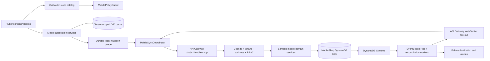
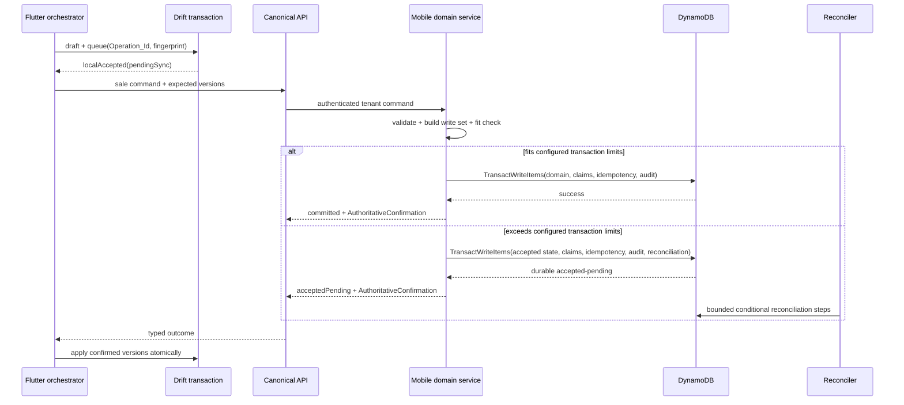

# Design Document: Mobile Shop Remediation

## Overview

This design remediates only `BusinessType.mobileShop` while preserving every non-mobileShop path. It reflects the approved requirements and current-source re-verification: `Dukan_x/my-backend` is the sole **Canonical_Backend**, and AWS DynamoDB is the sole **Canonical_Datastore** for authoritative MobileShop_Domain data. Flutter remains offline-first, but Drift is only a tenant-scoped local cache, draft store, mutation queue, and projection; it never establishes authoritative success.

The current Flutter application already has regression-lock targets: one `MaterialApp.router`/GoRouter composition, a dedicated mobileShop sidebar, non-null IMEI validation injection, second-hand intake, Luhn and month-end warranty helpers, live-data candidates, and widened warranty/history guards. The remaining system gap is end-to-end authority: mobile sales, IMEI lifecycle changes, idempotency, reconciliation, synchronization, and audit evidence need one tenant-bound DynamoDB contract with explicit access patterns and authoritative-confirmation semantics.

The design keeps the existing Serverless Framework, Lambda, API Gateway, Cognito, S3, CloudWatch, and deployment workflows in `Dukan_x/my-backend`. It adds the DynamoDB resources and mobile module there; no other backend root may own MobileShop_Domain data.

### Goals

1. Make invoice, invoice-line/IMEI association, lifecycle change, uniqueness, idempotency, and audit persistence one atomic DynamoDB operation when it fits configured transaction limits.
2. Use durable accepted-state and Reconciliation_Record items when an aggregate or external side effect cannot fit one transaction.
3. Guarantee tenant-bound primary and secondary access paths, bounded Query-only retrieval, opaque continuation tokens, and non-disclosing failures.
4. Preserve deterministic offline mutation, replay, conflict, and real-time convergence without treating Drift as authoritative.
5. Model every handset as a tenant-scoped, versioned IMEI unit with explicit lifecycle transitions and immutable history.
6. Keep shared behavior unchanged for every Non_MobileShop_Tenant through preservation tests and AF-01–AF-53 traceability.

### Non-goals

- Replacing GoRouter, Drift, SessionManager, the generic billing UI, or the established AWS deployment path.
- Giving Flutter direct DynamoDB credentials or making Drift, exports, projections, or another backend authoritative.
- Selecting finance, recharge, OCR, device-policy, or e-Way providers; provider-neutral ports remain feature-gated.
- Creating implementation tasks or changing application code during this design phase.

### Research Findings That Shape the Design

| Finding | Evidence | Design consequence |
|---|---|---|
| DynamoDB transactions are atomic but bounded | AWS documents up to 100 distinct items and 4 MB per transaction: [transaction behavior](https://docs.aws.amazon.com/amazondynamodb/latest/developerguide/transaction-apis.html) | Preflight transaction-fit; use `TransactWriteItems` only within configured headroom, otherwise persist accepted state plus reconciliation |
| Query pagination is key-based and bounded | DynamoDB Query pages are at most 1 MB and use `LastEvaluatedKey`: [pagination](https://docs.aws.amazon.com/amazondynamodb/latest/developerguide/Query.Pagination.html) | Every list uses a key condition, configured `Limit`, and a signed opaque token wrapping the exclusive start key |
| Streams integrate with event routing | EventBridge Pipes can consume DynamoDB Streams and route filtered events: [integration](https://docs.aws.amazon.com/amazondynamodb/latest/developerguide/eventbridge-for-dynamodb.html) | Streams feed durable reconciliation and tenant events; API Gateway WebSocket delivery is an optimization, while pull remains authoritative |
| PITR supplies continuous recovery points | AWS documents managed point-in-time recovery: [PITR](https://docs.aws.amazon.com/amazondynamodb/latest/developerguide/Point-in-time-recovery.html) | Enable PITR, on-demand backups before destructive model changes, encryption, and tested restore procedures |
| Throttling includes resource/reason detail | AWS documents table/index capacity metrics and throttling reasons: [throttling diagnosis](https://docs.aws.amazon.com/amazondynamodb/latest/developerguide/TroubleshootingThrottling) | Request consumed-capacity metadata, classify throttling, emit CloudWatch fields/metrics, and preserve idempotent pending state after retry exhaustion |
| Repository AWS architecture is established but mobile persistence is absent | `Dukan_x/my-backend/serverless.yml` uses Lambda, HTTP API, Cognito, S3, SNS, and CloudWatch logging | Extend this deployment only; remove database credentials from the mobile path and add least-privilege DynamoDB/Streams/EventBridge/WebSocket resources |
| Flutter fixes are partly ahead of the original audit | Current router/sidebar/IMEI/service code differs from stale audit claims | Protect passing behavior with regression locks rather than speculative rewrites |
| PBT support exists in Flutter | The workspace uses `dartproptest`; backend tests use TypeScript conventions | Use generated tests for pure policies and LocalStack or DynamoDB Local for datastore semantics; do not property-test live AWS calls |

Content from linked AWS documentation is paraphrased for licensing compliance.
## Architecture

### Target Boundaries



Dependencies point inward. Presentation uses application interfaces; application services use policy/repository ports; Drift and API adapters are infrastructure. Only `Dukan_x/my-backend` invokes DynamoDB. Widgets do not construct tenant keys, Flutter receives no AWS datastore credentials, and WebSocket notifications never replace an authenticated bounded pull.

### Canonical Backend and Datastore Decision

`Dukan_x/my-backend` owns all MobileShop_Domain APIs, model-version adapters, DynamoDB key encoding, conditional expressions, transactions, reconciliation, streams, audit access, and telemetry. The deployment adds one stage-scoped MobileShop table with Streams, PITR, encryption, deletion protection in production, alarms, failure destinations, and separate migration/backfill identities. A separate connection table may support API Gateway WebSockets; it stores connection metadata only and is not MobileShop_Domain authority.

Ownership is explicit:

- **Canonical_Backend + DynamoDB:** accepted domain versions, tenant-scoped uniqueness claims, idempotency outcomes, immutable audit events, reconciliation state, change feed, and authoritative query results.
- **Flutter + Drift:** offline cache, drafts, pending mutations, conflict copies, event inbox, and synchronization checkpoints. Every row carries tenant, server version, local status, and confirmation metadata.
- **Streams/EventBridge/WebSocket:** asynchronous transport and projection triggers. Delivery is at-least-once; consumers deduplicate by event identity and version.
- **No ownership:** `backend/`, `local-backend/`, `sls/`, `functions/`, exports, reports, or deleted parallel mobile modules. Duplicate roots are inventoried, drained, proven unused, and removed.

Authoritative success requires `AuthoritativeConfirmation` produced only after the AWS SDK reports a successful DynamoDB transaction/write, or after the accepted state, idempotency item, immutable audit item, and Reconciliation_Record are durably written. A Lambda timeout, unknown response, WebSocket notification, or local Drift commit cannot be labeled committed/current/server-confirmed.

### Tenant Isolation and Key Encoding

A verified `TenantContext` is resolved once from Cognito/membership and contains `tenantId`, `businessId`, `subjectId`, canonical `businessType`, permissions, and correlation ID. Client-supplied ownership never overrides it. Mobile handlers validate authentication, `mobile_shop`, capability, permission, schema, idempotency, and input before constructing any DynamoDB request.

The key codec is internal and typed:

```text
PK = TENANT#<tenantId>#<bucket>
SK = <ENTITY>#<entityId-or-sort-value>
```

`bucket` is a documented bounded shard (`ROOT` for ordinary entities; configured deterministic buckets only for high-volume event/change families). Every primary and GSI partition key starts with `TENANT#<authenticatedTenantId>#`. Repository methods accept `TenantContext`, not arbitrary partition keys. Returned and condition-checked items must have a matching `tenantId`; mismatch is treated as a security fault and emits no record.

IAM limits each workload to required table/index actions and uses resource ARNs plus `dynamodb:LeadingKeys` wherever the role/session model can bind the authenticated tenant prefix. Lambda-side authorization and key construction remain mandatory because presentation filtering and IAM alone are insufficient. Migration, restore, stream-consumer, WebSocket, and application roles are distinct.

### Navigation and Flutter Boundaries

`MaterialApp.router` and `appRouterProvider` remain the sole navigation composition. The mobile route catalog drives sidebar, quick actions, named routes, deep links, capability, permission, and KPI filters. Compatibility aliases may remain for the supported-client window but resolve through the same guard. Session loss renders an actionable signed-out/session-error state and performs no domain access.

For non-mobileShop bills, `BillsRepository` follows its baseline path. For mobileShop, it requires `MobileSaleConsistencyOrchestrator`. A local Drift transaction may save a draft/pending aggregate and queue, but the UI labels it `pendingSync`. Only backend confirmation moves it to `serverConfirmed`.

### Sale Consistency and Transaction-Fit Decision



A transaction planner calculates distinct item count and aggregate encoded size before submission, uses configurable headroom below service maxima, and rejects accidental unbounded aggregates. The atomic path includes invoice header, device lines/associations, IMEI version/state updates, tenant uniqueness claims, idempotency outcome, change items, and immutable audit items. Each mutable item uses an expected-version/lifecycle `ConditionExpression`; claims and first-use idempotency items use `attribute_not_exists(PK)` and `attribute_not_exists(SK)`.

No item is both condition-checked and mutated as separate actions; the condition is attached to its write. `ClientRequestToken` may protect immediate SDK retries, but the durable tenant Operation_Id item is the application idempotency authority beyond the service token window.

Operations beyond transaction limits enter an accepted-pending state through one small transaction containing: aggregate control item, reservations/claims that prevent competing use, idempotency item with recorded pending response, first immutable audit event, and Reconciliation_Record. The record contains ordered bounded steps, completed step markers, expected versions, attempts, lease, next attempt, latest error, and terminal evidence. Workers claim it conditionally, execute idempotent bounded steps, and finalize only when all effects are confirmed. Permanent failure remains visible and reserved until explicit recovery/reversal.

### Offline, Change Feed, and Real-Time Reconciliation

`MobileSyncCoordinator` binds exactly one TenantContext. Offline-approved commands are durably queued with immutable payload, Operation_Id, Mutation_Fingerprint, Data_Model_Version, base versions, dependencies, and retry metadata. On reconnect it pushes a stable topological order, then performs bounded pulls with a server-issued continuation token. Applying a page and advancing the local checkpoint occur in one Drift transaction.

Canonical mutations append tenant change items in the same DynamoDB transaction. DynamoDB Streams drive two independent consumers:

1. **Reconciliation consumer:** filtered reconciliation/control changes trigger bounded workers through EventBridge Pipes; retries and failure destinations are configured.
2. **Notification consumer:** domain changes become minimal tenant/version invalidations and are delivered through API Gateway WebSockets. Connection authorization and tenant binding are revalidated; stale connections are removed.

WebSocket messages contain no authoritative payload beyond event identity, entity type/id, version, and pull hint. The client deduplicates `(tenantId,eventId)`, rejects version regression, detects gaps, and uses the bounded pull API. If real-time delivery fails, polling/pull converges to the same state.

### Lifecycle, KPI, and Report Architecture

The existing canonical lifecycle graph is retained: `IN_STOCK`, `RESERVED`, `SALE_PENDING`, `SOLD`, `RETURNED`, `DEMO`, `IN_SERVICE`, `EXCHANGED`, `DAMAGED`, and `RETIRED`. All transitions are commands carrying Operation_Id, Mutation_Fingerprint, expected version, actor, reason, and evidence references. No unrestricted status patch exists.

Service, exchange, warranty, return, reservation, finance, and provider workflows use the same transaction-fit/reconciliation rule. Financial and lifecycle conflicts never use automatic last-write-wins. Live KPIs and reports use defined tenant-bound access patterns or asynchronously maintained tenant projections. A projection includes source watermark and confirmation metadata; it never outranks source records. UI states remain loading, current, empty, stale, unavailable, or error, and activation opens the exact permission-gated filter.
## Components and Interfaces

### 1. Remediation Ledger and Traceability Gate

The version-controlled ledger records AF-01–AF-53 before production changes: evidence, status, root cause, dependencies, requirement/design/task links, intended tests, changed files, and final Completion_Evidence. New related defects receive `MSR-###`. The gate compares navigation, capabilities, permissions, APIs, synchronization entities, DynamoDB access patterns, conditions, transactions/reconciliation, model versions, observability, rollout, and tests.

### 2. Tenant Context and Policy

```dart
@immutable
class TenantContext {
  final String tenantId;
  final String businessId;
  final String subjectId;
  final BusinessType businessType;
  final Set<String> permissions;
  final String correlationId;
}

abstract interface class TenantContextResolver {
  Result<TenantContext, DomainError> requireMobileShop();
}
```

The backend derives the same context from verified claims/membership, normalizes wire aliases to `mobile_shop`, and ignores client ownership fields. Authorization denial occurs before a DynamoDB call and returns no existence, count, key, token, or capacity signal.

### 3. Mobile Permissions and Route Catalog

Dedicated view/manage permissions cover service, IMEI, exchange, warranty, second-hand, finance, reports, settings, and export. An additive, idempotent compatibility matrix maps approved legacy roles without broadening access. Route entries declare business type, capability, permission, destination, and semantic interaction state; every invocation path uses the same policy.

### 4. Validation and Lifecycle Policies

```dart
abstract interface class ImeiValidator {
  Result<NormalizedImei, ValidationError> validate(String raw);
}

abstract interface class DeviceLifecyclePolicy {
  Result<DeviceLifecycleEvent, DomainError> transition(
    ImeiUnit unit,
    DeviceLifecycleState target,
    TransitionContext context,
  );
}
```

Normalization removes only configured presentation separators, requires 15 ASCII digits, and applies Luhn. Validation precedence is shared by UI, repository, sync, and backend fixtures. Tenant uniqueness and lifecycle compatibility are authoritative only when DynamoDB claim/version conditions succeed.

### 5. Mobile Sale Consistency Orchestrator

```dart
class MobileSaleCommand {
  final String operationId;
  final String mutationFingerprint;
  final InvoiceDraft invoice;
  final List<InvoiceDeviceLine> deviceLines;
  final Map<String, int> expectedImeiVersions;
  final int dataModelVersion;
}

abstract interface class MobileSaleConsistencyOrchestrator {
  Future<Result<SaleOutcome, DomainError>> finalizeSale(MobileSaleCommand command);
  Future<Result<SaleOutcome, DomainError>> reconcile(String operationId);
}
```

The orchestrator creates one Operation_Id per logical mutation, computes the fingerprint from normalized immutable fields, and never regenerates either on retry. Outcomes are `localPending`, `acceptedPending`, `committed`, `conflict`, or `rejected`, each with explicit confirmation state.

### 6. Local Drift Store and Sync Coordinator

Drift retains tenant-scoped domain projections, outbox, conflicts, event inbox, and checkpoints. Every method requires TenantContext, every local predicate includes tenant ID, and every server-derived row stores server version and confirmation. Money is integer minor units at new boundaries.

```dart
abstract interface class MobileSyncCoordinator {
  Future<SyncCycleResult> synchronize(TenantContext context);
  Future<void> bind(TenantContext context);
  Future<void> unbind();
}
```

Tenant switch cancels network work/subscriptions, releases queue leases, invalidates continuation tokens, clears memory, and opens only the next tenant's local scope.

### 7. Flutter API Contract

```dart
abstract interface class MobileShopApi {
  Future<ApiResult<SaleOutcomeDto>> finalizeSale(MobileSaleDto request);
  Future<ApiResult<PushResultDto>> push(PushBatchDto request);
  Future<ApiResult<PullPageDto>> pull(PullRequestDto request);
  Stream<MobileServerHintDto> subscribe(TenantContext context);
  Future<ApiResult<T>> command<T>(MobileEndpoint<T> endpoint);
}
```

All routes are versioned under `/api/v1/mobile-shop`. Mutation headers/body carry bearer authorization, correlation ID, Operation_Id, Mutation_Fingerprint, client/API version, and expected entity versions. List requests carry a configured limit and optional opaque token. Responses include typed status, data model/API version, correlation ID, and AuthoritativeConfirmation when the state is represented as authoritative.

### 8. Canonical Backend Module

```text
src/modules/mobile-shop/
  transport/            routes, schemas, problem responses
  application/          command/query handlers, transaction planner
  domain/               validation, lifecycle, fingerprint, conflict policies
  persistence/          key codec, access-pattern repositories, conditions
  reconciliation/       durable workers, leases, recovery
  streams/              change decoding, EventBridge/WebSocket fan-out
  migration/            version adapters, backfill/checkpoint handlers
```

The persistence port exposes named access-pattern methods rather than a generic query builder. Each method declares table/index, key condition, consistency mode, limit, projection, and token shape. Unsupported dynamic filters fail before datastore access.

### 9. Idempotency, Uniqueness, and Reconciliation Interfaces

```typescript
interface MutationEnvelope<T> {
  tenantId: string;
  operationId: string;
  mutationFingerprint: string;
  dataModelVersion: number;
  expectedVersions: Record<string, number>;
  command: T;
}

interface AuthoritativeConfirmation {
  authority: 'AWS_DYNAMODB';
  state: 'COMMITTED' | 'ACCEPTED_PENDING' | 'CURRENT';
  operationId?: string;
  confirmedAt: string;
  dataModelVersion: number;
  entityVersions: Record<string, number>;
  reconciliationId?: string;
}
```

Idempotency records use `PK=TENANT#t#IDEMPOTENCY`, `SK=OP#operationId`, contain the fingerprint, status, response reference or bounded response snapshot, created/updated timestamps, TTL epoch seconds, and Data_Model_Version. TTL is cleanup only; business retry policy rejects keys outside configured retention even if physical deletion is delayed. A matching replay returns the recorded outcome; a mismatched fingerprint returns conflict without mutation.

Uniqueness claim items use `PK=TENANT#t#CLAIM`, `SK=<TYPE>#<normalizedValue>` and point to the owning entity/version. Claim creation and domain mutation share a transaction. Release or reassignment is conditional on the recorded owner/version. No global claim reveals another tenant; optional regulatory checks use a provider-neutral non-disclosing port.

### 10. Access-Pattern Catalog

All list/lookup/report/sync requests are mapped to this reviewed catalog. `Query` is mandatory for domain retrieval; `Scan`, PartiQL full-table selection, and post-read tenant filtering are prohibited in application paths.

| ID | Purpose | PK / index partition key | Sort-key condition | Consistency/result |
|---|---|---|---|---|
| AP-01 | Entity aggregate by ID | `PK=TENANT#t#ENTITY#type#id` | `begins_with(SK,'META#'|'CHILD#')` | Base Query; strongly consistent when command pre-read requires it |
| AP-02 | IMEI exact lookup | `PK=TENANT#t#CLAIM` | `SK=IMEI#normalized` | Strong Get/Query of claim, then AP-01; no cross-tenant signal |
| AP-03 | Units by lifecycle/date | `GSI1PK=TENANT#t#UNIT#state` | `GSI1SK=updatedAt#unitId` | Bounded GSI Query |
| AP-04 | Invoice associations | `PK=TENANT#t#INVOICE#invoiceId` | `begins_with(SK,'DEVICE#')` | Bounded base Query |
| AP-05 | Customer device history | `GSI2PK=TENANT#t#CUSTOMER#customerId` | `GSI2SK=occurredAt#type#id` | Bounded GSI Query |
| AP-06 | Service jobs by status/due | `GSI1PK=TENANT#t#SERVICE#status` | `GSI1SK=dueAt#jobId` | Bounded GSI Query |
| AP-07 | Warranty expiry/claim status | `GSI1PK=TENANT#t#WARRANTY#status` | `GSI1SK=expiryOrUpdated#id` | Bounded GSI Query |
| AP-08 | Exchanges/intakes/returns/finance by status | `GSI1PK=TENANT#t#<TYPE>#status` | `GSI1SK=updatedAt#id` | Bounded GSI Query |
| AP-09 | Active reservation by unit | `PK=TENANT#t#CLAIM` | `SK=RESERVATION#unitId` | Strong claim read; conditional mutation |
| AP-10 | Tenant change feed | `PK=TENANT#t#CHANGE#bucket` | `SK=sequence#eventId` | Bounded base Query; cursor per bucket |
| AP-11 | Audit timeline | `GSI2PK=TENANT#t#AUDIT#entityType#entityId` | `GSI2SK=occurredAt#eventId` | Bounded GSI Query; immutable items |
| AP-12 | Reconciliation work | `GSI1PK=TENANT#t#RECON#status#bucket` | `GSI1SK=nextAttemptAt#id` | Worker-only bounded GSI Query |
| AP-13 | KPI projection | `PK=TENANT#t#PROJECTION` | `SK=KPI#metric#dimension` | Confirmed projection items with watermark |
| AP-14 | Idempotency outcome | `PK=TENANT#t#IDEMPOTENCY` | `SK=OP#operationId` | Strong read before ambiguous retry |
| AP-15 | Prefix catalogue/search | `GSI2PK=TENANT#t#CATALOG#normalizedPrefixBucket` | `begins_with(GSI2SK,prefix)` | Configured minimum prefix, bounded Query |

New access patterns require a design/catalog change, representative cardinality/load evidence, tenant-bound key review, index compatibility plan, and tests before deployment. Sparse GSI attributes are emitted only for entities participating in that access path.

### 11. Continuation Token Service

The API never exposes raw `LastEvaluatedKey`. It serializes `{version,tenantId,accessPatternId,queryHash,indexName,exclusiveStartKey,issuedAt,expiresAt}`, encrypts or signs it with a rotated server-side key, and returns an opaque token. Validation checks signature, expiry, tenant, route, normalized filters, sort direction, model version, and access pattern before issuing Query. Invalid tokens return `PAGINATION_TOKEN_INVALID` and no records. Tokens are revoked from active memory on tenant switch and naturally expire by configuration.

### 12. Streams, Events, and External Providers

Immutable audit and change items are written in the source transaction; stream consumers do not synthesize missing audit evidence after the fact. Consumers are idempotent, version-aware, use partial-batch failure handling, bounded retries, failure destinations, and alarms. EventBridge rules contain no sensitive tenant payload. WebSocket authorization binds connection to subject/tenant and sends only invalidation hints.

Provider requests derive one Provider_Request_Id from the logical provider submission and store it before transmission. Retries reuse the same ID and semantically identical payload. Ambiguous outcomes reconcile by provider identity before resubmission.

### 13. UX, Observability, Security, and Operations

Existing responsive, themed, accessible Flutter patterns are preserved: 48x48 controls, semantic labels/roles/states, keyboard focus, light/dark contrast, non-color status, busy-state duplicate prevention, bounded virtualized lists, debounced latest-query-wins search, and exact KPI-to-filter navigation.

Every DynamoDB call requests consumed-capacity metadata where supported and emits secret-free structured fields: correlation ID, tenant ID, Operation_Id, entity/access-pattern ID, table/index, operation, consistency, item count, consumed capacity, latency, conditional/transaction result, retry count, backoff, throttling reason/resource, and reconciliation outcome. CloudWatch dashboards and alarms cover throttles by table/index, consumed capacity, errors, p95 latency, transaction cancellation causes, stream iterator age, failure destinations, reconciliation age/depth, idempotency hits/mismatches, conflict rate, WebSocket failures, and KPI freshness.

Production table settings include encryption with the approved key policy, PITR, deletion protection, tagged stage ownership, controlled on-demand backups before risky model changes, restore drills, and retention evidence. Exports require permission and approved encryption. Application roles cannot update/delete audit items through code paths; IAM separates append/read from migration or break-glass restore operations.

### 14. Rollout and Compatibility Controller

Feature flags are tenant-scoped and one-way per cohort unless rollback criteria fire. Old supported clients use explicit API/model adapters; unknown versions receive upgrade-required without mutation. Rollback disables new writes or returns them to draft/pending mode, but never makes another datastore authoritative, removes accepted records, reuses unsafe post-commit IMEI marking, or claims unconfirmed success.
## Data Models

### DynamoDB Physical Model

A stage-scoped single table stores MobileShop_Domain items. Every item includes `PK`, `SK`, `tenantId`, `entityType`, `dataModelVersion`, `createdAt`, and relevant version/status fields. GSI keys are materialized only when the item participates in a cataloged access path. Item collections are deliberately small; large evidence/blob content lives encrypted in approved object storage and the item stores a tenant-bound reference and digest.

| Item family | Key shape | Required attributes and invariants |
|---|---|---|
| Aggregate root | `PK=TENANT#t#ENTITY#type#id`, `SK=META#type` | `entityId`, integer `version`, lifecycle/status, integer minor-unit values, confirmation state |
| Aggregate child/association | same aggregate PK, `SK=CHILD#type#id` | parent IDs, child version, normalized relationship, no unbounded arrays |
| IMEI claim | `PK=TENANT#t#CLAIM`, `SK=IMEI#normalized` | owner unit ID/version; created with absence condition |
| Reservation claim | `PK=TENANT#t#CLAIM`, `SK=RESERVATION#unitId` | reservation ID/version/expiry; conditional owner release |
| Idempotency | `PK=TENANT#t#IDEMPOTENCY`, `SK=OP#operationId` | fingerprint, status, response reference, `expiresAt` TTL, model version |
| Audit event | `PK=TENANT#t#AUDIT#bucket`, `SK=occurredAt#eventId` | actor/action/entity/before-after digest/correlation/operation; append-only; GSI2 entity timeline |
| Change event | `PK=TENANT#t#CHANGE#bucket`, `SK=sequence#eventId` | entity/version/action/pull reference; append-only and bounded retention policy |
| Reconciliation | `PK=TENANT#t#RECON#id`, `SK=META#RECON` | operation, plan version, steps, completed markers, lease, attempts, next attempt, terminal evidence |
| Projection | `PK=TENANT#t#PROJECTION`, `SK=KPI#metric#dimension` | value, source watermark/version, refreshedAt, confirmation; rebuildable |
| Migration checkpoint | `PK=TENANT#t#MIGRATION#name`, `SK=CHECKPOINT#segment` | source version, target version, last confirmed key, counters, lease, status |

### Domain Aggregates

- **IMEI unit:** normalized IMEI, catalogue attributes, condition, ownership source, valuation/acquisition/sale minor units, lifecycle, customer/invoice/reservation/exchange/service references, warranty, version, and confirmation.
- **Invoice/device association:** invoice and line identity, one handset unit per device line, separate accessory lines, tax and money allocations, warranty, Operation_Id, and versions.
- **Service job:** tenant-owned unit/customer, fault, estimate/actual minor units, technician, warranty decision, timestamps, status, prior compatible device state, and version.
- **Exchange:** old/new units, valuation, price and adjustment minor units, approval, invoice, both lifecycle transitions, reconciliation state, and version.
- **Warranty/claim:** sale/line/unit/customer, provider, start/end/months, evidence references, claim state, resolution, and version.
- **Second-hand intake:** seller/evidence references, consent, device-policy result, inspection/grade, proposed/approved valuation, approver, exchange link, unit, and version.
- **Return/reservation/finance/recharge/bundle/price adjustment:** retain the complete fields required by Requirements 4, 5, and 10; external identities and sensitive subscriber values are masked/encrypted under policy.

No domain item embeds an unbounded event history, line collection, or reconciliation log. Children use separate sort keys, and APIs enforce configured aggregate/page limits.

### Immutable Audit Model

`ImmutableAuditEvent` contains event ID, tenant, entity type/id/version, action, actor subject/role, occurred/recorded time, Operation_Id, correlation ID, reason, before/after state digests or approved bounded snapshots, evidence references, prior correction event if any, and Data_Model_Version. Corrections append a linked event. Application code has no update/delete method, and the application role lacks destructive audit permissions.

### Drift Synchronization Models

```dart
class OutboxMutation {
  final String operationId;
  final String mutationFingerprint;
  final String tenantId;
  final String entityType;
  final String entityId;
  final int baseVersion;
  final int dataModelVersion;
  final String payloadJson;
  final List<String> dependencyIds;
  final QueueStatus status;
  final int retryCount;
  final DateTime nextAttemptAt;
}

class ConflictRecord {
  final String id;
  final String operationId;
  final int localBaseVersion;
  final int serverVersion;
  final String localPayload;
  final String serverPayload;
  final ConflictReason reason;
  final ConflictResolutionState state;
  final String? resolutionEvidenceId;
}
```

Drift event inbox keys `(tenantId,eventId)`; checkpoints are tenant/access-pattern/bucket scoped. Local confirmation stores the backend confirmation state and entity versions. Tenant change opens a distinct local scope and clears prior in-memory values.

### Data Model Versioning and Backfill

Every authoritative domain, claim, idempotency, audit, change, reconciliation, projection, and checkpoint item carries `dataModelVersion`. Readers support the configured version window through pure adapters. Mutations upgrade supported earlier versions before condition evaluation and write the current version.