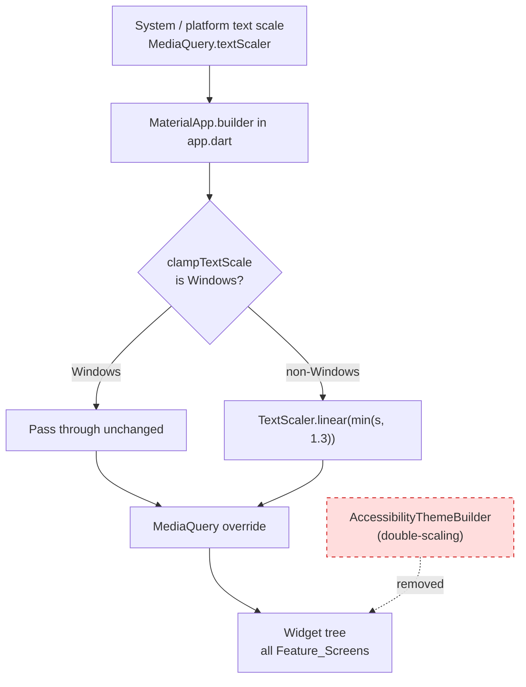
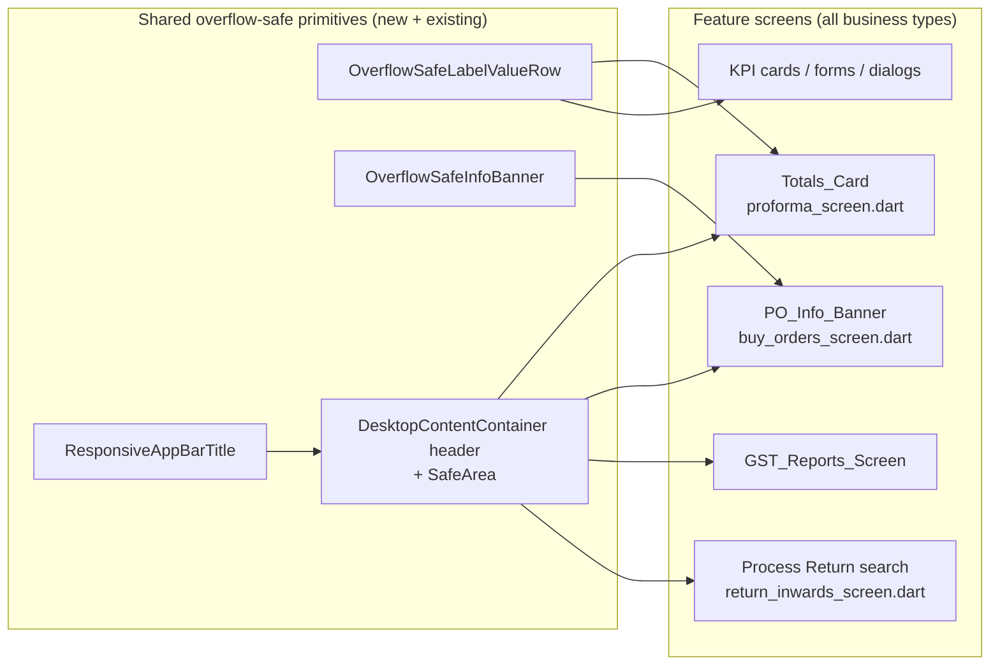
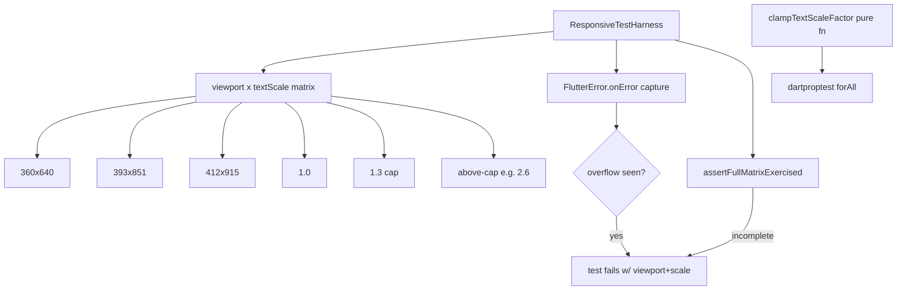

# Design Document

## Overview

This feature hardens DukanX against text-scale-driven and viewport-driven layout failures on Android phones and tablets, while freezing the Windows desktop render path. The work is a quality/robustness change — it does not add business functionality.

The design rests on five pillars that map directly onto the requirements:

1. **One coherent, clamped Text_Scale_Pipeline** (R1, R2, R11). Today there are two scaling mechanisms in the codebase: the live clamp in `lib/app/app.dart` (`_applyTextScaleClamp`, `kMaxTextScaleFactor = 1.3`, Windows-exempt), and a dead, unmounted `AccessibilityThemeBuilder` in `lib/core/theme/accessibility_theme.dart` that double-scales (it applies `textTheme.fontSizeFactor` **and** a nested `MediaQuery.textScaler`). We keep the live clamp as the single source of truth and **remove** the dead double-scaling widget so exactly one scale source remains.
2. **App-wide overflow-safe primitives** (R3, R9). We introduce a small set of reusable overflow-safe widgets and conventions (a label/value row, a wrapping info banner, safe-area-aware headers) so a single fix propagates across all business types through the shared components they already use (e.g., `DesktopContentContainer`).
3. **Per-defect fixes for the five screenshot cases** (R4–R8): the New Estimate Totals card, the New Purchase Order info banner, the GST Reports header + segmented control, the app-bar title/subtitle + SafeArea, and the Process Return search hint.
4. **A shared Responsive_Test_Harness** (R10) that pumps any widget/screen across the required viewport × text-scale matrix, fails on `RenderFlex` overflow, and fails if a case does not exercise the full required matrix. This is the regression gate that the prior specs lacked.
5. **Windows platform-freeze** (R11): every change is gated so Windows user-visible behavior is byte-for-byte unchanged, and the clamp continues to pass system scale through untouched on Windows.

### Research notes (grounded in the current codebase)

- `lib/app/app.dart` already clamps via `_applyTextScaleClamp(MediaQueryData)`: it derives `data.textScaler.scale(1.0)`, clamps to `[1.0, kMaxTextScaleFactor]`, and rebuilds a `TextScaler.linear`. Windows (`!kIsWeb && Platform.isWindows`) returns `data` unchanged. This is the correct single source; it only needs a **pure, testable extraction** and the removal of the competing path.
- `lib/core/theme/accessibility_theme.dart` defines `AccessibilityThemeBuilder`, `accessibilityProvider`, `initializeAccessibilityProvider`, and `AccessibilitySettingsScreen`. A workspace-wide search shows **none of these are referenced anywhere outside this file** — the widget is never mounted, the provider is never initialized, and the settings screen is never routed. It is entirely dead code, and the only piece that causes a correctness hazard is the double-scaling inside `AccessibilityThemeBuilder.build`.
- Shared layout entry point: `lib/widgets/desktop/desktop_content_container.dart` renders the header (back button + title + optional subtitle + actions) for most feature screens. Its title is already `maxLines: 1` + ellipsis and subtitle `maxLines: 2` + ellipsis, but the header is **not wrapped in `SafeArea`** and uses hardcoded font sizes; this is the shared fix point for R7.
- Existing responsive helpers live in `lib/core/responsive/responsive_layout.dart` (`context.isMobile`, `responsiveValue<T>`, `context.textScale`, `ResponsiveSafeArea`). We reuse these rather than inventing new breakpoint logic.
- Test infrastructure already present: `dartproptest ^0.2.1` (repo-standard PBT library), `golden_toolkit`, `flutter_test`, `integration_test`. There is a precedent for "totality" property tests (`test/tool/responsive_audit_totality_property_test.dart`) and an overflow-capturing widget harness (`test/widget/widget_test_harness.dart`) whose `FlutterError.onError` capture pattern we reuse.

## Architecture

### Text-scale data flow (single pipeline)



After this change there is exactly one place that sets the effective `TextScaler` for the tree: the `MaterialApp.builder` in `app.dart`. The `AccessibilityThemeBuilder` node is deleted, so no second scaling path can exist.

### Overflow-safe component layering



### Test architecture



## Components and Interfaces

### 1. Text_Scale_Pipeline (R1, R2, R11)

**File:** `lib/app/app.dart` (refactor of the existing clamp; no behavioral change on any platform).

Extract the clamp arithmetic into a pure, unit-testable function and keep the `MediaQueryData` wrapper as a thin adapter. The platform branch is parameterized so tests can drive both Windows and non-Windows behavior without running on the actual OS.

```dart
/// Pure, platform-parameterized clamp. Returns the effective linear text-scale
/// factor for [requested] given whether the host is Windows.
/// - Windows: pass-through (no cap) per the platform-freeze constraint.
/// - non-Windows: clamp into [1.0, kMaxTextScaleFactor].
double clampTextScaleFactor(double requested, {required bool isWindows}) {
  if (isWindows) return requested;
  return requested.clamp(1.0, kMaxTextScaleFactor);
}

/// Thin adapter used by MaterialApp.builder. Keeps the existing semantics:
/// only rebuilds MediaQueryData when the factor actually changes.
MediaQueryData applyTextScaleClamp(
  MediaQueryData data, {
  bool? isWindowsOverride,
}) {
  final isWindows =
      isWindowsOverride ?? (!kIsWeb && Platform.isWindows);
  final requested = data.textScaler.scale(1.0);
  final effective = clampTextScaleFactor(requested, isWindows: isWindows);
  if (effective == requested) return data;
  return data.copyWith(textScaler: TextScaler.linear(effective));
}
```

Notes:
- `kMaxTextScaleFactor = 1.3` is unchanged.
- The `isWindowsOverride` parameter exists solely for tests; production calls pass nothing, preserving the live `Platform.isWindows` check and thus the Windows render path (R11.1, R11.2).
- This is the **only** site that overrides `MediaQuery.textScaler` for the tree.

### 2. Removal/reconciliation of Accessibility_Theme_Builder (R2)

**File:** `lib/core/theme/accessibility_theme.dart`.

**Decision (confirmed):** remove the double-scaling path rather than wire it in.

- **Delete** `AccessibilityThemeBuilder` (and its private `_applyTextScale`, `_applyBoldText`, `_applyHighContrast` helpers that only it uses). This is the class that combined `textTheme.fontSizeFactor` with a nested `MediaQuery.textScaler` — the exact double-scaling forbidden by R1.5 and R2.3.
- The remaining `AccessibilitySettings` / `AccessibilityNotifier` / `AccessibilityPreferences` / `AccessibilitySettingsScreen` are also currently unmounted. Because this feature adds no new business functionality, we do **not** introduce new wiring for them. They contribute **nothing** to text scaling, so after the deletion exactly one scale source remains (R1.1, R2.1).
- **Integration contract (documented invariant):** if an in-app accessibility text scale is ever surfaced in the future, it MUST be injected by overriding `MediaQuery.textScaler` *upstream* of `applyTextScaleClamp` in `app.dart` (never via `textTheme.fontSizeFactor`). This guarantees any contribution is applied exactly once and is clamped on non-Windows platforms (R2.2, R2.3, R2.4).

This satisfies R2.1 (no unmounted double-scaling widget remains) by removal, and keeps R2.2–R2.4 well-defined for any future use.

### 3. Shared overflow-safe primitives (R3, R9)

New file: `lib/widgets/responsive/overflow_safe.dart`. Small, dependency-free widgets that encode the conventions so individual screens stop hand-rolling fragile `Row`s.

#### 3a. `OverflowSafeLabelValueRow` (R3.4, R4)

A label-on-left / value-on-right row that never overlaps and never overflows at elevated scale. The label is allowed to shrink/ellipsize; the value is kept whole where possible and shrinks-to-fit otherwise, always staying on one visible row with its label.

```dart
class OverflowSafeLabelValueRow extends StatelessWidget {
  final String label;
  final String value;
  final TextStyle? labelStyle;
  final TextStyle? valueStyle;
  final double minGap;        // guaranteed horizontal gap (default 12)
  final Widget? valueOverride; // e.g. the Discount TextFormField

  const OverflowSafeLabelValueRow({...});
  // Layout: Row(children: [
  //   Flexible(child: Text(label, maxLines:1, overflow: ellipsis)),
  //   SizedBox(width: minGap),
  //   Flexible(child: valueOverride ??
  //       FittedBox(alignment: Alignment.centerRight,
  //                fit: BoxFit.scaleDown,
  //                child: Text(value, maxLines:1, softWrap:false))),
  // ])
}
```

Both children are `Flexible`, so the `Row` can never exceed its width (no `RenderFlex` overflow). The value uses `FittedBox(scaleDown)` so it shrinks rather than clipping when it cannot fit (R4.3), and stays whole when it fits (R4.4).

#### 3b. `OverflowSafeInfoBanner` (R5)

A bounded-width banner with an icon and wrapping text.

```dart
class OverflowSafeInfoBanner extends StatelessWidget {
  final IconData icon;
  final String message;
  final Color? color;
  // Layout: Container(width: double.infinity, ...
  //   child: Row(crossAxisAlignment: start, children: [
  //     Icon(icon),
  //     SizedBox(width: 12),
  //     Expanded(child: Text(message, softWrap: true)),  // wraps across width
  //   ]))
}
```

The `Expanded` gives the text a defined width constraint (R5.3) so it wraps naturally across the banner width instead of one word per line (R5.1), and the `Row` cannot overflow horizontally (R5.2). The container width is explicitly `double.infinity` within its parent so the banner always has a real width budget regardless of the parent layout path.

#### 3c. Safe-area-aware header in `DesktopContentContainer` (R7, R9.5)

**File:** `lib/widgets/desktop/desktop_content_container.dart`.

- Wrap the header `Container` (`_buildHeader`) in `SafeArea(bottom: false)` so title/subtitle clear the status bar and notch on mobile (R7.3). On desktop `SafeArea` insets are zero, so the Windows layout is unchanged (R11.3).
- Keep title `maxLines: 1` + ellipsis and subtitle `maxLines: 2` + ellipsis (already present — both are Overflow_Safe_Widgets, R7.1), but make the title/subtitle `Column` `mainAxisSize: min` and ensure it sits inside the existing `Expanded` so title and subtitle never overlap the actions or each other (R7.2).
- Theme background consistency (R9.5): the header already derives color from `Theme.of(context)`; ensure the container's scaffold background uses the active theme's `scaffoldBackgroundColor` so light/dark regions match.

#### 3d. Back-navigation affordance audit (R9.2)

`DesktopContentContainer` already auto-injects a Back button when `Navigator.canPop()`. The design extends this guarantee to modal dialogs and onboarding flows: any forward-reachable surface that does not use `DesktopContentContainer` must provide an explicit close/back affordance (an `IconButton(Icons.close)` or `Icons.arrow_back`). This is verified by an enumeration test (see Testing Strategy), not by a runtime property.

### 4. Per-defect designs

#### 4a. Totals_Card — `lib/features/revenue/screens/proforma_screen.dart` (R4)

The current `_buildSummaryCard` uses bare `Row(mainAxisAlignment: spaceBetween, children: [Text(label), Text(value)])` for Subtotal and Total. At elevated scale the two `Text`es can jointly exceed the row width → `RenderFlex` overflow / overlap. Replace each summary row with `OverflowSafeLabelValueRow`:
- Subtotal → `OverflowSafeLabelValueRow(label: 'Subtotal', value: ₹subtotal)`.
- Discount → `OverflowSafeLabelValueRow(label: 'Discount', valueOverride: <the existing 100px-wide TextFormField wrapped in Flexible>)`.
- Total → `OverflowSafeLabelValueRow(label: 'Total', value: ₹total, ...)` keeping the bold/`responsiveValue` font styling.

#### 4b. PO_Info_Banner — `lib/features/buy_flow/screens/buy_orders_screen.dart` (R5)

The "Purchase Orders are created as PENDING…" banner is currently a hand-rolled `Container > Row > [Icon, SizedBox, Expanded(Text)]`. Replace it with `OverflowSafeInfoBanner(icon: Icons.info, message: '...', color: Colors.blue)` to guarantee a bounded width and natural wrapping on every viewport/scale.

#### 4c. GST_Reports_Screen — `lib/features/gst/screens/gst_reports_screen.dart` (R6)

- "Period:" header: the mobile branch already wraps the `Text` in `Expanded` and the non-mobile branch in `Flexible` + ellipsis. Confirm both branches use `maxLines: 1` + `TextOverflow.ellipsis` so the header cannot clip off the right edge at elevated scale (R6.1).
- Segmented control (GSTR-1 / GSTR-3B / HSN): on mobile the control is already `width: double.infinity` with icons dropped. To prevent label clipping at elevated scale (R6.2), wrap the `SegmentedButton` in a horizontal `SingleChildScrollView` fallback **only when** the labels would exceed the width, or set the segment labels as `FittedBox(scaleDown)`/`maxLines:1`+ellipsis text. Chosen approach: wrap each segment `label` text with `maxLines:1` + `FittedBox(scaleDown)` so labels shrink rather than clip while keeping all three on one row.
- Whole screen renders without overflow at the matrix (R6.3) — verified by harness.

#### 4d. App_Bar_Header — `desktop_content_container.dart` (R7)

Covered by 3c. Title/subtitle become explicitly bounded, SafeArea-wrapped, non-overlapping, and retain protection at above-cap scale because the clamp guarantees ≤1.3 reaches the tree and the `maxLines`+ellipsis protect even if an un-clamped scale were ever passed (R7.5).

#### 4e. Process Return search hint — `lib/features/revenue/screens/return_inwards_screen.dart` (R8)

The search field hint must truncate with ellipsis rather than clip mid-glyph. Set the `InputDecoration.hintMaxLines: 1` and a `hintStyle` with `overflow: TextOverflow.ellipsis`, and ensure the field's row uses `Expanded` for the input so it has a bounded width (R8.1, R8.2).

### 5. Responsive_Test_Harness (R10)

New file: `test/responsive/responsive_test_harness.dart`. A shared utility used by every hardening test.

```dart
/// The required matrix, defined once so individual tests cannot under-specify it.
const List<Size> kRequiredViewports = [
  Size(360, 640), Size(393, 851), Size(412, 915),
];
const double kBaselineScale = 1.0;
const double kCapScale = 1.3;        // == kMaxTextScaleFactor
const double kAboveCapScale = 2.6;   // an Above_Cap_Scale
const List<double> kRequiredScales = [kBaselineScale, kCapScale, kAboveCapScale];

/// Pumps [builder] under every (viewport x scale) combination in the required
/// matrix. Captures FlutterError overflow during build/layout. Throws (fails
/// the test) on the first overflow, naming the offending viewport+scale.
/// Also asserts the full matrix was exercised (totality, R10.6).
Future<void> pumpResponsiveMatrix(
  WidgetTester tester, {
  required Widget Function() builder,
  List<Size> viewports = kRequiredViewports,
  List<double> scales = kRequiredScales,
  ThemeData? theme,
}) async { ... }

/// Wraps a widget with the app's real single pipeline (applyTextScaleClamp)
/// so tests render the screen exactly as production would, at the chosen scale.
Widget wrapWithPipeline(Widget child, {required double requestedScale, ThemeData? theme});
```

Key behaviors:
- Sets `tester.view.physicalSize` / `devicePixelRatio` per viewport (mirrors `widget_test_harness.dart`), with `addTearDown` resets.
- Applies the requested text scale **through the real `applyTextScaleClamp`** (with `isWindowsOverride: false`) so the harness validates the production-clamped behavior, including that above-cap requests are capped at 1.3 (R1.3, R2.2).
- Captures overflow via `FlutterError.onError`, filtering messages containing `overflowed` (reusing the proven pattern). Any captured overflow → `fail('... at viewport $v, scale $s')` (R10.4).
- Tracks the set of `(viewport, scale)` pairs actually pumped and asserts it equals the required matrix; a missing pair → test failure (R10.6).
- A companion `assertCasesCovered(Set<String> requiredCases, Set<String> registeredCases)` enforces that the five named cases (Totals_Card, PO_Info_Banner, GST_Reports_Screen, App_Bar_Header, Process Return search) are all present (R10.5).

## Data Models

This feature introduces no persistent data models. The only typed structures are test/config constants and a small layout config object.

| Name | Kind | Fields | Purpose | Requirements |
|------|------|--------|---------|--------------|
| `kMaxTextScaleFactor` | `const double = 1.3` | — | The Text_Scale_Cap | R1.2, R1.3 |
| `clampTextScaleFactor(requested, {isWindows})` | pure fn → `double` | input scale, platform flag | Single clamp arithmetic | R1.2–R1.4, R11.1 |
| `kRequiredViewports` | `const List<Size>` | 360x640, 393x851, 412x915 | Mobile_Viewport set | R10.3 |
| `kRequiredScales` | `const List<double>` | 1.0, 1.3, 2.6 | Elevated_Text_Scale set incl. above-cap | R10.2 |
| `OverflowSafeLabelValueRow` | StatelessWidget | label, value, styles, gap, valueOverride | Non-overlapping label/value row | R3.4, R4 |
| `OverflowSafeInfoBanner` | StatelessWidget | icon, message, color | Bounded, wrapping banner | R5 |
| `ResponsiveMatrixResult` | test value object | exercisedPairs:Set, overflows:List | Coverage + failure reporting | R10.4, R10.6 |

`AccessibilitySettings` (existing) is left in place as inert configuration state but no longer feeds any scaling path; its `effectiveTextScale` getter is no longer consumed by the widget tree.

## Correctness Properties

*A property is a characteristic or behavior that should hold true across all valid executions of a system — essentially, a formal statement about what the system should do. Properties serve as the bridge between human-readable specifications and machine-verifiable correctness guarantees.*

PBT applies to two layers of this feature: (1) the **pure clamp arithmetic** of the Text_Scale_Pipeline, which has clear, input-varying input/output behavior; and (2) the **layout matrix**, where "for all (viewport × text-scale) combinations, the target renders without overflow" is a genuine universal statement validated by the Responsive_Test_Harness. Structural/architecture criteria (single scale source, dead-code removal, back-affordance completeness, theme-background consistency, Windows golden preservation) are validated by example/architecture/golden tests in the Testing Strategy, not as properties.

The properties below were consolidated during reflection so each provides unique validation value.

### Property 1: Non-Windows clamp invariant

*For any* requested text-scale factor on a non-Windows platform, `clampTextScaleFactor(requested, isWindows: false)` returns a value within `[1.0, kMaxTextScaleFactor]`, equal to `min(max(requested, 1.0), 1.3)` — so above-cap requests collapse to exactly the cap and at-or-below-cap requests pass through unchanged.

**Validates: Requirements 1.2, 1.3, 1.4**

### Property 2: Windows pass-through

*For any* requested text-scale factor on Windows, `clampTextScaleFactor(requested, isWindows: true)` returns the requested factor unchanged (no cap applied).

**Validates: Requirements 11.1**

### Property 3: Clamp idempotence (single application)

*For any* requested text-scale factor and platform flag, clamping a second time yields the same result: `clampTextScaleFactor(clampTextScaleFactor(s, isWindows: w), isWindows: w) == clampTextScaleFactor(s, isWindows: w)`. Applying the single pipeline more than once can never compound scaling.

**Validates: Requirements 1.1, 1.5, 2.2**

### Property 4: Matrix overflow-freedom across targets

*For any* hardening target (Totals_Card, PO_Info_Banner, GST_Reports_Screen, App_Bar_Header pattern, Process Return search field, KPI card, and representative form/table/dialog) and *for any* combination of required Mobile_Viewport (360x640, 393x851, 412x915) and required text scale (1.0, 1.3, and an Above_Cap_Scale routed through the real clamp), rendering the target produces no Overflow_Failure.

**Validates: Requirements 3.1, 3.2, 4.2, 5.2, 6.1, 6.3, 7.4, 7.5, 8.2, 9.1, 9.3**

### Property 5: Label/value rows never overlap

*For any* label string, value string, and required viewport × text-scale combination, an `OverflowSafeLabelValueRow` lays out so the label's painted bounds and the value's painted bounds do not intersect (a positive gap is preserved) and the row reports no overflow.

**Validates: Requirements 3.4, 4.1**

### Property 6: Value stays on a single visible row

*For any* amount value (including values too wide to fit naturally) in an `OverflowSafeLabelValueRow`, the value renders on a single visible row together with its label — shrinking to fit (FittedBox scale-down) or truncating with ellipsis when it cannot fit, and remaining whole when it fits.

**Validates: Requirements 4.3, 4.4**

### Property 7: Info banner wraps across available width

*For any* multi-word message and required viewport × text-scale combination, an `OverflowSafeInfoBanner` lays the text out within the bounded banner content width and wraps across that width rather than degenerating to one word per line (its rendered line count does not exceed its word count and it uses the available width), with no Overflow_Failure.

**Validates: Requirements 5.1, 5.2, 5.3**

### Property 8: Segmented-control labels remain visible

*For any* required viewport × text-scale combination, the GST report-type segmented control renders all three labels (GSTR-1, GSTR-3B, HSN) without clipping — each label is findable and shrinks-to-fit rather than being cut off — and the control reports no overflow.

**Validates: Requirements 6.2**

### Property 9: App-bar title and subtitle do not overlap

*For any* title string, subtitle string, and required viewport × text-scale combination, the App_Bar_Header renders with the title's painted bounds entirely above the subtitle's painted bounds (no vertical overlap), with both bounded by `maxLines`+ellipsis.

**Validates: Requirements 7.1, 7.2**

### Property 10: App-bar header respects safe-area insets

*For any* simulated top safe-area inset (status bar / notch height) and required viewport × text-scale combination, the App_Bar_Header content's top offset is greater than or equal to the inset, so header text never collides with the status bar or notch.

**Validates: Requirements 7.3**

### Property 11: Overflowing content is scrollable, not clipped

*For any* content taller than the available vertical space at an Elevated_Text_Scale on a Mobile_Viewport, the Feature_Screen exposes a scrollable region whose scroll extent is greater than zero, so all content is reachable rather than clipped.

**Validates: Requirements 9.4**

### Property 12: Harness matrix totality

*For any* hardening test executed through the Responsive_Test_Harness, the set of (viewport, text-scale) pairs actually exercised equals exactly the required matrix (viewports {360x640, 393x851, 412x915} × scales {1.0, 1.3, Above_Cap}); any test that omits at least one required pair fails the coverage check.

**Validates: Requirements 10.2, 10.3, 10.6**

### Property 13: Harness fails on overflow

*For any* target widget, the Responsive_Test_Harness reports failure if and only if the target produces an Overflow_Failure in at least one tested (viewport, text-scale) combination — an overflow-free target passes and an overflowing target fails, with the offending viewport and scale named.

**Validates: Requirements 10.4**

## Error Handling

- **Overflow during tests:** the harness installs a scoped `FlutterError.onError` handler that collects `FlutterErrorDetails`; messages containing `overflowed` are treated as Overflow_Failures and converted into explicit `fail()` calls naming the viewport and scale. The original handler is always restored in a `finally` block (and via `addTearDown`) so one failing case cannot corrupt later tests.
- **Clamp input robustness:** `clampTextScaleFactor` relies on `double.clamp`, which is total for finite inputs. Non-finite inputs (`NaN`, `infinity`) are not produced by `MediaQuery.textScaler.scale(1.0)` in practice; the function still returns a defined value because `clamp` with finite bounds yields a bound for `infinity`. No exception path is needed.
- **Missing/empty content in shared widgets:** `OverflowSafeLabelValueRow` and `OverflowSafeInfoBanner` accept empty strings without throwing; an empty value simply renders nothing while preserving layout constraints.
- **Runtime user-facing behavior is unchanged:** this feature adds no new error dialogs, network calls, or persistence. The removal of `AccessibilityThemeBuilder` cannot throw at runtime because it was never mounted.
- **Windows guard:** the production path keeps the live `!kIsWeb && Platform.isWindows` check; the `isWindowsOverride` parameter is test-only and never supplied in `app.dart`, so there is no risk of altering platform detection in production.

## Testing Strategy

### Dual approach

- **Property tests** (via `dartproptest ^0.2.1`, the repo-standard library) validate the universal properties above. Each runs a minimum of 100 iterations (200 is the repo default, matching `responsive_audit_totality_property_test.dart`).
- **Unit / example / architecture / golden tests** cover the structural and preservation criteria that are not universal properties.

Property tests are tagged with a comment referencing the design property, using the format:
`// Feature: mobile-text-scale-responsive-hardening, Property {n}: {property text}`

Each correctness property is implemented by a **single** property-based test.

### Property test mapping

| Property | Target / generators | Library |
|----------|---------------------|---------|
| 1 Non-Windows clamp invariant | `forAll` requested doubles in a wide range (incl. <1.0, =1.3, >>1.3) | dartproptest |
| 2 Windows pass-through | `forAll` requested doubles, `isWindows:true` | dartproptest |
| 3 Clamp idempotence | `forAll` requested doubles × platform flag | dartproptest |
| 4 Matrix overflow-freedom | `forAll` over registered targets; each pumped via `pumpResponsiveMatrix` (generated content where applicable) | dartproptest + flutter_test |
| 5 Label/value non-overlap | `forAll` generated label/value strings × matrix; geometry assertion | dartproptest + flutter_test |
| 6 Value single-row | `forAll` generated amounts (incl. very large) | dartproptest + flutter_test |
| 7 Banner wrapping | `forAll` multi-word messages × matrix | dartproptest + flutter_test |
| 8 Segmented-control labels | matrix sweep; all three labels findable | flutter_test (matrix) |
| 9 Title/subtitle non-overlap | `forAll` title/subtitle strings × matrix | dartproptest + flutter_test |
| 10 Safe-area insets | `forAll` simulated top padding × matrix | dartproptest + flutter_test |
| 11 Scrollable overflow | `forAll` content heights > viewport | dartproptest + flutter_test |
| 12 Harness totality | `forAll` subsets of the required matrix (some omitting pairs) | dartproptest |
| 13 Harness fails on overflow | `forAll` mix of safe vs deliberately-overflowing widgets | dartproptest + flutter_test |

### Explicit named cases (R10.5)

The harness suite registers, as required explicit cases, the **Totals_Card**, **PO_Info_Banner**, **GST_Reports_Screen**, **App_Bar_Header pattern**, and **Process Return search field**. `assertCasesCovered` fails the suite if any of the five is missing.

### Example / architecture / golden tests (non-PBT criteria)

- **Single scale source (R1.1, R1.5, R2.1, R2.3):** an architecture test asserting `AccessibilityThemeBuilder` no longer exists in the source and that `app.dart` contains exactly one `MediaQuery.textScaler` override site. Reuses the source-scanning pattern from `responsive_audit_totality_property_test.dart`.
- **No unbounded hardcoded fonts in narrow containers (R3.5):** a targeted static audit over the touched files and shared primitives.
- **Back/dismiss affordance completeness (R9.2):** an enumeration test over forward-reachable surfaces (screens, modal dialogs, onboarding) asserting each exposes a back/close affordance; `DesktopContentContainer` provides it automatically when `canPop()`.
- **Theme background consistency (R9.5):** golden/example tests asserting the scaffold background equals the active light/dark theme background.
- **Harness capability (R10.1):** a meta-test verifying that pumping at a given viewport/scale sets `MediaQuery.size` and `textScaler` accordingly.
- **Windows preservation (R11.2, R11.3):** golden preservation tests of the touched screens at a desktop viewport, plus reliance on Property 2 (clamp identity on Windows) and the fact that `SafeArea` insets are zero on desktop so the header layout is unchanged. These follow the existing `test/bug_condition/*_preservation_test.dart` convention.

### Unit-testing balance

Unit/example tests stay focused on concrete edge cases (empty strings, exact cap boundary 1.3, zero safe-area insets on desktop) and integration points; the broad input coverage is delegated to the property tests to avoid redundant example tests.

### Execution

Run the suite with `flutter test test/responsive/` (and the clamp unit suite). Property suites use `--run`-equivalent single execution (no watch mode). Golden baselines are updated with `flutter test --update-goldens` only when an intentional visual change is approved.
