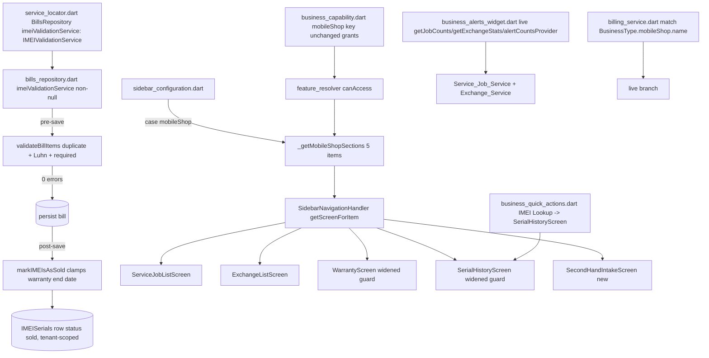

# Design Document — Mobile Phone Shop Vertical Remediation

## Overview

The DukanX `mobileShop` vertical (`BusinessType.mobileShop`, "Mobile Phone Shop") is configured and capability-granted as a specialized device-retail vertical — IMEI required at sale, repair/service jobs, exchange/buyback, warranty registration, and second-hand inventory — and a substantial real backend already exists under `features/service/*` (service jobs, exchanges, warranty claims, an `IMEISerial` model, an `IMEISerialRepository`, and an `IMEIValidationService`). The evidence-based audit (`audit-reports/business-types/audit-mobileShop.md`, §1–§20) found that the **live wiring is broken or generic** despite this. The single most severe class of defect is data integrity: the IMEI pipeline is a runtime no-op because `Service_Locator` constructs `Bills_Repository` without injecting `imeiValidationService`, so both the pre-save `validateBillItems` guard and the post-save `markIMEIsAsSold` guard are skipped.

This design specifies how the phased remediation defined in `requirements.md` (Requirement 1 through Requirement 13, delivered across Phase 0 through Phase 10) is realized in code. It mirrors the requirements: the cross-cutting invariants of Requirement 1 and the scope boundary of Requirement 2 become design-wide invariants enforced in every section; each subsequent phase maps to a design section with concrete components, interfaces, and data models; and the data-integrity surfaces (IMEI validation, warranty-date math, Luhn checksum, tenant scoping, second-hand valuation, idempotent migration) are specified precisely enough to support property-based testing.

The design intentionally aligns with the sibling `clothing-vertical-remediation` and `jewellery-vertical-remediation` specs: the same Phase 0 read-only verification, the same additive-only treatment of shared components with a per-vertical regression pass, the same offline-first repository conventions, and the same gate-driven progression. The audit (cited by section, e.g. §7) is the authoritative statement of what is broken; this design states how each finding is closed.

### Verified live wiring (grounding)

These facts were confirmed against the live codebase and anchor the design:

- `lib/core/repository/bills_repository.dart` declares `final IMEIValidationService? imeiValidationService;` (line ~64). The pre-save block at line ~229 (`if (imeiValidationService != null) { ... validateBillItems(...) }`) and the post-save block at line ~476 (`if (imeiValidationService != null) { ... markIMEIsAsSold(...) }`) are both gated on that nullable field.
- `lib/core/di/service_locator.dart` registers `BillsRepository(...)` at line ~448 with `database:`, `syncManager:`, etc., **but no `imeiValidationService:` argument** — so the field is null at runtime and both guarded blocks are dead.
- `lib/widgets/desktop/sidebar_configuration.dart` `_getSectionsForBusiness` currently groups mobileShop with electronics/computerShop: `case BusinessType.electronics: case BusinessType.mobileShop: case BusinessType.computerShop: return _getRetailSections();` (lines ~140–142). Sibling verticals (`vegetablesBroker`, `decorationCatering`, `jewellery`, `clothing`) each already have a dedicated `case ... : return _getXSections();` — the established pattern this design follows for mobileShop.
- A dedicated `_getServiceSections()` (with `service_jobs` and `exchanges` entries) exists at line ~1105 but is wired only to `BusinessType.service`.

### Guiding principles

- **Evidence before change.** Phase 0 produces a read-only `Verification_Report` resolving every unverified audit item to CONFIRMED, FALSIFIED, CONFIRMED-absent, or still-unverified (with a one-sentence rationale). No later phase acts on an assumption.
- **Surgical, additive change.** Shared files (`service_locator.dart`, `bills_repository.dart`, `billing_service.dart`, `sidebar_configuration.dart`, `business_quick_actions.dart`, `business_alerts_widget.dart`, `business_capability.dart`, `feature_resolver.dart`, the `/computer-shop/*` route registrations) are touched only by adding/extending the `mobileShop` branch or by widening a shared device-service guard to include mobileShop. No other business type's resolution path changes, and a regression pass records per-vertical results with a documented blast radius.
- **One canonical money path.** All touched mobileShop money is integer Paise — never `double`/`float`/decimal.
- **IMEI integrity is the core promise.** Injecting `IMEIValidationService` activates duplicate prevention, auto-registration, and mark-as-sold; UI enforcement (`isRequired`, non-empty guard, Luhn check) and the `billing_service.dart` enum-match fix close the remaining holes.
- **Gate-driven progression.** Each phase ends with the literal `PHASE N COMPLETE — AWAITING APPROVAL` and resumes only on the literal `APPROVED`. Schema/enum/Drift changes (Mini_Gate) and deletions (soft-delete / two-confirmation sign-off) require their own explicit approval.

## Architecture

### Current-state component map

```mermaid
graph TD
    subgraph Live navigation root
        APP[app.dart: MaterialApp routes:] --> ROUTES[routes.dart buildAppRoutes]
        ROUTES -->|/computer-shop/warranty BusinessGuard computerShop| WS[WarrantyScreen BLOCKED for mobileShop]
        ROUTES -->|/computer-shop/serial-history BusinessGuard computerShop| SH[SerialHistoryScreen BLOCKED]
        ROUTES -->|/computer-shop/job-card BusinessGuard computerShop| JC[JobCardDetailScreen BLOCKED]
    end
    subgraph Sidebar shared component
        SBCFG[sidebar_configuration.dart _getSectionsForBusiness] -->|electronics/mobileShop/computerShop share| RETAIL[_getRetailSections generic, no mobile tools]
        SVC[_getServiceSections service_jobs+exchanges] -->|wired only to service| SVCONLY[BusinessType.service]
    end
    subgraph IMEI pipeline DEAD
        SL[service_locator.dart BillsRepository no imeiValidationService] --> BR[bills_repository.dart imeiValidationService == null]
        BR -.->|both guards skipped| IVS[IMEIValidationService never runs]
        IVS -.-> IMEIREPO[IMEISerialRepository.getByNumber duplicate check unreachable]
    end
    subgraph Dashboard shared widgets
        QA[business_quick_actions.dart IMEI Lookup onTap empty] 
        AW[business_alerts_widget.dart hardcoded 5 / 8 / 3]
    end
    BILL[billing_service.dart gate on 'mobile_shop' never matches mobileShop] -.->|dead branch| X[no-op]
```



### Target-state component map (post-remediation)



### Phase-to-requirement map

| Phase | Requirements | Theme | Primary artifacts |
|-------|--------------|-------|-------------------|
| — | 1, 2 | Cross-cutting invariants + scope boundary (not a phase) | enforced in every section |
| 0 | 3 | Read-only pre-flight verification | `phase0-verification-report.md` (Markdown only) |
| 1 | 4 | IMEI pipeline DI + data integrity (warranty-date clamp) | `service_locator.dart`, `bills_repository.dart`, `imei_validation_service.dart` |
| 2 | 5 | IMEI enforcement + Luhn validation + enum-match fix | `manual_item_entry_sheet.dart`, `bill_line_item_row.dart`, `imei_validation_service.dart`, `billing_service.dart` |
| 3 | 6 | Unblock guarded device-service screens | `/computer-shop/*` route registrations, Feature_Resolver gating |
| 4 | 7 | Dedicated sidebar + navigation + RBAC wiring | `sidebar_configuration.dart`, `content_host.dart`, `routes.dart` |
| 5 | 8 | Dashboard / KPI real-data wiring | `business_quick_actions.dart`, `business_alerts_widget.dart` |
| 6 | 9 | Second-hand intake, demo status, EMI decision | second-hand intake screen, `IMEISerial`/`IMEISerialStatus` (Mini_Gate) |
| 7 | 10 | Security hardening (identity, null-session, tenant scoping) | service screens, repositories |
| 8 | 11 | Capability alignment (OCR / sales-return decisions) | `business_capability.dart`, optional IMEI-aware return |
| 9 | 12 | UX, performance, accessibility | touched service screens |
| 10 | 13 | Regression, isolation, RBAC, offline, traceability closure | `Traceability_Matrix`, test suites |

### Design-wide invariants (Requirement 1 & 2)

These hold in every section below; they are not a phase.

1. **Integer-Paise money (1.1, 1.2).** Every money value in created/modified mobileShop code is an `int` of Paise (e.g. second-hand valuation, exchange value). No `double`/`float`/decimal currency is introduced; any touched currency field is migrated to integer Paise.
2. **RID ids (1.3).** New entities (second-hand `IMEISerial` rows, any new record) use `{tenantId}-{timestamp_ms}-{uuid_v4_short}` via the shared RID generator (the same generator the jewellery offline repo uses), with `uuid_v4_short` ≥ 8 chars.
3. **Tenant scoping (1.4, 1.5, 1.13).** Every `IMEISerial`/`ServiceJob`/`Exchange`/`WarrantyClaim` read, write, and sync resolves `Tenant_Id` from the authenticated session (`SessionManager`), never a hardcoded/constant/client-supplied value. An unresolved `Tenant_Id` aborts the operation, performs no read or write, leaves data unchanged, and returns a tenant-missing error.
4. **Mini_Gate for schema/enum/Drift (1.6).** Any DynamoDB model-shape, Drift table, or enum-shape change (notably the `demo` status and the second-hand `condition`/`grade` fields) halts and requests a Mini_Gate with a proposed change and an idempotent migration plan before applying.
5. **No hard deletes (1.7).** Removal of a record/file/route/screen (notably the orphaned `Mobile_Shop_Module`) uses a soft-delete status flag or a two-confirmation flow; no hard delete of data without explicit sign-off.
6. **Idempotent migrations (1.8).** Any data migration is guarded so two or more consecutive runs over the same data produce the same persisted result and modify zero records after the first execution.
7. **Additive shared edits + regression (1.9–1.12).** Shared components gain only a `mobileShop` branch/case or a new gated item, or are intentionally widened to include `mobileShop` under Requirement 8 (guards) — no other business type's sidebar/capability/quick-action/alert resolution changes. A regression pass records pass/fail per non-mobileShop vertical and documents the blast radius (components changed + business types exercised).
8. **STOP GATE (1.14).** Phase completion emits the literal `PHASE N COMPLETE — AWAITING APPROVAL` and waits for the literal `APPROVED`.
9. **Scope boundary (2.1–2.7).** Changes are restricted to `features/service/*`, `modules/mobile_shop/*`, the `mobileShop` case/key within Shared_Components, the `Bills_Repository` DI registration, the navigation entries needed for reachability, and the `Shared_Device_Verticals` repositories/screens **only** for regression prevention or the minimum access-widening edit. No app-wide GoRouter migration; no new backend endpoint beyond an existing contract; EMI/finance is a deferred decision item left unmodified until explicit confirmation. A change that touches both an in-scope and an out-of-scope location applies only the in-scope portion and surfaces a sign-off request naming the out-of-scope path and the boundary clause.

## Components and Interfaces

### Phase 0 — Verification_Report (Requirement 3)

A single read-only Markdown artifact at `.kiro/specs/mobileshop-vertical-remediation/phase0-verification-report.md`. Phase 0 creates/modifies/deletes zero files other than this report and touches no application source/config/build file (3.1). It records:

- **Tenant isolation reality (3.2):** for each of `IMEISerial`, `ServiceJob`, `Exchange`, `WarrantyClaim`, whether every read and write is scoped by the session `Tenant_Id`, citing the file + function checked.
- **Sync-handler liveness (3.3):** whether `MobileShopSyncHandler` and `MobileShopWsHandler` are active in the live app or inactive due to the unmounted `Mobile_Shop_Module`, citing the registration path.
- **Submit-time IMEI enforcement (3.4):** whether `BillCreationScreenV2` enforces IMEI as required at submit time (distinct from the manual-entry-sheet path).
- **Backup encryption (3.5):** whether the `backup` flow encrypts its output — resolves the audit's "encryption unverified" to CONFIRMED or FALSIFIED.
- **SIM/recharge absence (3.6):** whether any SIM-activation/recharge screen exists — CONFIRMED-absent or FALSIFIED.
- **RBAC matrix (3.7):** the full `RolePermissions` matrix as applied to mobileShop sidebar items, identifying which sensitive items carry no `permission` tag.
- **Resolution (3.8–3.11):** every previously unverified audit item resolved to exactly one of CONFIRMED / FALSIFIED / CONFIRMED-absent / still-unverified with a one-sentence rationale; a missing source forces still-unverified naming the missing path; a falsified finding that a later phase depends on records the discrepancy and halts before that phase until acknowledged. Phase 0 is marked complete only when every item is resolved.

The report is the authoritative input to Phases 1–10 (e.g. Phase 7's tenant-leak fixes reference finding 3.2; Phase 10's offline test references finding 3.3).

### Phase 1 — IMEI Pipeline DI and Data Integrity (Requirement 4)

```mermaid
sequenceDiagram
    participant UI as Bill submit
    participant BR as Bills_Repository
    participant IVS as IMEI_Validation_Service
    participant IR as IMEI_Serial_Repository
    participant DB as (persistence)
    UI->>BR: save(bill) [tenant-scoped]
    BR->>IVS: validateBillItems(tenantId, items)
    IVS->>IR: getByNumber(imei, tenantId)
    IR-->>IVS: existing status (or none)
    alt zero errors
        IVS-->>BR: ok
        BR->>DB: persist bill
        BR->>IVS: markIMEIsAsSold(tenantId, billId, items)
        IVS->>IR: upsert IMEISerial(status=sold, warrantyEnd=clamped)
        alt mark fails
            IVS-->>BR: error(unmarked IMEIs)
            BR-->>UI: bill kept; error names unmarked IMEIs
        end
    else errors
        IVS-->>BR: errors(offending IMEIs)
        BR-->>UI: reject before persist; data unchanged
    end
```

- **DI injection (4.1):** `service_locator.dart` constructs `BillsRepository(... imeiValidationService: IMEIValidationService(sl<AppDatabase>()) ...)` so `imeiValidationService` is non-null at runtime. This is the single change that activates the entire pipeline.
- **Pre/post-save ordering (4.2):** with the field non-null, the existing pre-save `validateBillItems` block (bills_repository line ~229) runs before persistence and proceeds only on zero errors; the post-save `markIMEIsAsSold` block (line ~476) runs after persistence.
- **IMEISerial upsert (4.3):** a persisted mobileShop bill containing an IMEI creates/updates the `IMEISerial` row whose IMEI matches, scoped by `Tenant_Id`, status `sold`.
- **Warranty-date clamp (4.4, 4.5):** `markIMEIsAsSold` replaces the naive `DateTime(now.year, now.month + warrantyMonths, now.day)` with a clamping computation: compute the target year/month, then set the day to `min(saleDay, lastDayOfTargetMonth)`. For warranty-months in the inclusive range 0–120, the result is exactly that many months after the sale date, clamped to the target month's last day rather than rolling into the next month. A calculation test asserts a sale on the 31st with a term landing in a 30-day month yields the 30th, not the 1st of the following month.
- **Shared-vertical preservation (4.6, 4.7):** for `electronics` and `computerShop` bills, the repository persists the same field values as before the injection and does not create/modify an `IMEISerial` row for a vertical that does not require IMEI (the validation service's required-IMEI check is keyed on the mobile business type). A regression test confirms an electronics bill and a computerShop bill persist successfully after the injection.
- **Error paths (4.8, 4.9):** an empty/malformed/already-`sold`/`inService`/`damaged` IMEI is rejected before persistence with persisted data unchanged and an error identifying the offending IMEI; a `markIMEIsAsSold` failure after persistence keeps the bill persisted and returns an error naming the IMEIs that were not marked sold.

### Phase 2 — IMEI Enforcement and Validation (Requirement 5)

- **Required-field enforcement (5.1, 5.2):** `manual_item_entry_sheet.dart` gains a non-empty guard on the serial/IMEI field, and `bill_line_item_row.dart` evaluates `config.isRequired(ItemField.serialNo)` rather than `hasField`. An empty submission is rejected, the offending line identified, entered values retained, and a required-field message presented.
- **Duplicate rejection at UI (5.3, 5.9):** before the bill is added/persisted, an IMEI whose existing `IMEISerial` status is `sold`/`inService`/`damaged` is rejected as a duplicate with a message naming the IMEI and its conflicting status, preventing the duplicate from being added to the bill.
- **Luhn checksum (5.4, 5.5, 5.6):** a `Luhn_Check` function validates 15-digit numeric IMEIs. A non-empty value that is exactly 15 numeric digits is accepted only if it passes Luhn; a 15-digit value failing Luhn is rejected with a format error. A non-empty value that is not exactly 15 numeric digits is treated as a generic serial and the Luhn check is **not** applied. A validation test asserts a Luhn-valid 15-digit IMEI is accepted and a Luhn-invalid one rejected.
- **Enum-match fix (5.7):** `billing_service.dart` matches the mobileShop type using `BusinessType.mobileShop.name` instead of the literal `'mobile_shop'`, reviving the dead branch.
- **Warranty-months range (5.8):** a warranty-months value is accepted only when it is an integer in the inclusive range 0–120; non-integer, negative, or >120 is rejected with an error indication.

The `_guessIMEIType` length-15 heuristic is extended (not replaced) so the existing classification is preserved while the Luhn gate is added for the 15-digit numeric case.

### Phase 3 — Unblock Guarded Device-Service Screens (Requirement 6)

- **Access-widening decision (6.5):** this design records the decision to **widen the existing `BusinessGuard` allow-lists** for `/computer-shop/warranty`, `/computer-shop/serial-history`, and `/computer-shop/job-card/*` to include `BusinessType.mobileShop`, rather than relocating the screens. Rationale: widening is the minimum, reversible, additive edit that satisfies the scope boundary (2.1 access-widening clause) and avoids touching computerShop/electronics import paths or screen internals, whereas a move would ripple across the `Shared_Device_Verticals`; relocation is therefore deferred unless a later need arises.
- **Capability gating before render (6.1–6.4, 6.9):** access to each widened screen is gated through `Feature_Resolver.canAccess` by the matching capability evaluated before the screen renders — `useWarranty` for Warranty_Screen, `useIMEI` for Serial_History_Screen, `useJobSheets` for Job_Card_Detail_Screen. A mobileShop session holding the capability renders the screen rather than a denial; a mobileShop session lacking the specific capability is denied, the screen is not rendered, and the required capability is named.
- **Denial messaging (6.6, 6.8):** a business type holding none of the three capabilities and not in the widened allow-list is denied with a message naming the required capability or allowed business types; the denial message must not name only "Computer Shop" for a screen mobileShop is now permitted to use.
- **Multi-unit untouched (6.7):** `Multi_Unit_Screen` stays restricted to `computerShop`; `useMultiUnit` is not granted to mobileShop.

### Phase 4 — Sidebar, Navigation, and RBAC Wiring (Requirement 7)

- **Dedicated section (7.1, 7.10):** mobileShop is removed from the shared `electronics/mobileShop/computerShop → _getRetailSections()` group and given its own `case BusinessType.mobileShop: return _getMobileShopSections();` (the established sibling-vertical pattern). `_getMobileShopSections()` returns exactly five mobile entries — Service Jobs, Exchanges, IMEI Tracking, Warranty, Second-Hand Intake — plus the same shared common sections every type receives, and does not fall through to retail. For every other `BusinessType`, sections remain byte-for-byte identical (electronics and computerShop keep their own grouped `_getRetailSections()` case).

| Item | Sidebar id | Screen | Capability gate (7.2) |
|------|-----------|--------|-----------------------|
| Service Jobs | `service_jobs` | `ServiceJobListScreen` | `useJobSheets` |
| Exchanges | `exchanges` | `ExchangeListScreen` | `useExchange` |
| IMEI Tracking | `imei_tracking` | `SerialHistoryScreen` | `useIMEI` |
| Warranty | `warranty` | `WarrantyScreen` | `useWarranty` |
| Second-Hand Intake | `second_hand_intake` | `SecondHandIntakeScreen` (Phase 6) | `useBuyback` |

- **Capability exclusion (7.2, 7.8):** each item is tagged with its capability; an item whose capability the session lacks is excluded. Unsupported retail items (e.g. `proforma_bids`, `dispatch_notes`, `return_inwards`) are excluded by omission from the dedicated section.
- **Service-job navigation (7.3):** selecting job-create/job-status/job-deliver navigates to the corresponding service-job destination and renders without a navigation error.
- **RBAC permission tags (7.4, 7.5):** financial/compliance/admin retail items that remain visible to mobileShop carry a `permission` tag (e.g. `viewReports`, `manageSettings`) so `RolePermissions` gates them; a role lacking the tagged permission is blocked, shown an access-denied indication, and the current screen state preserved.
- **Content_Host guard parity (7.6):** when a repair/exchange screen renders through the `Content_Host` in-shell path, the same permission required by the equivalent named route (`/service_jobs`, `/exchanges`) is enforced before rendering, closing the guard-bypass; absent permission denies rendering.
- **Durable decision artifacts (7.7, 7.9):** a decision artifact records (a) whether `manageStaff` remains the gating permission for repair/exchange operations or is replaced by an operations/invoice permission, and (b) whether the orphaned `Mobile_Shop_Module`/`Mobile_Shop_Routes` are deleted (under soft-delete/sign-off) or retained — each with a one-sentence rationale.

### Phase 5 — Dashboard and KPI Real-Data Wiring (Requirement 8)

- **Quick-action fix (8.1):** the mobileShop "IMEI Lookup" quick action in `business_quick_actions.dart` navigates to `Serial_History_Screen` instead of the empty `onTap: () {}`.
- **Live alert counts (8.2):** `business_alerts_widget.dart`'s mobileShop branch reads from `Service_Job_Service.getJobCounts`, `Exchange_Service.getExchangeStats`, and `Alert_Counts_Provider` instead of the literals `'5'`, `'8'`, `'3'`.
- **Four KPI cards (8.3):** the dashboard shows exactly four KPI cards — active repairs by job status (`getJobCounts`), exchange pipeline value (`getExchangeStats.totalExchangeValue`), IMEI in-stock vs sold count, open warranty claim count — each from its live source.
- **Loading / empty / error states (8.4, 8.5, 8.6):** each card shows a loading state and resolves to a value, empty state, or error state within 10 seconds; a zero-record source shows a zero value with an empty-state label (not a hardcoded count); a failed/timed-out source shows an error state with a retry affordance and never a stale/hardcoded count.
- **Cross-vertical preservation (8.7):** for any business type other than mobileShop, `business_alerts_widget.dart` and `business_quick_actions.dart` resolve identical content and destinations.

### Phase 6 — Second-Hand Intake, Demo Status, EMI Decision (Requirement 9)

- **Intake capture (9.1, 9.2):** a `SecondHandIntakeScreen` captures device identity, a `condition` from a predefined finite set, and a `grade` from a predefined finite set, scoped by `Tenant_Id`. A missing required field or an out-of-set condition/grade rejects the submission, creates no record, and names the offending field.
- **Valuation + RID (9.3):** the used-phone valuation is stored as integer Paise in the inclusive range `1 .. 99,999,999,999`; the identifier uses the RID pattern.
- **Mini_Gate for schema/enum (9.4, 9.5, 9.6):** extending `IMEISerial` with `condition`/`grade` fields requests a Mini_Gate before applying; adding the `demo` state to `IMEISerialStatus` requests a Mini_Gate and supplies an idempotent migration plan. If a Mini_Gate is not granted, no schema/enum change is applied and the existing definitions are unchanged.
- **Demo stock exclusion (9.7, 9.8):** an `IMEISerial` with `demo` status is excluded from sellable stock counts while remaining visible in IMEI tracking; transitioning out of `demo` to a sellable status re-includes it.
- **EMI decision (9.9):** an explicit decision records EMI/finance as in-scope or deferred-backlog with a one-sentence rationale; no EMI code is implemented without the Requirement 2.5 confirmation.

### Phase 7 — Security Hardening (Requirement 10)

- **Single identity source (10.1):** `Service_Job_List_Screen` and `Exchange_List_Screen` resolve the authenticated user identity from one shared identity source (the audit found `AuthService().currentUser` vs `FirebaseAuth.instance` divergence), so both return the same `User_Id`/`Tenant_Id` for the same session.
- **Null / timeout session states (10.2, 10.3):** a null session/identity on load shows an error state with an "invalid or expired session" message and stops the loading indicator; an identity unresolved within 10 seconds replaces the loading indicator with an error state indicating the session could not be resolved.
- **Tenant scoping of leaks (10.4, 10.5):** any tenant-isolation leak identified in Phase 0 affecting an `IMEISerial`/`ServiceJob`/`Exchange`/`WarrantyClaim` read/write is scoped by session `Tenant_Id` so it accesses only same-tenant records. A passing automated test per entity asserts a query under one `Tenant_Id` returns zero records belonging to another.

### Phase 8 — Capability Alignment (Requirement 11)

- **OCR decision (11.1, 11.2):** a documented decision resolves `useScanOCR` for mobileShop to exactly one of — grant the capability (aligning with electronics) or remove the `ocrFocus` value — with a one-sentence (≥10-word) rationale. Where OCR is denied, no `ocrFocus` value or any UI/label/config entry implying OCR exists for mobileShop is exposed.
- **Sales-return decision (11.3):** a documented decision resolves `useSalesReturn` for mobileShop to — grant an IMEI-aware return flow or remain without sales-return — with a one-sentence rationale.
- **IMEI-aware return (11.4–11.6) — only if granted:** confirming a return for a `sold` `IMEISerial` within the requesting tenant reverts its status from `sold` to a returnable state, scoped to that tenant only; a return for a non-existent (within tenant) or non-`sold` serial is rejected with the status unchanged and an error naming the reason; no `IMEISerial` belonging to a different tenant is modified.

### Phase 9 — UX, Performance, Accessibility (Requirement 12)

- **Debounced search (12.1, 12.2):** search in `Service_Job_List_Screen`/`Exchange_List_Screen` applies the filter only after 300 ms of keystroke inactivity (replacing per-keystroke `.where(...)`); clearing the field shows the full unfiltered list within 300 ms.
- **Consistent layout (12.3):** both screens use an identical header structure — same header component, title placement, and primary-action positioning (reconciling the AppBar-based vs custom-gradient-header divergence).
- **Theme tokens (12.4):** all hardcoded color literals in the touched service screens are replaced with theme tokens; none remain.
- **Semantics / tooltips (12.5):** every custom tap target in the touched screens — including the previously action-less status cards — gets a non-empty `Semantics` label and a tooltip.
- **Contrast (12.6):** a color-contrast verification against WCAG 2.1 AA (≥4.5:1 normal text, ≥3:1 large text) is recorded, noting full WCAG validation requires manual testing with assistive technology.

### Phase 10 — Regression, Isolation, RBAC, Offline, Traceability (Requirement 13)

- **Regression (13.1, 13.2):** each `Shared_Device_Vertical` and every other business type is compared against a baseline recorded before Phase 10 across sidebar/capability/quick-action/alert behavior, with PASS/FAIL per business type; any differing element is listed and final sign-off withheld until resolved.
- **Multi-tenant isolation (13.3, 13.4):** an isolation test with ≥2 distinct `Tenant_Id` values confirms `IMEISerial`/`ServiceJob`/`Exchange`/`WarrantyClaim` reads/writes return no other-tenant records; any cross-tenant access is recorded and sign-off withheld until resolved.
- **Offline (13.5):** with connectivity disabled, repair/exchange reads/writes operate against the local database and IMEI rows persist locally.
- **RBAC (13.6):** each permission-tagged sidebar item is hidden for roles lacking the permission and shown for roles holding it, PASS/FAIL per item.
- **Traceability closure (13.7, 13.8):** the `Traceability_Matrix` maps every audit finding (§1–§20) to exactly one of FIXED / VERIFIED-OK / DEFERRED-SIGNOFF; any unmapped, multiply-dispositioned, or unresolved finding is listed and sign-off withheld.

## Data Models

### IMEISerial (existing, extended in Phase 6 under Mini_Gate)

| Field | Type | Notes |
|-------|------|-------|
| `id` | `String` | RID `{tenantId}-{timestamp_ms}-{uuid_v4_short}` for new rows (1.3) |
| `tenantId` | `String` | scoping for every read/write/sync (1.4) |
| `imei` | `String` | 15-digit numeric → Luhn-validated; otherwise generic serial (5.4, 5.5) |
| `status` | `IMEISerialStatus` | see enum below |
| `warrantyEndDate` | `DateTime?` | clamped to target month's last day (4.4) |
| `valuationPaise` | `int?` | second-hand only; `1 .. 99,999,999,999` (9.3) — **Mini_Gate** |
| `condition` | enum (finite set) | second-hand only (9.1) — **Mini_Gate** |
| `grade` | enum (finite set) | second-hand only (9.1) — **Mini_Gate** |

### IMEISerialStatus (existing enum, extended in Phase 6 under Mini_Gate)

Existing: `inStock`, `sold`, `inService`, `returned`, `damaged`. Phase 6 adds `demo` (Mini_Gate + idempotent migration). `demo` units are excluded from sellable stock counts but visible in IMEI tracking (9.7, 9.8). Statuses `sold`/`inService`/`damaged` are the duplicate-sale conflict set (5.3).

### Warranty-date computation (Phase 1)

A pure helper used by `markIMEIsAsSold`:

```
DateTime warrantyEndDate(DateTime saleDate, int warrantyMonths) {
  // precondition: 0 <= warrantyMonths <= 120 (validated upstream, 5.8)
  final totalMonth = saleDate.month - 1 + warrantyMonths;
  final targetYear = saleDate.year + (totalMonth ~/ 12);
  final targetMonth = (totalMonth % 12) + 1;
  final lastDay = lastDayOfMonth(targetYear, targetMonth);
  final day = saleDate.day <= lastDay ? saleDate.day : lastDay; // clamp (4.4)
  return DateTime(targetYear, targetMonth, day);
}
```

### Luhn check (Phase 2)

A pure helper:

```
bool isValidLuhn15(String imei) {
  // precondition: imei is exactly 15 numeric digits (else caller treats as generic serial, 5.5)
  // standard Luhn over the 15 digits; returns true iff checksum % 10 == 0
}
```

### RID identifier (Requirement 1.3)

`{tenantId}-{timestamp_ms}-{uuid_v4_short}` where `tenantId` is the active `Tenant_Id`, `timestamp_ms` is Unix epoch milliseconds, and `uuid_v4_short` is a ≥8-char shortened UUID v4.

### Decision artifacts

Markdown decision records co-located with the spec capture: the Phase 3 widen-vs-relocate decision (6.5), the Phase 4 `manageStaff` permission decision and `Mobile_Shop_Module` retain/delete decision (7.7, 7.9), the Phase 6 EMI decision (9.9), and the Phase 8 OCR (11.1) and sales-return (11.3) decisions.

## Correctness Properties

*A property is a characteristic or behavior that should hold true across all valid executions of a system — essentially, a formal statement about what the system should do. Properties serve as the bridge between human-readable specifications and machine-verifiable correctness guarantees.*

The mobileShop remediation contains genuine pure-logic and data-integrity surfaces — IMEI validation (Luhn, classification, duplicate rejection), warranty-date math, RID generation, tenant isolation, idempotent migration, second-hand valuation, demo stock counting, and capability/RBAC gating — that are well-suited to property-based testing. The properties below were derived from the prework analysis and consolidated to remove redundancy (e.g. the four tenant-isolation criteria collapse into one property; the repository- and UI-layer duplicate-IMEI rejections collapse into one). Process gates, documentation artifacts, regression baselines, and offline/integration checks are covered by the Testing Strategy section instead.

### Property 1: RID identifier format

*For any* non-empty `tenantId`, an identifier generated by the RID generator starts with that `tenantId`, contains a numeric millisecond segment, ends with a UUID-v4-short segment of at least 8 characters, and two identifiers generated in succession are distinct.

**Validates: Requirements 1.3, 9.3**

### Property 2: Tenant isolation across all device entities

*For any* set of `IMEISerial`, `ServiceJob`, `Exchange`, and `WarrantyClaim` records distributed across two or more distinct `Tenant_Id` values, a read or write issued under a given `Tenant_Id` accesses only records whose `Tenant_Id` equals that value and returns zero records belonging to any other tenant.

**Validates: Requirements 1.4, 10.4, 10.5, 13.3**

### Property 3: Unresolved tenant aborts with no side effects

*For any* IMEISerial/ServiceJob/Exchange/WarrantyClaim operation invoked while the `Tenant_Id` is missing or unresolved, the operation performs no read or write, leaves all persisted data unchanged, and returns an error indicating the `Tenant_Id` is missing or unresolved.

**Validates: Requirements 1.13**

### Property 4: Migrations are idempotent

*For any* pre-migration data set, running the migration twice in succession produces the same persisted result as running it once, and the second run modifies zero records.

**Validates: Requirements 1.8, 9.5**

### Property 5: Sale records and marks the IMEISerial

*For any* valid mobileShop bill containing a 15-digit IMEI, after the bill is persisted the `IMEISerial` row whose IMEI matches exists, has status `sold`, and is scoped to the bill's `Tenant_Id`.

**Validates: Requirements 4.2, 4.3**

### Property 6: Warranty end date is months-after with last-day clamp

*For any* sale date and any integer warranty-months count in the inclusive range 0 to 120, the computed warranty end date falls in the month exactly that many months after the sale month, with its day equal to the smaller of the sale day-of-month and the target month's last day, and never rolls into the following month.

**Validates: Requirements 4.4, 4.5**

### Property 7: Invalid or duplicate IMEIs are rejected before persistence

*For any* mobileShop bill submission whose IMEI is empty, malformed, or matches an existing `IMEISerial` with status `sold`, `inService`, or `damaged`, the submission is rejected before persistence, no IMEI is added to the bill, persisted data is left unchanged, and an error identifies the offending IMEI (and, for a status conflict, its conflicting status).

**Validates: Requirements 4.8, 5.1, 5.3, 5.9**

### Property 8: Luhn validation of 15-digit IMEIs

*For any* string of exactly 15 numeric digits, the system accepts it as an IMEI if and only if it passes the Luhn checksum, and rejects a 15-digit value failing Luhn with a format error.

**Validates: Requirements 5.4, 5.6**

### Property 9: Non-15-digit values are generic serials

*For any* non-empty serial value that is not exactly 15 numeric digits, the system treats it as a generic serial and does not apply the Luhn check to it.

**Validates: Requirements 5.5**

### Property 10: Warranty-months range validation

*For any* warranty-months input, the system accepts it if and only if it is an integer in the inclusive range 0 to 120, and rejects a non-integer, negative, or greater-than-120 value with an error indication.

**Validates: Requirements 5.8**

### Property 11: Shared device verticals persist unchanged

*For any* `electronics` or `computerShop` bill, after the IMEI_Validation_Service injection the bill persists the same field values it persisted before the injection, and no `IMEISerial` row is created or modified for a vertical that does not require IMEI.

**Validates: Requirements 4.6**

### Property 12: Capability gating of device-service screens

*For any* session and any of Warranty_Screen, Serial_History_Screen, or Job_Card_Detail_Screen, the screen renders if and only if the session holds the matching capability (`useWarranty`, `useIMEI`, `useJobSheets` respectively) or the session's business type is in the widened allow-list; otherwise access is denied, the screen is not rendered, and the required capability or allowed business types are named.

**Validates: Requirements 6.1, 6.2, 6.3, 6.4, 6.6, 6.9**

### Property 13: Sidebar items are filtered by held capability

*For any* subset of capabilities held by a mobileShop session, `_getMobileShopSections` returns exactly those of the five mobile items whose tagged capability the session holds and excludes every item whose capability the session does not hold.

**Validates: Requirements 7.2, 7.8**

### Property 14: RBAC gating of permission-tagged items

*For any* role and any permission-tagged sidebar item, the item is shown if and only if the role holds the tagged permission; a role lacking the permission is blocked with an access-denied indication and the current screen state is preserved.

**Validates: Requirements 7.5, 13.6**

### Property 15: Second-hand intake validation

*For any* second-hand intake submission, the submission is accepted and a tenant-scoped record is created if and only if device identity is present and both `condition` and `grade` belong to their predefined finite sets; otherwise no record is created and an error identifies the offending field.

**Validates: Requirements 9.1, 9.2**

### Property 16: Second-hand valuation range

*For any* second-hand valuation value, it is accepted if and only if it is an integer number of Paise in the inclusive range 1 to 99,999,999,999.

**Validates: Requirements 9.3**

### Property 17: Demo units are excluded from sellable stock

*For any* inventory of `IMEISerial` units, the sellable stock count excludes every unit whose status is `demo` while the IMEI-tracking count includes it, and when a unit transitions out of `demo` to a sellable status it is re-included in the sellable count.

**Validates: Requirements 9.7, 9.8**

### Property 18: Identity source is consistent across service screens

*For any* active session, Service_Job_List_Screen and Exchange_List_Screen resolve the same `User_Id` and the same `Tenant_Id`.

**Validates: Requirements 10.1**

### Property 19: IMEI-aware return reverts status, tenant-scoped (only if return flow is granted)

*For any* `IMEISerial` whose status is `sold` within the requesting tenant, confirming a return reverts its status to a returnable state, and no `IMEISerial` belonging to a different tenant is modified.

**Validates: Requirements 11.4, 11.6**

### Property 20: IMEI-aware return error condition (only if return flow is granted)

*For any* return requested for an `IMEISerial` that does not exist within the requesting tenant or whose status is not `sold`, the return is rejected, the `IMEISerial` status is left unchanged, and an error identifies the reason for rejection.

**Validates: Requirements 11.5**

## Error Handling

Error handling follows the audit's data-integrity emphasis: fail closed, never persist partial state, and always name the offending entity.

- **Unresolved tenant (1.13, Property 3).** Any device-entity operation resolves `Tenant_Id` from the session first; an unresolved tenant aborts before any read/write and returns a tenant-missing error. No fallback to a default or constant tenant.
- **Pre-persistence IMEI rejection (4.8, 5.1, 5.3, Property 7).** `validateBillItems` collects all errors (empty, malformed, Luhn-failed, duplicate-status) and returns them before persistence; the repository proceeds to persist only on zero errors. The bill store is unchanged on rejection, and the error payload names each offending IMEI and any conflicting status.
- **Post-persistence mark failure (4.9).** If `markIMEIsAsSold` fails after the bill is persisted, the bill remains persisted (it is valid) and the error names the IMEIs that were not marked `sold`, allowing a retry/reconciliation rather than rolling back a valid sale.
- **Mini_Gate refusal (9.6).** If a Mini_Gate for the `IMEISerial` model-shape or the `IMEISerialStatus` enum change is not granted, no schema/enum change is applied and the existing definitions are left intact; second-hand `condition`/`grade` and `demo`-dependent features are held until the gate is granted.
- **Migration failure / re-run (1.8, Property 4).** Migrations are guarded so a partial or repeated run never double-applies; a failure leaves the data in a re-runnable state and the next run converges to the same result.
- **Null / timed-out session on service screens (10.2, 10.3).** A null or unresolved-within-10s identity replaces the loading indicator with an error state messaging an invalid/expired or unresolvable session — never a perpetual spinner (closing the audit's `ExchangeListScreen` spinner bug).
- **KPI source failure (8.6).** A KPI data source that fails or exceeds 10s shows an error state with a retry affordance and never a stale or hardcoded count; a zero-record source shows a zero with an empty-state label.
- **Capability / RBAC denial (6.6, 6.8, 7.5).** Denials name the required capability or allowed business types (never only "Computer Shop" for a screen mobileShop may now use) and preserve the current screen state.
- **Boundary violation (2.6, 2.7).** A proposed change outside the scope boundary is not applied; existing files are left unmodified with no partial edits, and a sign-off request names the file path and the violated boundary clause. A change spanning in-scope and out-of-scope locations applies only the in-scope portion.

## Testing Strategy

### Dual approach

- **Property tests** verify the universal properties in the Correctness Properties section across many generated inputs (IMEI logic, warranty-date math, RID, tenant isolation, idempotent migration, second-hand validation, demo stock counting, capability/RBAC gating).
- **Unit / example tests** verify specific behaviors, edge cases, and wiring: the warranty 31st-into-30-day example (4.5), the Luhn valid/invalid examples (5.6), the DI non-null resolution (4.1), the `billing_service` enum-match (5.7), the validate-then-persist-then-mark ordering (4.2), the post-persist mark-failure path (4.9), the quick-action and alerts wiring (8.1–8.6), the sidebar five-item content (7.1), and the null/timeout session states (10.2, 10.3).
- **Regression / baseline tests** verify that every business type other than mobileShop resolves byte-for-byte-identical sidebar, capability, quick-action, and alert behavior (1.9–1.11, 7.10, 8.7, 13.1, 13.2) and that electronics/computerShop bills still persist (4.7).
- **Integration / offline tests** (1–3 examples) verify the offline-mode local reads/writes and local IMEI persistence (13.5) and the end-to-end sync-handler disposition from the Phase 0 finding.
- **Smoke / artifact checks** verify the process gates and decision artifacts: Phase 0 read-only `Verification_Report` completeness (3.1–3.11), Mini_Gate emission (1.6, 9.4, 9.5), STOP GATE text (1.14), blast-radius docs (1.12), the widen-vs-relocate (6.5), `manageStaff` (7.7), module retain/delete (7.9), EMI (9.9), OCR (11.1), and sales-return (11.3) decisions, and the Phase 10 `Traceability_Matrix` one-disposition-per-finding closure (13.7, 13.8).

### Property-based testing requirements

- **Library.** Use the target language's established property-based testing library — for Dart, `package:test` with `package:glados` (or `fast_check`-style generators where already used in sibling specs). Do not implement property generation from scratch.
- **Iterations.** Each property test runs a minimum of 100 generated iterations.
- **Tagging.** Each property test is tagged with a comment referencing its design property, in the format: **Feature: mobileshop-vertical-remediation, Property {number}: {property_text}**.
- **One test per property.** Each correctness property is implemented by a single property-based test; generators must cover the edge cases the prework flagged (warranty term landing on the 31st/Feb/leap years, IMEIs with leading zeros, `(condition, grade)` boundary values, valuations at 1 and 99,999,999,999 Paise, capability subsets including the empty set, tenant ids containing hyphens).
- **Mocks for cost control.** Tenant-isolation, IMEISerial-on-sale, and return-flow properties run against an in-memory/mocked Drift store so 100+ iterations stay cheap; no live backend calls in property tests.

### Conditional coverage

Properties 19 and 20 (IMEI-aware return flow) are exercised only if the Phase 8 sales-return decision (11.3) grants the flow; if the decision defers sales-return, those properties and their tests are marked not-applicable in the Traceability_Matrix with the decision as rationale.

### Unit-test balance

Unit tests stay focused on concrete examples, wiring, and edge/error conditions; the broad input coverage is delegated to the property tests so the suite does not accumulate redundant example tests for behaviors a property already covers universally.
