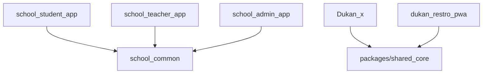

# Design Document: Monorepo Compilation Fixes

## Overview

This design describes a phased approach to resolving ~2087 compilation errors across a 6-package Flutter monorepo. The errors stem from dependency version drift (Riverpod v1→v2, cloud_firestore v3→v4, connectivity_plus v4→v6), missing code generation outputs, incorrect API access patterns, and structural file corruption.

The fix strategy is strictly ordered by dependency: upstream fixes (dependency versions, core types) must complete before downstream fixes (data layer, UI, tests) to prevent cascade failures where fixing one error introduces others.

### Packages

| Package | Role | Key Dependencies |
|---------|------|-----------------|
| Dukan_x | Main business app | Riverpod, Firestore, Drift, WebSocket |
| dukan_restro_pwa | Restaurant PWA | Riverpod, Firestore |
| school_admin_app | School admin panel | Riverpod, Firestore |
| school_student_app | Student-facing app | Riverpod, school_common |
| school_teacher_app | Teacher-facing app | Riverpod, school_common |
| school_common | Shared school library | Riverpod, Firestore |

### Dependency Graph



## Architecture

### Fix Execution Model

The fix process follows a 10-phase pipeline where each phase's output is a prerequisite for the next:

```mermaid
graph LR
    P1[Phase 1: Deps] --> P2[Phase 2: Core Types]
    P2 --> P3[Phase 3: Data Layer]
    P3 --> P4[Phase 4: Platform/Auth]
    P4 --> P5[Phase 5: UI/Screen]
    P5 --> P6[Phase 6: Services]
    P6 --> P7[Phase 7: Scripts]
    P7 --> P8[Phase 8: Tests]
    P8 --> P9[Phase 9: Code Gen]
    P9 --> P10[Phase 10: Cleanup]
```



### Why This Order Matters

1. **Phase 1 (Dependencies)** — Without correct versions in pubspec.yaml, `pub get` fails and no analysis is possible.
2. **Phase 2 (Core Types)** — Riverpod migration and enum additions unblock ~140 errors that cascade into every other category.
3. **Phase 3-6 (Data/Platform/UI/Services)** — These are independent error clusters that depend on Phase 2 being complete but can be addressed in any sub-order.
4. **Phase 7 (Scripts)** — Script files are standalone; fixing them doesn't affect app code.
5. **Phase 8 (Tests)** — Test files depend on source being correct first.
6. **Phase 9 (Code Gen)** — build_runner needs all source files to be syntactically valid.
7. **Phase 10 (Cleanup)** — Unused imports only become apparent after all other fixes.

## Components and Interfaces

### Phase 1: Dependency Alignment

**What changes:** All `pubspec.yaml` files across 6 packages.

**Pattern:**
```yaml
# Before
flutter_riverpod: ^2.0.0

# After
flutter_riverpod: ^2.5.1
```

**Minimum versions to enforce:**

| Dependency | Min Version | Scope |
|-----------|-------------|-------|
| flutter_riverpod | ^2.5.1 | dependencies |
| riverpod_annotation | ^2.3.5 | dependencies |
| cloud_firestore | ^4.17.0 | dependencies |
| firebase_auth | ^4.20.0 | dependencies |
| firebase_core | ^2.32.0 | dependencies |
| connectivity_plus | ^6.0.3 | dependencies |
| web_socket_channel | ^2.4.5 | dependencies |
| drift | ^2.18.0 | dependencies |
| riverpod_generator | ^2.4.3 | dev_dependencies |
| build_runner | ^2.4.9 | dev_dependencies |
| mockito | ^5.4.4 | dev_dependencies |

**Post-step:** Run `flutter pub get` in each package directory.

### Phase 2: Core Type Fixes

#### 2A: Riverpod v1→v2 Migration (~120 errors)

**Pattern — StateNotifier to Notifier:**
```dart
// BEFORE (v1)
class MyNotifier extends StateNotifier<MyState> {
  MyNotifier() : super(MyState.initial());
  void doSomething() { state = state.copyWith(...); }
}
final myProvider = StateNotifierProvider<MyNotifier, MyState>((ref) => MyNotifier());

// AFTER (v2)
@riverpod
class MyNotifier extends _$MyNotifier {
  @override
  MyState build() => MyState.initial();
  void doSomething() { state = state.copyWith(...); }
}
// Provider is auto-generated as myNotifierProvider
```

**Pattern — Async StateNotifier to AsyncNotifier:**
```dart
// BEFORE (v1)
class MyAsyncNotifier extends StateNotifier<AsyncValue<MyData>> {
  MyAsyncNotifier() : super(const AsyncValue.loading());
  Future<void> load() async {
    state = AsyncValue.data(await fetchData());
  }
}

// AFTER (v2)
@riverpod
class MyAsyncNotifier extends _$MyAsyncNotifier {
  @override
  Future<MyData> build() async => fetchData();
}
```

**Consumer-side changes:**
```dart
// BEFORE
ref.watch(myProvider.notifier).doSomething();

// AFTER
ref.read(myNotifierProvider.notifier).doSomething();
```

#### 2B: StaffRole Enum Addition (~2 errors)

**Pattern:**
```dart
// Add to StaffRole enum definition
enum StaffRole {
  owner,
  manager,
  cashier,
  waiter,
  caterer,  // ADD THIS
  // ... other roles
}
```

Then add `case StaffRole.caterer:` to all switch statements that handle StaffRole.

#### 2C: Module File Override Export (~17 errors)

**Pattern:**
```dart
// In module barrel files (e.g., feature_module.dart)
export 'package:flutter_riverpod/flutter_riverpod.dart' show Override;
// OR more commonly:
export 'package:flutter_riverpod/flutter_riverpod.dart';
```

### Phase 3: Data Layer Fixes

#### 3A: ApiResponse Access Pattern (~13 errors)

**Pattern:**
```dart
// BEFORE
final name = response['name'];
final items = response['items'] as List;

// AFTER
final name = response.data['name'];
final items = response.data['items'] as List;
```

#### 3B: Firestore API Fixes (~10 errors)

**Patterns:**
```dart
// .reference → .ref
doc.reference  →  doc.ref

// startAfterDocument — verify correct usage
.startAfterDocument(lastDoc)  // unchanged API, verify import

// count() — use AggregateQuery
collection.count().get()  →  collection.count().get()  // verify AggregateQuerySnapshot usage

// isNotEqualTo — named parameter
.where('field', isNotEqualTo: value)  // verify named param syntax
```

#### 3C: Drift Expression<bool> Operator (~3 errors)

**Pattern:**
```dart
// BEFORE
final query = (table.col1.equals(x)) & (table.col2.equals(y));

// AFTER
final query = (table.col1.equals(x)).and(table.col2.equals(y));
```

### Phase 4: Platform & Auth Fixes

#### 4A: Google Auth / Firebase Auth (~4 errors)

**Pattern:**
```dart
// Ensure correct import
import 'package:firebase_auth/firebase_auth.dart';

// Platform guard for web-only methods
if (kIsWeb) {
  await FirebaseAuth.instance.signInWithPopup(GoogleAuthProvider());
}
```

#### 4B: WebSocket → web_socket_channel (~6 errors)

**Pattern:**
```dart
// BEFORE
import 'dart:io';
final ws = await WebSocket.connect(url);
ws.listen((data) { ... });
ws.add(message);

// AFTER
import 'package:web_socket_channel/web_socket_channel.dart';
final channel = WebSocketChannel.connect(Uri.parse(url));
channel.stream.listen((data) { ... });
channel.sink.add(message);
```

#### 4C: ConnectivityResult List Handling (~2 errors)

**Pattern:**
```dart
// BEFORE (connectivity_plus v4)
final ConnectivityResult result = await Connectivity().checkConnectivity();
if (result == ConnectivityResult.none) { ... }

// AFTER (connectivity_plus v6)
final List<ConnectivityResult> results = await Connectivity().checkConnectivity();
if (results.contains(ConnectivityResult.none)) { ... }
```

#### 4D: HttpClient Imports (~2 errors)

**Pattern:**
```dart
// Add missing import
import 'dart:io' show HttpClient;
// OR for foundation utilities
import 'package:flutter/foundation.dart' show consolidateHttpClientResponseBytes;
```

#### 4E: PhoneAuthCredential Type (~1 error)

**Pattern:**
```dart
// Ensure callback signature matches firebase_auth ^4.20.0
verificationCompleted: (PhoneAuthCredential credential) { ... }
```

### Phase 5: UI & Screen Fixes

#### 5A: const_eval_method_invocation (~10 errors)

**Pattern:**
```dart
// BEFORE
const Text(someFunction())  // ERROR: method call in const context

// AFTER
Text(someFunction())  // Remove const
```

#### 5B: AuthState.user Getter (~1 error)

**Pattern:**
```dart
// Use the correct accessor based on refactored AuthState class
// Check actual AuthState definition and use matching getter
```

#### 5C: valueOrNull on AsyncValue (~1 error)

**Pattern:**
```dart
// BEFORE (if deprecated)
final value = asyncValue.valueOrNull;

// AFTER (Riverpod v2 — valueOrNull still exists but verify)
final value = asyncValue.valueOrNull;
// OR if the API changed:
final value = asyncValue.value;
```

#### 5D: num→int Type Mismatch (~4 errors)

**Pattern:**
```dart
// BEFORE
int result = someNum / otherNum;  // ERROR: double assigned to int

// AFTER
int result = someNum ~/ otherNum;  // Integer division
// OR
int result = (someNum / otherNum).toInt();
```

### Phase 6: Service & Utility Fixes

#### 6A: Variable Scoping in license_service.dart (~3 errors)

Move variable declarations to the correct scope level where they are used.

#### 6B: PwaHaptics.error() Replacement (~2 errors)

```dart
// BEFORE
PwaHaptics.error();

// AFTER — check actual PwaHaptics API
PwaHaptics.heavyImpact();  // or whatever the current method name is
```

#### 6C: BillEntity Import (~1 error)

```dart
// Add missing import
import 'package:dukan_x/features/billing/data/models/bill_entity.dart';
```

#### 6D: SyncChangeRecord Import Update (~8 errors)

```dart
// BEFORE
import '...old_path/sync_change_record.dart';

// AFTER — find current location and class name
import '...new_path/sync_change_record.dart';
```

### Phase 7: Script File Fixes

#### 7A: Raw Regex Patterns (~60 errors)

**Pattern:**
```dart
// BEFORE
final regex = RegExp('\\$variable');  // Dart tries to interpolate $variable

// AFTER
final regex = RegExp(r'\$variable');  // Raw string, no interpolation
```

#### 7B: Unterminated String Literals

Fix any strings that are missing closing quotes or have unescaped special characters.

#### 7C: Variable Scoping in Scripts

Move `data` and other variable declarations to the correct block scope.

### Phase 8: Test File Fixes

#### 8A: Structural Corruption (~30 errors in audit_fixes_verification_test.dart)

Rebuild the file structure: remove duplicated class definitions, fix malformed syntax, ensure proper test group nesting.

#### 8B: Mock Signature Mismatches (~errors in dc_enhancements_test.dart)

Update `@GenerateMocks([...])` annotations to match current interface signatures after Riverpod v2 migration.

#### 8C: Missing Test Dependencies (~5 errors)

Add missing packages to `dev_dependencies` in relevant pubspec.yaml files:
```yaml
dev_dependencies:
  cloud_functions: ^4.0.0  # if tests reference it
  # ... other missing deps
```

#### 8D: StaffMembersCompanion Usage (~1 error)

Update Drift companion class usage to match current generated API.

### Phase 9: Code Generation

**Command per package:**
```bash
dart run build_runner build --delete-conflicting-outputs
```

Run in each package that has a `build.yaml` or uses `@riverpod` / `@GenerateMocks` annotations:
1. Dukan_x
2. dukan_restro_pwa
3. school_common
4. school_admin_app
5. school_student_app
6. school_teacher_app

### Phase 10: Cleanup & Verification

1. Remove unused imports (~40 warnings)
2. Remove unnecessary casts
3. Remove duplicate imports
4. Run `flutter analyze` on each package
5. Verify zero errors across all 6 packages

## Data Models

No new data models are introduced. This effort modifies existing models to match updated API contracts:

- **StaffRole enum** — adds `caterer` value
- **ApiResponse** — no structural change; consumer access pattern changes from `response['key']` to `response.data['key']`
- **Riverpod providers** — structural change from `StateNotifier<T>` to `Notifier`/`AsyncNotifier` with code generation
- **Drift queries** — operator change from `&` to `.and()` method

## Error Handling

### Rollback Strategy

Each phase should be committed separately so that if a phase introduces unexpected errors, it can be reverted independently:

1. **Phase 1 failure** — Revert pubspec changes, re-run `pub get`
2. **Phase 2 failure** — Most likely incomplete migration; check for missed StateNotifier references
3. **Phase 9 failure** — build_runner errors indicate source files still have issues; return to relevant phase

### Common Failure Modes

| Failure | Cause | Resolution |
|---------|-------|-----------|
| `pub get` fails | Version conflict between packages | Check dependency_overrides or align versions |
| build_runner errors | Source file has syntax error | Fix source, re-run build_runner |
| New errors after fix | Cascade from incomplete migration | Complete the migration pattern fully |
| Test still fails after mock regen | Interface changed but annotation not updated | Update @GenerateMocks annotation |

## Testing Strategy

**Property-based testing is NOT applicable** for this feature because:
- This is a code migration/fix task, not a feature with pure functions or input/output behavior
- The verification criterion is binary: `flutter analyze` reports 0 errors or it doesn't
- There are no universal properties that hold across a wide input space

**Verification approach:**
- **Per-phase verification:** Run `flutter analyze` after each phase to confirm error count decreases
- **Final verification:** Run `flutter analyze` on all 6 packages and confirm zero errors
- **Regression check:** Ensure no new errors are introduced by each phase
- **Test suite execution:** After Phase 9 (code gen), run `flutter test` to verify tests pass

**Verification commands:**
```bash
# Per-package analysis
flutter analyze Dukan_x
flutter analyze dukan_restro_pwa
flutter analyze school_admin_app
flutter analyze school_student_app
flutter analyze school_teacher_app
flutter analyze school_common

# Full test suite (after all fixes)
flutter test  # in each package directory
```
