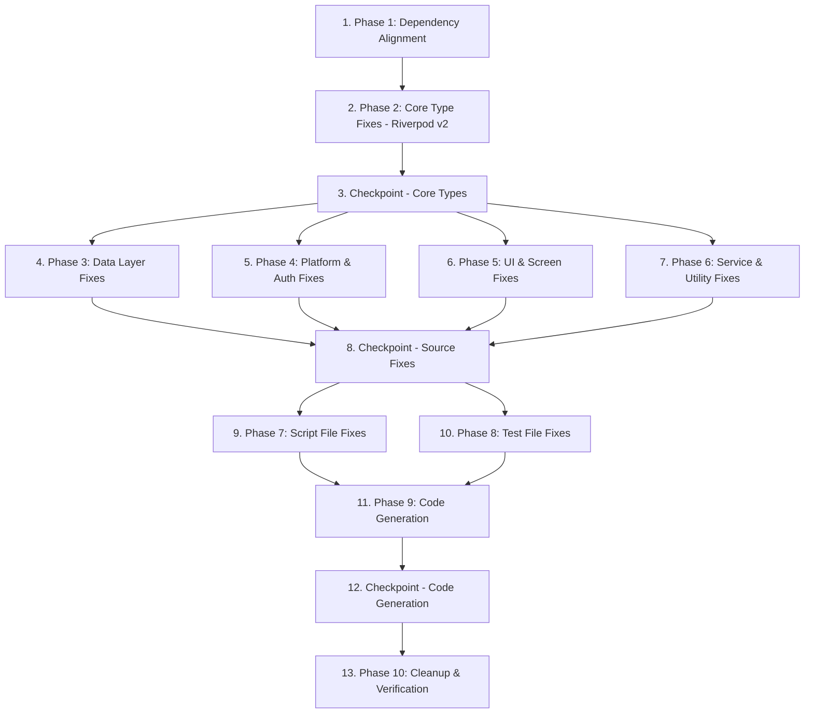

# Implementation Plan: Monorepo Compilation Fixes

## Overview

Resolve ~2087 compilation errors across 6 Flutter packages by applying fixes in strict dependency order. Each phase builds on the previous — dependency alignment first, then core type migrations, then downstream fixes, then code generation, then cleanup.

## Task Dependency Graph



```json
{
  "waves": [
    { "wave": 1, "tasks": ["1"] },
    { "wave": 2, "tasks": ["2"] },
    { "wave": 3, "tasks": ["3"] },
    { "wave": 4, "tasks": ["4", "5", "6", "7"] },
    { "wave": 5, "tasks": ["8"] },
    { "wave": 6, "tasks": ["9", "10"] },
    { "wave": 7, "tasks": ["11"] },
    { "wave": 8, "tasks": ["12"] },
    { "wave": 9, "tasks": ["13"] }
  ]
}
```

## Tasks

- [ ] 1. Phase 1: Dependency Alignment
  - [x] 1.1 Update pubspec.yaml in Dukan_x
    - Set flutter_riverpod: ^2.5.1, riverpod_annotation: ^2.3.5, cloud_firestore: ^4.17.0, firebase_auth: ^4.20.0, firebase_core: ^2.32.0, connectivity_plus: ^6.0.3, web_socket_channel: ^2.4.5, drift: ^2.18.0
    - Set dev_dependencies: riverpod_generator: ^2.4.3, build_runner: ^2.4.9, mockito: ^5.4.4
    - _Requirements: 10.1, 10.2, 10.3, 10.4, 10.5, 10.6, 10.7, 10.8, 10.9_
  - [x] 1.2 Update pubspec.yaml in dukan_restro_pwa
    - Set same minimum versions for all shared dependencies
    - _Requirements: 10.1, 10.2, 10.3, 10.4, 10.8, 10.9_
  - [ ] 1.3 Update pubspec.yaml in school_common
    - Set same minimum versions for all shared dependencies
    - _Requirements: 10.1, 10.2, 10.3, 10.8, 10.9_
  - [ ] 1.4 Update pubspec.yaml in school_admin_app, school_student_app, school_teacher_app
    - Set same minimum versions for all shared dependencies
    - _Requirements: 10.1, 10.2, 10.3, 10.8, 10.9_
  - [ ] 1.5 Run flutter pub get in all 6 packages
    - Run `flutter pub get` in each package directory and verify no version conflicts
    - _Requirements: 9.1, 9.2, 10.10_

- [ ] 2. Phase 2: Core Type Fixes — Riverpod v2 Migration
  - [ ] 2.1 Migrate StateNotifier classes to Notifier/AsyncNotifier in Dukan_x
    - Convert all StateNotifier<T> → Notifier with build() method
    - Convert all StateNotifier<AsyncValue<T>> → AsyncNotifier with async build()
    - Add @riverpod annotation and part directive for code generation
    - Update StateNotifierProvider → generated provider references
    - _Requirements: 2.2, 2.3, 2.4_
  - [ ] 2.2 Migrate StateNotifier classes in dukan_restro_pwa
    - Same pattern as 2.1 for this package
    - _Requirements: 2.2, 2.3, 2.4_
  - [ ] 2.3 Migrate StateNotifier classes in school_common and school apps
    - Same pattern as 2.1 for school_common, school_admin_app, school_student_app, school_teacher_app
    - _Requirements: 2.2, 2.3, 2.4_
  - [ ] 2.4 Add StaffRole.caterer enum value and update switch statements
    - Add `caterer` to StaffRole enum definition
    - Add `case StaffRole.caterer:` to all switch statements handling StaffRole
    - _Requirements: 12.1_
  - [ ] 2.5 Add flutter_riverpod re-export to module barrel files
    - Find all module files that cause "Override is not a type" errors
    - Add `export 'package:flutter_riverpod/flutter_riverpod.dart';` to each
    - _Requirements: 3.1, 3.2, 3.3_

- [ ] 3. Checkpoint — Verify core type fixes
  - Run `flutter analyze` on Dukan_x and confirm Riverpod-related errors are resolved
  - Ensure all tests pass, ask the user if questions arise.

- [ ] 4. Phase 3: Data Layer Fixes
  - [ ] 4.1 Fix ApiResponse access patterns
    - Find all `response['key']` patterns and replace with `response.data['key']`
    - Find all places treating ApiResponse as raw Map and add `.data` accessor
    - _Requirements: 13.1, 13.2, 13.3_
  - [ ] 4.2 Fix Firestore API calls
    - Replace `.reference` with `.ref` on DocumentSnapshot
    - Verify `startAfterDocument` usage matches cloud_firestore ^4.x API
    - Verify `.count()` uses AggregateQuery API correctly
    - Fix `isNotEqualTo` named parameter syntax
    - _Requirements: 4.2, 4.3, 4.4, 4.5_
  - [ ] 4.3 Fix Drift Expression<bool> operator usage
    - Replace `&` operator with `.and()` method on Expression<bool>
    - Replace `|` operator with `.or()` method if present
    - _Requirements: 11.3_

- [ ] 5. Phase 4: Platform & Auth Fixes
  - [ ] 5.1 Fix Google Auth / Firebase Auth imports and platform guards
    - Ensure correct import path for GoogleAuthProvider
    - Add `kIsWeb` guard around `signInWithPopup` calls
    - _Requirements: 11.1, 11.2_
  - [ ] 5.2 Replace dart:io WebSocket with web_socket_channel
    - Replace `import 'dart:io'` WebSocket usage with `package:web_socket_channel`
    - Replace `WebSocket.connect()` with `WebSocketChannel.connect()`
    - Update stream/sink usage pattern
    - _Requirements: 5.1, 5.2, 5.3, 5.4_
  - [ ] 5.3 Fix ConnectivityResult list handling
    - Update `checkConnectivity()` callers to handle `List<ConnectivityResult>` return type
    - Replace `result == ConnectivityResult.none` with `results.contains(ConnectivityResult.none)`
    - _Requirements: 11.4_
  - [ ] 5.4 Fix HttpClient imports and PhoneAuthCredential type
    - Add missing `dart:io` or foundation imports for HttpClient usage
    - Fix PhoneAuthCredential callback type signature
    - _Requirements: 11.5, 11.6_

- [ ] 6. Phase 5: UI & Screen Fixes
  - [ ] 6.1 Remove const from runtime expressions
    - Find all `const` keywords on widget constructors containing method calls
    - Remove `const` where compile-time evaluation is impossible
    - Preserve `const` on genuinely compile-time evaluable expressions
    - _Requirements: 15.1, 15.2, 15.3_
  - [ ] 6.2 Fix AuthState.user getter and AsyncValue.valueOrNull
    - Update AuthState.user to use correct accessor for refactored class
    - Verify .valueOrNull usage matches Riverpod v2 API
    - _Requirements: 12.4, 12.5_
  - [ ] 6.3 Fix num→int type mismatches
    - Replace `/` with `~/` for integer division
    - Add `.toInt()` where explicit conversion is needed
    - _Requirements: 15.1_

- [ ] 7. Phase 6: Service & Utility Fixes
  - [ ] 7.1 Fix variable scoping in license_service.dart
    - Move variable declarations to correct scope level
    - _Requirements: 14.2_
  - [ ] 7.2 Replace PwaHaptics.error() with current API method
    - Find current PwaHaptics method name and replace all .error() calls
    - _Requirements: 14.3_
  - [ ] 7.3 Fix BillEntity and SyncChangeRecord imports
    - Add missing BillEntity import where referenced
    - Update SyncChangeRecord import path to current location across ~8 files
    - _Requirements: 12.2, 12.3_

- [ ] 8. Checkpoint — Verify source fixes
  - Run `flutter analyze` on all packages and confirm error count is significantly reduced
  - Ensure all tests pass, ask the user if questions arise.

- [ ] 9. Phase 7: Script File Fixes
  - [ ] 9.1 Fix raw regex patterns in script files
    - Convert string literals containing `$` in regex to raw strings (r'...')
    - Fix unterminated string literals
    - _Requirements: 14.1_
  - [ ] 9.2 Fix variable scoping in script files
    - Move `data` and other variable declarations to correct block scope
    - _Requirements: 14.2_

- [ ] 10. Phase 8: Test File Fixes
  - [ ] 10.1 Repair structural corruption in audit_fixes_verification_test.dart
    - Remove duplicated class definitions
    - Fix malformed syntax and ensure proper test group nesting
    - Preserve test logic while fixing structure
    - _Requirements: 6.3_
  - [ ] 10.2 Fix mock signature mismatches in dc_enhancements_test.dart
    - Update @GenerateMocks annotations to match current interface signatures
    - _Requirements: 6.2_
  - [ ] 10.3 Add missing test dependencies to pubspec.yaml files
    - Add cloud_functions, cloud_firestore, or other missing packages to dev_dependencies
    - _Requirements: 6.4_
  - [ ] 10.4 Fix StaffMembersCompanion usage in test files
    - Update Drift companion class usage to match current generated API
    - _Requirements: 6.2_

- [ ] 11. Phase 9: Code Generation
  - [ ] 11.1 Run build_runner in Dukan_x
    - Execute `dart run build_runner build --delete-conflicting-outputs`
    - Verify .g.dart and .mocks.dart files are generated without errors
    - _Requirements: 7.1, 7.2, 7.3_
  - [ ] 11.2 Run build_runner in dukan_restro_pwa
    - Execute `dart run build_runner build --delete-conflicting-outputs`
    - _Requirements: 7.1, 7.2_
  - [ ] 11.3 Run build_runner in school_common and school apps
    - Execute `dart run build_runner build --delete-conflicting-outputs` in each
    - _Requirements: 7.1, 7.2_
  - [ ] 11.4 Resolve any build_runner generation errors
    - If build_runner reports errors, fix the source issues and re-run
    - _Requirements: 7.4_

- [ ] 12. Checkpoint — Verify code generation
  - Run `flutter analyze` on all packages after code generation
  - Ensure all tests pass, ask the user if questions arise.

- [ ] 13. Phase 10: Cleanup & Verification
  - [ ] 13.1 Remove unused imports across all packages
    - Remove all imports flagged as unused by the analyzer
    - _Requirements: 8.1, 8.3_
  - [ ] 13.2 Remove unnecessary casts and duplicate imports
    - Remove casts that are no longer needed after type corrections
    - Remove duplicate import statements
    - _Requirements: 8.2, 8.4_
  - [ ] 13.3 Final verification — flutter analyze on all 6 packages
    - Run `flutter analyze` in Dukan_x, dukan_restro_pwa, school_admin_app, school_student_app, school_teacher_app, school_common
    - Confirm zero errors in each package
    - _Requirements: 1.1, 1.2, 1.3, 1.4, 1.5, 1.6_

## Notes

- Each phase should be committed separately for rollback safety
- If `flutter pub get` fails in Phase 1, check for version conflicts and use dependency_overrides if needed
- Riverpod v2 migration (Phase 2) is the highest-risk phase — it touches the most files and has the most cascading effects
- Code generation (Phase 9) must run AFTER all source fixes are complete
- Cleanup (Phase 10) must run AFTER code generation since generated files may introduce new unused imports
- Checkpoints allow verification that error counts are decreasing between phases
