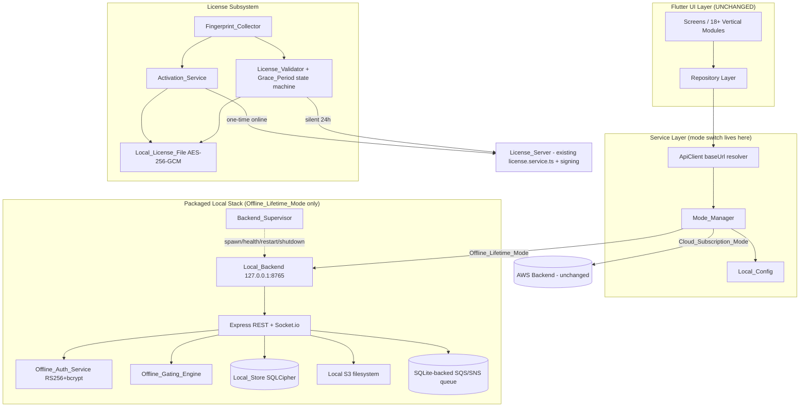
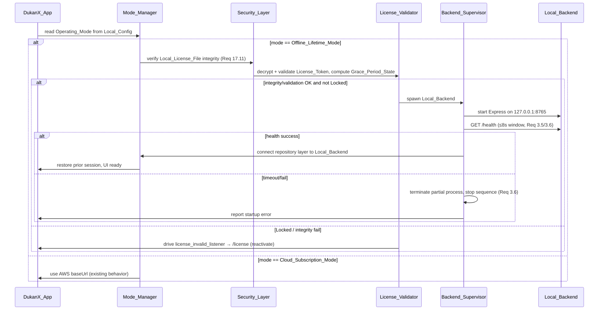
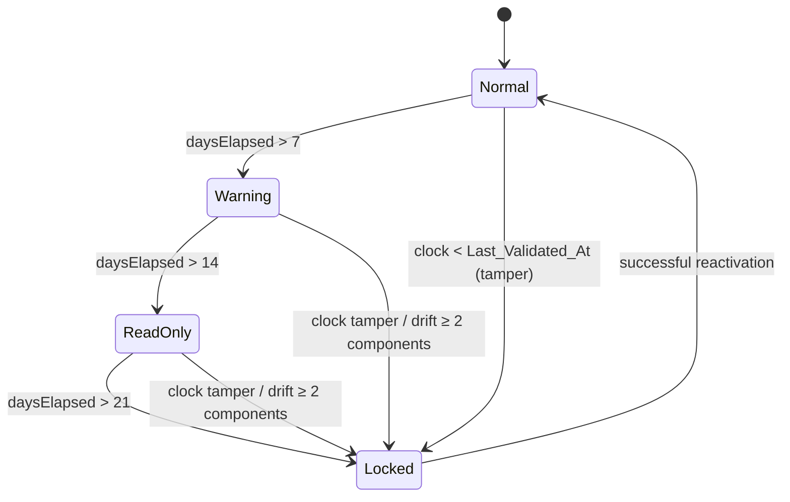

# Design Document

## Overview

This feature adds a fully offline-capable operating mode to DukanX **alongside** the existing
cloud mode. The application keeps its current AWS path untouched (Cloud_Subscription_Mode) and
gains a second path (Offline_Lifetime_Mode) that runs a packaged Node.js/Express + Socket.io
backend on the loopback interface, stores data in an encrypted SQLCipher/Drift database, and is
protected by a machine-bound, RSA-signed license token.

The design is shaped by three hard constraints from the requirements:

1. **Reuse, don't rebuild.** The license payload (`LicenseKeyPayload`), the DKX-/DKNX- key formats,
   the backend license services (`license.service.ts`, `license-denylist.service.ts`), the Super
   Admin generator, the Drift database (`app_database.dart` with `LicenseCache` and `SyncQueue`),
   and the deterministic gating engine (`plan_mapping_builder.dart` + `capability_classifier`,
   `subscription_tier`, `plan_mapping`) already exist and are treated as fixed baselines. This
   design wires new behavior **into** them.
2. **Cloud parity is preserved.** For identical inputs, Cloud_Subscription_Mode must produce
   request contracts, response contracts, and auth outcomes identical to the pre-feature baseline.
   Shared code is only extended in additive, behavior-preserving ways.
3. **Zero Flutter UI changes.** All mode selection and online/offline routing live at the
   service/repository layer. The widget tree, screens, and the 18+ `lib/modules/` verticals
   operate unchanged in either mode.

### Research Summary — What Already Exists

The following was confirmed by reading the codebase and directly informs the design:

| Concern | Existing asset | How this design uses it |
| --- | --- | --- |
| License payload & keys | `my-backend/src/types/license.types.ts` (`LicenseKeyPayload`, `LicenseKeyRecord`, `DenylistEntry`); DKX legacy + DKNX standalone key regexes in `license.service.ts` | The new License_Token wraps the **unchanged** `LicenseKeyPayload`. No field is added/renamed/retyped. |
| License lifecycle | `license.service.ts` (`generateStandaloneLicenseKey`, `activateLicense`, `validateLicenseKey`, `changeLicenseStatus`, device allowance via `maxDevices`) | Activation/validation/revocation reuse these functions. A thin signing + fingerprint-binding layer is added server-side. |
| Denylist | `license-denylist.service.ts` (`isKeyDenylisted` is **fail-closed**) | Activation calls `isKeyDenylisted` before issuing a token (Req 17.13). |
| Offline DB | `Dukan_x/lib/core/database/app_database.dart` (Drift, `schemaVersion = 38`, `MigrationStrategy.onUpgrade` ladder), `tables.dart` (`SyncQueue`, `LicenseCache`, business tables) | Schema is extended via the existing migration ladder (v39+); existing rows preserved (Req 8.7). |
| License cache fallback | `LicenseCache` table + `app_state_providers.dart` fallback | Reused as the offline cache of the validated token / plan. |
| Gating engine | `plan_mapping_builder.dart`, `capability_classifier.dart`, `subscription_tier.dart` (`SubscriptionTier {basic, pro, premium, enterprise}` cumulative), `plan_mapping.dart` | Offline_Gating_Engine feeds the License_Token's plan + allowed business types into the **same** builder. No new tier logic. |
| License-invalid handling | `Dukan_x/lib/security/license_invalid_listener.dart`, `lib/app/app.dart` | Grace-period Locked/Read_Only states reuse this listener to drive the existing `/license` redirect. |
| Repository routing | `Dukan_x/lib/core/api/api_client.dart` (single `baseUrl`, retry/timeout, tenant headers) | Mode_Manager selects the `baseUrl` (AWS vs `http://127.0.0.1:8765`). This is the single switch point. |
| Device identity | `Dukan_x/lib/core/security/device/device_fingerprint.dart` (`DeviceFingerprint`, SHA-256 combine) | Fingerprint_Collector extends this with cpuId/macAddress/hddSerial for the Fingerprint_Hash. |
| GST engine | `Dukan_x/lib/features/gst/services/gst_service.dart` (`calculateInvoiceGst`, intra → CGST+SGST, inter → IGST) | Reused unchanged offline; parity is a property, not a reimplementation. |

### Goals

- Add Offline_Lifetime_Mode without regressing Cloud_Subscription_Mode.
- Bind a lifetime license to a machine via one-time online activation; keep it valid offline for a
  year with silent revalidation and graduated grace periods.
- Serve the same API contracts locally as the cloud serves, so the Flutter layer is mode-agnostic.
- Preserve all existing offline data through an additive schema migration.

### Non-Goals

- Executing synchronization or conflict resolution (Req 12.4 — defined, not executed this version).
- Redesigning the cloud backend, the license payload, or any Flutter UI.
- Implementing a new gating/tiering algorithm (the existing one is reused as-is).

## Architecture

### High-Level Mode Topology



The **only** decision point that differs between modes is the backend target chosen by
Mode_Manager and handed to `ApiClient` as its `baseUrl`. Everything above the service layer is
identical in both modes.

### Startup Sequence (Offline_Lifetime_Mode)



### Layering and Responsibility

- **Service layer (Dart):** Mode_Manager, Local_Config, Backend_Supervisor, Fingerprint_Collector,
  Activation_Service, License_Validator, Backup_Service, Migration_Wizard, LAN_Coordinator,
  Update_Service. These are pure-Dart/service classes injected through the existing
  `service_locator` (`sl`). None of them are referenced by the widget tree.
- **Local_Backend (Node/TypeScript):** a packaged Express + Socket.io app that mirrors the AWS
  route contracts. It embeds local equivalents of Cognito (RS256 JWT + bcrypt), Lambda/API Gateway
  (Express routes), DynamoDB (SQLCipher), S3 (filesystem), and SQS/SNS (SQLite queue). It reuses
  the existing TypeScript domain logic where that logic is transport-agnostic.
- **Shared backend code:** `license.service.ts`, `license-denylist.service.ts`, and license types
  are shared between the AWS License_Server and the new signing endpoint. Changes are additive only.

### Mode Selection and Routing Rules

- On startup, Mode_Manager reads `operating_mode` from Local_Config. Missing/unrecognized →
  default to Cloud_Subscription_Mode and persist it (Req 1.9).
- In Cloud_Subscription_Mode, `ApiClient.baseUrl` resolves to the existing `ApiConfig.baseUrl`
  (AWS) and behavior is byte-for-byte the current behavior (Req 1.4, 2.1).
- In Offline_Lifetime_Mode, `ApiClient.baseUrl` resolves to `http://127.0.0.1:8765` (Req 1.5).
- A routed call that neither connects nor responds within 10s yields a routing failure that names
  the failed target; the active mode is unchanged (Req 1.8).

## Components and Interfaces

### Mode_Manager (Dart, service layer)

Determines, persists, and exposes the active Operating_Mode and the active backend target. It is
the single switch point and never leaks the target to the UI (Req 1.6).

```dart
enum OperatingMode { offlineLifetime, cloudSubscription }

class RoutingFailure {
  final String backendTarget; // e.g. "127.0.0.1:8765" or AWS host
  final String reason;        // 'timeout' | 'connection_failed'
}

abstract class ModeManager {
  Future<OperatingMode> resolveActiveMode();      // reads Local_Config (Req 1.2, 1.9)
  Future<void> selectMode(OperatingMode mode);    // persists to Local_Config (Req 1.3)
  Uri activeBackendBaseUri();                      // AWS host or loopback (Req 1.4/1.5)
  // Wraps a routed call; on >10s no-connect/no-response returns RoutingFailure (Req 1.8)
  Future<Result<T>> route<T>(Future<T> Function(Uri baseUri) call);
}
```

### Local_Config (Dart)

Persists the selected mode and runtime settings (validation interval, backup time, backup
location, LAN role). Backed by secure local storage; never exposed to the UI layer.

### Backend_Supervisor (Dart)

Owns the Local_Backend process lifecycle (Req 3.3–3.9).

```dart
class RestartEvent { final int attempt; final DateTime at; final String reason; }

abstract class BackendSupervisor {
  Future<void> runStartupSequence();   // license → decrypt/validate → spawn → health → connect → restore (Req 3.3)
  Future<bool> healthCheck({Duration window = const Duration(seconds: 8)}); // Req 3.5/3.6
  Future<void> shutdown({Duration graceful = const Duration(seconds: 5)});  // Req 3.7
  Stream<RestartEvent> get restarts;   // up to 3 consecutive (Req 3.8)
  Stream<void> get unrecoverableFailure; // after 3 failed restarts (Req 3.9)
}
```

The supervisor binds the backend to the Loopback_Address only (Req 3.4, 17.6). On unexpected exit
it restarts up to 3 times, recording each `RestartEvent`; after 3 failures it reports an
unrecoverable failure and marks the repository layer disconnected.

### Local_Backend (Node.js/Express + Socket.io)

Mirrors AWS contracts (Req 3.2, 4.2, 4.3) and provides the offline service equivalents (Req 4):

- **Cognito equivalent → Offline_Auth_Service:** RS256-signed local JWT (12h expiry), bcrypt
  (work factor 12) password hashing/verification (Req 4.1, 9.1, 9.2, 17.4, 17.5).
- **Lambda/API Gateway equivalent:** Express routes bound to loopback, schema validation on every
  input, parameterized SQL only (Req 4.2, 17.8, 17.9).
- **WebSocket equivalent:** Socket.io server on loopback serving the same event contracts (Req 4.3).
- **DynamoDB equivalent → Local_Store:** SQLCipher CRUD returning results equivalent to cloud for
  identical inputs (Req 4.4).
- **S3 equivalent → Object_Store:** content-addressed binary store under the DukanX data dir,
  returning bytes unchanged (Req 4.5).
- **SQS/SNS equivalent → Local_Queue:** SQLite-backed FIFO queue (Req 4.6).

Every endpoint except `/health` requires valid auth (Req 17.7, 17.14). Failed store/enqueue
operations roll back atomically, leaving no partial object/message (Req 4.7).

### Fingerprint_Collector (Dart)

Extends the existing `device_fingerprint.dart` with the components the license binding requires.

```dart
class MachineFingerprint {
  final String cpuId;
  final String macAddress;
  final String hddSerial;
  final String osType;
  final String hostname;
}

abstract class FingerprintCollector {
  Future<MachineFingerprint> collect();             // Req 5.1
  String fingerprintHash(MachineFingerprint fp);    // SHA256(cpuId+macAddress+hddSerial) (Req 5.2)
  // same machine iff at most one of the 5 components differs (Req 6.1/6.2)
  bool isSameMachine(MachineFingerprint activated, MachineFingerprint current);
}
```

### Activation_Service (Dart) and License_Server (Node/TypeScript)

One-time online activation (Req 5). The Activation_Service sends the key + fingerprint to the
License_Server (≤30s), which reuses `license.service.ts` validation + `isKeyDenylisted`, enforces
the device allowance (1 by default, 2–3 only if Super Admin configured an integer in [1,3]), and
returns an RSA-signed License_Token (365-day TTL) wrapping the unchanged `LicenseKeyPayload`. The
Activation_Service writes the token to the Local_License_File encrypted with AES-256-GCM using a
PBKDF2 key derived from Fingerprint_Hash + app secret, stored in the OS-specific secure location.

```dart
sealed class ActivationOutcome {}
class ActivationSucceeded extends ActivationOutcome { final LicenseToken token; }
class ActivationFailed extends ActivationOutcome { final String reason; } // invalid/expired/revoked/allowance-exhausted (Req 5.11)
class ActivationNeedsInternet extends ActivationOutcome {}                 // Req 5.4
class ActivationConnectionError extends ActivationOutcome {}               // fail/timeout >30s (Req 5.12)

abstract class ActivationService {
  Future<ActivationOutcome> activate(String licenseKey); // Req 5.3–5.12
}
```

On any failure path the service does **not** create the Local_License_File and leaves the machine
unactivated.

### License_Validator (Dart) and Grace_Period state machine

Silent background revalidation every 24h (configurable 1–168h, ±5min), each attempt completing or
abandoning within 2s, executed asynchronously so the UI is never blocked >100ms (Req 7.1–7.5). On
success it records the server-provided `Last_Validated_At`. The Grace_Period_State is a pure
function of `daysElapsed = days(now − Last_Validated_At)` plus fingerprint drift and clock state:



```dart
enum GracePeriodState { normal, warning, readOnly, locked }

abstract class LicenseValidator {
  // Pure, deterministic classification — the core property surface (Req 6, 7.6–7.11)
  GracePeriodState classify({
    required DateTime now,
    required DateTime lastValidatedAt,
    required int driftComponentCount, // # of fingerprint components that differ
  });
  Stream<GracePeriodState> get state;
  Future<void> runBackgroundValidation(); // Req 7.1–7.5, 7.12
}
```

Read_Only disables bill-creation controls and blocks creation attempts (Req 7.8, 7.9); Locked
disables everything except reactivation (Req 7.13) by reusing `license_invalid_listener.dart`.
Validation failures (unreachable/network/timeout) retain the last `Last_Validated_At`, do not
advance state, and let the user keep working (Req 7.12).

### Offline_Gating_Engine (Dart)

Adapts the License_Token to the **existing** gating engine without new tier logic (Req 10).

```dart
abstract class OfflineGatingEngine {
  // Derives plan, allowed business types, feature flags from the token, then
  // reuses PlanMappingBuilder + capability classifier to resolve access.
  bool isFeatureAccessible(String capability, {required String businessVertical});
  SubscriptionTier grantedTier(LicenseToken token); // Req 10.1
  bool isBusinessVerticalAllowed(String vertical, LicenseToken token); // Req 10.9
}
```

`superAdminOverride == true` grants everything (Req 10.8). A vertical absent from
`allowedBusinessTypes` is denied with a clear indication (Req 10.9). Access above the granted tier
is denied without changing the granted tier (Req 10.5).

### Sync_Foundation (Dart)

Records every offline write into the existing `SyncQueue` and sets the row's `sync_status` to
pending (Req 12.1, 12.2, 8.6). It owns the documented Conflict_Strategy but never executes sync
(Req 12.4, 12.5). If the Sync_Queue insert fails, the corresponding record is not persisted and the
failure is surfaced (Req 12.7) — the write and its queue entry are committed in one transaction.

### Backup_Service, Migration_Wizard, LAN_Coordinator, Update_Service, Security_Layer

- **Backup_Service:** first-run blocking prompt for a writable location (Req 13.1, 13.6); daily
  verified backups with checksum + open check, 7 retained (Req 13.2, 13.3, 13.7); persistent banner
  after 2 consecutive failures (Req 13.4); restore wizard with integrity gate (Req 13.5, 13.8).
- **Migration_Wizard:** export data + deactivation token, 48h overlap window where both machines
  stay usable, integrity-checked import, source auto-deactivation on window elapse (Req 14).
- **LAN_Coordinator:** one Primary_Device; Secondary_Devices connect to the primary's loopback
  backend over LAN within 10s, capped by the license device allowance; secondaries cannot write
  when the primary is unreachable (Req 15).
- **Update_Service:** background update checks; mandatory security patches cannot be deferred,
  others can; updates never touch Local_Store data (Req 18).
- **Security_Layer:** cross-cutting controls — SQLCipher AES-256, runtime-derived keys (never in
  source), AES-256-GCM license file, bcrypt(12), RS256 JWT with signing key in OS keychain,
  loopback-only binding, auth on all non-health endpoints, schema validation, parameterized SQL,
  secret/key log exclusion, license-file integrity verification, denylist enforcement, tamper →
  read-only forensic mode (Req 17).

## Data Models

### License_Token (wraps the unchanged LicenseKeyPayload)

The token is an RSA-signed (RS256) JWT. Its claims are exactly the existing `LicenseKeyPayload`
plus standard JWT binding/TTL claims. **No `LicenseKeyPayload` field is added, removed, renamed, or
retyped** (Req 2.2).

```ts
// Conceptual claim set of License_Token (server-side, my-backend)
interface LicenseTokenClaims extends LicenseKeyPayload { // payload reused verbatim
  // tenantId, plan, allowedBusinessTypes, maxUsers, maxDevices,
  // features, expiresAt, issuedAt, keyVersion, superAdminOverride  ← unchanged
  fingerprintHash: string; // binding: SHA256(cpuId+macAddress+hddSerial)
  iat: number;             // issued-at (JWT)
  exp: number;             // iat + 365 days (Req 5.5)
}
```

### Local_License_File (on disk)

```jsonc
// AES-256-GCM ciphertext; key = PBKDF2(Fingerprint_Hash + appSecret) (Req 5.6, 17.3)
{
  "v": 1,
  "alg": "AES-256-GCM",
  "iv": "<base64>",
  "tag": "<base64>",
  "ciphertext": "<base64 of { licenseToken, machineFingerprint, lastValidatedAt }>"
}
```

Stored in OS-specific secure locations (Req 5.7, 20.4):
- Windows: `%APPDATA%/DukanX/license/`
- macOS: `~/Library/Application Support/DukanX/license/`
- Linux: `$XDG_DATA_HOME/DukanX/license/` (fallback `~/.local/share/DukanX/license/`)

### Local_Store System_Columns (every table)

The cloud-mirroring tables carry the universal `System_Columns` (Req 8.1):

| Column | Type | Notes |
| --- | --- | --- |
| id | TEXT (PK) | UUID |
| tenant_id | TEXT | indexed (Req 8.5) |
| created_at | DATETIME | |
| updated_at | DATETIME | |
| deleted_at | DATETIME? | soft delete, indexed (Req 8.5) |
| sync_status | TEXT | `pending` \| `synced`, indexed (Req 8.5) |
| server_id | TEXT? | server-assigned id once synced |
| local_version | INTEGER | incremented on each offline write (Req 8.6) |

The existing tables already provide `id`, `created_at`, `updated_at`, `deleted_at`, and a `version`
column; the migration adds `tenant_id`, `sync_status`, `server_id`, and `local_version` (aligning
`version` semantics with `local_version`) where missing. The existing `SyncQueue` and `LicenseCache`
tables are **extended, never dropped** (Req 8.7).

### Required cloud entity tables (Req 8.2)

`users, roles, permissions, sessions, products, categories, units, inventory,
inventory_movements, customers, sales, sale_items, payments, vendors, purchases, purchase_items,
business_settings, tax_rates`. Tables already present (e.g. `Products`, `Customers`, `Vendors`,
`PurchaseItems`) are reused; missing ones are added by migration. SQLCipher key derives from
Fingerprint_Hash + tenant id + app secret (Req 8.3); WAL mode enabled (Req 8.4); per-table indexes
on `tenant_id`, `sync_status`, `deleted_at` (Req 8.5).

### Schema Migration (additive, on the existing Drift ladder)

`app_database.dart` is at `schemaVersion = 38`. This feature adds steps at v39+ inside the existing
`onUpgrade` ladder: `addColumn` for the new System_Columns on existing tables, `createTable` for
missing cloud entities, and `createIndex` for the required indexes. Existing rows and column values
are preserved; a migration that does not complete leaves the prior schema and data unchanged and
reports the failure (Req 8.7, 8.8).

### Conflict_Strategy (documented, not executed — Req 12.3, 12.6)

| Entity class | Conflict_Strategy |
| --- | --- |
| sales | local wins |
| inventory | last-write-wins |
| roles, permissions | cloud wins |
| user profiles | cloud wins |
| product catalog | merge-with-prompt |
| settings | cloud wins |

### RBAC Permission_Matrix (Req 9.3, 9.4)

Default_Role ∈ {owner, manager, cashier, viewer}. Each role maps to a set of allowed module
actions; any action not in the set is denied with a "not permitted" indication. owner ⊇ manager ⊇
cashier ⊇ viewer for shared actions, with owner/manager holding management actions cashier/viewer
lack.


## Correctness Properties

*A property is a characteristic or behavior that should hold true across all valid executions of a
system — essentially, a formal statement about what the system should do. Properties serve as the
bridge between human-readable specifications and machine-verifiable correctness guarantees.*

These properties target the pure, input-varying logic of the feature (classification, key
derivation, gating, parity, atomicity). Infrastructure, packaging, layering, timing/perf, and
fixed-configuration criteria are covered by integration/smoke/example tests in the Testing Strategy
rather than property-based tests, per the prework classification.

### Property 1: Mode persistence round trip and safe default

*For any* value stored in Local_Config as the operating mode, resolving the active mode returns
that mode when it is a recognized Operating_Mode, and otherwise returns Cloud_Subscription_Mode and
persists that default; and *for any* mode passed to `selectMode`, a subsequent `resolveActiveMode`
returns the same mode.

**Validates: Requirements 1.2, 1.3, 1.9**

### Property 2: Backend target is a total function of mode

*For any* active Operating_Mode, `activeBackendBaseUri` returns the AWS host if and only if the mode
is Cloud_Subscription_Mode, and the loopback address `127.0.0.1:8765` if and only if the mode is
Offline_Lifetime_Mode.

**Validates: Requirements 1.4, 1.5**

### Property 3: Routing failure names the failed target and preserves mode

*For any* active backend target whose routed call neither connects nor responds within 10 seconds,
`route` yields a RoutingFailure whose `backendTarget` equals that active target, and the active
Operating_Mode is unchanged.

**Validates: Requirements 1.8**

### Property 4: Shared cloud/license code preserves baseline outcomes

*For any* valid input to shared license or cloud code, the output produced on the cloud path with
this feature present equals the output of the frozen pre-change baseline reference (identical
request contract, response contract, and authentication outcome).

**Validates: Requirements 2.1, 2.4**

### Property 5: Only Super_Admin can generate a license key

*For any* actor role, license-key generation succeeds if and only if the actor is Super_Admin; when
the actor is not Super_Admin, no license key is created or persisted and an authorization error is
returned.

**Validates: Requirements 2.5, 2.6**

### Property 6: Fingerprint_Hash is deterministic over the bound components

*For any* Machine_Fingerprint, the Fingerprint_Hash equals `SHA256(cpuId + macAddress + hddSerial)`,
is identical for identical (cpuId, macAddress, hddSerial) triples, changes whenever any of those
three components changes, and is independent of osType and hostname.

**Validates: Requirements 5.2**

### Property 7: Activation never leaves partial state on failure

*For any* activation attempt that fails because the key is invalid, expired, revoked, or
denylisted, the device allowance is exhausted, there is no internet, or the request fails or
exceeds 30 seconds, the Activation_Service reports the corresponding failure indication, creates no
Local_License_File, and leaves the machine unactivated.

**Validates: Requirements 5.4, 5.11, 5.12, 17.13**

### Property 8: Device allowance is range-validated and enforced

*For any* proposed device allowance, the configured allowance updates if and only if the value is an
integer in [1, 3], otherwise the previously configured allowance is retained; and *for any* license
with a configured allowance n, activation succeeds for the first n distinct machines and is rejected
for any additional machine.

**Validates: Requirements 5.8, 5.9, 5.10**

### Property 9: Token sign/verify round trip with the configured TTL

*For any* token issued by the signing layer (the 365-day License_Token over the unchanged
LicenseKeyPayload, or the 12-hour local auth JWT), verifying the token under the corresponding
public key succeeds, the verified claims equal the issued claims, the difference between `exp` and
`iat` equals the configured time-to-live, and verification fails for any tampered token.

**Validates: Requirements 4.1, 5.5, 9.1**

### Property 10: Credential hashing round trip at the required cost

*For any* password, the bcrypt hash uses work factor 12, verifying the correct password against its
hash succeeds, and verifying any different password against that hash fails; a failed verification
issues no token and reports an invalid-credentials indication.

**Validates: Requirements 9.2, 9.9, 17.4**

### Property 11: Encryption round trip and authenticated-failure on wrong key or tamper

*For any* plaintext and any key-deriving inputs (Fingerprint_Hash, tenant id, application secret),
AES-256-GCM / SQLCipher encryption followed by decryption with a key derived from the same inputs
returns the original plaintext byte-for-byte, while decryption with a key derived from any altered
input, or of any tampered ciphertext, fails authentication; consequently the Local_License_File is
usable if and only if its integrity verifies.

**Validates: Requirements 5.6, 8.3, 17.1, 17.3, 17.11, 17.16**

### Property 12: Grace-period and machine-binding classification

*For any* trusted reference time `lastValidatedAt`, current clock `now`, and count of differing
fingerprint components `drift`, `classify` returns: Locked when `now < lastValidatedAt` (clock
tamper) or `drift >= 2`; otherwise Normal when `daysElapsed <= 7`, Warning when `7 < daysElapsed
<= 14`, Read_Only when `14 < daysElapsed <= 21`, and Locked when `daysElapsed > 21`; and while the
state is Read_Only or Locked, every bill-creation (and, for Locked, every non-reactivation) action
is blocked.

**Validates: Requirements 6.1, 6.2, 6.3, 7.6, 7.7, 7.8, 7.9, 7.10, 7.11, 7.13**

### Property 13: Failed validation preserves trusted state

*For any* background validation that fails (server unreachable, network error, or 2-second
timeout), the recorded `Last_Validated_At` and the current Grace_Period_State are identical before
and after the attempt, and on success the recorded `Last_Validated_At` equals the server-provided
value.

**Validates: Requirements 7.5, 7.12**

### Property 14: Validation interval is range-validated

*For any* proposed background-validation interval, the applied interval updates if and only if the
value is a whole number of hours in [1, 168]; otherwise the previously applied interval is retained,
and the default applied interval is 24 hours.

**Validates: Requirements 7.2**

### Property 15: Offline write is atomic and produces a pending, queued row

*For any* offline create or update, either the operation persists the business record with
`sync_status = pending` and `local_version` incremented by one together with exactly one matching
Sync_Queue entry, or — if the Sync_Queue entry cannot be recorded — it persists nothing and reports
the failure; after k successful offline writes to a record, its `local_version` equals the initial
version plus k.

**Validates: Requirements 4.7, 8.6, 12.1, 12.2, 12.7**

### Property 16: Every table declares System_Columns and the required indexes

*For any* Local_Store table that mirrors a cloud entity, the table declares all eight System_Columns
(id, tenant_id, created_at, updated_at, deleted_at, sync_status, server_id, local_version) and
defines indexes on tenant_id, sync_status, and deleted_at.

**Validates: Requirements 8.1, 8.5, 16.2**

### Property 17: Schema migration is atomic and preserves existing data

*For any* pre-migration dataset, a successful migration preserves every existing row and column
value and adds the new columns/tables/indexes, while a migration that does not complete leaves the
prior schema and all data identical to the pre-migration snapshot and reports the failure.

**Validates: Requirements 8.7, 8.8**

### Property 18: Object store and message queue round trips

*For any* object key and binary content, storing then retrieving the object returns the content
byte-for-byte unchanged and deleting it removes it; and *for any* sequence of enqueued messages,
dequeuing returns the messages in the exact order they were enqueued.

**Validates: Requirements 4.5, 4.6**

### Property 19: Role change invalidates exactly that user's sessions

*For any* user with any set of active sessions, changing that user's role invalidates exactly that
user's sessions and requires the user to re-authenticate before any further action, leaving other
users' sessions unaffected.

**Validates: Requirements 9.6**

### Property 20: Login gate enforces rate limiting and lockout

*For any* timeline of failed login attempts, a login attempt is permitted if and only if the account
is not within a 60-second rate-limit window triggered by 5 failures in 15 minutes and not within a
30-minute lock triggered by 10 failures in 30 minutes; once a window elapses, attempts are permitted
again.

**Validates: Requirements 9.7, 9.8**

### Property 21: Permission_Matrix enforcement

*For any* authenticated role and module action, the action is permitted if and only if it is listed
for that role in the Permission_Matrix, and any denied action returns a not-permitted indication.

**Validates: Requirements 9.4**

### Property 22: Cumulative tier gating with super-admin override and derivation

*For any* License_Token and active Business_Vertical, the accessible feature set equals the existing
plan_mapping_builder's cumulative mapping for the token's tier (a higher tier's accessible set is a
superset of every lower tier's), attempting a feature above the granted tier is denied without
changing the granted tier, and when the token carries the super-admin override every feature is
accessible regardless of tier or vertical.

**Validates: Requirements 10.1, 10.2, 10.3, 10.4, 10.5, 10.6, 10.8**

### Property 23: Existing capabilities keep their pre-feature tier assignment

*For any* capability that existed before this feature, its offline tier assignment from the
Offline_Gating_Engine equals its assignment in the pre-feature plan mapping.

**Validates: Requirements 10.7**

### Property 24: Business-vertical access requires license membership

*For any* License_Token and Business_Vertical, that vertical's features are accessible if and only
if the vertical is in the token's `allowedBusinessTypes`; otherwise access is denied with an
indication that the vertical is not included in the license.

**Validates: Requirements 10.9**

### Property 25: Online-only features are blocked offline

*For any* feature flagged as an Online_Only_Feature accessed while in Offline_Lifetime_Mode, the
feature is not executed and an indication that it is unavailable offline is returned.

**Validates: Requirements 11.10**

### Property 26: Cross-mode output parity within tolerance

*For any* identical billing, inventory, or report input, the Offline_Lifetime_Mode output field
values equal the Cloud_Subscription_Mode output field values, with all monetary values (including
CGST, SGST, and IGST) matching to within 0.01.

**Validates: Requirements 11.2, 11.8**

### Property 27: Synchronization is disabled and inert this version

*For any* attempt to trigger synchronization or conflict resolution, the operation is prevented, the
Local_Store is left unchanged, and the caller is told that synchronization is disabled.

**Validates: Requirements 12.5**

### Property 28: Backup verification, retention, and failure banner

*For any* completed backup, it is marked verified if and only if it both opens successfully and its
checksum matches the source; *for any* number of successful daily backups, at least the 7 most
recent verified backups are retained; and *for any* sequence of backup outcomes, the persistent
failure banner is shown if and only if there are at least two trailing consecutive failures with no
subsequent verified backup.

**Validates: Requirements 13.2, 13.3, 13.4, 13.7**

### Property 29: Backup location must be writable

*For any* chosen backup location, the selection is accepted if and only if the location is writable;
otherwise it is rejected with a not-writable indication and a writable location continues to be
required.

**Validates: Requirements 13.6**

### Property 30: Restore and migration import never corrupt the live store

*For any* backup selected for restore or any exported dataset imported during migration, the
operation proceeds only when the data passes integrity verification; when verification fails the
operation aborts, the existing (target) Local_Store is preserved unchanged, and the failure is
reported.

**Validates: Requirements 13.5, 13.8, 14.4, 14.7**

### Property 31: Machine-migration overlap window

*For any* elapsed time since source-machine deactivation, the target machine can be activated with
the exported deactivation token if and only if the token is valid and the elapsed time is at most
48 hours; both machines remain usable while within the window; and once the window elapses the
source machine is deactivated and requires reactivation. An invalid or expired token is rejected
with a reason and leaves the target unactivated.

**Validates: Requirements 14.1, 14.2, 14.3, 14.5, 14.6**

### Property 32: LAN connection gating and device-allowance cap

*For any* sequence of secondary-device connect and disconnect attempts, a connection is accepted
only when the Primary_Device is reachable and authenticated within 10 seconds and accepting it keeps
the count of connected Secondary_Devices plus the Primary_Device within the license device
allowance; when the primary is unreachable the secondary reports a connection failure regardless of
its previously reported status and cannot create or modify records in the primary's store.

**Validates: Requirements 15.2, 15.4, 15.5, 15.6**

### Property 33: Two-year archival partition

*For any* set of records with varying ages, after archival the archive store contains exactly the
records older than two years and the live store contains exactly the remaining records.

**Validates: Requirements 16.1**

### Property 34: Authentication required on every non-health endpoint

*For any* request to a Local_Backend endpoint, the request is executed only when the endpoint is the
health-check endpoint or valid authentication credentials are supplied; otherwise the request is
rejected without executing the operation and an authentication-required error is returned.

**Validates: Requirements 17.7, 17.14**

### Property 35: Schema validation precedes persistence

*For any* request input, the request is processed if and only if the input passes schema validation;
an input that fails validation is rejected with a validation error and no data is persisted.

**Validates: Requirements 17.8, 17.15**

### Property 36: Secrets and license keys are excluded from logs

*For any* operation that handles a secret, encryption key, or license key, no emitted log line
contains any of those secret values.

**Validates: Requirements 17.10**

### Property 37: Tamper detection forces read-only forensic mode

*For any* Local_Store detected as swapped or tampered, every write operation is blocked while read
operations remain permitted, and the tamper condition is reported.

**Validates: Requirements 17.12**

### Property 38: Update deferral policy and data preservation

*For any* available update, it can be deferred if and only if it is not a mandatory security patch;
and *for any* Local_Store contents, applying an update leaves the store data identical to its
pre-update snapshot.

**Validates: Requirements 18.2, 18.3, 18.4, 18.5**

## Error Handling

Error handling follows the existing `ApiResponse`/`ApiException` conventions in `api_client.dart`
(typed failures with codes such as `OFFLINE`, `TIMEOUT`, `CONNECTION_FAILED`) and the fail-closed
posture already used by `license-denylist.service.ts`.

### Mode and routing

- **Missing/invalid Local_Config mode:** default to Cloud_Subscription_Mode and persist it
  (Req 1.9). Never throw on startup for a bad config value.
- **Routing timeout (>10s):** return a `RoutingFailure` naming the failed target; do not mutate the
  active mode (Req 1.8). The repository layer surfaces this as a typed failure, not an exception.

### Backend lifecycle

- **Health-check failure within 8s:** terminate any partially started process, stop the
  Startup_Sequence, and report a startup error to the service layer (Req 3.6).
- **Unexpected backend exit:** restart up to 3 times, recording each `RestartEvent`; after the 3rd
  failure report an unrecoverable failure and mark the repository disconnected (Req 3.8, 3.9).
- **Shutdown:** request graceful shutdown; force-terminate after 5s (Req 3.7).
- **Local-equivalent op failure (store/retrieve/enqueue/dequeue):** roll back so no partial object
  or message remains, and report to the service layer (Req 4.7).

### Activation and licensing

- **No internet / connection error / timeout / rejection / denylist:** report the specific reason,
  create no Local_License_File, leave the machine unactivated (Req 5.4, 5.11, 5.12, 17.13).
- **License-file integrity failure:** prevent use of the file and report the integrity failure;
  drive the existing `license_invalid_listener` to the `/license` reactivation flow (Req 17.11,
  17.16).
- **Validation failure (background):** retain the last `Last_Validated_At`, do not advance the
  grace state, let the user keep working (Req 7.12).
- **Clock tamper / fingerprint drift ≥ 2:** transition to Locked (Req 6.3, 7.11).

### Data integrity

- **Migration failure:** retain the prior schema and all data unchanged; report the failure
  (Req 8.8). Migrations run inside a transaction so a failed step rolls back cleanly.
- **Sync_Queue insert failure:** abort the enclosing write transaction so the business record is not
  persisted; indicate the failure (Req 12.7).
- **Backup verification failure:** discard the failed backup, retain the last verified backup, count
  the attempt as failed, and (after 2 consecutive failures) show the persistent banner (Req 13.4,
  13.7).
- **Restore/import integrity failure:** abort, preserve the existing/target store unchanged, report
  the failure (Req 13.8, 14.7).
- **Store tamper detected:** enter read-only forensic mode (reads allowed, writes blocked), report
  the condition (Req 17.12).

### Security and auth

- **Missing/invalid auth on a non-health endpoint:** reject without executing, return an
  authentication-required error (Req 17.14).
- **Schema-invalid input:** reject before persistence with a validation error (Req 17.15).
- **Rate limit / lockout:** reject with the appropriate temporary indication and resume after the
  window (Req 9.7, 9.8).
- **Logging:** all error paths scrub secrets, keys, and license keys from log output (Req 17.10),
  consistent with the existing `maskKey` pattern in `license.service.ts`.

## Testing Strategy

This feature mixes pure, input-varying logic (ideal for property-based testing) with
infrastructure, packaging, timing, and fixed-configuration concerns (better served by integration,
smoke, and example tests). The strategy below assigns each concern to the right tool, per the
prework classification.

### Property-Based Tests

- **Library:** `fast_check`-style property testing is not native to Dart; use the established Dart
  PBT approach. For Dart/Flutter code use the **`glados`** package (or `dart_test` with
  property generators) and for the Node/TypeScript Local_Backend use **`fast-check`** with Jest.
  Do not implement property generation from scratch.
- **Iterations:** every property test runs a minimum of **100** generated cases.
- **Tagging:** each property test is tagged with a comment referencing its design property in the
  form **`Feature: offline-license-activation, Property {number}: {property_text}`**.
- **Coverage:** implement each of Properties 1–38 with a **single** property-based test. Properties
  whose subject is pure (mode mapping, fingerprint hashing, grace-period classification, gating
  cumulativity, validation/range setters, GST/cross-mode parity, encryption and JWT round trips,
  queue ordering, archival partition, deferral policy) are the primary PBT surface. Properties that
  involve a store or backend (atomic writes, migration atomicity, restore/import atomicity, auth
  gating, schema validation, tamper mode) use in-memory SQLCipher/test doubles and mocked process
  control so 100+ iterations stay cheap.
- **Generators:** build reusable generators for Machine_Fingerprint (5 components with controlled
  drift), LicenseKeyPayload/License_Token (all plan tiers, business-type subsets, override flag),
  invoice line items (amounts, rates, intra/inter-state), failed-attempt timelines, backup-outcome
  sequences, and arbitrary binary blobs.

### Cross-Mode Parity Tests (model-based)

For Properties 4 and 26, freeze a baseline reference of the cloud path (recorded golden outputs for
shared license/cloud functions, and the existing `gst_service.calculateInvoiceGst` results) and
assert the offline path matches it for arbitrary inputs within tolerance (0.01 for money). This is
the strongest guard against cloud regression (Req 2.1, 2.4) and offline parity (Req 11.8).

### Unit (Example) Tests

Concrete behaviors and small fixed sets: two-mode enum (1.1), LicenseKeyPayload shape unchanged
(2.2), Startup_Sequence call order (3.3), graceful-then-force shutdown (3.7), fingerprint
collection completeness (5.1), Default_Role set (9.3), Conflict_Strategy map values (12.3),
required-table presence (8.2), ≥18 verticals available (11.1), barcode lookup (11.4), update check
runs in background (18.1), validation cadence and 2-second abandon with a fake clock (7.1, 7.3),
role change without internet (9.5).

### Integration Tests (1–3 examples each)

External/contract behavior that does not vary meaningfully with input: REST and Socket.io contract
parity with AWS (3.2, 4.2, 4.3), UI-responsiveness during validation (7.4), printing/PDF and report
generation offline (11.3, 11.6), and the performance benchmark suite for Req 16.3 and Req 19.1–19.8
(cold/warm start, bill creation, search, report, PDF, indexed query, 1M-row queries) using seeded
datasets.

### Smoke Tests (single execution)

One-time setup and configuration: backend packaging present and launchable (3.1), loopback-only
binding (3.4, 17.6), OS-specific license path (5.7, 20.4), WAL mode (8.4), keys never in source /
runtime-derived (17.2), signing key read from OS keychain (17.5), parameterized-SQL static check
(17.9), Online_Only_Feature documentation (11.9), Conflict_Strategy documentation (12.6),
no-internet LAN operation (15.3), single-primary designation (15.1), and per-OS launch on Windows,
macOS, and Linux (20.1–20.3).

### Architecture/Review Checks

Layering constraints that are not runtime-testable: Mode_Manager target not exposed to the UI
(1.6), operating in both modes with no UI change (1.7), and reuse of existing license logic without
duplicate implementations (2.3). These are enforced by import/dependency lint rules and code review.
