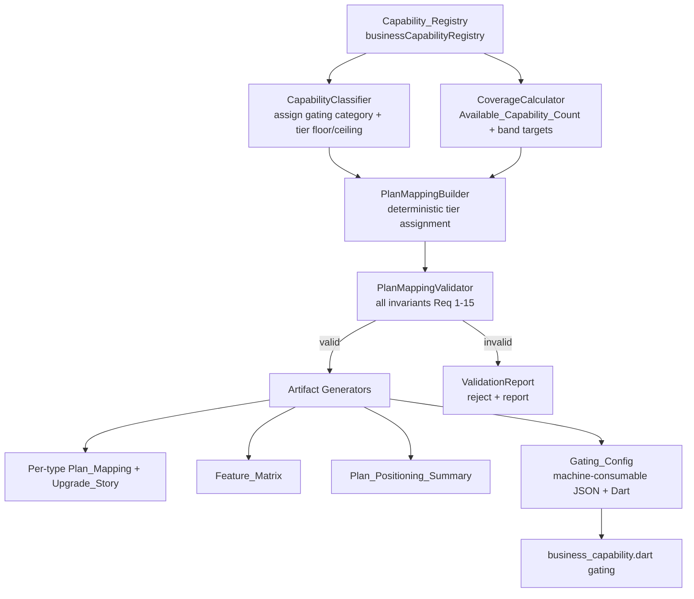
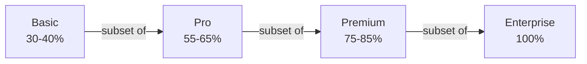

# Design Document

## Overview

The `subscription-plan-tiers` feature introduces a **Tiering_System**: a small, pure-Dart
module that derives, validates, and exports a four-tier subscription plan mapping
(Basic → Pro → Premium → Enterprise) for every registered business type in DukanX.

The single source of truth is `businessCapabilityRegistry` in
`lib/core/isolation/business_capability.dart`. The registry decides which
`BusinessCapability` values a business type may ever access (hard isolation). The
Tiering_System never invents capabilities: it only partitions a type's *registered*
capabilities into ordered, cumulative tiers and refuses any mapping that would grant a
capability the registry does not list.

The feature ships three human-facing artifacts and one machine-consumable artifact:

1. **Per-type Plan_Mapping** with Upgrade_Story narratives (Req 16).
2. **Feature_Matrix** — capability-by-tier grid across all types (Req 17).
3. **Plan_Positioning_Summary** — tier value narratives for pricing/product (Req 18).
4. **Gating_Config** — a serializable map of `(businessType, tier) → Set<BusinessCapability>`
   that drives gating logic in `business_capability.dart` without manual transcription (Req 19).

This release also registers five business types that already have feature code under
`lib/features/` but are absent from the registry today — **bookStore, jewellery, autoParts,
decorationCatering, schoolErp** — using only `BusinessCapability` identifiers that already
exist in the enum (Req 4). After registration all 19 types are treated identically.

### Design goals

- **Correctness first.** Every requirement that constrains the mapping is expressed as a
  machine-checkable invariant. The mapping is only valid if it survives all of them.
- **Determinism.** Given the registry, the produced Plan_Mapping is deterministic and
  reproducible, so artifacts and gating logic never drift apart.
- **Separation.** Capability classification, tier assignment, validation, and artifact
  rendering are independent units so each can be tested in isolation.
- **No new runtime dependencies.** The module is plain Dart on top of the existing enum.

### Research notes

- **Source of truth.** Confirmed by reading `business_capability.dart`: the registry currently
  holds 14 types (`grocery, pharmacy, restaurant, clothing, electronics, mobileShop,
  computerShop, hardware, service, wholesale, petrolPump, vegetablesBroker, clinic, other`).
  The five Newly_Registered_Types bring the total to 19. All identifiers named in Requirement 4
  (`useISBN, usePublisherReturns, useLoyaltyPoints, useJobSheets, useRepairStatus, useWarranty,
  useDecorationThemes, useCateringMenu, useCateringKitchen, useVenueManagement, useEventBooking,
  useEventInventory, useEventStaffAllocation, useEventReports, useStudentRegistry,
  useFeeCollection, useAttendanceTracking, useTimetable, useTestResults, useCertificates,
  useScholarshipDiscount, useParentNotifications, useCourseMaterial, useDemoClasses`) already
  exist in the `BusinessCapability` enum, so registration adds map entries only — no enum edits.
- **Billing_Core mapping.** The glossary maps `useInvoiceCreate, useInvoiceList, useInvoiceSearch`
  to the enum members `useInvoiceCreate, useInvoiceList, useInvoiceSearch`. Verified against the
  registry: 18 of the 19 types contain all three and land them wholly at Basic (Req 5.1). The
  `'other'` type is the one **partial** Billing_Core case — it registers `useInvoiceCreate` and
  `useInvoiceList` but not `useInvoiceSearch`, so it follows Req 5.3 (place the present members at
  Basic, record the absent `useInvoiceSearch` as a hard-isolation exception) in combination with
  the `'other'`-specific rules of Req 14.
- **Testing library.** The Dukan_x package has no property-based testing library today
  (`pubspec.yaml` dev-deps: `flutter_test`, `integration_test`, `mockito`, ...). The Tiering_System
  is pure logic over finite enums, which is an ideal property-based-testing target. The design
  adopts a property-based testing library for Dart (see Testing Strategy) rather than hand-rolling
  generators.

## Architecture

The Tiering_System is a layered pipeline. Input is the `Capability_Registry`; output is the four
artifacts. Each stage is pure and independently testable.



### Tier order

Tiers are strictly ordered and cumulative.



Higher tiers always contain every capability of every lower tier (Req 2, Req 19.5). Because the
model is cumulative, a "tier" is fully described by the set of capabilities granted at that tier,
and the **Tier_Delta** of a tier is `tier.capabilities \ nextLowerTier.capabilities`.

### Stage responsibilities

| Stage | Responsibility | Requirements |
|-------|----------------|--------------|
| `CapabilityClassifier` | Tag each capability with a gating category that fixes its lowest and highest legal tier. | 5, 9, 10, 11, 12 |
| `CoverageCalculator` | Compute `Available_Capability_Count` and the integer target size of each tier band; flag deviations. | 1, 3.5 |
| `PlanMappingBuilder` | Deterministically assign registered capabilities to tiers honoring all hard constraints. | 2, 5, 6, 7, 8, 12, 13, 14 |
| `PlanMappingValidator` | Independently re-check a proposed mapping against every invariant; reject + report. | 2, 3, 5, 6, 7, 8, 9, 10, 11, 13, 14, 15 |
| `GatingConfig` (+ codec) | Serialize/deserialize the mapping for engineering consumption. | 19 |
| Artifact generators | Render Plan_Mapping, Upgrade_Story, Feature_Matrix, Plan_Positioning_Summary. | 16, 17, 18 |

The **builder** and the **validator** are deliberately separate implementations. The builder
produces a mapping; the validator proves it correct. Property tests exercise both: the builder's
output must always pass the validator, and the validator must reject any mapping mutated to break
a rule.

## Components and Interfaces

All code lives under `lib/core/subscription/`. Types below are expressed in Dart.

### SubscriptionTier

```dart
/// The four ordered subscription plans. `index` encodes order:
/// basic(0) < pro(1) < premium(2) < enterprise(3).
enum SubscriptionTier {
  basic,
  pro,
  premium,
  enterprise;

  bool operator <(SubscriptionTier other) => index < other.index;
  bool operator <=(SubscriptionTier other) => index <= other.index;

  /// Tier_Coverage band as inclusive [minPercent, maxPercent].
  /// Enterprise is exactly 100%.
  CoverageBand get band => switch (this) {
        SubscriptionTier.basic => const CoverageBand(30, 40),
        SubscriptionTier.pro => const CoverageBand(55, 65),
        SubscriptionTier.premium => const CoverageBand(75, 85),
        SubscriptionTier.enterprise => const CoverageBand(100, 100),
      };
}
```

### CapabilityClassifier

Maps a `BusinessCapability` to the gating rules that bound where it may sit. The floor is the
lowest legal tier; the ceiling is the highest legal tier.

```dart
enum GatingCategory {
  billingCore,        // Req 5  : floor=basic,   ceiling=basic
  analyticsExport,    // Req 9  : floor=premium, ceiling=enterprise
  enterpriseOnly,     // Req 10 : floor=enterprise, ceiling=enterprise
  complianceSeasonal, // Req 11 : floor=premium, ceiling=enterprise
  standard,           // floor=basic, ceiling=enterprise
}

class CapabilityClassifier {
  /// Lowest tier a capability may be assigned to.
  SubscriptionTier floorFor(BusinessCapability cap);

  /// Highest tier a capability may be assigned to.
  SubscriptionTier ceilingFor(BusinessCapability cap);

  GatingCategory categoryOf(BusinessCapability cap);
}
```

Fixed category membership (from the enum identifiers in `business_capability.dart`):

- **billingCore** = `{useInvoiceCreate, useInvoiceList, useInvoiceSearch}` (Req 5; Req 5.6 makes
  Billing_Core win over any analytics gating).
- **analyticsExport** = `{useInventoryExport, usePurchaseRegister, useDeadStock,
  useRevenueOverview}` (Req 9). `useRevenueOverview` is treated as full-history revenue analytics.
- **enterpriseOnly** = `{useCreditManagement, useCreditLimit, useDispatchNote, useStockReversal,
  useProformaInvoice}` (Req 10).
- **complianceSeasonal** = `{useDrugSchedule, useBatchExpiry, useFuelManagement,
  useShiftManagement}` (Req 11).
- **standard** = every other capability.

### WorkflowPairs

```dart
/// Capabilities that must always share a tier (registered members only).
const List<Set<BusinessCapability>> workflowPairs = [
  {BusinessCapability.usePurchaseOrder, BusinessCapability.useSupplierBill}, // Req 7.1
  {BusinessCapability.useIMEI, BusinessCapability.useWarranty},             // Req 8.1
  {BusinessCapability.useJobSheets, BusinessCapability.useRepairStatus},    // Req 8.2
  {BusinessCapability.usePrescription, BusinessCapability.useDoctorLinking},// Req 8.3
  {BusinessCapability.usePatientRegistry, BusinessCapability.useAppointments}, // Req 8.4
];

/// Ordering constraint, not an equality pair: useStockEntry tier <= usePurchaseOrder tier (Req 7.2).
```

### CoverageCalculator

```dart
class CoverageBand {
  final int minPercent; // inclusive
  final int maxPercent; // inclusive
  const CoverageBand(this.minPercent, this.maxPercent);

  /// Integer tier sizes (capability counts) that land inside the band for a
  /// given Available_Capability_Count. Empty when no integer fits the band.
  List<int> feasibleSizes(int availableCount);
}

class CoverageCalculator {
  int availableCount(String businessType); // distinct registered capabilities

  /// Tier_Coverage of a tier = |tier.capabilities| / availableCount * 100.
  double coverageOf(PlanMapping mapping, SubscriptionTier tier);

  /// Records (band, chosenSize, deviationReason?) per tier (Req 1.6, 6.3).
  List<TierCoverageRecord> evaluate(PlanMapping mapping);
}
```

### PlanMappingBuilder

```dart
class PlanMappingBuilder {
  PlanMappingBuilder(this.classifier, this.calculator);

  /// Deterministically build the cumulative four-tier mapping for one type.
  /// Throws BuildInfeasibleError only if hard constraints cannot be met
  /// (which the validator would also reject).
  PlanMapping buildFor(String businessType);

  /// Build mappings for all 19 registered types.
  Map<String, PlanMapping> buildAll();
}
```

Builder algorithm (per type), summarized:

1. Read the registered capability set `R` from `Capability_Registry` (source of truth).
2. If `|R| == 0`, emit empty tiers and skip band evaluation (Req 1.7).
3. Special-case `'other'`: Basic = 3 fixed capabilities, Pro = Premium = Enterprise = all 6
   (Req 14); mark plan-washing/Enterprise-distinct-addition exceptions.
4. Otherwise:
   - Place every **billingCore** member registered in `R` at Basic (Req 5).
   - Reserve **enterpriseOnly** members for Enterprise only; **analyticsExport** and
     **complianceSeasonal** members for Premium or Enterprise only.
   - Identify the **single most essential vertical capability** and ensure it (and its workflow
     pair, if any) lands at Pro or below (Req 12).
   - Fill each tier up to its `feasibleSize` target, choosing capabilities so that workflow pairs
     stay together (Req 7, 8), `useStockEntry ≤ usePurchaseOrder` (Req 7.2), and Service_Only_Type
     deltas use only workflow/reporting/staff/customer capabilities (Req 13).
   - Make tiers cumulative (each tier is the union with all lower tiers).
   - Ensure Enterprise = `R` (100%) and that Enterprise adds ≥2 capabilities over Premium for
     types large enough to differentiate (Req 15).
5. Record Tier_Delta, essential-vertical rationale, workflow-pair tiers, and any deviations.

### PlanMappingValidator

```dart
class ValidationViolation {
  final String rule;            // e.g. "Req 5.5 billing-core-split"
  final String businessType;
  final SubscriptionTier? tier;
  final BusinessCapability? capability;
  final String message;
}

class ValidationResult {
  final bool isValid;
  final List<ValidationViolation> violations;
}

class PlanMappingValidator {
  PlanMappingValidator(this.classifier, this.calculator);

  /// Re-checks every invariant. Pure; never mutates input.
  ValidationResult validate(String businessType, PlanMapping mapping);

  ValidationResult validateAll(Map<String, PlanMapping> mappings);
}
```

Validator checks (each maps to a property): subset monotonicity (Req 2), hard isolation +
completeness (Req 3), coverage bands/deviation (Req 1), billing core placement (Req 5), non-empty
deltas (Req 6), workflow cohesion (Req 7, 8), analytics/export gating (Req 9), enterprise-only
gating (Req 10), compliance/seasonal gating (Req 11), essential-vertical at Pro (Req 12),
service-only deltas (Req 13), 'other' exception (Req 14), no plan-washing (Req 15).

### Artifact generators

```dart
class UpgradeStory {
  final SubscriptionTier from;
  final SubscriptionTier to;
  final Set<BusinessCapability> addedCapabilities; // == Tier_Delta of `to`
  final String narrative;
}

class FeatureMatrix {
  /// included[businessType][capability] = lowest tier at which it is granted,
  /// or null when Hard_Isolated for that type.
  Map<String, Map<BusinessCapability, SubscriptionTier?>> included;
}

class PlanPositioningSummary {
  final Map<SubscriptionTier, TierPositioning> tiers; // customer, narrative, trigger, anchors
}
```

### GatingConfig (machine-consumable, Req 19)

```dart
class GatingConfig {
  /// grants[businessType][tier] = capabilities granted at that tier (cumulative).
  final Map<String, Map<SubscriptionTier, Set<BusinessCapability>>> grants;

  /// Stable JSON using exact enum identifier names (Req 19.2).
  Map<String, dynamic> toJson();
  factory GatingConfig.fromJson(Map<String, dynamic> json);

  /// Build directly from a validated set of plan mappings.
  factory GatingConfig.fromMappings(Map<String, PlanMapping> mappings);
}
```

## Data Models

### PlanMapping

The central per-type model. Tiers are stored as cumulative capability sets so monotonicity is
structural, not merely asserted.

```dart
class PlanMapping {
  final String businessType;

  /// Cumulative capability set per tier. Invariant:
  /// basic ⊆ pro ⊆ premium ⊆ enterprise == registeredCapabilities.
  final Map<SubscriptionTier, Set<BusinessCapability>> tiers;

  /// Distinct registered capabilities (== enterprise tier set). Source: registry.
  final Set<BusinessCapability> registeredCapabilities;

  /// Tier_Delta per tier (added vs. next-lower tier). enterprise.delta over premium etc.
  final Map<SubscriptionTier, Set<BusinessCapability>> deltas;

  /// The single most essential vertical capability + rationale (Req 12).
  final BusinessCapability? essentialVerticalCapability;
  final String essentialVerticalRationale;

  /// Workflow pairs present for this type and the tier they share (Req 7.4, 8).
  final Map<String, SubscriptionTier> workflowPairTiers;

  /// Recorded deviations/exceptions (Req 1.6, 5.3, 6.3, 14.5, 15.x).
  final List<MappingNote> notes;
}
```

### Newly registered registry entries (Req 4)

These entries are added to `businessCapabilityRegistry` using only existing enum members. Counts
shown are the resulting `Available_Capability_Count`.

| Type | Vertical / required members (Req 4) | Standard members added | Count |
|------|-------------------------------------|------------------------|-------|
| `bookStore` | `useISBN, usePublisherReturns` | 7 product, inventory `{list, visibleStock, deadStock, search}`, invoice `{create, list, search}`, alerts `{lowStockAlert, dailySnapshot, revenueOverview}`, purchase `{purchaseOrder, stockEntry, supplierBill}`, `useBarcodeScanner, useStockManagement` | 24 |
| `jewellery` | `useLoyaltyPoints` | 7 product, inventory `{list, visibleStock, search}`, invoice `{create, list, search}`, alerts `{dailySnapshot, revenueOverview}`, purchase `{purchaseOrder, stockEntry, supplierBill}`, `useStockManagement` | 20 |
| `autoParts` | `useJobSheets, useRepairStatus, useWarranty` | 7 product, inventory `{list, visibleStock, search}`, invoice `{create, list, search}`, alerts `{lowStockAlert, dailySnapshot, revenueOverview}`, purchase `{purchaseOrder, stockEntry, supplierBill}`, `useBarcodeScanner, useStockManagement` | 24 |
| `decorationCatering` *(service-only)* | `useDecorationThemes, useCateringMenu, useCateringKitchen, useVenueManagement, useEventBooking, useEventInventory, useEventStaffAllocation, useEventReports` | invoice `{create, list, search}` | 11 |
| `schoolErp` *(service-only)* | `useStudentRegistry, useFeeCollection, useAttendanceTracking, useTimetable, useTestResults, useCertificates, useScholarshipDiscount, useParentNotifications, useCourseMaterial, useDemoClasses` | invoice `{create, list, search}` | 13 |

`decorationCatering` and `schoolErp` carry no product or inventory capabilities, so they are
Service_Only_Type values alongside `service` and `clinic` (Req 13.1). Any standard member added
above is drawn only from identifiers already present in the enum (Req 4.2), and the builder will
reject any entry that names an undefined identifier (Req 4.9).

### Available_Capability_Count per type (derived from Capability_Registry)

These counts are computed dynamically by `CoverageCalculator` and are shown here as the grounding
for coverage-band math. The 14 existing counts are read from the current registry; the 5 new ones
follow from the table above.

| Type | Count | Basic (30–40%) | Pro (55–65%) | Premium (75–85%) | Enterprise (100%) |
|------|------:|---------------:|-------------:|-----------------:|------------------:|
| grocery | 27 | 9–10 | 15–17 | 21–22 | 27 |
| pharmacy | 34 | 11–13 | 19–22 | 26–28 | 34 |
| restaurant | 25 | 8–10 | 14–16 | 19–21 | 25 |
| clothing | 23 | 7–9 | 13–14 | 18–19 | 23 |
| electronics | 24 | 8–9 | 14–15 | 18–20 | 24 |
| mobileShop | 27 | 9–10 | 15–17 | 21–22 | 27 |
| computerShop | 26 | 8–10 | 15–16 | 20–22 | 26 |
| hardware | 24 | 8–9 | 14–15 | 18–20 | 24 |
| service *(service-only)* | 9 | 3 | 5 | 7 | 9 |
| wholesale | 34 | 11–13 | 19–22 | 26–28 | 34 |
| petrolPump | 25 | 8–10 | 14–16 | 19–21 | 25 |
| vegetablesBroker | 23 | 7–9 | 13–14 | 18–19 | 23 |
| clinic *(service-only)* | 10 | 3–4 | 6 | 8 | 10 |
| other *(special, Req 14)* | 6 | 3 (fixed) | 6 | 6 | 6 |
| bookStore | 24 | 8–9 | 14–15 | 18–20 | 24 |
| jewellery | 20 | 6–8 | 11–13 | 15–17 | 20 |
| autoParts | 24 | 8–9 | 14–15 | 18–20 | 24 |
| decorationCatering *(service-only)* | 11 | 4 | 7 | 9 | 11 |
| schoolErp *(service-only)* | 13 | 4–5 | 8 | 10–11 | 13 |

Every type except `'other'` has at least one integer tier size inside each band, so the deviation
path (Req 1.6) is reserved for edge cases and is recorded as a `MappingNote` when used. The
`'other'` type is the documented exception (Req 14, Req 15.5).

### Gating_Config JSON shape (Req 19)

```json
{
  "version": 1,
  "tierOrder": ["basic", "pro", "premium", "enterprise"],
  "grants": {
    "grocery": {
      "basic":      ["useInvoiceCreate", "useInvoiceList", "useInvoiceSearch", "..."],
      "pro":        ["...cumulative superset of basic..."],
      "premium":    ["...cumulative superset of pro..."],
      "enterprise": ["...all registered capabilities..."]
    }
  }
}
```

Identifier strings are the exact `BusinessCapability` enum names (Req 19.2). The codec round-trips:
`GatingConfig.fromJson(config.toJson())` reproduces the same per-tier sets, and every string must
resolve to a registered capability for its type or the codec rejects the config (Req 19.3, 19.4).

## Correctness Properties

*A property is a characteristic or behavior that should hold true across all valid executions of
a system — essentially, a formal statement about what the system should do. Properties serve as
the bridge between human-readable specifications and machine-verifiable correctness guarantees.*

The Tiering_System is pure logic over the finite `BusinessCapability` enum and the
`Capability_Registry`, with strong universal invariants (monotonicity, hard isolation, coverage
bands, gating, serialization round-trips). This makes it an ideal property-based-testing target.

Generators draw business types from the full set of 19 registered types (including the five
Newly_Registered_Types), and additionally synthesize randomized registry entries (random subsets
of `BusinessCapability.values`, including empty and tiny sets) to exercise edge bands and
deviation paths. "Valid mapping" below means a mapping produced by `PlanMappingBuilder` for the
given registry. Each rejection-direction property mutates a valid mapping to break exactly one
rule and asserts the validator reports it.

### Property 1: Coverage bands hold per tier

*For all* registered business types other than `'other'` with a non-zero
`Available_Capability_Count`, each tier's Tier_Coverage falls within its band — Basic 30–40%,
Pro 55–65%, Premium 75–85% — and Enterprise is exactly 100%, unless the assignment is a recorded
deviation. The `'other'` type is governed instead by the explicit counts of Requirement 14.

**Validates: Requirements 1.2, 1.3, 1.4, 1.5**

### Property 2: Infeasible bands pick the closest ordering-preserving size

*For any* business type whose `Available_Capability_Count` makes a band unsatisfiable by an exact
integer, the chosen tier size is a feasible value minimizing the distance to the band that still
preserves tier ordering, and a deviation justification is recorded.

**Validates: Requirements 1.6**

### Property 3: Tier subset monotonicity

*For all* business types, the Basic capability set is a subset of Pro, Pro is a subset of Premium,
and Premium is a subset of Enterprise; and *for any* valid mapping, removing a capability from a
higher tier (so a lower-tier capability is no longer contained above) causes the validator to
reject the mapping and report the violating capability and tier.

**Validates: Requirements 2.1, 2.2, 2.3, 2.4**

### Property 4: Hard isolation and completeness

*For all* business types, every capability assigned to any tier is a Registered_Capability for
that type and the union of the four tiers equals exactly the registered capability set; and *for
any* valid mapping, inserting a Hard_Isolated_Capability into any tier causes the validator to
reject the mapping and report the offending capability and business type.

**Validates: Requirements 3.1, 3.2, 3.4**

### Property 5: Available_Capability_Count is sourced only from the registry

*For all* business types, `CoverageCalculator.availableCount(type)` equals the number of distinct
`BusinessCapability` values listed for that type in `Capability_Registry`.

**Validates: Requirements 3.5**

### Property 6: Registered billing-core members live at Basic

*For all* business types, every registered member of Billing_Core (`useInvoiceCreate`,
`useInvoiceList`, `useInvoiceSearch`) is assigned to Basic_Tier (and therefore to every higher
tier), even when a member would otherwise fall under analytics gating; and *for any* valid
mapping, moving a registered billing-core member above Basic causes the validator to reject the
mapping and report the split.

**Validates: Requirements 5.1, 5.2, 5.3, 5.5, 5.6**

### Property 7: Tier deltas are non-empty and correctly recorded

*For all* business types whose `Available_Capability_Count` permits, the Tier_Delta of Pro,
Premium, and Enterprise each contains at least one capability; for every tier the recorded
Tier_Delta equals that tier's capabilities minus the next-lower tier's capabilities; and *for any*
valid mapping, collapsing two tiers to produce an empty delta where the count permits a non-empty
delta causes the validator to reject the mapping and report the affected tier.

**Validates: Requirements 6.1, 6.2, 6.4**

### Property 8: Workflow pairs share a tier

*For all* business types and *for all* defined Workflow_Pairs (`{usePurchaseOrder, useSupplierBill}`,
`{useIMEI, useWarranty}`, `{useJobSheets, useRepairStatus}`, `{usePrescription, useDoctorLinking}`,
`{usePatientRegistry, useAppointments}`), the registered members of each pair are assigned to the
same tier and that tier is documented; and *for any* valid mapping, assigning the registered
members of a pair to different tiers causes the validator to reject the mapping and report the
split pair and business type.

**Validates: Requirements 7.1, 7.3, 7.4, 8.1, 8.2, 8.3, 8.4, 8.5**

### Property 9: Stock entry never unlocks after purchase order

*For all* business types whose registry includes both `useStockEntry` and `usePurchaseOrder`, the
tier of `useStockEntry` is less than or equal to the tier of `usePurchaseOrder`.

**Validates: Requirements 7.2**

### Property 10: Analytics and export capabilities gated at Premium and above

*For all* business types, every registered analytics-or-export capability (`useInventoryExport`,
`usePurchaseRegister`, `useDeadStock`, full-history `useRevenueOverview`) is assigned only to
Premium_Tier or Enterprise_Tier; and *for any* valid mapping, assigning such a capability to Basic
or Pro causes the validator to reject the mapping and report the violating capability and tier.

**Validates: Requirements 9.1, 9.2, 9.3, 9.4, 9.5**

### Property 11: Bulk, B2B, and financial-risk capabilities gated at Enterprise

*For all* business types, every registered capability in `{useCreditManagement, useCreditLimit,
useDispatchNote, useStockReversal, useProformaInvoice}` is assigned only to Enterprise_Tier; and
*for any* valid mapping, assigning such a capability below Enterprise causes the validator to
reject the mapping and report the violating capability and tier.

**Validates: Requirements 10.1, 10.2, 10.3, 10.4, 10.5, 10.6**

### Property 12: Compliance and seasonal capabilities gated at Premium and above

*For all* business types, every registered capability in `{useDrugSchedule, useBatchExpiry,
useFuelManagement, useShiftManagement}` is assigned only to Premium_Tier or Enterprise_Tier; and
*for any* valid mapping, assigning such a capability to Basic or Pro causes the validator to reject
the mapping and report the violating capability and tier.

**Validates: Requirements 11.1, 11.2, 11.3, 11.4, 11.5**

### Property 13: Single essential vertical capability available by Pro

*For all* business types with a non-zero `Available_Capability_Count`, exactly one registered
capability is identified as the single most essential vertical capability with a non-empty
rationale, it is assigned to Pro_Tier or lower, and when it belongs to a Workflow_Pair the
registered members of that pair are together assigned no higher than Pro_Tier.

**Validates: Requirements 12.1, 12.2, 12.3, 12.4**

### Property 14: Service-only deltas avoid product and inventory capabilities

*For all* Service_Only_Type business types (`service`, `clinic`, `schoolErp`,
`decorationCatering`), no Tier_Delta contains a product or inventory capability; and *for any*
valid service-only mapping, injecting a product or inventory capability into a delta causes the
validator to reject the mapping and report the affected tier.

**Validates: Requirements 13.2, 13.3, 13.4**

### Property 15: No plan-washing for differentiable types

*For all* business types other than `'other'` whose `Available_Capability_Count` permits
differentiation, the Premium and Enterprise capability sets are not identical and Enterprise adds
at least two distinct capabilities over Premium; and *for any* valid mapping, making Premium and
Enterprise identical for such a type causes the validator to reject the mapping and report the
business type.

**Validates: Requirements 15.1, 15.2, 15.3, 15.4**

### Property 16: Mapping and upgrade-story completeness

*For all* 19 target business types, the Plan_Mapping defines all four tier capability sets and
provides exactly three Upgrade_Stories (Basic→Pro, Pro→Premium, Premium→Enterprise) whose added
capabilities equal the Tier_Delta of the higher tier in each transition.

**Validates: Requirements 16.1, 16.2, 16.3, 16.4**

### Property 17: Feature matrix is consistent with the mapping

*For all* business types, the Feature_Matrix records every Registered_Capability against the four
tiers and marks a Hard_Isolated_Capability as not-applicable; a capability marked included at a
tier is also included at every higher tier; and reconstructing the tier capability sets from the
matrix reproduces the Plan_Mapping exactly.

**Validates: Requirements 17.1, 17.2, 17.3, 17.4**

### Property 18: Gating_Config validity and serialization round-trip

*For all* business types and tiers, the Gating_Config grant set equals the corresponding
Plan_Mapping tier set, every granted capability is a Registered_Capability for its type, and the
tiers remain cumulative (Basic ⊆ Pro ⊆ Premium ⊆ Enterprise) after serialization; decoding an
encoded config (`GatingConfig.fromJson(config.toJson())`) reproduces an equal config using exact
enum identifier names; and *for any* config, injecting a non-registered capability causes
validation to reject it and report the offending entry.

**Validates: Requirements 19.1, 19.2, 19.3, 19.4, 19.5**

## Error Handling

The Tiering_System fails safe: an invalid or unprovable mapping is **never** emitted as an
artifact or applied to gating. Errors fall into three groups.

### Build-time infeasibility

`PlanMappingBuilder.buildFor` throws `BuildInfeasibleError` when hard constraints cannot be
simultaneously satisfied (for example, gating floors/ceilings that leave a band with no legal
assignment). The error carries the business type, the conflicting constraints, and the tier
involved. Builds run for all 19 types up front (`buildAll`), so any infeasibility surfaces before
artifacts are generated.

### Validation rejection (Req 2.4, 3.2, 4.9, 5.5, 6.2, 7.3, 8.5, 9.5, 10.6, 11.5, 13.3, 15.4, 19.4)

`PlanMappingValidator.validate` returns a `ValidationResult` with `isValid == false` and one
`ValidationViolation` per broken rule. Each violation names the rule, business type, and — where
applicable — the offending capability and tier. The pipeline treats a non-empty violation list as
fatal for that type: artifacts and Gating_Config are not produced for a type that fails validation,
and `validateAll` aggregates violations across types into a single `ValidationReport`.

### Fail-safe fallback (Req 3.3)

If the validator itself cannot run (an unexpected exception, missing registry entry, or codec
failure), the pipeline blocks the mapping from taking effect rather than allowing a potentially
forbidden capability to be granted. The default gating outcome in the absence of a *validated*
Gating_Config entry is "capability denied". This guarantees hard isolation is preserved even under
internal failure.

### Registry and enum integrity (Req 4.2, 4.9, 19.4)

When registering the five Newly_Registered_Types, each proposed entry is checked so that every
identifier resolves to an existing `BusinessCapability` enum value; an unresolved identifier is
rejected with the identifier reported. Because Dart enums are closed, runtime entries use enum
references directly (compile-time safe); the proposed-entry validation path additionally guards
any string-keyed or externally-sourced config (such as a loaded Gating_Config) against unknown
identifiers.

### Empty and degenerate inputs (Req 1.7, 5.4, 6.3)

A business type with zero registered capabilities skips coverage-band evaluation and deviation
recording. A type with no Billing_Core member records no billing exception. A type too small to
produce a non-empty delta for a tier is allowed an empty delta with a recorded reason. These paths
are normal outcomes, not errors, and are exercised by the edge-case generators.

## Testing Strategy

The Tiering_System is pure, deterministic logic over finite enums, so it is tested with a
**dual approach**: example/edge unit tests for concrete facts and a property-based suite for the
universal invariants.

### Property-based testing

- **Library.** Adopt a Dart property-based testing library (for example, `glados`, added to
  `dev_dependencies`). Do not hand-roll generators or implement PBT from scratch.
- **Generators.**
  - A business-type generator drawing from all 19 registered types (including the five
    Newly_Registered_Types) so Requirement 4.8 is covered without special-casing.
  - A registry-entry generator producing random subsets of `BusinessCapability.values`, including
    empty sets, tiny sets, partial Billing_Core, and sets rich enough to differentiate tiers, to
    exercise coverage bands (Property 1, 2), service-only deltas, and degenerate paths.
  - A "mutation" generator that takes a valid mapping and breaks exactly one rule (drop a higher-
    tier capability, inject a hard-isolated capability, split a pair, push a gated capability too
    low, collapse a delta, equate Premium and Enterprise) to drive every rejection-direction
    property.
- **Configuration.** Each property test runs a minimum of 100 iterations.
- **Tagging.** Each property test is tagged with a comment referencing its design property in the
  form `Feature: subscription-plan-tiers, Property {number}: {property_text}`.
- **One test per property.** Each of Properties 1–18 is implemented by a single property-based
  test; the builder's output is fed to the validator (forward direction) and mutated inputs drive
  the rejection direction within the same property where applicable.

### Unit, example, and edge-case tests

These cover criteria that are concrete facts or degenerate conditions rather than universal
properties:

- **Tier enum shape** (Req 1.1): four tiers in ascending order.
- **Registry completeness** (Req 4.1): all 19 types present, including the five new ones.
- **New-type membership** (Req 4.3–4.7): each new type's entry contains the required identifiers.
- **Undefined identifier rejection** (Req 4.9): a proposed entry with an unknown identifier is
  rejected and reported.
- **Fail-safe fallback** (Req 3.3): with the validator forced to fail, no mapping is applied and
  gating defaults to denied.
- **'other' type** (Req 14.1–14.5): six capabilities, Basic = exactly three, Pro = all six,
  Premium = Enterprise = Pro, and the exception note recorded; plus exemption from plan-washing
  (Req 15.5).
- **Service-only classification** (Req 13.1): `service`, `clinic`, `schoolErp`,
  `decorationCatering` carry no product/inventory capabilities.
- **Degenerate inputs** (Req 1.7, 5.4, 6.3): empty registry skips band evaluation; no billing-core
  member omits the exception; tiny registry allows a recorded empty delta.
- **Plan_Positioning_Summary** (Req 18.1–18.4): one entry per tier with non-empty target customer,
  value narrative, and upgrade trigger, referencing the Requirement 1 coverage targets and the
  category anchors from Requirements 9, 10, and 11.

### Integration check

A single end-to-end test runs `buildAll` → `validateAll` → artifact generation →
`GatingConfig.fromMappings` → JSON round-trip across all 19 types and asserts the full pipeline
produces validated, mutually consistent artifacts (Plan_Mapping, Feature_Matrix,
Plan_Positioning_Summary, Gating_Config) with zero validation violations. This is the check that
guards against drift between the human-facing artifacts and the machine-consumable Gating_Config
that drives `business_capability.dart`.
