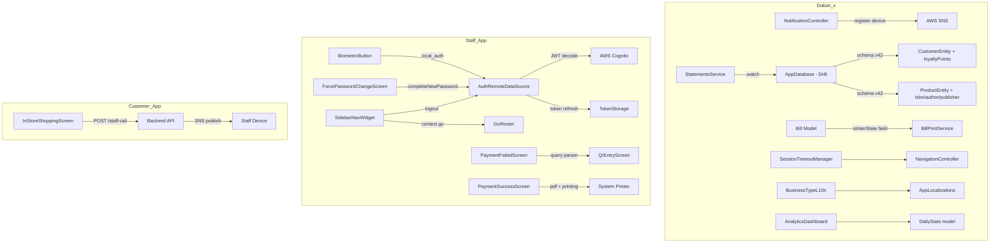

# Design Document: TODO Implementation Completions

## Overview

This design covers the implementation of 18 TODO/FIXME items across the monorepo. The items are independent of each other and span three Flutter applications. The design groups them by subsystem for clarity, but each can be implemented and tested in isolation.

**Key architectural constraints:**
- Backend: AWS (Lambda, DynamoDB, API Gateway, Cognito, SNS)
- Local DB: Drift/SQLite with code generation (Dukan_x)
- Auth: AWS Cognito (staff_petrol_pump_app)
- Routing: GoRouter (staff_petrol_pump_app)
- State: Riverpod (all apps)

## Architecture



## Components and Interfaces

### 1. NotificationController — AWS SNS Integration (Dukan_x)

**Current state:** `getToken()`, `subscribeToTopic()`, `unsubscribeFromTopic()` are no-ops after Firebase removal.

**Design:**
- Add an `AwsSnsService` class that wraps HTTP calls to a backend Lambda endpoint for device registration
- The Lambda endpoint handles SNS `CreatePlatformEndpoint`, `Subscribe`, and `Unsubscribe` API calls
- Device tokens come from platform-specific channels (APNs token on iOS/macOS, FCM equivalent token on Android via platform channel)
- On Windows desktop: skip push registration (local notifications only)

```dart
// New: lib/core/services/aws_sns_service.dart
class AwsSnsService {
  final ApiClient _api;
  
  Future<String?> registerDevice(String platformToken, String userId) async {
    // POST /notifications/register → returns endpointArn
  }
  
  Future<void> subscribe(String endpointArn, String topicArn) async {
    // POST /notifications/subscribe
  }
  
  Future<void> unsubscribe(String endpointArn, String topicArn) async {
    // POST /notifications/unsubscribe
  }
}
```

### 2. Drift Schema Migration v42 (Dukan_x)

**Current state:** Schema version is 41. CustomerEntity lacks `loyaltyPoints`, ProductEntity lacks `isbn`, `author`, `publisher`.

**Design:**
- Bump schema version to 42
- Add columns via `m.addColumn()` in the `onUpgrade` block
- Columns are nullable (or defaulting to 0 for loyaltyPoints) so existing rows are unaffected
- Uncomment the mapping code in `_customerToMap()` and `_productToMap()`

```dart
if (from < 42) {
  await m.addColumn(customers, customers.loyaltyPoints);
  await m.addColumn(products, products.isbn);
  await m.addColumn(products, products.author);
  await m.addColumn(products, products.publisher);
}
```

### 3. Real-Time Customer Bills Stream (Dukan_x)

**Current state:** `watchCustomerBills()` does a one-shot fetch, yields once, then the stream ends.

**Design:**
- Replace the one-shot fetch + yield pattern with a Drift `.watch()` query
- The repository layer should expose a `Stream<List<Bill>>` using Drift's `watchCustomerBillsForStatement()` method
- The service passes through the stream directly

```dart
Stream<List<Bill>> watchCustomerBills({...}) {
  return _repository.watchCustomerBillsForStatement(
    userId: userId,
    customerId: customerId,
    startDate: startDate,
    endDate: endDate,
  );
}
```

### 4. Bill Model isInterState Field (Dukan_x)

**Current state:** An extension provides `bool get isInterState => false;` hardcoded.

**Design:**
- Add `bool isInterState` field to the `Bill` class (default: `false`)
- Include it in `fromJson`/`toJson` serialization
- Remove the `_BillGstExt` extension from `bill_print_service.dart`
- The field is persisted to DynamoDB and synced via the existing sync mechanism

### 5. NavigationController Re-enable (Dukan_x)

**Current state:** The `clearHistory()` call is commented out with a TODO.

**Design:**
- Uncomment the line: `ref.read(navigationControllerProvider.notifier).clearHistory()`
- Add a try-catch guard so if the provider is disposed or unavailable, it logs and continues
- No structural changes needed; this is a simple re-enable with error guard

### 6. ARB Localization for Business Types (Dukan_x)

**Current state:** `BusinessTypeL10n.name()` returns hardcoded English strings.

**Design:**
- Add 19 ARB keys to `app_en.arb`, `app_hi.arb`, `app_mr.arb` (e.g., `businessTypeGrocery`, `businessTypePharmacy`, etc.)
- Update `BusinessTypeL10n.name()` to use `AppLocalizations.of(context)!.businessTypeGrocery` etc.
- Fallback: if `AppLocalizations.of(context)` is null (rare), return the English default

### 7. DailyStats Model Enhancement (Dukan_x)

**Current state:** DailyStats has 6 fields. Dashboard uses `null` for missing metrics.

**Design:**
- Add 4 fields to DailyStats: `todayCollections`, `todayBillCount`, `monthlyBillCount`, `customerCount`
- All new fields default to 0 in `DailyStats.empty()`
- Update the `fromJson` factory to parse new fields from backend response with fallback to 0
- Update the analytics dashboard to read actual values instead of `null`

### 8. Auth Token Validation & Refresh (Staff App)

**Current state:** `loginWithBiometrics()` returns a hardcoded mock user. `isLoggedIn()` only checks token existence. `getCurrentUser()` returns null.

**Design:**
- JWT decoding: use the `dart:convert` base64 decode on token's payload segment (standard JWT structure)
- Token expiration: extract `exp` claim, compare with `DateTime.now().millisecondsSinceEpoch / 1000`
- Refresh flow: use Cognito's `CognitoUser.getSession()` with stored refresh token
- `getCurrentUser()`: decode ID token claims to construct `StaffUserModel`

```dart
// Helper to decode JWT payload
Map<String, dynamic> _decodeJwtPayload(String token) {
  final parts = token.split('.');
  final payload = base64Url.normalize(parts[1]);
  return jsonDecode(utf8.decode(base64Url.decode(payload)));
}

bool _isTokenExpired(String token) {
  final payload = _decodeJwtPayload(token);
  final exp = payload['exp'] as int;
  return DateTime.now().millisecondsSinceEpoch / 1000 >= exp;
}
```

### 9. Force Password Change Wiring (Staff App)

**Current state:** `_changePassword()` has `await Future.delayed(...)` placeholder.

**Design:**
- Add a `completeNewPassword` method to `AuthNotifier` (Riverpod StateNotifier) that delegates to `AuthRemoteDataSource.completeNewPassword()`
- The screen calls `ref.read(authNotifierProvider.notifier).completeNewPassword(staffId, tempPassword, newPassword)`
- On success: navigate to home. On failure: show error.

### 10. Biometric Authentication (Staff App)

**Current state:** Button shows "coming soon" snackbar.

**Design:**
- Use `local_auth` package (already in dependencies or add if missing)
- Flow: check `canCheckBiometrics` → `authenticate()` → call `loginWithBiometrics()` datasource
- Handle `PlatformException` for unsupported devices

```dart
final localAuth = LocalAuthentication();
final canCheck = await localAuth.canCheckBiometrics;
if (!canCheck) { /* show unsupported message */ return; }
final authenticated = await localAuth.authenticate(
  localizedReason: 'Log in with biometrics',
);
if (authenticated) {
  await ref.read(authNotifierProvider.notifier).loginWithBiometrics();
}
```

### 11. Payment Amount Pre-fill (Staff App)

**Current state:** `context.go('/qr/entry')` without passing the amount.

**Design:**
- Pass amount as query parameter: `context.go('/qr/entry?amount=$previousAmount')`
- In `AmountEntryScreen`, read query parameter from `GoRouterState` and pre-fill the text field
- Simple, no new routes needed

### 12. Print Receipt (Staff App)

**Current state:** Shows "Printing receipt..." snackbar with no actual printing.

**Design:**
- Use `pdf` and `printing` packages (already in pubspec)
- Generate a simple receipt PDF: amount, date, time, transaction reference, station name
- Call `Printing.layoutPdf()` to send to system printer
- Wrap in try-catch; show error snackbar on failure

### 13. Sidebar Navigation & Logout (Staff App)

**Current state:** Sales, Inventory, Customers, Settings have empty `onTap: () {}`. Logout is `// TODO`.

**Design:**
- Navigation: Replace empty callbacks with `context.go('/sales')`, `context.go('/inventory')`, `context.go('/customers')`, `context.go('/settings')`
- Routes: Sales, Inventory, Customers, Settings routes may need placeholder screens if not yet defined in GoRouter. Add them to `fuelpos_router.dart` as simple placeholder pages.
- Logout: Call `AuthRemoteDataSource.logout()`, clear Riverpod state, navigate to `/login`

### 14. Staff Call Notification (Customer App)

**Current state:** "Call Staff" button just pops the dialog.

**Design:**
- Add an API service method: `POST /stores/{storeId}/staff-call` with body `{ "location": "...", "reason": "product_not_found" }`
- Backend Lambda receives request, looks up on-duty staff for that store, publishes SNS notification
- On success: show confirmation. On failure: show error.

## Data Models

### DailyStats (Updated)

```dart
class DailyStats {
  final double todaySales;
  final double todaySpend;
  final double totalPending;
  final int lowStockCount;
  final double paidThisMonth;
  final double overdueAmount;
  // New fields
  final double todayCollections;
  final int todayBillCount;
  final int monthlyBillCount;
  final int customerCount;
}
```

### Bill Model (Updated)

```dart
class Bill {
  // ... existing fields ...
  bool isInterState; // NEW: default false, determines IGST vs CGST+SGST
}
```

### Drift CustomerEntity (v42)

```dart
// In tables.dart
class Customers extends Table {
  // ... existing columns ...
  IntColumn get loyaltyPoints => integer().withDefault(const Constant(0))();
}
```

### Drift ProductEntity (v42)

```dart
// In tables.dart
class Products extends Table {
  // ... existing columns ...
  TextColumn get isbn => text().nullable()();
  TextColumn get author => text().nullable()();
  TextColumn get publisher => text().nullable()();
}
```

### JWT Payload Structure (Cognito)

```json
{
  "sub": "uuid",
  "custom:role": "pump_operator",
  "custom:station_id": "STATION-001",
  "name": "Staff Name",
  "exp": 1719849600,
  "iat": 1719846000
}
```

## Error Handling

| Component | Error Scenario | Handling |
|-----------|---------------|----------|
| SNS Registration | Network failure | Log error, retry on next app launch |
| SNS Subscribe/Unsubscribe | Invalid endpoint | Log error, return gracefully |
| Drift Migration | Column already exists | Drift handles idempotently via version check |
| Token Decode | Malformed JWT | Throw auth exception, force credential login |
| Token Refresh | Refresh token expired | Throw auth exception, redirect to login |
| Biometric Auth | Not available | Show "not supported" message |
| Print Receipt | Printer not found | Show error snackbar |
| Staff Call API | Network failure | Show error message in dialog |
| Navigation Re-enable | Provider disposed | Catch exception, log, continue lock |
| GoRouter navigation | Route not found | GoRouter redirects to error page |

## Testing Strategy

### Testing Approach

This feature set is primarily composed of:
- **Integration wiring** (connecting existing components)
- **Schema migrations** (database DDL)
- **UI navigation** (route changes)
- **External service calls** (AWS SNS, Cognito)

Most items are **not suitable for property-based testing** because:
- Schema migrations are deterministic DDL operations (test with 1 migration test)
- Navigation is UI event → route assertion (example-based)
- Auth flows interact with external Cognito service (integration test with mocks)
- Push notifications are side-effect-only operations

**The two items suitable for property-based testing are:**
1. **JWT decoding** — pure function, input varies meaningfully (different token payloads, expiration times)
2. **DailyStats fromJson parsing** — pure function, input varies (different field combinations, missing fields, zero values)

### Unit Tests (Example-based)
- Drift migration test: verify columns exist after migration
- `_customerToMap` includes `loyaltyPoints`
- `_productToMap` includes `isbn`, `author`, `publisher`
- Bill model serialization includes `isInterState`
- `BusinessTypeL10n.name()` returns localized string for each type
- Navigation controller `clearHistory()` is called on session lock
- Sidebar navigation calls `context.go()` with correct routes
- Receipt PDF generation produces valid PDF bytes
- Staff call API sends correct request

### Integration Tests (Mock-based)
- SNS service: mock HTTP client, verify registration/subscribe/unsubscribe calls
- Auth token refresh: mock Cognito responses, verify token storage updates
- Biometric login: mock `local_auth`, verify datasource call on success
- Logout flow: verify token clear + navigation

### Property-Based Tests
- JWT decode: for any valid 3-segment base64url token, decode extracts payload correctly
- DailyStats.fromJson: for any map with subset of expected keys, parsing produces valid model with defaults for missing keys

## Correctness Properties

*A property is a characteristic or behavior that should hold true across all valid executions of a system — essentially, a formal statement about what the system should do. Properties serve as the bridge between human-readable specifications and machine-verifiable correctness guarantees.*

### Property 1: JWT Decode Round-Trip

*For any* valid JWT payload map (containing string/int values), encoding it as a JWT token (header.payload.signature) and then decoding with `_decodeJwtPayload()` SHALL produce a map equivalent to the original payload.

**Validates: Requirements 9.1, 10.1, 11.1**

### Property 2: Token Expiration Detection

*For any* JWT token with an `exp` claim, `_isTokenExpired()` SHALL return true if and only if the exp value is less than or equal to the current Unix timestamp.

**Validates: Requirements 10.1, 10.2**

### Property 3: DailyStats Parsing Resilience

*For any* JSON map containing a subset of DailyStats fields (with numeric values or missing keys), `DailyStats.fromJson()` SHALL produce a valid DailyStats instance where missing fields default to zero and present fields match their input values.

**Validates: Requirements 8.1, 8.3**

### Property 4: Bill Model isInterState Serialization Round-Trip

*For any* Bill instance with isInterState set to either true or false, serializing to JSON and deserializing back SHALL preserve the isInterState value.

**Validates: Requirements 5.1, 5.2**

### Property 5: Customer Map Contains loyaltyPoints

*For any* CustomerEntity with a non-negative loyaltyPoints value, `_customerToMap()` SHALL produce a map where the 'loyaltyPoints' key equals the entity's loyaltyPoints field.

**Validates: Requirements 2.2**

### Property 6: Product Map Contains Book Fields

*For any* ProductEntity with isbn, author, and publisher values (including null), `_productToMap()` SHALL produce a map containing those exact field values.

**Validates: Requirements 3.2**
