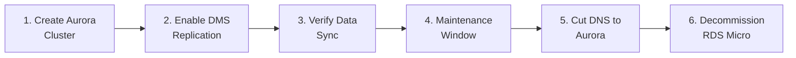

# BizMate Scalability Guide

## RDS Micro → Aurora Serverless v2 Migration

### When to Migrate
| Signal | Free Tier Limit | Action Trigger |
|--------|----------------|----------------|
| CPU consistently > 70% | 1 vCPU | Migrate |
| FreeableMemory < 200MB | 1 GB RAM | Migrate |
| Active connections > 50 | ~60 max | Add RDS Proxy first |
| Storage > 15GB | 20 GB SSD | Migrate |
| Monthly users > 500 | N/A | Migrate |

### Migration Steps (Minimal Downtime)



1. **Create Aurora Serverless v2 cluster** (min 0.5 ACU, max 2 ACU)
2. **Set up AWS DMS** for continuous replication from RDS to Aurora
3. **Verify** row counts and data integrity
4. **Schedule 5-min maintenance window** — stop Lambdas, let DMS catch up
5. **Update `DATABASE_URL`** in Lambda env vars to point to Aurora
6. **Re-enable Lambdas**, verify functionality, decommission old RDS

### What Changes in Code
**Nothing.** The service layer connects via `DATABASE_URL` — Aurora uses the same PostgreSQL wire protocol.

### Cost Impact
| Tier | Monthly Cost |
|------|-------------|
| RDS db.t3.micro (current) | **$0** (Free Tier) |
| Aurora Serverless v2 (0.5–2 ACU) | ~$43–$170 |
| + RDS Proxy (recommended) | ~$15 |

---

## Lambda → Container (ECS Fargate) Migration

### When to Consider
- Cold starts > 3s affecting UX
- Request duration > 15 min (Lambda hard limit)
- Need WebSocket/SSE for real-time features

### What Changes
Only the **handlers/** layer. The **services/** layer is already portable:

```
Lambda (current)           →  Express/Fastify (ECS)
├── handlers/auth.ts       →  routes/auth.routes.ts
├── middleware/*            →  middleware/* (same)
├── services/*             →  services/* (unchanged!)
└── serverless.yml         →  Dockerfile + ECS task def
```

### Cost: ~$15/mo for 0.25 vCPU / 0.5 GB Fargate task
