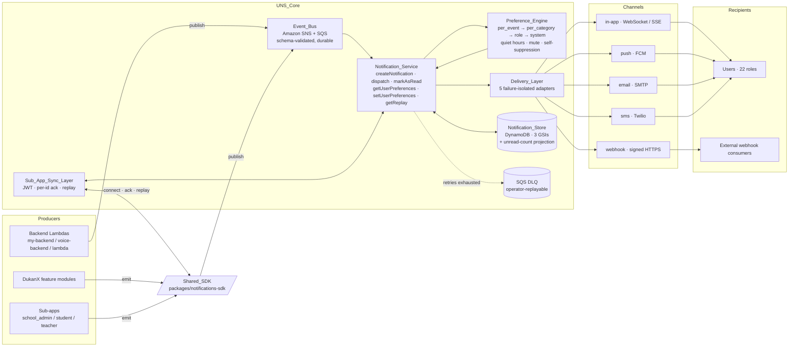

# Unified Notification System (UNS) — Architecture

> Single source of architectural truth for the runtime notification system shared by DukanX and every sub-app. Grounded in the implementation under `my-backend/src/notifications/`, `packages/notifications-sdk/`, and `packages/notifications-ui/`.
>
> Companion specs:
> - `.kiro/specs/unified-notification-system/requirements.md` — REQ 1–20
> - `.kiro/specs/unified-notification-system/design.md`
> - `.kiro/specs/unified-notification-system/phase3-architecture.md`
> - `.kiro/specs/unified-notification-system/phase2-event-registry.md` (134 events + 8 batched events, 26 sub-categories across 8 categories)
> - `.kiro/specs/unified-notification-system/phase1-scan-report.md` (145 Trigger_Points)
> - `.kiro/specs/unified-notification-system/migration_status.md` (per-Trigger_Point ledger)

---

## 1. Overview

UNS is one canonical pipeline:

```
producers → Event_Bus → Notification_Service (preferences + dedup + authz)
         → Delivery_Layer (5 channel adapters) → Notification_Store
         → Shared_SDK / UI widgets
```

**Why it replaces the legacy ad-hoc helpers.** Before UNS the workspace had three independent transports (API Gateway WebSocket via `wsService`, EventBridge, in-process `StreamController`), several persistence stores (`customer_notifications` Drift table, the school-ERP `NOTIF#<userId>` DDB partition, in-memory buffers in the school sub-apps), and per-feature emitters (`service_job_notification_service.dart`, `restaurant_notification_service.dart`, `security_notification_service.dart`, `customer_notifications_repository.dart`, `school-notifications.ts`, etc.). Each helper made independent decisions about recipients, channels, deduplication, and retention. UNS unifies all of that behind a single envelope (the Event_Contract), a single bus (Amazon SNS + SQS), a single service (`Notification_Service`), and a single SDK consumed by every Flutter app.

**Reliability model.**
- `critical` and `high` priority events use **at-least-once** delivery.
- `normal` and `low` events use **at-most-once-with-dedup** (effective once-per-recipient via the `by-dedup-key` GSI lookup).
- Up to 5 retries with exponential backoff, then the SQS-managed DLQ.

**Performance targets.** 500 ms p95 in-app delivery for connected clients, 50 ms p95 unread-count query, 100 ms p95 unread-count projection update, all at 10 000 concurrent users (REQ 5.7, 13.1, 13.2, 6.7).

**Migration is partial.** As of the latest commit captured in `migration_status.md`, **44 / 146 rows** are on the canonical UNS path; the remaining **102 rows** still emit through legacy helpers under the additive-emit pattern described in §11. This document reflects what is implemented today, not the end state.

---

## 2. High-Level Diagram



---

## 3. Components

Each component has exactly one canonical implementation (REQ 20.1). The table below lists the component and its code root; the subsections that follow expand on each.

| # | Component | Code root |
|---|---|---|
| 1 | Event_Bus (publisher + consumer + outbox) | `my-backend/src/notifications/event-bus/` |
| 2 | Notification_Service | `my-backend/src/notifications/service/` |
| 3 | Preference_Engine | `my-backend/src/notifications/preferences/` |
| 4 | Delivery_Layer + 5 channel adapters | `my-backend/src/notifications/channels/` |
| 5 | Notification_Store + projections | `my-backend/src/notifications/store/` |
| 6 | Sub_App_Sync_Layer (replay + ack) | `my-backend/src/notifications/sync/` |
| 7 | Audit_Log | `my-backend/src/notifications/store/audit-log.repo.ts` |
| 8 | Observability (logger / metrics / alerts) | `my-backend/src/notifications/observability/` |
| 9 | Retention configuration | `my-backend/src/notifications/retention/` |
| 10 | Shared_SDK (Dart/Flutter) | `packages/notifications-sdk/` |
| 11 | Shared UI widgets (Flutter) | `packages/notifications-ui/` |

### 3.1 Event_Bus

**Responsibility.** Single publish entry point for every Producer. Validates payloads against the Event_Contract JSON Schema, charges per-Producer rate limits, persists durably via SNS+SQS before acknowledging, and routes retry-exhausted messages to the DLQ. Validates REQ 3 + 9.

**Inputs.** An `EventContract` envelope (typed in `my-backend/src/notifications/event-bus/types.ts`).

**Outputs.** A `PublishAck` (SNS `messageId`) on success; a structured error otherwise.

**Key files.**
- `event-bus/publisher.ts` — `publishEvent(...)`, `_setSnsClientForTests(...)`
- `event-bus/consumer.ts` — SQS consumer loop with per-message backoff
- `event-bus/schema-validator.ts` — Ajv-backed `validateEventContract` / `tryValidateEventContract`
- `event-bus/delivery-modes.ts` — `getDeliveryMode(priority)` (`at_least_once` vs `at_most_once_with_dedup`)
- `event-bus/rate-limiter.ts` — per-Producer 1000 events/minute default (REQ 12.4)
- `event-bus/outbox.ts` — local outbox for buffering when SNS is unavailable (REQ 9.7)
- `event-bus/emit-helper.ts` — `emitUnsEvent(...)` and `buildEventContract(...)` for backend producers
- `event-bus/errors.ts` — `EventContractValidationError`, `EventBusUnavailableError`, `ProducerRateLimitExceededError`

**Key types.** `EventContract`, `Recipient`, `Channel`, `Priority`, `Category`, `SourceApp`, `BusMessageAttributes`, `OutboxEntry`.

### 3.2 Notification_Service

**Responsibility.** The brain. Owns notification creation, recipient resolution, deduplication, persistence, and the dispatch decision. Validates REQ 4.

**Inputs.** A validated `EventContract` (from the bus consumer) or a direct `CreateNotificationInput` (from internal callers).

**Outputs.** A `CreateNotificationResult` with `notification_id`, then a `DispatchResult` describing per-recipient outcomes.

**Key files.**
- `service/notification.service.ts` — exposes `createNotification`, `dispatch`, `markAsRead`, `getUserPreferences`, `setUserPreferences`, `getReplay`. Default factory at `getDefaultNotificationService()`.
- `service/dedup.ts` — `computeDedupKey({event_name, actor_id, target_id, dedup_scope_fields, payload})`, `findDuplicateForRecipient(...)`, `DEFAULT_DEDUP_WINDOW_SECONDS = 60`
- `service/authz.ts` — `CallerAuthorizer`, `RecipientAuthorizer` interfaces; `DefaultCallerAuthorizer`, `AllowAllRecipientAuthorizer`
- `service/lifecycle.ts` — `transitionToDispatched`, `transitionToDelivered`, `markAsRead` with the ordering-invariant guard
- `service/errors.ts` — `AuthorizationError`, `NotificationNotFoundError`, `PreferenceValidationError`, `ReplayWindowExceededError`
- `service/types.ts` — `DispatchChannelAdapter`, `CreateNotificationInput`, `DispatchResult`, `REPLAY_WINDOW_DAYS = 7`

**Key types.** `NotificationRecord`, `NotificationStatus` (`emitted | queued | dispatched | delivered | read | failed`), `DispatchRecipientOutcome`.

### 3.3 Preference_Engine

**Responsibility.** Pure resolver. Given a notification, a recipient, and the recipient's `UserPreferenceRecord`, return the allowed channel set. Stateless apart from reading `UserPreference` records. Targets <10 ms p95. Validates REQ 7.

**Resolution order.** `per_event_channels` → `per_category_channels` → role-level default → system default. Then quiet-hours, critical bypass, mute, self-suppression are applied.

**Inputs.** `ResolverNotification`, `UserPreferenceRecord`, current instant.

**Outputs.** A fresh `Channel[]` (deduplicated, ordering preserved). Empty array means "deliver nothing" (silent suppression — `Notification_Service` records a `skipped` audit entry).

**Key files.**
- `preferences/resolver.ts` — `resolveAllowedChannels(notification, prefs, now)`
- `preferences/quiet-hours.ts` — `isInQuietHours(prefs, now)`
- `preferences/role-defaults.ts` — `ROLE_DEFAULT_CHANNELS`, `getRoleDefaultChannels(role)`

### 3.4 Delivery_Layer + Channel Adapters

**Responsibility.** Pluggable façade over five channel adapters (`in_app`, `push`, `email`, `sms`, `webhook`). Each adapter owns its transport-specific retry/backoff and authentication. A failure in one adapter does not block the others (failure isolation). Validates REQ 5 + 9.5–9.6.

| Channel | Transport | Auth | Retries | File |
|---|---|---|---|---|
| `in_app` | API Gateway WebSocket / SSE | JWT (existing Cognito) | 5 (bus) + ack-required-before-delivered | `channels/in-app.ts` |
| `push` | Firebase Cloud Messaging | FCM device token + app server key | 3 with exponential backoff | `channels/push.ts` |
| `email` | SMTP | env-scoped credentials | 3 with exponential backoff | `channels/email.ts` |
| `sms` | Twilio (or env-configured equivalent) | Twilio API key | 3 with exponential backoff | `channels/sms.ts` |
| `webhook` | Signed HTTPS POST | per-consumer shared secret (`X-Signature` header) | 5 with exponential backoff before DLQ | `channels/webhook.ts` |

**Per-channel rate limits** (per user, defaults from REQ 9.5; on hit, same-`event_name` notifications coalesce into a batched summary):

| Channel | Limit |
|---|---|
| `in_app` | 60 / min |
| `push` | 20 / min |
| `email` | 10 / min |
| `sms` | 5 / min |
| `webhook` | 60 / min |

**Inputs.** `DispatchChannelArgs` (notification record + recipient + channel + envelope).

**Outputs.** A `DeliveryOutcome` (`delivered` / `rate_limited_coalesced` / `failed`).

**Key files.**
- `channels/index.ts` — façade entry, exposes `deliveryLayer.dispatch` as a `DispatchChannelAdapter` callback
- `channels/delivery-layer.ts` — `createDeliveryLayer(opts)`, `setAdapter(channel, adapter)`, `lastOutcome(...)`
- `channels/rate-limiter.ts` — `createRateLimiter(...)`, `DEFAULT_RATE_LIMITS_PER_MINUTE`, coalesce-on-flush
- Per-channel files listed above

**Key types.** `DispatchChannelAdapter`, `ChannelAdapterRegistry`, `DeliveryOutcome`, `CoalescedFlush`.

### 3.5 Notification_Store + Projections

**Responsibility.** Persistent store on DynamoDB for `Notification`, `UserPreference`, and `AuditLog` records. Maintains the per-user `unread_count` projection. Validates REQ 6.

**Three logical tables** (prefix from `NOTIFICATIONS_TABLE_PREFIX`, default `<service>-<stage>`):

| Logical table | Constant | Primary key | Notes |
|---|---|---|---|
| Notifications | `NOTIFICATION_TABLE` | `notification_id` | DynamoDB Streams enabled (NEW_AND_OLD_IMAGES) for the unread-count projection |
| User preferences | `USER_PREFERENCE_TABLE` | `user_id` | Optimistic `version` updates |
| Audit log | `AUDIT_LOG_TABLE` | append-only | `appendAuditLog` rejects update/delete attempts |
| Unread counts | `UNREAD_COUNT_TABLE` | `user_id` | Single attribute `unread_count` (Number); separate from `USER_PREFERENCE_TABLE` to avoid mixing optimistic-version writes with atomic-counter increments |

**Three GSIs** (REQ 6.4–6.6):

| GSI | Constant | Hash | Range |
|---|---|---|---|
| `by-user-status` | `GSI_BY_USER_STATUS` | `<user_id>#<status>` | `<created_at>#<notification_id>` |
| `by-user-category` | `GSI_BY_USER_CATEGORY` | `<user_id>#<category>` | `<created_at>#<notification_id>` |
| `by-dedup-key` | `GSI_BY_DEDUP_KEY` | `dedup_key` | `<created_at>#<notification_id>` |

**Lifecycle ordering invariant** (REQ 6.7a, Property 6): every Notification record satisfies

```
created_at <= dispatched_at <= delivered_at <= read_at
```

with `null` allowed for any unset trailing timestamp. The repositories reject any state transition that would violate this ordering.

**Key files.**
- `store/keys.ts` — table names, GSI names, key builders (`userStatusGsiKey`, `userCategoryGsiKey`, `dedupGsiKey`)
- `store/notification.repo.ts` — `createNotification`, `getNotification`, `listByUserStatus`, `listByUserCategory`, `findByDedupKey`, cursor pagination
- `store/user-preference.repo.ts` — `getUserPreference`, `upsertUserPreference` (optimistic versioning)
- `store/audit-log.repo.ts` — `appendAuditLog` (no update/delete API exposed)
- `store/unread-count.projection.ts` — DynamoDB Streams handler with `ReportBatchItemFailures`; updates within 100 ms p95 of a `delivered`/`read` transition
- `store/cursor.ts` — opaque `(user_id, created_at, notification_id)` cursor codec

**Key types.** `NotificationRecord`, `NotificationRecipient`, `UserPreferenceRecord`, `AuditLogRecord`, `LifecycleTimestamps`.

### 3.6 Sub_App_Sync_Layer

**Responsibility.** Cross-app integration surface: JWT-authenticated WebSocket entry, per-`notification_id` ack handling, and the missed-event replay endpoint. Validates REQ 8.

**Endpoints.**
- `GET /notifications/replay?since=<ISO_DATE>&app=<sub_app_name>` — returns notifications targeted at the authenticated user with `created_at >= since`, in ascending order, bounded by the 7-day Replay_Window. Out-of-window requests return `replay_window_exceeded`. Empty in-window result returns HTTP 200 with `notifications: []` and `next_cursor = since`.
- WebSocket ack channel — front-end posts a per-`notification_id` ack within 30 s; missing acks trigger a retry under channel policy.

**Allowed `app` values.** `dukanx_desktop`, `school_admin_app`, `school_student_app`, `school_teacher_app`.

**Key files.**
- `sync/replay.handler.ts` — `replay` Lambda handler (`authorizedHandler` wrapper with `allowedRoles=[]` so any authenticated user can replay their own notifications)
- `sync/ack.handler.ts` — handles per-`notification_id` ack messages from in-app clients
- `sync/index.ts` — barrel export

### 3.7 Audit_Log

**Responsibility.** Append-only record of every lifecycle transition (`emitted`, `queued`, `dispatched`, `delivered`, `read`, `failed`) and every denied access attempt (`unauthorized_access_attempt`). Validates REQ 12.5–12.7, 14.1.

**Schema (REQ 6.3).** `audit_id`, `notification_id`, `lifecycle_state`, `recipient_id`, `channel`, `attempt`, `outcome`, `error_reason`, `timestamp`.

**Key files.** `store/audit-log.repo.ts` — `appendAuditLog(...)`. The repo deliberately exposes no update/delete surface; attempts to construct one fail at compile time.

### 3.8 Observability

**Responsibility.** Structured logs, metrics, and alerts for every UNS lifecycle stage. Validates REQ 14.

**Lifecycle stages logged.** `emitted → queued → dispatched → delivered → read` (and `failed`). Each transition emits a structured log line carrying `notification_id`, `event_name`, `recipient_id`, `channel`, `timestamp`.

**Metrics surface (in-process registry, batched flush to CloudWatch by an external sink):**

| Metric | Type | Labels | REQ |
|---|---|---|---|
| `events_emitted_total` | counter | `event_name`, `priority`, `source_app` | 14.2 |
| `notifications_dispatched_total` | counter | `event_name`, `channel`, `priority` | 14.3 |
| `notifications_failed_total` | counter | `event_name`, `channel`, `error_reason` | 14.4 |
| `delivery_latency_ms` | histogram (rolling 5-min p95) | `channel` | 14.5 |

**Failure-rate alert.** `alert.notifications.high_failure_rate` fires when the rolling 5-minute ratio `notifications_failed_total / notifications_dispatched_total > 5%` AND the dispatched count is `>= 1`. Per-channel evaluation in `observability/alerts.ts` (one alert per `in_app`, `push`, `email`, `sms`, `webhook`).

**Key files.**
- `observability/logger.ts` — structured lifecycle logger
- `observability/metrics.ts` — `metricsRegistry`, `MetricsRegistry` class (testable instances), label-cardinality cap, histogram windowing
- `observability/alerts.ts` — `recordDeliveryOutcome(channel, success)`, `checkAlerts()`, `onAlertFired(handler)`, `ALERT_EVENT_NAME`

### 3.9 Retention Configuration

**Responsibility.** Configurable Archive_Period (default 90 days) for `Notification` and `AuditLog` records. Every change writes an Audit_Log entry; the change is rejected if the Audit_Log subsystem is unavailable. Validates REQ 6.8, 13.4, 13.4a.

**Key files.**
- `retention/retention-config.service.ts` — `getRetentionConfig`, `setRetentionConfig`, `resolveDefaultArchivePeriodDays`
- `retention/retention-audit.ts` — `recordRetentionChange(...)`
- `retention/validation.ts` — Zod schema for the update body (`updateRetentionConfigSchema`)
- `retention/errors.ts` — `InvalidRetentionValueError`, `AuditLogUnavailableError`

### 3.10 Shared_SDK (`packages/notifications-sdk/`)

**Responsibility.** The single Dart/Flutter client package consumed by DukanX and every sub-app. Owns the offline outbox.

**Public API** (pinned by `phase3-architecture.md` §13.2):
- `subscribe(eventName, handler)`
- `emit(event)`
- `onNotification(handler)`
- `replay(sinceIso)`
- Operational: `connect()`, `flushOutbox()`, `close()`

**Key files.**
- `packages/notifications-sdk/lib/notifications_sdk.dart` — public barrel
- `packages/notifications-sdk/lib/src/sdk_client.dart` — `NotificationsSdk` class with WebSocket, JWT, and outbox wiring
- `packages/notifications-sdk/lib/src/event_contract.dart` — Dart serializer/parser for the envelope (round-trip safe per Property 4)
- `packages/notifications-sdk/lib/src/outbox.dart` — local outbox storage (queues emits while disconnected, flushes in `created_at` ascending order on reconnect)
- `packages/notifications-sdk/lib/src/schema_validator.dart` — client-side validation against the bundled JSON Schema
- `packages/notifications-sdk/event-contract.schema.json` — single source of truth for the wire format

### 3.11 Shared UI widgets (`packages/notifications-ui/`)

**Responsibility.** The four widgets every Flutter front-end consumes. Validates REQ 11.

**Widgets.**
- `notification_bell.dart` — unread-count bell, updates within 1 s p95 on a connected client; shows `stale` indicator otherwise
- `notification_drawer.dart` — `created_at` descending list with cursor pagination and category filter; calls `markAsRead` on open
- `notification_toast.dart` — surfaces `critical`/`high` notifications immediately
- `preferences_page.dart` — per-category channels, per-event channels, Quiet_Hours, mute targets

**Supporting client.** `notifications_ui_client.dart` is a thin HTTP wrapper for the read/write API surface widgets need (list/unread-count/mark-read/preferences). Separated from the SDK because the SDK's public surface is contract-level and should not grow.

---

## 4. Event Contract

The wire format every Producer publishes and every Consumer receives.

**Schema location.** `packages/notifications-sdk/event-contract.schema.json` (JSON Schema Draft 2020-12, `$id = urn:dukanx:notifications-sdk:event-contract:v1`). Bundled in the Dart SDK and consumed at runtime by Ajv on the backend (`my-backend/src/notifications/event-bus/schema-validator.ts`).

**Required fields.**

| Field | Type | Notes |
|---|---|---|
| `id` | UUID v4 string | Producers generate client-side so outbox replays preserve identity |
| `event_name` | snake_case `<domain>.<entity>.<action>` | Closed list governed by the Phase 2 registry, not the schema |
| `category` | enum (8 values) | `billing` · `orders` · `payments` · `inventory` · `users` · `system` · `delivery` · `reports` |
| `priority` | enum (4 values) | `critical` · `high` · `normal` · `low` |
| `actor_id` | string | Used for self-suppression (REQ 7.5) and as part of the `dedup_key` |
| `target_id` | string \| null | Used for recipient-authorization checks (REQ 4.11) and mute resolution (REQ 7.6) |
| `recipients` | array of `Recipient` | Each entry: `user_id`, `role`, optional `channels`, optional `target_id` |
| `payload` | object | Free-form per-event payload |
| `channels` | array (subset of 5) | The channels the producer opted in to |
| `source_module` | string | Canonical workspace path of the producing module |
| `source_app` | enum (6 values) | `dukanx_desktop` · `dukanx_backend` · `school_admin_app` · `school_teacher_app` · `school_student_app` · `webhook_consumer` |
| `created_at` | RFC 3339 / ISO 8601 with offset | e.g. `2025-01-31T14:23:45.123Z` |
| `dedup_key` | sha256 hex digest | `(event_name, actor_id, target_id, dedup_scope_fields...)` |
| `dedup_scope_fields` | array of strings (optional) | Names of payload fields that participated in `dedup_key` |

**Versioning rules.**
- The schema is `v1` and stable. New events do **not** require a schema change because `event_name` is structurally validated (regex `^[a-z][a-z0-9_]*\.[a-z][a-z0-9_]*\.[a-z][a-z0-9_]*$`) but the closed list of valid values lives in the Notification_Event_Registry (Phase 2), not the schema.
- New optional fields can be added in a backward-compatible release. Required-field changes need a `v2` schema and a parallel-publish migration window.
- The schema is round-trip safe: `parse(serialize(event))` is structurally equivalent to `event` for every valid event (Property 4 in `design.md` §"Correctness Properties").

**Validation pipeline.**
1. **Producer side** — the Dart SDK validates with `schema_validator.dart` before queuing the emit.
2. **Bus boundary** — `publishEvent(...)` calls `validateEventContract(event)` (Ajv) before invoking `sns:Publish`. Schema-invalid publishes throw `EventContractValidationError` and persist nothing (REQ 3.6).
3. **Consumer side** — the SQS consumer re-validates with `tryValidateEventContract(...)` so a bus topic mis-configuration cannot poison downstream stages.

---

## 5. Producers

A Producer is any module, service, controller, Lambda, or sub-app that emits an event onto the Event_Bus.

### 5.1 Backend service (TypeScript / Lambda) — `emit-helper.ts`

The reusable helper at `my-backend/src/notifications/event-bus/emit-helper.ts` keeps each producer migration a small, repeatable diff. Errors are caught and logged; they do not propagate to the calling handler (fire-and-forget on the hot path).

```typescript
import { emitUnsEvent } from '../notifications/event-bus/emit-helper';

emitUnsEvent({
  eventName: 'billing.invoice.created',
  category: 'billing',
  priority: 'normal',
  actorId: auth.sub,
  targetId: result.id,
  recipients: [{ user_id: auth.tenantId, role: 'admin' }],
  payload: { invoiceId: result.id, total: result.total },
  sourceModule: 'my-backend/src/handlers/invoices.ts',
}).catch(() => { /* non-fatal */ });
```

**What `emitUnsEvent` does:**
- Builds an `EventContract` envelope (UUID v4, ISO 8601 `created_at`, computed `dedup_key`).
- Defaults `channels` to `['in_app']` (conservative — preserves the legacy WS-only delivery surface).
- Defaults `sourceApp` to `dukanx_backend`.
- Catches `EventContractValidationError`, `EventBusUnavailableError`, and `ProducerRateLimitExceededError` and logs them as warnings.

### 5.2 ESM Lambda (`.mjs`) — `lambda/shared/uns-emit.mjs`

For the ES-module Lambdas under `lambda/` (trial provisioning, trial scheduler, expiry cron, etc.) that live outside the `my-backend` TypeScript project, a parallel dependency-free shim publishes the same envelope shape:

```javascript
import { emitUnsEvent } from '../shared/uns-emit.mjs';

await emitUnsEvent({
  eventName: 'system.trial.expiring',
  category: 'system',
  priority: 'high',
  actorId: 'cron:trial_expiry_sweeper',
  targetId: tenant.id,
  recipients: [{ user_id: tenant.ownerUserId, role: 'admin' }],
  payload: { tenantId: tenant.id, expiresAt: tenant.expiresAt },
  sourceModule: 'lambda/trialExpiryCronHandler/index.mjs',
});
```

The shim publishes to `UNS_SNS_TOPIC_ARN`; if the env var is not set, the emit is silently dropped (these handlers run in environments that may not yet have UNS wired).

### 5.3 Flutter client — `Shared_SDK.emit(...)`

Flutter producers (DukanX, sub-apps) emit through the SDK so the offline outbox can buffer events when the WebSocket is disconnected:

```dart
await sdk.emit(EventContract(
  id: const Uuid().v4(),
  eventName: 'orders.service_job.status_changed',
  category: 'orders',
  priority: 'high',
  actorId: session.userId,
  targetId: jobId,
  recipients: [Recipient(userId: customerId, role: 'customer')],
  payload: {'status': newStatus, 'jobId': jobId},
  channels: ['in_app', 'push'],
  sourceModule:
    'Dukan_x/lib/features/service/services/service_job_notification_service.dart',
  sourceApp: 'dukanx_desktop',
  createdAt: DateTime.now().toUtc().toIso8601String(),
  // dedup_key computed by the SDK
));
```

Client-side emit is rare in production — most events originate server-side. Notable exceptions: customer/vendor link flows (`T-CUS-3`, `T-CUS-4`), customer payment collection (`T-CUS-5`), and the restaurant helper events migrated under task 14.3.

### 5.4 Trigger_Point reference

Every emit site is grounded in the Phase 1 scan (145 Trigger_Points across `T-BIL-*`, `T-PAY-*`, `T-INV-*`, `T-PUR-*`, `T-CUS-*`, `T-JEW-*`, `T-RES-*`, `T-CLN-*`, `T-SCH-*`, `T-SVC-*`, `T-JOB-*`, `T-DC-*`, `T-VEG-*`, `T-DLV-*`, `T-PMP-*`, `T-PLN-*`, `T-SEC-*`, `T-MKT-*`, `T-AI-*`). The canonical `event_name` for each Trigger_Point lives in the Phase 2 registry. The migration ledger (`migration_status.md`) records, per Trigger_Point, whether the producer is on the legacy path or the UNS path.

---

## 6. Consumers / Channels

### 6.1 Channel adapter contract

Every adapter implements the `DispatchChannelAdapter` callback shape (defined in `my-backend/src/notifications/service/types.ts`):

```typescript
export type DispatchChannelAdapter = (args: DispatchChannelArgs) => Promise<void>;

export interface DispatchChannelArgs {
  readonly notification: NotificationRecord;
  readonly recipient: NotificationRecipient;
  readonly channel: NotificationChannel;
  readonly envelope: EventContract;
}
```

The façade in `channels/delivery-layer.ts` calls the adapter inside a try/catch and continues to the next channel on error (failure isolation).

### 6.2 Adding a new channel

1. Implement a new file under `my-backend/src/notifications/channels/<name>.ts` exporting a `DispatchChannelAdapter`.
2. Extend `NotificationChannel` in `store/types.ts` and the `Channel` enum in `event-bus/types.ts`.
3. Add the channel to the JSON Schema `channels` enum in `packages/notifications-sdk/event-contract.schema.json` (this is a `v2` schema bump).
4. Register the adapter in `channels/index.ts` via `setAdapter('<name>', adapter)`.
5. Configure a per-user rate limit in `channels/rate-limiter.ts` (`DEFAULT_RATE_LIMITS_PER_MINUTE`).
6. Add per-role default channels in `preferences/role-defaults.ts` if relevant.

### 6.3 Retry / backoff policy

| Layer | Max attempts | Backoff |
|---|---|---|
| Event_Bus (outer envelope) | 5 | Exponential, SQS visibility-timeout-driven |
| `push` adapter | 3 | Exponential per transient FCM error |
| `email` adapter | 3 | Exponential per transient SMTP error |
| `sms` adapter | 3 | Exponential per transient provider error |
| `webhook` adapter | 5 | Exponential per non-2xx response |
| `in_app` adapter | n/a (ack-required) | Re-delivered on next reconnect from `Notification_Store` |

When the inner per-channel budget is exhausted, the failure escalates to the outer bus retry, which on exhaustion routes to the SQS-managed DLQ with the original payload, error reason, retry count, and timestamps preserved (REQ 3.10, 9.3).

### 6.4 Idempotency

- **At the bus.** SQS at-least-once delivery means consumers can see the same message twice. The Notification_Service's deduplication step (`service/dedup.ts::findDuplicateForRecipient`) queries the `by-dedup-key` GSI before persisting and skips duplicates with a `skipped_duplicate` audit entry.
- **At the recipient.** `markAsRead(notification_id, user_id)` is idempotent: subsequent calls leave `read_at` unchanged (REQ 4.6).
- **At the preferences API.** `setUserPreferences(user_id, prefs)` is idempotent: same payload yields the same stored state regardless of how many times it is called (REQ 4.9, Property 5).
- **At producers.** Event `id` is generated client-side so outbox replays preserve identity; the Notification_Service's dedup step then suppresses redundant deliveries at the recipient (REQ 8.8, 9.7).

---

## 7. Preferences & Categories

### 7.1 How the Preference_Engine evaluates per-user preferences

For each recipient and each channel of every notification, the resolver in `preferences/resolver.ts` runs the resolution order until one rule yields a decision:

1. **Self-suppression** — if `actor_id == recipient.user_id`, return `[]` (suppress).
2. **Mute** — if the recipient has muted the notification's `target_id` (or `event_name` where the registry permits), return `[]`. Un-mutable critical events bypass.
3. **Channel resolution** (first non-empty wins):
    1. `UserPreference.per_event_channels[event_name]`
    2. `UserPreference.per_category_channels[category]`
    3. `ROLE_DEFAULT_CHANNELS[role]` (from `preferences/role-defaults.ts`)
    4. System default channel set
4. **Intersect** the resolved set with the notification's declared `channels` (the resolver MUST NOT add channels the producer never opted in to).
5. **Quiet_Hours** — while the recipient's local time is within `quiet_hours_start`–`quiet_hours_end`, suppress `push`, `sms`, `email` for any non-`critical` notification.
6. **Critical bypass** — `priority == 'critical'` overrides Quiet_Hours (does NOT override the recipient-authorization check).

Empty output is a legitimate "deliver nothing" outcome, recorded as a `skipped` audit entry rather than a failure.

### 7.2 Category map

The eight permitted categories (REQ 2.3):

| Category | Sub-categories present in Phase 2 registry |
|---|---|
| `billing` | `invoice`, `credit_note`, `decoration_catering_invoice`, `school_fee`, `school_payslip`, `restaurant_bill` |
| `payments` | `invoice_payment`, `gateway_callback`, `refund`, `manual_collection`, `vendor_payout`, `purchase_payment`, `decoration_catering_payment`, `school_fee_payment`, `decoration_catering_expense` |
| `orders` | `purchase`, `restaurant`, `restaurant_kot`, `restaurant_table`, `service_job`, `service_warranty`, `service_exchange`, `auto_parts_job_card`, `computer_shop_job_card`, `computer_shop_warranty`, `dc_event`, `dc_quote`, `dc_kot`, `dc_staff`, `jewellery_gold_rate`, `jewellery_custom_order`, `jewellery_repair`, `jewellery_gold_scheme`, `jewellery_old_gold` |
| `inventory` | `stock`, `item`, `batch`, `import`, `purchase_goods`, `hallmark`, `dc` |
| `users` | `customer_shop`, `customer_recovery`, `customer_credit`, `school_*` (admission/attendance/leave/student/batch/timetable/material/homework/library/hostel/announcement), `clinic_*`, `pharmacy_*` |
| `system` | `security_*` (fraud, cash, stock, access), `health`, `trial` |
| `delivery` | `restaurant`, `school_transport`, `marketplace` |
| `reports` | `school_exam`, `school_report_card` |

### 7.3 Default behaviour

If a user has no `UserPreference` record, the resolver falls through to role defaults (`preferences/role-defaults.ts::ROLE_DEFAULT_CHANNELS`) and then to the system default. Role defaults follow the convention table in `phase2-event-registry.md` §1.4:

| Priority | Default for tenant staff (admin/cashier/accountant) | Default for external recipients (customer/parent/vendor/farmer) |
|---|---|---|
| `critical` | `in_app` + `push` + `sms` | `in_app` + `push` + `sms` |
| `high` | `in_app` + `push` | `in_app` + `push` (+ `sms` when SMS template exists) |
| `normal` | `in_app` | `in_app` + `push` |
| `low` | `in_app` | `in_app` |

`email` is added when the event carries financial documents (invoice, receipt, payslip, report card, statement). `webhook` is added when an event has external integrations.

---

## 8. Storage & Retention

### 8.1 Notification_Store schema (high level)

The fields below are the wire-level union; the typed shape lives in `my-backend/src/notifications/store/types.ts`.

**Notification record (REQ 6.1).**
```
notification_id, event_name, category, sub_category, priority,
actor_id, target_id,
recipients: [{user_id, role, channels[], status, delivered_at, read_at}],
payload, channels[], status,
created_at, dispatched_at, delivered_at, read_at,
dedup_key, source_module, source_app
```

**UserPreference record (REQ 6.2).**
```
user_id, role, per_category_channels, per_event_channels,
quiet_hours_start, quiet_hours_end, quiet_hours_timezone,
mute_targets, updated_at, version
```

**AuditLog record (REQ 6.3).**
```
audit_id, notification_id, lifecycle_state, recipient_id,
channel, attempt, outcome, error_reason, timestamp
```

### 8.2 Unread-count projection

A DynamoDB Streams handler at `store/unread-count.projection.ts` updates the `UNREAD_COUNT_TABLE` per-user counter atomically:

| Lifecycle transition | Effect |
|---|---|
| `dispatched` → `delivered` | `unread_count += 1` |
| `delivered` → `read` | `unread_count -= 1` |
| any other transition (e.g. `failed`) | no-op |

The handler uses partial-batch `ReportBatchItemFailures` so a single malformed record does not cause the rest of the batch to replay. Update applied within 100 ms p95 of the lifecycle transition under nominal load (REQ 6.7); under load spikes processing continues rather than dropping.

### 8.3 Retention configuration endpoint

The configurable Archive_Period lives at `retention/retention-config.service.ts`:
- Default 90 days (REQ 6.8).
- `getRetentionConfig()` / `setRetentionConfig(input)` are the canonical read/write API.
- Every `setRetentionConfig` call writes an Audit_Log entry via `recordRetentionChange(...)` naming the actor, previous value, new value, and timestamp.
- If the Audit_Log is unavailable, the change is rejected with `AuditLogUnavailableError`.
- Records older than the Archive_Period are moved to cold storage by a separate job that reads the configuration through `resolveDefaultArchivePeriodDays()`.

---

## 9. Security & Compliance

Validates REQ 12.

### 9.1 Authentication

- **End-user requests** authenticate with the existing Cognito JWT (same middleware used by every `my-backend` handler — `my-backend/src/middleware/cognito-auth.ts`). REQ 12.3, 19.1.
- **Sub-apps and external Producers** connect with a JWT or env-scoped shared secret; failed auth is rejected.
- **Webhook deliveries** carry an `X-Signature` header computed over the payload using a per-consumer shared secret (`channels/webhook.ts`). REQ 5.12.

### 9.2 Authorization

- **Caller authorization at `createNotification`** — rejects without persisting if the caller is not authorized to emit on behalf of the supplied `actor_id` and `source_module`. REQ 4.10.
- **Per-recipient authorization at `dispatch`** — `service/authz.ts` runs the recipient-authorization predicate against `(event_name, target_id)` for every prospective recipient. Failed recipients are silently omitted (REQ 4.11, 12.1, Property 3).
- **Authorization monotonicity** — revoking a recipient's authorization for an `event_name` prevents future deliveries; it does not retroactively withdraw prior deliveries. REQ 15.15.
- **Read/modify access** — only Recipients of a notification or authorized administrators may read or modify it; denials are recorded as `unauthorized_access_attempt` Audit_Log entries.

### 9.3 Per-Producer publish rate limit

`event-bus/rate-limiter.ts` enforces a default of **1000 events per minute per Producer** (`source_module`), evaluated independently of and prior to authorization. On exceed → `ProducerRateLimitExceededError`, nothing reaches validation or SNS. REQ 12.4.

### 9.4 Sanitization & redaction

- Every `payload` field is sanitized before persistence and before delivery to strip scripting tags and control characters (REQ 12.2).
- The Notification_System never includes secret values, full PAN, or full government-issued identifiers in payloads — only redacted references. Events that try to embed raw values are rejected at the bus boundary by the Event_Contract validator (REQ 12.8).

### 9.5 Audit_Log

Append-only via `store/audit-log.repo.ts::appendAuditLog`. Every lifecycle transition writes a record. The repo deliberately exposes no update/delete API (REQ 12.6). Every denied access attempt writes an `unauthorized_access_attempt` entry (REQ 12.7).

### 9.6 Retention

Configured per §8.3. Default 90-day Archive_Period; configurable via the audited `setRetentionConfig` endpoint.

---

## 10. Observability

Validates REQ 14.

### 10.1 Lifecycle stages

Every Notification record passes through a strict subset of these states (and the `failed` terminal state from any non-`read` predecessor):

```
emitted → queued → dispatched → delivered → read
```

Each transition is logged via `observability/logger.ts` with `notification_id`, `event_name`, `recipient_id`, `channel`, and `timestamp`. The lifecycle ordering invariant `created_at <= dispatched_at <= delivered_at <= read_at` is enforced by the repositories on every state change.

### 10.2 Metrics surface

In-process registry in `observability/metrics.ts` (singleton `metricsRegistry` plus a testable `MetricsRegistry` class). Reads happen through `getSnapshot()`; an external batched-flush job ships the snapshot to CloudWatch.

| Metric | Type | Labels |
|---|---|---|
| `events_emitted_total` | counter | `event_name`, `priority`, `source_app` |
| `notifications_dispatched_total` | counter | `event_name`, `channel`, `priority` |
| `notifications_failed_total` | counter | `event_name`, `channel`, `error_reason` |
| `delivery_latency_ms` | histogram (rolling 5-min p95) | `channel` |

The module caps label cardinality at `MAX_LABEL_CARDINALITY` per metric and coalesces overflow into a synthetic `__overflow__` bucket so a misbehaving producer cannot leak memory through high-cardinality labels (e.g. `notification_id`).

### 10.3 Failure-rate alert

`observability/alerts.ts` evaluates per channel:

> `notifications_failed_total / notifications_dispatched_total > 0.05` over a rolling 5-minute window AND `notifications_dispatched_total >= 1`

When both conditions hold, `alert.notifications.high_failure_rate` fires for the affected channel. If the dispatched count is 0, the alert does NOT fire (REQ 14.6). Configurable via `UNS_ALERT_WINDOW_MS`, `UNS_ALERT_FAILURE_RATIO`, `UNS_ALERT_MIN_DISPATCHES`.

---

## 11. Migration Status & Backward Compat

### 11.1 Current state (from `migration_status.md`)

| Distribution | Count |
|---|---|
| Total ledger rows (Phase 1 §9) | **146** |
| Justified Trigger_Points (have a UNS replacement) | 126 |
| Rejected / subsumed (no UNS replacement) | 18 |
| Consumer rows (subscribers, not producers) | 2 |
| `Active path = legacy` | **102** |
| `Active path = uns` | **44** |
| `Active path = both` | **0** (forbidden by invariant) |
| Equivalence test `passed` | 44 |
| Equivalence test `pending` | 102 |
| Equivalence test `failed` | 0 |

### 11.2 Single-path invariant (REQ 19.5)

At any given time, **exactly one path (legacy OR UNS) is active per Trigger_Point**. The `both` state is forbidden. The transition `legacy → uns` is atomic from the producer's point of view: in the same commit that introduces the UNS emit, the legacy emit is replaced by `Shared_SDK.emit(...)` (frontend) or `emitUnsEvent(...)` (backend), and the legacy helper code path for that Trigger_Point is deleted (REQ 10.7, 10.9, 10.9a).

### 11.3 Additive-emit pattern

For backend handlers that already broadcast through `wsService.emitEvent(...)` to connected DukanX desktop clients, the migration uses an additive pattern during the migration window:

> The producer keeps its legacy `wsService.emitEvent(...)` / `wsService.broadcastToClientType(...)` call AND adds a new `emitUnsEvent({...})` call alongside it.

This satisfies REQ 19.5's single-active-path invariant for the registry-defined `event_name` (the canonical UNS emit is the sole path for that `event_name`) while keeping the legacy WS broadcast running so DukanX desktop clients on older builds keep working. The legacy emits are deleted in a follow-up sweep once the equivalence-test results land in CI for each producer.

### 11.4 What's already on UNS (44 rows)

Highlights from §5.1 of `migration_status.md`:

- **Billing / Payments / Inventory / DC** — `my-backend/src/handlers/invoices.ts`, `payments.ts`, `payment-webhook.ts`, `inventory.ts`, `dc.ts` (T-BIL-2..5, T-PAY-2..4, T-INV-3..7, T-INV-9, T-DC-1..5, T-DC-8)
- **Restaurant** — server half of `restaurant-v1-public.ts` (T-RES-1) plus the desktop-side helper migrations from task 14.3 (T-RES-2..5, T-RES-7)
- **Service / Warranty** — `service_job_notification_service.dart` and `warranty_claim_service.dart` (T-SVC-1..4)
- **Customer / Vendor link & collection** — `customer_payment_screen.dart`, `customer_link_accept_screen.dart`, `qr_scanner_screen.dart`, `shop_confirmation_screen.dart` (T-CUS-3, T-CUS-4, T-CUS-5, retiring T-PAY-8)
- **Security** — `SecurityNotificationService` migrations for fraud, cash variance, stock anomaly (T-SEC-1, T-SEC-2, T-SEC-3)
- **Pump** — `pump.ts` (T-PMP-1..5)
- **Trial / Plan** — `lambda/trial*Handler/index.mjs` via the new `lambda/shared/uns-emit.mjs` shim (T-PLN-1..3)
- **Customer notifications repository** — now read-only Drift cache (the legacy emit path is deleted)
- **School-notifications helper** — `my-backend/src/handlers/modules/school-erp/school-notifications.ts` now delegates to `getDefaultNotificationService().createNotification(...)`. The T-SCH-* producer files still emit through the legacy `pushNotification(userId, payload)` shape and flip to UNS when their producer migrates under task 14.9.
- **Sub-app consumer screens** — `ac_notifications_screen.dart`, the three school sub-apps' announcements/notifications screens, and the dashboard widgets (`business_alerts_widget.dart`, `upcoming_payments_panel.dart`) all render through `packages/notifications-ui/`.

### 11.5 What's still on legacy (102 rows)

Highlights from §5.2 of `migration_status.md`. These are deferred to follow-up waves:

- **Frontend producers** — purchase, jewellery, billing return/credit-note screens, refund screen
- **Deep service-layer emits** — `bills_repository.dart`, `products_repository.dart`, `invoice.service.ts` post-sale stock decrement
- **Clinic / Pharmacy** — `T-CLN-1..8`
- **School producers** — `T-SCH-1..22` (helper accepts overrides; the producers need to pass canonical `event_name`/`priority`/`recipients`)
- **Auto Parts / Computer Shop** — `T-JOB-1..3`
- **Vegetable Broker / Delivery / Marketplace / Loyalty / AI** — listed individually in `migration_status.md` §5.2

### 11.6 Removal plan

The migration is complete when, for every justified Trigger_Point: `Active path = uns`, both timestamps populated, and `Equivalence test status = passed`. Rejected and consumer rows do not require an equivalence test, but their legacy emit (if any) must be deleted before the feature is marked complete (REQ 10.7).

---

## 12. Operational Runbook (brief)

### 12.1 Triage a failing channel

1. **Check the alert.** `alert.notifications.high_failure_rate{channel=<x>}` from `observability/alerts.ts` identifies which channel is failing.
2. **Read the metrics snapshot.** `metricsRegistry.getSnapshot()` returns counters and the `delivery_latency_ms` histogram per channel. Compare `notifications_failed_total{channel=<x>, error_reason=*}` to identify the dominant error.
3. **Inspect the Audit_Log.** Filter on `lifecycle_state='failed'` and the offending channel; the `error_reason` field carries the transport-specific error (FCM error code, SMTP response, Twilio code, webhook HTTP status).
4. **Inspect the DLQ.** SQS DLQ for the channel's consumer queue holds messages that exhausted retry. Original payload, error reason, retry count, and timestamps are preserved as message attributes.
5. **Replay.** The operator endpoint replays DLQ entries by pushing them back to the originating SQS queue with `retry_count` reset.

### 12.2 Read the metrics snapshot

```typescript
import { metricsRegistry } from 'my-backend/src/notifications/observability/metrics';

const snapshot = metricsRegistry.getSnapshot();
// { counters: { events_emitted_total: { ... }, ... },
//   histograms: { delivery_latency_ms: { in_app: { p50, p95, count }, ... } } }
```

The flush job ships the snapshot to CloudWatch in batched `PutMetricData` calls.

### 12.3 Flip retention

```bash
# Read current value
GET /notifications/retention

# Update — every change writes an Audit_Log entry naming actor/prev/next/timestamp
POST /notifications/retention
{ "archivePeriodDays": 60 }
```

The endpoint validates against `MIN_ARCHIVE_PERIOD_DAYS` / `MAX_ARCHIVE_PERIOD_DAYS` in `retention/types.ts` and returns `InvalidRetentionValueError` for out-of-range values. If the Audit_Log is unavailable at the time of the change, the request is rejected with `AuditLogUnavailableError` and the previous Archive_Period stays in effect (REQ 13.4a).

---

## 13. Data Flow — Notification Lifecycle

A step-by-step walkthrough of a notification from creation to delivery.

### 13.1 End-to-end flow (ASCII)

```
┌──────────────┐     ┌──────────────────┐     ┌─────────────────────┐
│   Producer   │────▶│    Event_Bus     │────▶│ Notification_Service│
│ (emit event) │     │ (SNS + SQS)      │     │                     │
└──────────────┘     └──────────────────┘     └─────────┬───────────┘
                                                        │
                     ┌──────────────────────────────────┘
                     │
                     ▼
┌──────────────────────────────────────────────────────────────────┐
│                    Notification_Service pipeline                   │
│                                                                    │
│  1. Validate Event_Contract schema                                │
│  2. Check caller authorization (actor_id + source_module)         │
│  3. Compute Deduplication_Key                                     │
│  4. Persist Notification record (status = emitted)                │
│  5. Resolve recipients                                            │
│  6. Per-recipient:                                                │
│     a. Check recipient authorization (event_name + target_id)     │
│     b. Check deduplication (by-dedup-key GSI lookup)              │
│     c. Run Preference_Engine → allowed channels                   │
│     d. Forward to Delivery_Layer per allowed channel              │
│  7. Transition lifecycle: emitted → dispatched                    │
└──────────────────────────────────────────────────────────────────┘
                     │
                     ▼
┌──────────────────────────────────────────────────────────────────┐
│                    Delivery_Layer (per channel)                    │
│                                                                    │
│  ┌─────────┐  ┌──────┐  ┌───────┐  ┌─────┐  ┌─────────┐        │
│  │ in_app  │  │ push │  │ email │  │ sms │  │ webhook │        │
│  │ WS/SSE  │  │ FCM  │  │ SMTP  │  │Twilio│  │ HTTPS   │        │
│  └────┬────┘  └──┬───┘  └───┬───┘  └──┬──┘  └────┬────┘        │
│       │          │           │          │          │              │
│       ▼          ▼           ▼          ▼          ▼              │
│  [ack within  [3 retries] [3 retries] [3 retries] [5 retries]    │
│   30 seconds]                                                     │
└──────────────────────────────────────────────────────────────────┘
                     │
                     ▼
┌──────────────────────────────────────────────────────────────────┐
│  On success: lifecycle → delivered, unread_count += 1             │
│  On ack/read: lifecycle → read, unread_count -= 1                │
│  On failure (retries exhausted): lifecycle → failed, route to DLQ│
└──────────────────────────────────────────────────────────────────┘
```

### 13.2 Step-by-step lifecycle

| Step | Actor | Action | Outcome |
|------|-------|--------|---------|
| 1 | Producer | Calls `Shared_SDK.emit(event)` or `emitUnsEvent(event)` | Event queued in offline outbox (if disconnected) or published to SNS |
| 2 | Event_Bus (publisher) | Validates payload against Event_Contract JSON Schema | Reject with `EventContractValidationError` if invalid; persist durably via SNS+SQS if valid |
| 3 | Event_Bus (publisher) | Checks per-Producer rate limit (1000/min default) | Reject with `ProducerRateLimitExceededError` if exceeded |
| 4 | Event_Bus (consumer) | SQS delivers message to Notification_Service ingestor Lambda | Message becomes visible to the consumer |
| 5 | Notification_Service | `createNotification(event)` — caller authorization check | Reject without persisting if unauthorized |
| 6 | Notification_Service | Persist `Notification` record with status `emitted` | Record written to DynamoDB; `notification_id` returned |
| 7 | Notification_Service | `dispatch(notification_id)` — resolve recipients | Build recipient list from event `recipients` field |
| 8 | Notification_Service | Per-recipient: authorization check against `(event_name, target_id)` | Unauthorized recipients silently omitted |
| 9 | Notification_Service | Per-recipient: deduplication check via `by-dedup-key` GSI | Duplicates within the window → `skipped_duplicate` audit entry |
| 10 | Preference_Engine | Resolve allowed channels for each remaining recipient | Apply per_event → per_category → role → system defaults; apply quiet hours, mute, self-suppression |
| 11 | Delivery_Layer | Forward to each allowed channel adapter (failure-isolated) | Each adapter runs independently |
| 12 | Channel adapter | Attempt delivery with transport-specific retry/backoff | On success → `delivered`; on exhaustion → `failed` + DLQ |
| 13 | Notification_Store | Update lifecycle timestamps; update unread-count projection | `dispatched_at`, `delivered_at` set; projection updated within 100 ms |
| 14 | Recipient (client) | Receives notification via SDK `onNotification` stream | Bell widget updates, toast shown for critical/high |
| 15 | Recipient (client) | Opens notification in drawer → `markAsRead` called | `read_at` set (idempotent); unread_count decremented |

### 13.3 Lifecycle state machine

```
emitted → queued → dispatched → delivered → read
                                    │
                                    └──→ failed (terminal, routed to DLQ)
```

The ordering invariant `created_at ≤ dispatched_at ≤ delivered_at ≤ read_at` is enforced on every transition. Out-of-order transitions are rejected with a structured error.

---

## 14. How to Add a New Notification

A step-by-step guide for wiring a new notification type into UNS.

### 14.1 Define the event in the Notification_Event_Registry

1. Open `.kiro/specs/unified-notification-system/phase2-event-registry.md`.
2. Add a new row with all required fields:
   - `event_name` — snake_case `<domain>.<entity>.<action>` (e.g. `billing.subscription.renewed`)
   - `category` — one of: `billing`, `orders`, `payments`, `inventory`, `users`, `system`, `delivery`, `reports`
   - `sub_category` — domain-specific grouping
   - `priority` — one of: `critical`, `high`, `normal`, `low`
   - `trigger_condition` — when this event fires
   - `source_module` — file path of the producing code
   - `consumer_roles` — which roles receive this notification
   - `consumer_apps` — which apps receive it (`dukanx_desktop`, `school_admin_app`, etc.)
   - `channels_per_role` — channel set per role (subset of `in_app`, `push`, `email`, `sms`, `webhook`)
   - `deduplication_rule` — fields composing the dedup key + window in seconds
   - `silence_conditions` — when to suppress (actor==recipient, muted, quiet hours, etc.)
   - `justification` — recipient, reason, expected action
3. If the event has elevated frequency risk, add it to the `notification_fatigue_risks` section with a suppression rule and max deliveries/hour.

### 14.2 Emit from the feature module

**Backend (TypeScript):**

```typescript
import { emitUnsEvent } from '../notifications/event-bus/emit-helper';

// Inside your handler, after the state change:
await emitUnsEvent({
  eventName: 'billing.subscription.renewed',
  category: 'billing',
  priority: 'normal',
  actorId: auth.sub,
  targetId: subscriptionId,
  recipients: [
    { user_id: tenantAdminId, role: 'admin' },
    { user_id: customerId, role: 'customer' },
  ],
  payload: { subscriptionId, plan: newPlan, renewedAt: new Date().toISOString() },
  sourceModule: 'my-backend/src/handlers/subscriptions.ts',
}).catch(() => { /* non-fatal; logged internally */ });
```

**Flutter (Dart):**

```dart
await notificationsSdk.emit(EventContract(
  id: const Uuid().v4(),
  eventName: 'billing.subscription.renewed',
  category: 'billing',
  priority: 'normal',
  actorId: session.userId,
  targetId: subscriptionId,
  recipients: [Recipient(userId: adminId, role: 'admin')],
  payload: {'subscriptionId': subscriptionId, 'plan': newPlan},
  channels: ['in_app', 'push'],
  sourceModule: 'Dukan_x/lib/features/billing/services/subscription_service.dart',
  sourceApp: 'dukanx_desktop',
  createdAt: DateTime.now().toUtc().toIso8601String(),
));
```

### 14.3 Register recipients and choose channels

Recipients are declared in the `recipients` array of the event payload. The Preference_Engine resolves the final channel set per recipient using:

1. The recipient's `UserPreference.per_event_channels` for this `event_name` (if set).
2. The recipient's `UserPreference.per_category_channels` for this `category` (fallback).
3. Role-level defaults from `preferences/role-defaults.ts`.
4. System defaults.

To add role-level defaults for a new role or event pattern, update `ROLE_DEFAULT_CHANNELS` in `my-backend/src/notifications/preferences/role-defaults.ts`.

### 14.4 Add tests

1. **Unit test** — verify the emit call produces a valid `EventContract` envelope:
   ```
   my-backend/tests/notifications/unit/<your-module>.test.ts
   ```
2. **Integration test** — exercise the full path from emit → bus → service → delivery:
   ```
   my-backend/tests/notifications/integration/<your-category>.test.ts
   ```
   At minimum, assert:
   - The notification is persisted with correct `event_name`, `category`, `priority`
   - The correct recipients receive it on the expected channels
   - Deduplication suppresses a second emit within the window

### 14.5 Update migration_status.md

Add a row to `.kiro/specs/unified-notification-system/migration_status.md`:

```markdown
| T-XXX-N | <file_path> | <symbol> | <event_name> | uns | <timestamp> | — | passed | <notes> |
```

### 14.6 Checklist

- [ ] Event defined in Phase 2 registry with all required fields
- [ ] `event_name` follows `<domain>.<entity>.<action>` snake_case format
- [ ] Emit call added at the producing site (backend or Flutter)
- [ ] Recipients declared with correct `user_id` and `role`
- [ ] Channels appropriate for the priority and audience
- [ ] Deduplication rule defined (fields + window)
- [ ] Silence conditions documented
- [ ] Unit test passing
- [ ] Integration test passing
- [ ] `migration_status.md` row added

---

## 15. How to Add a New Sub_App

A step-by-step guide for integrating a new Flutter sub-app with UNS.

### 15.1 Install the Shared_SDK

Add the dependency to the sub-app's `pubspec.yaml`:

```yaml
dependencies:
  notifications_sdk:
    path: ../../packages/notifications-sdk
```

### 15.2 Acquire a JWT

The sub-app authenticates with the same Cognito JWT used by DukanX and existing sub-apps. Ensure the sub-app's auth flow issues a JWT with the standard claims (`sub`, `cognito:groups`, `custom:tenantId`).

```dart
final sdk = NotificationsSdk(
  wsUrl: Environment.unsWebSocketUrl,
  jwtProvider: () => authService.currentToken,
);
await sdk.connect();
```

### 15.3 Subscribe to events

Register handlers for the event names relevant to the sub-app's domain:

```dart
sdk.subscribe('school.fee.payment_received', (event) {
  // Handle the event — update local state, show UI feedback
  setState(() => lastPayment = event.payload);
});

sdk.onNotification((notification) {
  // Called for every notification delivered to the signed-in user
  // The shared UI widgets (bell, drawer, toast) handle display automatically
});
```

### 15.4 Handle replay on reconnect

When the sub-app reconnects after being offline, the SDK's offline outbox flushes pending emits automatically. To replay missed notifications:

```dart
// The SDK handles this internally on reconnect, but you can also call manually:
final missed = await sdk.replay(lastSeenTimestamp.toIso8601String());
for (final notification in missed) {
  // Process each missed notification
}
```

The replay endpoint returns notifications with `created_at >= since` in ascending order, bounded by the 7-day Replay_Window.

### 15.5 Register channels

Declare which channels the sub-app supports in the app's initialization:

```dart
// The sub-app's supported channels are declared per-user via preferences.
// Users configure their channels through the shared preferences page widget.
```

To add the sub-app as a valid `source_app` in the Event_Contract:
1. Add the app name to the `source_app` enum in `packages/notifications-sdk/event-contract.schema.json`.
2. Add the app to the `ALLOWED_APPS` list in `my-backend/src/notifications/sync/replay.handler.ts`.

### 15.6 Use the shared UI widgets

Add the UI package dependency:

```yaml
dependencies:
  notifications_ui:
    path: ../../packages/notifications-ui
```

Drop the widgets into the sub-app's shell:

```dart
// In the app bar:
NotificationBell(sdk: notificationsSdk)

// In a drawer or overlay:
NotificationDrawer(sdk: notificationsSdk)

// For immediate alerts (wrap your MaterialApp):
NotificationToastOverlay(
  sdk: notificationsSdk,
  child: MaterialApp(...),
)

// Preferences page (accessible from settings):
NotificationPreferencesPage(sdk: notificationsSdk)
```

### 15.7 Register the sub-app's roles

If the sub-app introduces new roles not already in the system:

1. Add the role to the Phase 2 registry's recipient mappings.
2. Add role-level default channels in `my-backend/src/notifications/preferences/role-defaults.ts`.
3. Submit a roles manifest on first connection (REQ 17.3):
   ```dart
   await sdk.registerRoles(['new_role_a', 'new_role_b']);
   ```

### 15.8 Checklist

- [ ] `notifications_sdk` added to `pubspec.yaml`
- [ ] JWT auth flow configured (same Cognito pool)
- [ ] `NotificationsSdk` instantiated and connected
- [ ] Event subscriptions registered for relevant `event_name` patterns
- [ ] Shared UI widgets integrated (bell, drawer, toast, preferences)
- [ ] Sub-app name added to `source_app` enum in Event_Contract schema
- [ ] Sub-app name added to `ALLOWED_APPS` in replay handler
- [ ] New roles (if any) registered in Phase 2 registry and role-defaults
- [ ] Integration test verifying replay returns correct notifications for the sub-app

---

## 16. Environment Variables & Configuration

### 16.1 Required environment variables

| Variable | Description | Default | Used by |
|----------|-------------|---------|---------|
| `UNS_SNS_TOPIC_ARN` | ARN of the SNS fan-out topic | — (required) | Event_Bus publisher |
| `UNS_SQS_QUEUE_URL` | URL of the main consumer SQS queue | — (required) | Event_Bus consumer |
| `UNS_DLQ_URL` | URL of the dead-letter SQS queue | — (required) | DLQ routing |
| `NOTIFICATIONS_TABLE_PREFIX` | DynamoDB table name prefix | `<service>-<stage>` | Notification_Store |
| `UNS_WEBSOCKET_API_ID` | API Gateway WebSocket API ID | — (required for in-app) | in-app adapter |
| `UNS_FCM_SERVER_KEY` | Firebase Cloud Messaging server key | — (required for push) | push adapter |
| `UNS_SMTP_HOST` | SMTP server hostname | — (required for email) | email adapter |
| `UNS_SMTP_PORT` | SMTP server port | `587` | email adapter |
| `UNS_SMTP_USER` | SMTP username | — (required for email) | email adapter |
| `UNS_SMTP_PASS` | SMTP password | — (required for email) | email adapter |
| `UNS_TWILIO_ACCOUNT_SID` | Twilio account SID | — (required for sms) | sms adapter |
| `UNS_TWILIO_AUTH_TOKEN` | Twilio auth token | — (required for sms) | sms adapter |
| `UNS_TWILIO_FROM_NUMBER` | Twilio sender phone number | — (required for sms) | sms adapter |
| `UNS_WEBHOOK_SECRETS` | JSON map of consumer → shared secret | `{}` | webhook adapter |
| `UNS_ARCHIVE_PERIOD_DAYS` | Notification retention period | `90` | Retention service |
| `UNS_PRODUCER_RATE_LIMIT` | Max events/minute per Producer | `1000` | Rate limiter |
| `UNS_ALERT_FAILURE_RATIO` | Failure ratio threshold for alert | `0.05` | Alerts |
| `UNS_ALERT_WINDOW_MS` | Rolling window for failure-rate alert | `300000` (5 min) | Alerts |
| `UNS_ALERT_MIN_DISPATCHES` | Min dispatches before alert can fire | `1` | Alerts |
| `UNS_REPLAY_WINDOW_DAYS` | Max replay lookback period | `7` | Sync layer |
| `UNS_DEDUP_WINDOW_SECONDS` | Default deduplication window | `60` | Dedup service |

### 16.2 Per-channel rate limits (configurable)

| Variable | Description | Default |
|----------|-------------|---------|
| `UNS_RATE_LIMIT_IN_APP` | in_app notifications per user per minute | `60` |
| `UNS_RATE_LIMIT_PUSH` | push notifications per user per minute | `20` |
| `UNS_RATE_LIMIT_EMAIL` | email notifications per user per minute | `10` |
| `UNS_RATE_LIMIT_SMS` | sms notifications per user per minute | `5` |
| `UNS_RATE_LIMIT_WEBHOOK` | webhook notifications per user per minute | `60` |

### 16.3 Retention policies

- **Active storage (DynamoDB):** Notifications and AuditLog records are retained for the configured `UNS_ARCHIVE_PERIOD_DAYS` (default 90 days).
- **Cold storage:** Records older than the Archive_Period are moved to an S3 cold-storage bucket by a scheduled Lambda eviction job. Records are NOT deleted — only relocated.
- **Replay window:** Sub-apps can replay missed notifications up to `UNS_REPLAY_WINDOW_DAYS` (default 7 days) back.
- **Deduplication window:** Duplicate events within `UNS_DEDUP_WINDOW_SECONDS` (default 60 s) are suppressed per recipient.

### 16.4 Changing retention at runtime

Retention can be updated via the authenticated endpoint:

```
POST /notifications/retention
Authorization: Bearer <admin-jwt>
Content-Type: application/json

{ "archivePeriodDays": 60 }
```

Every change writes an Audit_Log entry. The change is rejected if the Audit_Log subsystem is unavailable (REQ 13.4a).

---

## 17. Glossary

- **Trigger_Point** — A specific code location (file + symbol) where a state change, action, or event MUST emit an event onto the Event_Bus. The Phase 1 scan enumerated 145 Trigger_Points across 26 sub-categories. Each row in `migration_status.md` is one Trigger_Point.
- **Event** — An Event_Contract-conformant message published by a Producer onto the Event_Bus. One Event MAY result in zero, one, or many Notifications, depending on rule evaluation, deduplication, and Preference_Engine resolution.
- **Notification** — A persisted, addressed message produced by the Notification_System describing a state change or action that one or more Recipients need to know about. Each Notification has a unique `notification_id`, an `event_name`, a `payload`, a `priority`, a `category`, a recipient list, a per-channel selection, and a lifecycle status.
- **Channel** — A transport mechanism through which a Notification reaches a Recipient. The five supported Channels are `in_app`, `push`, `sms`, `email`, `webhook`. Each has its own adapter, retry policy, rate limit, and authentication mechanism.
- **Producer** — Any module, service, controller, Lambda handler, or sub-app that emits an event to the Event_Bus. Producers reach the bus through `Shared_SDK.emit(...)` (Flutter), `emitUnsEvent(...)` (backend TS), or `lambda/shared/uns-emit.mjs::emitUnsEvent(...)` (ESM lambdas).
- **Consumer** — Any module, service, sub-app, or external system that receives notifications from the Notification_System. Internal consumers subscribe via SQS queues fanned out from the SNS topic; client consumers receive notifications through the Shared_SDK's `onNotification` stream.
- **Deduplication_Key** — The deterministic tuple `(event_name, actor_id, target_id, dedup_scope_fields)` used to suppress duplicate deliveries within the Deduplication_Window.
- **Deduplication_Window** — The time interval (default 60 s) within which a notification with the same Deduplication_Key is not delivered to the same recipient more than once.
- **Quiet_Hours** — A user-configured time range during which non-`critical` notifications are suppressed on `push`, `sms`, and `email` channels.
- **Replay_Window** — The configurable lookback period (default 7 days) within which a sub-app may request missed events via the replay endpoint.
- **Archive_Period** — The retention period (default 90 days) for notifications in the Notification_Store before they are moved to cold storage.
- **DLQ** — Dead-letter queue holding events that exceed the retry policy, for manual or scheduled reprocessing by operators.
- **Event_Contract** — The JSON Schema definition of a notification event payload that every producer and consumer must conform to. Located at `packages/notifications-sdk/event-contract.schema.json`.
- **Preference_Engine** — The stateless resolver that determines the allowed channel set per recipient per notification based on user preferences, role defaults, quiet hours, mutes, and self-suppression rules.
